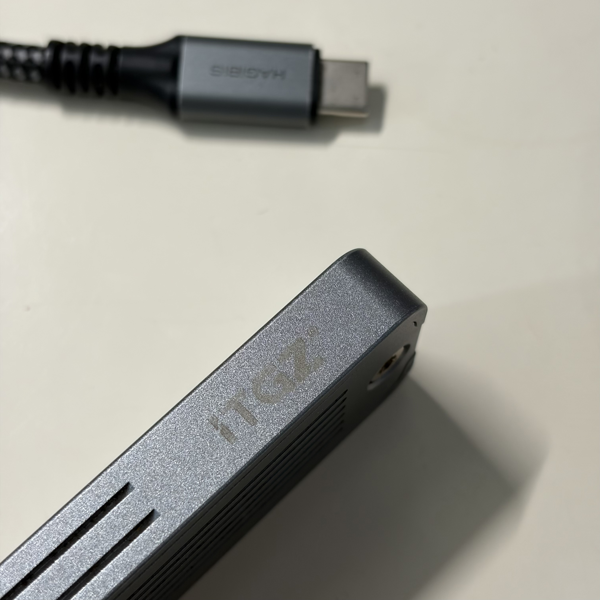
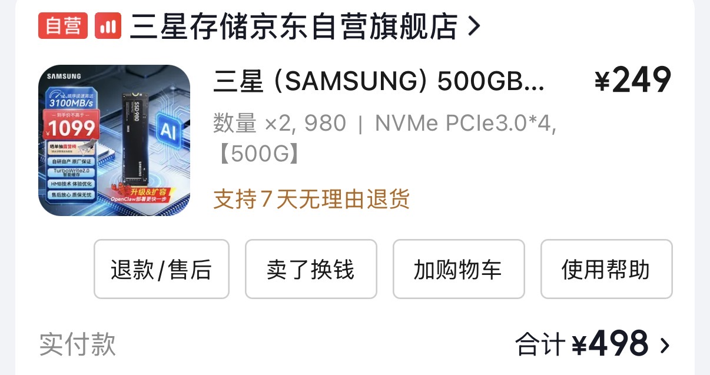
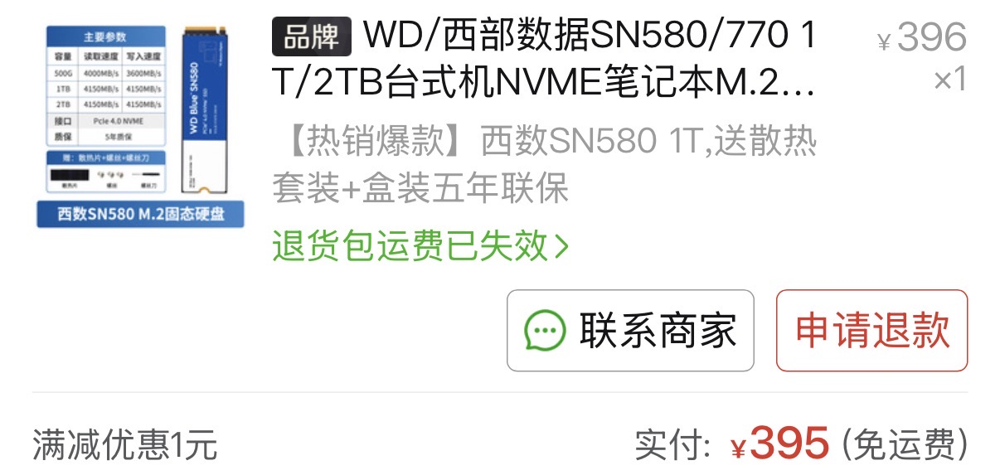
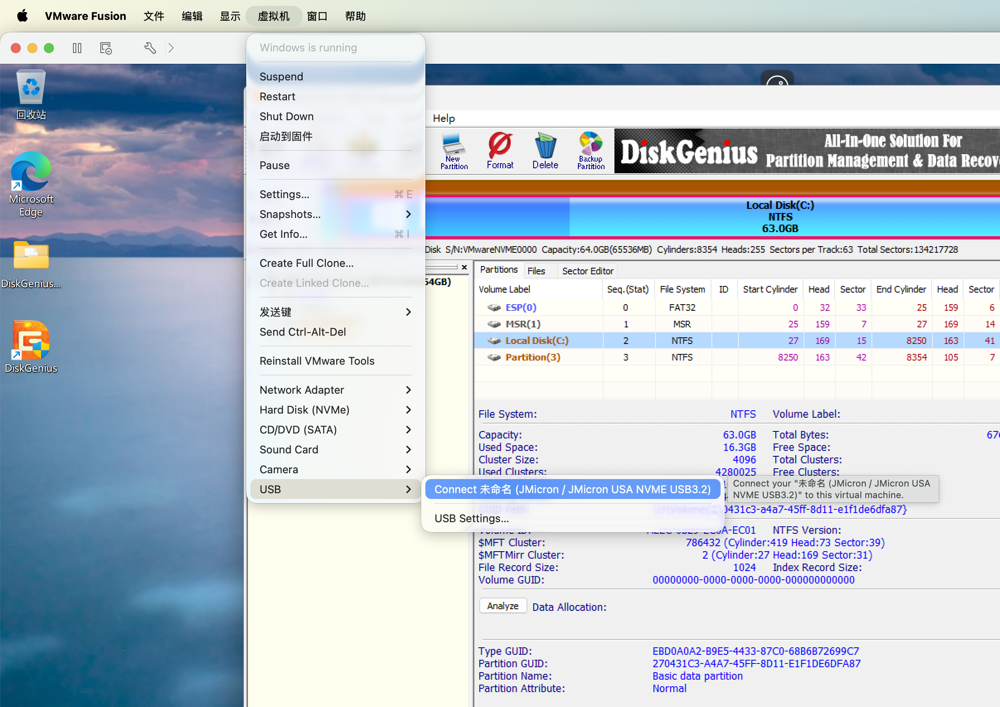
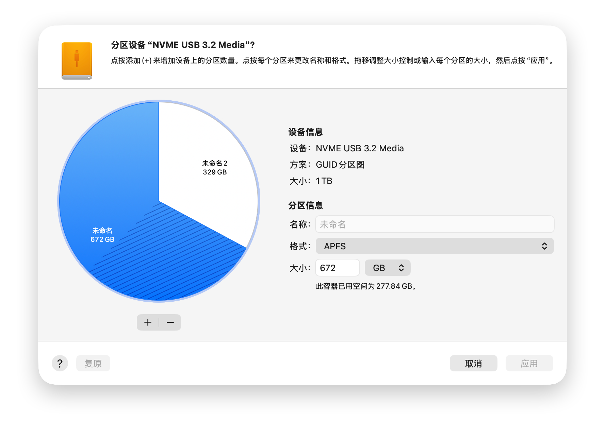

# 记一次台式机与硬盘盒中固态硬盘的互换流程

## 目录

## 引子

我已经早早忘了我居然还专门买过 1TB 的固态硬盘这一事实——在机械硬盘、固态硬盘和内存价格均爆炸式增长的当下，这种感觉就好像是在抽屉里找到了失散多年的几百块钱一样。这块硬盘就那样静静地躺在台式机的第二个 M.2 插槽上。

台式机由于其物理位置限制，我并不是日常使用，且大多数时候也只拿来打 LOL，上面作为数据盘的 1TB 虽然使用过半，但大部分都是与这台台式机无关的数据，比如照片之类的，就连经常玩的 LOL 也没有装在这块盘上。我日常使用的是另一块 512GB 的固态硬盘，容量虽然没有到捉襟见肘的程度，但结合多种因素考虑，将它们互换是最好。

## 物理互换

物理上的互换非常简单，并不是这篇文章记录的重点。我的移动硬盘是一个 ITGZ 的 M.2 硬盘盒，日常搭配一根支持 10Gbps 传输的 USB-C 线使用，这根线还可以用来接显示器。硬盘盒里面装的是就是普通规格的固态硬盘，可以直接与台式机上的固态硬盘互换。操作过程只需要螺丝刀和硅脂片即可完成。

 _ITGZ 硬盘盒_

### 固态硬盘的价格对比

从台式机上面将这块 1TB 的数据盘拿出来以后，我想起来台式机上的系统盘和我的移动硬盘是一起买的两块三星 980（TLC 颗粒）。

翻了一下购买记录，这价格放到现在是想都不敢想，当时居然两块一起买才不到五百。随便点进去看了一下现价，500G 单块直接 1000 出头了。只过了三年，同样的型号和容量，价格已经是沧海桑田般的变化。

|                 2023 年 6 月                  |                2026 年 5 月                 |
| :-------------------------------------------: | :-----------------------------------------: |
|                   ￥249/块                    |                  ￥1099/块                  |
|  |  |

这块 1TB 的数据盘是 2024 年购入的一块 SN580。1TB 的容量，价格相当于两个 500G，非常合理。不过这块盘是在拼多多上买的而不是京东自营，虽然平台有点掉档次但用了两年没发现什么问题。

## 第一次迁移

虽然物理位置已经完成了互换，但故事才刚刚开始。一个理想的迁移效果，应该是数据放在原地不动，而文件系统符合对应系统的需要，但这是不可能轻易完成的。由于 macOS 和 Windows 天然不相容，它们默认、推荐的文件系统也不一样，对于 Windows，这个文件系统是NTFS；对于 macOS 则是 APFS。

下面的表列出了一个读写兼容性矩阵，展示了两个操作系统对于三种文件系统的原生读写兼容性情况。除了前面两个文件系统外，还列出了一个名为 exFAT 的文件系统，这是本次整体迁移的一个主角。

| 文件系统\操作 | Windows | macOS |
| :-----------: | :-----: | :---: |
|     NTFS      |   WR    |   R   |
|     APFS      |    -    |  WR   |
|     exFAT     |   WR    |  WR   |

目前的情况是，硬盘盒中的硬盘由于常年与 macOS 搭配使用，其分区情况如下表：

|   维度\值    | 分区1 | 分区2 | 总   |
| :----------: | :---: | :---: | :----: |
|   文件系统   | APFS  | exFAT | -    |
| 总大小（GB） |  450  |  50   | 500  |
| 已使用（GB） | ~200  |  ~30  | ~230 |
| 已使用（%）  |  44   |  60   | 46   |

这里单独划出来一个 50GB，是因为在日常使用中不可避免会出现需要在 macOS 与 Windows 之间传递数据，或者单纯地往 Windows 上传递数据的需求。exFAT 的两端读写兼容性使其可以胜任这份工作，成为一个“单纯的 U 盘”。这个分区在日常中专门用于这种用途。

第一次迁移的目的是将 APFS、exFAT 分区中的所有数据都换到一整个 NTFS 分区中。

由于 Windows 无法对 APFS 进行任何操作，甚至连读也不可以，为了让 APFS 中的数据不丢失，需要先在 macOS 上面将其中的内容做删减（删减后数据总大小不到 200GB），然后将其移动到一个 exFAT 分区内。为此，在 macOS 上面使用磁盘工具对 exFAT 分区进行了扩容，使其能够完全容纳 APFS 分区的内容，让 APFS 分区最终不容纳任何数据。注意，这里所说的操作都是在物理迁移之前完成的。

将数据从 APFS 全部移动到 exFAT、完成物理迁移后，在台式机上将 exFAT 分区内的数据全部拷贝到系统盘（500GB）作为中转，然后将整个数据盘格式化为 NTFS，再将数据从系统盘拷贝到数据盘，就完成了第一次迁移。

第一次迁移的思路比较简单，且使用了中转。这里起到关键性作用的是 exFAT 文件格式，它使得 macOS 和 Windows 可以操作同一个分区：macOS将数据放在 exFAT，然后 Windows 从 exFAT 中取出，消除了 Windows 无法读写 APFS 带来的影响。

其实只要有中转，问题都不大，毕竟可以先将文件全部放在一个地方，然后格式化，然后再将文件放回去，只是时间问题。但对于下面的第二次迁移，由于数据量较大，中转几乎不可行。

## 第二次迁移

第二次迁移是 1TB NTFS 数据盘中数据的迁移，要将这些数据全部换到一个 APFS 数据盘中。该数据盘只有一个分区，数据量达到 700GB，导致手头没有足够的空间做中转。

### 尝试中转的方案

中转的方案永远是最简单的，因为它很粗暴，适用于任意数据量大小，只要你有相等的额外数据空间，这个方案就可行。当然，对于非常大的数据，这个方案可能因为传输带宽限制而变得不再现实。

既然手头没有足够的空间，那么是不是可以借助网络资源呢？理论上完全可以，因为国内的一些云盘只要开会员，就能给你几个 TB 的“空间”。

为了避免开会员，我最先考虑的是阿里云 OSS 或者腾讯云 COS 之类的产品，结论是不适合。虽然它们的上行流量都是免费的，但下行流量却很贵，尤其是对于当下 700GB 数据的场景，即使挑其中最关键的 300GB 传输，以阿里云 OSS 下行流量 0.8 元/G 的价格，一次取回也需要花费 240 人民币，用流量包来抵扣也需要 148 人民币。

所以我花了 25 开了一个月的百度云 SVIP，这个价格相比于企业级的 OSS 要显得便宜很多（虽然如果从 0 元往上看，这个价格也不算便宜）。空间绝对是够的，也不管什么隐私不隐私了，能中转就可以。于是我创建了一个 300GB 文件夹的上传任务，挂了一个晚上、10 小时，早上发现还有几千个文件没有上传，并且似乎还出现了问题：虽然上行带宽能跑的比较高，但是总是断断续续地挂起、不上传，体验并不好。以及虽然入户带宽是 1000Mbps，但这是下行；上行带宽估计有 100Mbps 就不错了。

考虑到这样折腾来折腾去的时间有点太久了，甚至可能不如直接走本地方案。所以网络方面的中转就先放弃了。

那么本地该如何进行呢？一个很自然的思路是，在硬盘上的空余空间（剩下的 300GB）建立 APFS 分区，然后将 NTFS 中的数据复制一部分到该分区中，尽量占满；然后将 APFS 分区的大小进行拓展，像滚雪球一样，逐渐吞掉 NTFS 分区中的数据，直到 NTFS 分区没有数据，直接删除并将空间合并到 APFS 分区中。这里有两个问题

1. 以上过程的效率奇低，因为该过程注定是从硬盘的后部向前扩展的。从硬盘后部向前扩展的最大问题是数据的分布不连续，导致在扩容后部的 APFS 分区的过程中总是会发生数据的搬移，这样会消耗很多时间
2. Windows 并不能读写 APFS 分区，所以以上操作无法直接进行

问题一是这个方法本身的特点，无法解决。对于问题二，解决方式就是引入 exFAT 作为中间层，将上述步骤中的 APFS 替换为 exFAT 进行，然后在可以操作 APFS 分区的 macOS 上面重复上述步骤，这进一步增加了时间成本。

于是经过了大约三四个小时的搬移操作，这 700GB 数据从一个 1TB 的 NTFS 分区原地迁移到了一个 1TB 的 exFAT 分区，但在这个过程中出现了一些插曲，见下文。

### 近距离认识 exFAT 与猫

“1TB的 exFAT 分区”这个词会显得很诡异，因为 exFAT 分区通常不会考虑建立得这么大，这与它本身的性质和用途有关系。

exFAT 是微软公司设计的**轻量级**的文件系统，它是 FAT32 系统的一个后继，没有 FAT32 中最明显的限制——单文件不超过 4GB。exFAT 适合用于移动存储设备。这里所说的移动存储设备，更强调 portable——像是一种临时的，用作中转的介质。所以在最初硬盘盒的分区规划中，单独为其划分一个 50GB 的分区作为中转分区从而为硬盘盒提供一个 U 盘的角色是很符合该文件系统初衷的一种划分。

exFAT 最致命的问题在于它没有日志机制，这表示只要在传输过程中出现差错，或者出现无法预料的掉电行为，那么未保存的那部分数据就会损坏。互联网上有许多帖子都分享了 exFAT 的这一缺点带来的严重后果——数据的完全丢失。我当然不希望我的这些数据，包括一些照片等，因为文件系统的问题以及不可预料的接口松动、掉电而损坏掉。

其实在之前数据搬移的过程中就已经涉及到这一缺点。一旦数据搬移的过程出现问题，其后果与上面所说的掉电是类似的。而由于数据量较大，搬移的时间较长，出现问题的概率就更大。这里所说的概率是多方面的：既有软硬件层面的故障概率，也有现实世界的种种概率，比如——虾球（一只猫）在扩容分区数据搬移的过程中爬到了台式机的顶部睡下，这是它的日常行为，但它的触碰导致了插在主机上的 USB 的松动，进而导致这一次扩容直接中断。

结果是被搬移的分区（扩容时，提供空间的那一方）被 DiskGenius 标为已损坏。但注意，已损坏只是一个称呼，表示这个分区的结构不再稳定，但其中的数据并没有损坏，因为没有任何写入操作，这其实和操作系统上删除文件的原理类似，虽然一个文件看上去不存在了，但它就是以某种形式存在着，只是被标记为不再需要、可以覆盖。

已经搬移的那些数据被撤销，因为调整分区大小的操作因为设备掉线而失败。分区的大小最终没有改变。假设这些数据不被撤销，其中一定有被 exFAT 特性损坏的数据。后续拷贝过程也体现了这一点。

一个“损坏”的分区不能直接被文件资源管理器读取，但可以使用 DiskGenius 访问其中的文件，也可以进行复制。将这些文件复制到一个正常的分区，就完成了最基本的数据恢复，在这过程不存在什么很大的顾虑，除非——

虾球又导致了几次 USB 的松动，此时 DiskGenius 针对单个文件的复制报错。通过跳过这些文件，完成剩余文件的复制。此时必须仔细检查复制的那些文件，找出与 USB 松动导致复制报错的文件个数相等的那些破损文件。在实际过程中一共找到了三个损坏的视频、图片文件，对应复制过程中的三次 USB 松动。通过重新复制这些文件，避免了数据的完全丢失。

### 寻找 macOS 上的分区工具

Anyway 虽然发生了一些意外，但至少思路是对的，最终成功将一整个 NTFS 分区中的数据做一些删减后迁移到了一整个 exFAT 分区中。接下来迁移到 APFS 的操作则必须在 macOS 上面进行，一是因为 Windows 不具备读取写入 APFS 分区的能力，二是因为即使功能全面如 DiskGenius，其创建出来的 APFS 分区似乎也是“冒牌”的，并不被真正的 macOS 系统认可。

macOS 上面从来没有听说过或者搜到过什么非常好用的第三方分区工具，事实证明的确 no such thing。不可否认，macOS 自带的磁盘工具在大多数情况下已经够用了。其实这类软件的使用频率也不高。偶尔买个新硬盘，因为是空的，所以也不存在很多考虑或者特殊需求。自带的磁盘工具也支持 exFAT 文件系统的格式化。

提出上面的滚雪球方案，一个原因是 macOS 自带的磁盘工具是支持分区的扩容的，还有一个令人印象深刻的饼图供你可视化地进行调整。但当我将硬盘连接到 macOS 上后，读写是可以了，但磁盘工具直接显示“无法调整此分区的大小”，没有标明原因。

我开始考虑使用第三方的硬盘分区工具。考虑到 macOS 或多或少也是一个 Unix 系统，应该支持 gparted 吧？并没有，只有 GParted Live 可用。我想来想去还是嫌 Live 麻烦，直接在 VMWare Fusion 里面装了一个 Debian，然后在 Debian 里面安装 GParted。多亏了 Fusion 提供的方便的将 USB 设备直通到虚拟机里的功能，GParted 可以识别出这个分区，但是点进去准备调整大小，才发现箭头都是灰的，数值也无法输入，即使系统里已经安装了 exFAT 相关依赖。

GParted 不可以，开源/免费的方案几乎就没有了，那么 Paragon 呢？它应该会提供这一类的软件。临时用我并不希望付费，破解版应该是很好整到的。结果发现，Paragon Hard Disk Manager for Mac 已经是过去式了，在官网上被标为 Legacy Product (Unavailable since 08 Oct 2025) 且只适用于 Intel Mac，并且仔细翻 FAQ 会发现下面这一行：

> Resizing Microsoft exFAT partitions is not allowed due to the Microsoft exFAT licensing issues.

### Expensive and Fragile

经过一番搜索，发现 exFAT 其实是一个很“娇贵”的文件系统，它有着专利的保护。一些免费甚至付费的软件都不提供对它的调整功能，其中就包括 GParted 用到的相关 exFAT 依赖和 Paragon。macOS 自带的磁盘工具也只能创建，不能调整。所以其实我在前面提出的在 exFAT 分区上滚雪球的方案，其实是一个涉及到专利的高成本方案？

我开始往 exFAT resize/shrink 方向搜索互联网，最后找到 Stack Exchange 上的这一个问题：[Shrink exFat Partition](https://superuser.com/questions/393132/shrink-exfat-partition)。其中的一个回答提出，经过他的测试，只有 DiskGenius 支持 exFAT 分区的调整。结合我先前在 Windows 上用 DiskGenius 滚雪球的过程，我突然意识到正是因为 DG 功能的强大让我相信其它磁盘工具也有类似的功能，而事实并非如此。

### 来自秦皇岛的拯救者

那么该如何在 macOS 上使用 DiskGenius 呢？当然是装虚拟机了。结合 GParted 能在虚拟机内正确识别并差点可以操作的经验，这一次直接装 Windows。我担心过 Windows 11 ARM 会导致 DiskGenius 无法运行，事实证明多虑了，运行得非常好。让 VMWare Fusion 直通连接的硬盘盒后，DiskGenius 可以在虚拟机里面正确地识别分区并且正确地做操作。

 _借助 VMWare Fusion 的功能可以直接将 USB 物理设备连接到虚拟机_

不过，这里悖论来了。既然在前面提到，涉及到 APFS 的操作只能在 macOS 上进行（实际上是，最好采用 macOS 自带的磁盘工具进行），否则该分区无法使用，那么该如何使用 DiskGenius 来建立可用的 APFS 分区呢？答案是不管它建立的是什么分区，只要是分区而非空闲空间就可以，这样该分区可被识别，就可被操作。

按照以下步骤反复操作，就可以实现最终的滚雪球：

1. 将硬盘盒通过 Fusion 直通到虚拟机
2. 调整 exFAT 分区大小，将无数据占用的空间定为空闲空间
3. 在空闲空间上建立 APFS 或 HFS+ 等分区，无论该分区能否真的被 macOS 识别为可装数据的分区
4. 从 Fusion 中卸载硬盘盒，硬盘盒会被自动重新挂到 macOS 并在磁盘工具中可识别
5. 在磁盘工具中删除存在但不可用的 DiskGenius 创建的空分区，在其上面建立 APFS 分区
6. 将数据从 exFAT 分区复制到 APFS 分区

以上步骤相比于从 NTFS 转为 exFAT 的滚雪球要快得多：在两个分区之间拷贝数据至多需要 10 分钟，两次拷贝 20 分钟，建立分区、扩展分区的总耗时不到 2 分钟。这主要因为：

- 没有使用 USB-C -> USB 的转换头（我手头上的这个转换头大概率是不支持很大的传输速率的），减少了损耗。拷贝 200GB 的数据
- 数据量经过缩减后，其大小小于 500GB（一半硬盘总大小），使得分区的大小可以使用一个来回倒腾的技巧来避免从后向前的扩展的发生：
    - 初始时，是一个整个 exFAT 分区
    - 将分区后部的全部空闲空间均用于建立 APFS 分区
    - 将 exFAT 分区的全部内容拷贝到 APFS 分区
    - 删除 exFAT 分区，建立 APFS 分区
    - 将后 APFS 分区的全部拷贝到前 APFS 分区中
    - 删除后 APFS 分区，将前 APFS 分区扩展到占满磁盘

 _分区后部的空间可删除（“-”按钮亮），而前部空间不可删除_

## 总结

做了这么多的探索和尝试，核心目的是将一个 1TB NTFS 分区转换为 1TB APFS 分区，并在不使用中转空间的情况下保留数据。不得不说，这样的需求算是非常小众且很难遇到的，但探索的过程又感觉自己久违地做了一回软件技术宅（自我安慰中）。

最大的收获是尝试了在 Windows 11 ARM 虚拟机里面使用 DiskGenius 完成分区的过程，所以其实 macOS 上面磁盘工具的最优解是装个 Windows 虚拟机然后用 DiskGenius，磁盘工具打下手，其余一概不碰。