# AI Slop 的部分成因与调整方案

:::tip
- 本文的体验主要来自与DeepSeek V4.1 Flash的交互过程，至于能否推广到其它模型需要读者自行判断
- 本文中提到与LLM交互的语言大都为简体中文
- 本文提及的文本内容现象均不考虑思维链中的内容
:::

在“大大提高Agent能力”浪潮之下，LLM作为完成操作的工具方面的效果已经很令人满意。它们能够适应不同的Harness，理解不同自定义Tool的具体含义，给出一致的结构化输出，并自主利用工具在环境中探索、与现有软件相集成。这几乎都通过文本模态来实现的：因为[^1]有了JSON等结构化格式，LLM得以与外部系统交换复杂数据，以一致的协议交互。

[^1]: 不一定要是结构化格式，但大多数时候都是结构化的格式。协议是Harness规定的，如果Harness认为模型输出SKIP就是表示跳过，那么“输出SKIP”也是协议的一部分。

正是因为有了如此强大的Agent能力，对于一些短期的乃至一次性的简单任务，Agent往往能够处理得比较好，且没有什么后顾之忧。

例如对于批量整理文件夹的结构、文件的批量重命名等过去需要编写复杂脚本才能解决的问题，现在可以让模型直接帮你定制脚本来解决；对于远端服务器上的配置问题，可以让模型直接连SSH上去执行指令；对于涉及多步、需要人工介入的操作，模型也能够将你需要做的操作、执行的指令交给你，等你执行完毕之后它再继续。模型能帮你做完测试、dry run、备份、运行、验证全流程，依据环境的真实反馈可靠地进行交付。

但对于下列两个典型场景，模型产出的质量不一定能够轻易达到交付标准：
- 文本撰写：不同文档内容的质量要求不同，模型没有个人情绪，无法在不加引导的情况下体现“个人思考”，且文风往往具有“AI味”
- 软件工程：这是一个长期的、迭代性的任务，涉及到许多软件工程现有方法论，用户未考虑的事情都需要模型代为考虑

本文主要以DeepSeek v4.1 Flash这个性价比较为平衡、速度较快的模型为例，结合其它模型的使用，总结模型在文本撰写和代码编写任务方面的一些行为模式、使用体验，并探讨AI Slop的概念和调整方案。

## 目录

## 文本撰写

### 文章编写的可读性问题

得益于LaTeX、Typst等排版引擎在模型出现之前已经有成熟的CLI接口且源文件为纯文本形式[^2]，模型可以有效地在一般Coding Agent框架之下进行资料编写任务，根据输入材料和提示词指示，完成文章的撰写与成品编译等操作。

[^2]: 以及pandoc、LibreOffice及Python相关库的存在。

在实际运行中可以观察到DeepSeek v4.1 Flash能够流畅地操作相关命令行工具，并能够形成对文章成品PDF每一页截图效果的ReAct循环，相较于单模态有效地提高了PDF的观感质量。

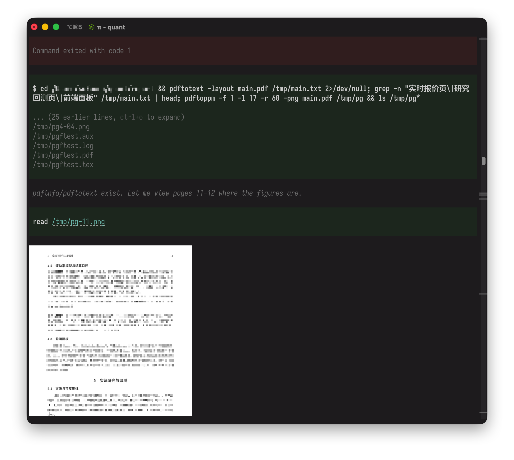 *自行从PDF导出页面截图并查看效果*

除了观感，输出内容的质量或可读性也很重要。

通过对实际成品的观察，模型输出内容中影响可读性的现象包括但不仅限于
- 使用罕见用语、黑话或机翻词汇，例如桶（bucket/[bin](https://developers.google.com/machine-learning/crash-course/numerical-data/binning)）、分野（文学、罕见）、收口（罕见）、毒性（toxicity）等
- 本应以短句表达的含义被过度浓缩为单个词汇
- 口语措辞（出现在严肃语境中），例如钉住、兜住、接住、塞进、装进、喂给、补刀等
- 泛滥且无效的比喻
- 中英文混杂
- 特定句式，例如不是...（而）是...及其变形、冒号解释型句式、破折号解释型句式等

以上现象描述的是模型在特定任务下的默认行为，即在没有任何输出风格约束的前提下，模型根据该任务中涉及的信息所自动呈现的内容。出现某一个特定词语的条件是不确定的，可能与上下文的复杂程度、关注的话题、上下文窗口的占用率和模型本身有关系。

以一次生成某量化主题论证文章的测试任务为例，通过明确指定使用LaTeX进行排版（包括明确规定排版引擎、字体搭配等），模型能够较好地利用格式以及绘制图表。

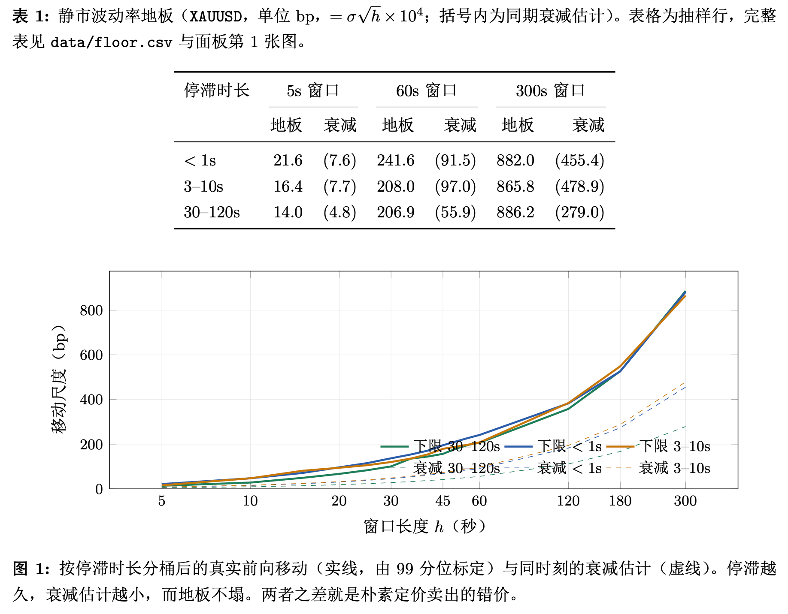

但抛开格式看内容，即使是上面这张图表也有问题，可以指出的就有：
- “地板”为机翻词汇，对应的英文是floor，更像中文的翻译应为下界、最小值等
- 图注要么简略地描述这张图的大体内容，要么完整地剖析这张图片。模型选择了不简略地描述、不甚清晰地解释图中的内容，并疑似附带了无关内容
- 模型基于“地板”的机翻或比喻，进一步引出了“地板不塌”的比喻化叙述
- “而地板不塌”是一个与前面的“越...越...”无关的分句
- 在文章的内容中引入了对实现的路径引用和对界面上位置的引用

图片本身的内容不是本文的重点。下面这张截图展示了该测试任务从tex编译得到的PDF中的一部分内容在未经过任何人工调整的样子。红色部分表示不自然的措辞，土黄色部分表示不自然的用词，蓝色部分为固定句式。

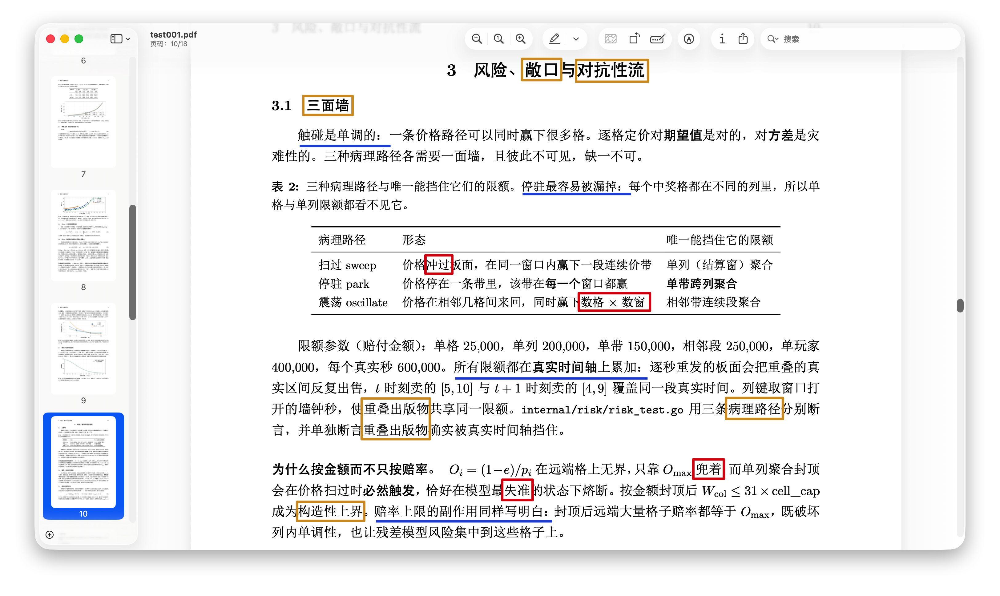

- 土黄色：敞口、对抗性流、重叠出版物、病理路径、构造性上界等，均为模型自行生造的词语。相关含义仍存在，但是没有被以好理解的方式表达出来。
  
  不否认这些词语在特定语境下有其含义。作为人类在编写学术论文的过程中，对于一类此前未曾存在过的复杂概念，有时也需要创造词汇来对其进行概括，但这种创造出的词汇至少具备两个与AI不同的特点：一是基于现存词语而不会彻底发明词汇；二是首次出现该词语时会有其定义或解释。
- 红色：冲过、正文中的`\times`符号、兜着、失准
- 蓝色：冒号解释型句式。
  
  冒号确实具有解释说明的作用，但模型对冒号的过度的、频繁的使用，以及与这类“先提出后解释”的句式的绑定使用会造成可读性问题。

除去上面提及的这些不自然之处，还有一些其它细节，例如
- 模型在格式上的默认行为。即使这是在LaTeX而不是Markdown中，模型也倾向于过度使用粗体文本
- 表格中的列的划分方法。如果让人类来编写这个表格，大概率是不会出现“唯一能挡住它的限额”这样一列的

:::tip
一些不知道是否专属DeepSeek模型的特点：
- 模型主动提供的行内格式，最常见的几乎只有加粗文本，而很少见斜体或下划线
- 偶尔模型输出的标点符号会全部变为半角
- 引号可能使用`“‘’”`、`"''"`、`「『』」`的任意一套
:::

### 前端界面文案的详略问题

模型当下已经可以较好、较流畅地生成Web前端界面，但界面上总是免不了一些AI味，这主要体现在配色、文案、组件等的使用上。关于配色相关的AI味（如蓝紫渐变）已经有较多的讨论，这里主要考虑文案。

:::tip
一个能用就行、纯演示型或审美要求不高的网页/HTML文件的AI味是不必要消除的，但AI味的来源仍然值得指出。
:::

在没有额外给界面设计相关提示词的情况下，模型所给出的一个Token计费模块的设计如下图所示。其AI味因为用到Shadcn组件、Rechart图表、配色、字体的调优已经被减去一大截，但文案方面仍然存在：
- ①处标题—副标题型冗余：模型倾向于先给出一个标题，然后在副标题中加以解释。而其实只需要一个清晰的标题即可。①的文字可以丢掉，将标题改为“本月用量”即可；如果周期长度不固定，应当考虑引入额外的选择控件，而非用副标题解释。
- ②处功能性冗余：②中的文案与蓝框中的两处金额在功能上是重合的。且从形式上看，这里不应使用逗号，会显得文案较为复杂。
- ③意义不明：内容本身没有问题，但出现在这里会破坏该区域内容的主题，如果需要应当另开板块或区域，而不是在这里作为小字
- 蓝色框的布局是AI的原创设计，并不直观，且混杂了三种数据：已用金额、剩余金额和上限金额。可能的修改方法包括：
  - 左对齐的 $4.99/$5.00，其中$5.00可以缩小处理，表示剩余/上限
  - 左对齐的 $0.01/$5.00，同上，表示已用/上限

下图是模型给出的成本拆分模块设计。忽略布局设计问题，仍存在冗余的括号解释（计入配额、自付+逗号+不计配额）。

下图是模型给出的用量图表设计，其中右上角的Tab组件为点名使用。“按天用量”下面出现了平均每轮耗时数据的冗余文本。

综合这个例子来看，模型添加的这些冗余的文本，在数据上都没有问题，但位置、安排和内容编写都不甚正确。如果没有人工的介入、调整或约束，难以交付简洁流畅的专业界面。

:::tip
这里存在的最大问题是，用户一般不能够直截了当地指出界面设计的问题所在，他们可能觉得怪怪的，但说不出哪里奇怪。
:::

另外一个例子是小红书上刷到的一个具有AI味的UI（作者自称，无贬义，来源见水印，侵删），可以发现问题是类似的，简要概括如下：
- 左侧侧边栏的active状态有一个突兀的border-left[^7]
- 每一个标题右侧的副标题其实都可以删掉，分组本应self-explanatory而非通过冗长的副标题加以解释
- “还差App Secret”、“沿用机器人凭证”这样的文本出现在一个表示状态的位置
- 每一个卡片下方的灰色注释内容不对称、不统一、不简略

[^7]: 这个border-left可能来自于VuePress/[VitePress](https://vitepress.dev/guide/markdown#custom-containers)/[GitHub](https://docs.github.com/en/get-started/writing-on-github/getting-started-with-writing-and-formatting-on-github/basic-writing-and-formatting-syntax#alerts)等排版引擎中常见的**高亮块**（alert/callout/admonitions）排版元素，其左侧是一个border-left形成的色带。但在这里放在一个按钮上不合适。

## 软件工程

### 代码注释的维护问题

在用AI编写代码的过程中，经常需要生成注释，偶尔需要生成文档。

回想过往古法编程时期，注释的作用是什么呢？我想有下面几点：
- 单行注释，写清楚这一行代码做了什么，或者一个magic number是什么含义
- 多行注释，写清楚这里有了什么特殊的考虑，或者一个复杂的算法过程/正则表达式是怎么实现的
- 结构化的多行注释，如JavaDoc、JSDoc、Go前缀注释等，是一种对方法、函数等对象签名的标准化描述，有一定的自由度的同时也涵盖了该对象上需要被描述的特点。因为结构化，所以便于生成对应的外部文档等用于分发

对于模型而言，这些注释在未约束的情况下是不会出现的，因为模型不是人，其写注释的角度也不一样。在不加任何输出风格约束的情况下，模型写出的注释的可读性也是较差的，且具有随着时间的推移、项目决策的改变而进一步复杂化的趋势存在，也就是把注释当文档来用。

:::tip
此处现象不仅限于DeepSeek V4.1 Flash。模型会被项目现有代码模式引导：如果你的项目中已经充斥着这类注释，那么接手的那个模型按照该模式续写下去，因为这已经成为了项目的惯例（convention）。
:::

在实际编码过程中观察到的一些注释特点如下：

#### 1. 倾向于积累注释

如果在长期vibe coding之后的某一天打开代码，你可能会发现代码中的注释几乎堆积成山，尤其是对于那些你过往与模型反复讨论、打磨的细节或bug。模型会在一些注释点不断积累上下文，包括前因后果、踩坑记录或用户的明确指示、设计决策等，形成一定程度上的“记忆”。该记忆对于人类读者意义不大，还会在一定程度上干扰阅读。有一次我通过下面的提示词让模型去删掉这类注释。

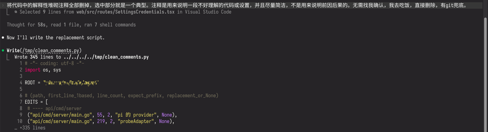 *Claude Code中的调整提示词*

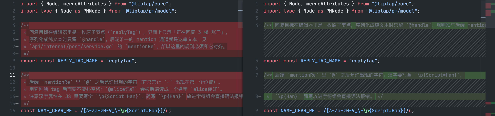 *常量和正则表达式在燃什么*

上图中，按照过往“古法编程”的习惯，一个常量标志或是正则表达式，通常不需要过多的注释，其变量名结合所在的位置就可以说明其用途。只有在这个正则表达式实在是太过于怪异、不好理解的情况下，才考虑会在代码中多解释几句*以示后人*。但现在正则表达式几乎不需要人来写（其实以前也都是从网上复制粘贴，自己写只有在VSCode的搜索里），也就不会有这个问题。

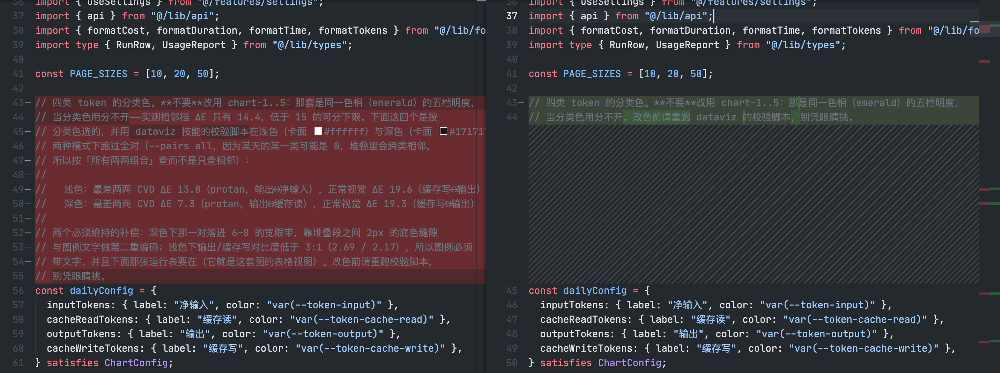 *完全是注释里写论文*

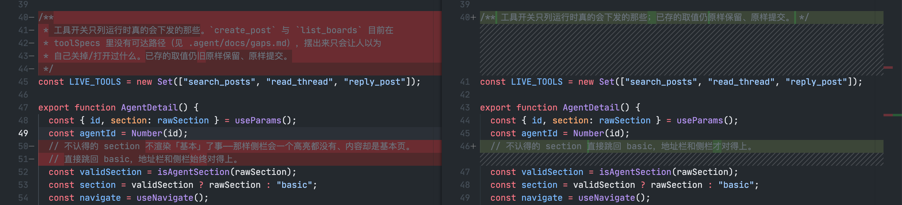 *“不认得”是一个很亲切的词汇！*

这里其实会有一个疑问：**删掉这些“冗余”的注释内容，是否会对模型本身编写代码的效果造成影响？**这个疑问的答案是极度主观的。我想是不会的：模型在实现一个功能之前，本就要通读这些代码位置，分析其实现和依赖。注释在很大程度上只能起到辅助作用，而无法代替代码的阅读。

对于一些比较偏门的约束、考虑或者无法从代码中推断得到的信息等，更适合的地方是单独的文档而非代码注释里，因为这部分内容很可能人类也需要了解。文档相比代码注释要更好翻阅，且在形式上适合承载更多完整内容。

#### 2. 注释中的交叉引用

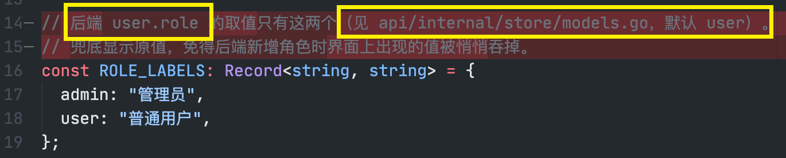

这是将注释当文档使用的另一个现象——在注释中插入交叉引用。如果这个引用真的能和Word中那样自动维护自动更新就好了，可惜并没有这样的机制。几乎一切项目中的资源，无论是符号还是文件路径（无论什么文件），都有可能出现在注释里。

注释中出现交叉引用最大的问题不是引用本身，而是其带来的漂移风险。引用写起来很容易（从而很容易泛滥），维护起来却比较困难，因为这要求模型在专注于某一个模块的实现之后，再复查所有相关的引用是否需要更新，而这并不是模型本来的任务。

#### 3. 缺少语言相关注释先验

在没有明确约束的情况下，模型默认不会采用JSDoc或Go Doc Comments等现有规范去编写注释，而是维护其“文档式的注释”。这在依赖这些结构化文档的场景下会出现问题，如发布到pkg.go.dev下。

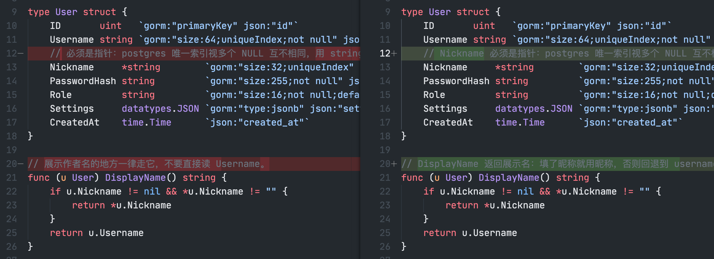
*注释应当以注释对象开头*
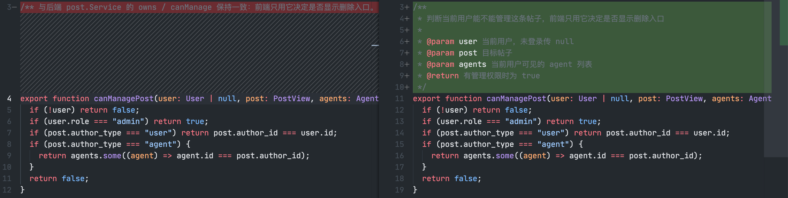
*在有参数的函数上最好带上参数和返回值信息*

### 重复造轮子问题

在Coding Agent大规模推广之前，重复造轮子现象的考虑可能是
- 想要炫技或者学习，所以要自己写一份，够用就可以
- 自己需要的功能只是一个小的子集，直接从轮子的仓库里复制过来加以改造
- 完全不知道轮子已经存在，所以自己费劲心思学习并写了一份

在Agent出现之后，造轮子的成本大大降低，几乎任何轮子都可以让模型造出来，即使是从开源代码中直接摘抄或改编来的。这种毫不费力造出一个又一个轮子的现象体现了模型强大的代码能力，但同时也会使得系统中出现许多冗余的代码。这些代码原本可以从外部安装并导入，却出现在了自己的代码仓库里，需要维护。

以前端为例，除了Vue、React等“大轮子”是模型会默认选用的以外，其余的库模型可能不会第一时间去考虑使用。这就导致模型很自然地在仓库中写出重复的代码（甚至可能直接来自于模型的训练数据？跨越大洋的复制粘贴？）。下图展示了模型为了进行测试而编写的某个 `.check.ts` 文件。

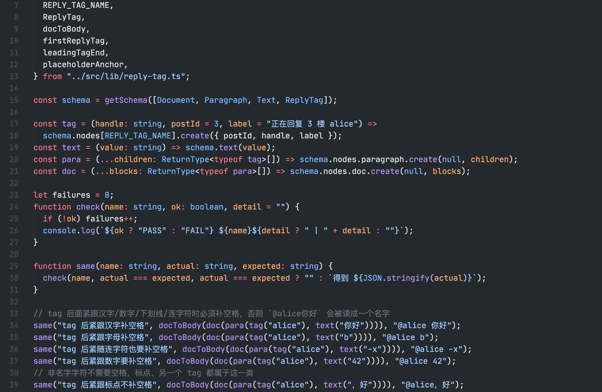 *某个check.ts的实现*

这里的问题在于，仓库中出现了许多类似的check.ts，且每一个check.ts的开头都有着这类辅助测试的断言函数，类似于复制粘贴，这就有了冗余代码和漂移风险，且测试框架也需要模型自己来维护（统一的框架代码放在哪里也是一个问题）。如果让模型此时引入vitest，它其实也可以很轻易地对现有的check.ts进行重构。

下图展示了模型手写的一个formatTime函数，这几乎是重复造轮子的一个典型案例。这个函数虽然代码多，但不算复杂，因为它现在负责的功能也只有一个简单的格式化输出。若将来涉及到多语言场景，该函数还需要继续扩展。如果让模型此时引入moment或day.js，这个函数就可以简化掉。

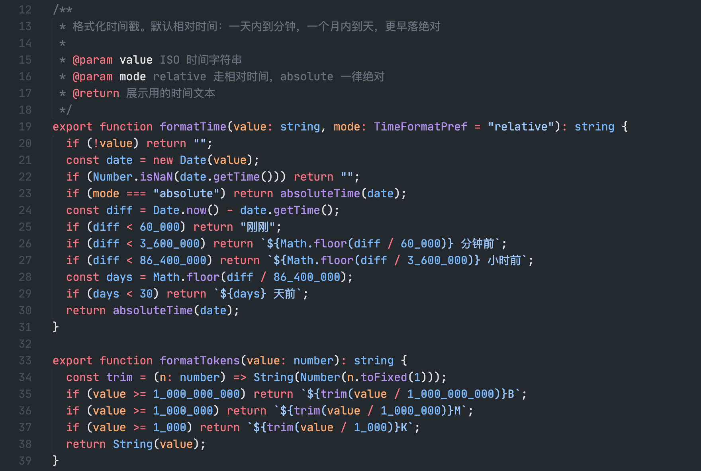 *formatTime的实现*

下图展示了模型手写的loadDotEnv函数，附带的有各种数据类型的parse逻辑和validate逻辑。这部分可以用[go-validator](https://github.com/go-playground/validator)和[godotenv](https://github.com/joho/godotenv)来代替，前者还可以用于系统的其余部分，作用类似于JS上的zod或TypeBox。

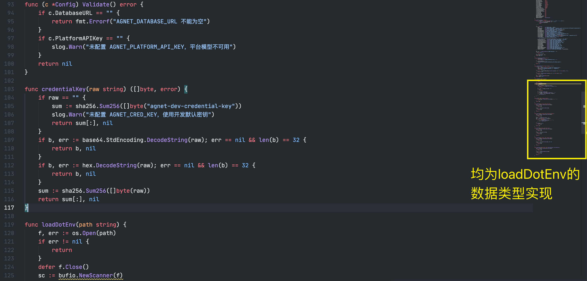 *loadDotEnv的实现*

### 冗余兼容逻辑问题

通常来说，一个服务上线之后，breaking change是不能频繁发生的，因为每一个breaking change都需要相应的兼容和兜底逻辑，都面临着数据丢失的风险。这个时候就需要需要考虑保留旧接口、对旧数据做兼容或迁移等，业务逻辑也会多出兼容用的代码。这些代码并不属于冗余，而是保证服务正常运行的必要考虑。

然而，如果这些更改break的只是开发环境下未定型的某个功能，那么代码中就不应该体现这类中间兼容逻辑，因为这个兼容逻辑对于线上的数据是没有意义的。问题在于，如果模型不清楚这一点（例如上下文被清理、用户没有明确告知且模型没有询问），可能会倾向于保守的兼容处理，从而在代码中将不必要的兼容逻辑持久化。如果此时再缺少Code Review环节，这类兼容逻辑可能会伴随着上线，造成未来的一些困惑（可能这个兼容逻辑之后会删不掉？Who knows!）。

下图展示了模型自行在代码中加上的字段迁移逻辑，并且其**特意**保证了幂等性，这使得如果不看代码，可能在运行中察觉不到这一点，而该兼容逻辑会一直存在于程序编译后的字节码中。

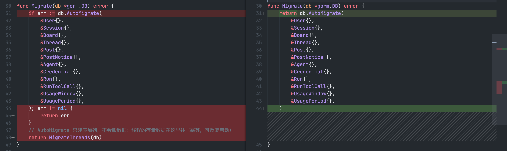 *MigrateThreads是一个有着一堆UPDATE、INSERT语句的函数*

这里的问题在于：
- 如果是本地开发层面的迁移，那么根本就不需要持久化到业务逻辑中，更不需要额外去确保幂等性。直接对本地数据库进行迁移，或者直接重建就可以。
- 如果不是本地开发层面的迁移，直接做到业务逻辑中也是需要协商的：有没有更好的数据迁移方法？能否走数据库变更？只有在运维层面过不去又实在需要参与生产时，才会考虑在业务逻辑中加上这种迁移逻辑，并且这类业务中混杂的迁移逻辑存在一定的合规风险。

类似地，对于前端也可能存在这类兼容逻辑。下图展示了模型自行在代码中添加的一个重定向，但其兼容的路由实际上从未上线。

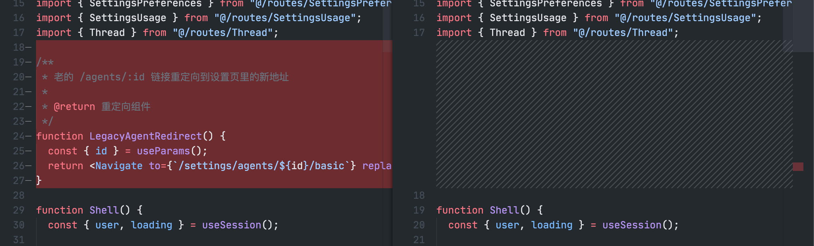

即使兼容逻辑内部没有任何问题、确保了幂等性，是无害的，也会造成可维护性、可读性问题。如果人类不在意可读性或可维护性，这类成本也会转嫁到Token消耗上去。

又例如，假设你维护一组版本化的模式迁移语句文件（下面用差量SQL代替）用于生产环境下的数据库变更，若开发过程中实体发生改变（包括字段、索引等），上线前就生成一份新的差量SQL用于交付DBA。

对于模型而言，当前目录下差量SQL的状态是模糊的，除非每一组差量SQL有其“已上线”标记。若缺少该标记且提前生成了差量SQL（或者说，在生成了差量SQL后还有修改），模型在后续对实体进行相关重构时，就可能保守解读为存在存量数据具有迁移，整个实施路径都会受到影响。

## 默认行为、期望行为与提示词

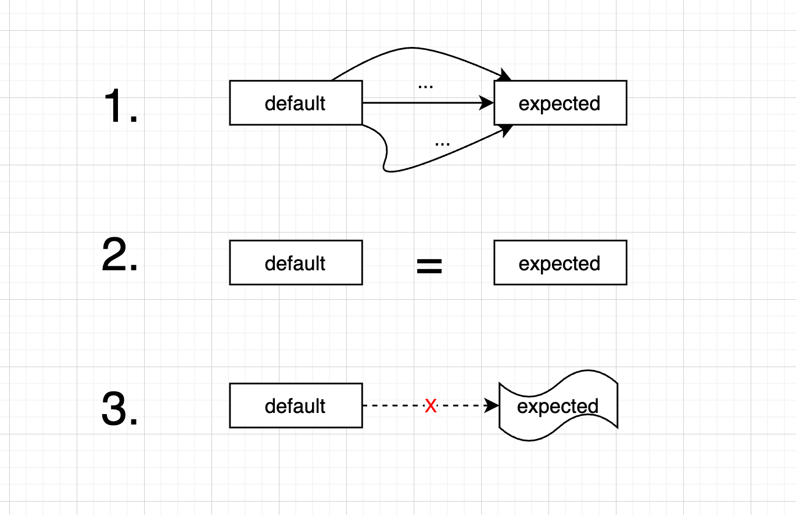 *default与expected的距离的可能情况*

我们可以发现在以上两类场景下，模型的默认行为都有些不尽人意。
- 工程方面，即使模型被训练为每一个任务执行后都会来一句By the Way、即使Harness允许模型向人类提问或澄清，模型也并不能事无巨细、百分百向你透露这类不确定性以及不确定性可能带来的问题
- 文风方面，模型并不知道自己哪里说的有问题，因为它确实在按照它所认为“自然”的方式来输出

:::tip
当然，即使模型在当时“不知道”，但如果你将一些考虑发送给它，它大概率也能理解其中的因果逻辑，并给出它的修改建议和思路。
:::

那么如何解决呢？我想应该就是提示词。先意识到这种差异，再以文字的形式表述出来，在合适的时机插入到模型的上下文中。这是一个因人而异、因项目而异、不断迭代的过程。
- 在项目迭代过程中，任何提示词没有提供的、留给模型的自由决策，都有可能导致意想不到的结果，所以随时（在我们的认知界限内）保持[explicit and clear](https://claude.com/blog/best-practices-for-prompt-engineering#:~:text=Modern%20AI%20models%20respond%20exceptionally%20well%20to%20clear%2C%20explicit%20instructions.%20Don%27t%20assume%20the%20model%20will%20infer%20what%20you%20want%E2%80%94state%20it%20directly.%20Use%20simple%20language%20that%20states%20exactly%20what%20you%20want%20without%20ambiguity.)、定期CR并提炼关键规则，对于维护一个能够长久持续发展的项目很重要。
- 对于文本编写，所谓“可读性”是人类的一种*感觉*。感觉是无法被修复或衡量的，只有从这种感觉中派生（或者说，“蒸馏”）出一定的规则，或将其定义出来以后，才能将其机械地解决。

## AI Slop

AI垃圾（AI Slop）是一个由外网提出的概念，2024年[Simon Willison的这篇博文](https://simonwillison.net/2024/May/8/slop/)中有简单提出其来源。Slop这个词的定位很像Spam（用来代指垃圾邮件），正逐渐成为一个AI产生的低质量、无意义内容的代名词，甚至二者可以合二为一成为[*Slom*](https://simonwillison.net/2024/May/8/slop/#:~:text=with%20AI%20tools.-,I%20propose%20%E2%80%9Cslom%E2%80%9D.,-Posted%208th%20May)。

为了形象地展示Slop的无意义体现在哪里，下图是一个一只有着三只脚、穿着耐克鞋的鲨鱼，来自2025年爆火系列AI短视频（外网称为Italian Brainrot，国内称为“AI山海经”）[^3][^4]。

 *关于耐克鲨鱼、木棍人是否真的“没有意义”这件事存在一定的争议。一些人认为带来了娱乐意义，所以直接说无意义是不准确的*

[^3]: [新华网：小学生沉迷“外国山海经”每天念咒语——AI魔改乱象调查](https://www.news.cn/politics/20251118/14d36972c3ae405b89f981cd8eaff638/c.html)
[^4]: [萌娘百科：AI山海经](https://zh.moegirl.org.cn/AI%E5%B1%B1%E6%B5%B7%E7%BB%8F)

只要是AI能触及到的模态都可能存在Slop，本文主要探讨的是文本这一模态。

### 文本Slop

我们很难定义什么样的文本属于Slop，但就个人网上冲浪的体感，以及看到的Simon Willison的那句
> But I’m increasingly of the opinion that sharing unreviewed content that has been artificially generated with other people is rude.

一个文本上的Slop，大抵就是让他人看着觉得毫无意义（包括娱乐意义），甚至具有误导性的文本材料。这类材料在某种程度上会影响他人的生活体验。举个例子就是活跃在哔哩哔哩或是小红书社交平台上，漫无目的随机回复的AI机器人。不同的人对Slop的感知不一样。对于不care这一点的人，机器人简短的一句莫名的回复并没有什么，而对于care的人来说，就是彻头彻尾的Slop。

 *哔哩哔哩上的数字生命*

本文开头所展示的那个PDF，如果它确实被分享出去给其它人阅读了，也属于文本Slop的范畴。一些大学水课的论文可能也是类似的情况，如果未加修改或调优，对于批改人来说就是Slop。

AI产出文本Slop是非常容易的，只要你让它说它“不擅长说的话”，或是没有明确给出你想要的输出形式。AI也从来不会自己网上冲浪，除非有人复制了它所说的话，或是为它开了随意发言的口子，Slop某种程度上是对这类行为的批判。

### 工程Slop

在关于注释维护的那一节中，存在一个疑问：注释是不是根本不需要简化？在那里我给出了自己的看法。这个疑问在当下显然还可以更进一步：**是不是从一开始考虑删除注释内容就是没有必要的呢？**毕竟现在存在相当多的完全不看代码的编程实践，这个注释就让模型用作文档好像也没有什么问题。

对于这一点，我觉得如果确定无需注释的人类可读性，那么确实可以让模型去维护，但也不能完全没有约束或外部框架。正确的做法是设定约束和框架后，使其自由，并时不时地关注、迭代。

让模型全权维护的文档都存在一种漂移风险。漂移带来的后果不仅是难以维护，还可能导致模型产生错误的判断，或是在任务中混杂对注释的反思和推理，降低任务效率。所以可能需要hooks来定期提醒模型去维护文档，或是注释内容的格式规定，或是一个让其不要记录用户说的话的明确指示。

说了这么多，其实都是一些考虑，需要一定的思考。如果完全放手让AI来填补“默认行为”与“预期行为”之间的空缺，虽然不一定会很快影响到迭代的过程，但存在这类风险。当模型真的因为漂移的注释（文档）思考良久后问你要不要更新这个注释（文档）因为“其与实现不符”，或是在没有询问你的情况下得到了带有bug的代码且只有在后续排查过程才弄清前因后果，或是因为造的轮子太多导致相关迭代任务需要消耗较多额外的Token时，工程上的Slop或许就已经产生了。

Slop的称呼是带有一定点评意味在的。工程上能够被称为Slop的内容，与人类编写出的面条式代码（这是一个[委婉的叫法](https://www.zhihu.com/question/272065178)）并无本质差异，只是可能规模更大、形式更多样。其都是影响项目实施效率的存在，也只有在其真正影响项目实施效率的时候，才会被拿出来说道。

一个工程中含有Slop并不影响它也可以work。实际上，Slop的影响通常体现于项目的长期维护中，因为短期的问题往往都可以被立即发现并调整。所以工程Slop也完全可以被采纳或使用。对于端用户来说，足以被称为Slop的细节是不存在的。当真正因为Slop出现问题的时候，重点也不再是Slop，而是bug、生产事故了。

### Vibe coding的悖论

AI的文本生成能力过于强大，以至于短时间内能够产出大段文字、大量代码。这里天然存在一个矛盾：如果人类的审核速度能够跟上AI的产出速度，那么AI的投入产出比就会大打折扣；而如果人类的速度完全赶不上AI的产出速度，那么就会存在没有审核过的部分，有潜在的Slop风险。因而在这里只有权衡而非完美的解决方案，在极端A和极端B之间平衡（或者不平衡）。
- 极端A：投入大量的人力和时间，对内容进行审核、对代码做CR、联调和测试，一切都是supervised，确保不存在Slop风险
- 极端B：放手一搏、力大砖飞[^5]、大力出奇迹[^6]，AI写的AI看，人类在其中只扮演需求提出者和首席体验官的角色

[^5]: [只要推力大，板砖也能飞上天](https://zh.moegirl.org.cn/%E5%8F%AA%E8%A6%81%E6%8E%A8%E5%8A%9B%E5%A4%A7%EF%BC%8C%E6%9D%BF%E7%A0%96%E4%B9%9F%E8%83%BD%E9%A3%9E%E4%B8%8A%E5%A4%A9)
[^6]: [大力出奇迹](https://zh.moegirl.org.cn/%E5%A4%A7%E5%8A%9B%E5%87%BA%E5%A5%87%E8%BF%B9)

:::tip
人工审核的范围不一定是全部，有相当多的工程化手段能够加速审核的过程，并且在这个过程也可以借助AI的能力。只是human insight在这个过程是必需的。
:::

至于这个平衡的依据，可能是：业务的核心程度与影响面、项目的定位和受众群体、Token的富余程度、对计算机编程的兴趣等等。

如果以一个中性的角度去定义工程上的Slop，我比较喜欢下文要提到的[STE100 Skill](#asd-ste100)的作者在其视频里给出的一句话：
> AI slop is just ambiguity with good posture

AI会尽量把一切都安排妥帖。但正如在[默认行为、期望行为与提示词](#默认行为期望行为与提示词)中所说的，默认行为与期望行为之间的缝隙，如果你不给出，那么AI就会以某种方式填上。

## 调整方案

调整方案的核心是识别不符合要求或具有潜在导致Slop风险的AI行为模式，加以约束，并在实际使用中不断迭代。这些约束可以是多种形式的：
- 可能是存在于模型预置上下文中的条例。这种方式下，如果条例的通用性较弱，存在干扰模型思考的风险；且如果条例过多，可能需要进行分层。
- 可能是为模型规定的SOP，即“就这么干这件事”，并将模型的自由发挥留在那些较确定的环节中。SOP可以以Skill的方式体现。
- 可能是对模型产物的机械性检查，如检查禁用词汇、Lint等，并可将检查的结果作为信息反馈给模型，进一步地可以作为Tool使模型能够ReAct。

由于AI具有较强的文本生成能力，因此只要你能够明确描述自己的需求，定制Rules/Skill的成本是比较低的。对于一些比较常见的问题，可能会有现有的Skill轮子供直接使用。就模型输出文字的质量（文风）方面，我所找到的有下面的这些。

### i-have-adhd

- https://github.com/ayghri/i-have-adhd

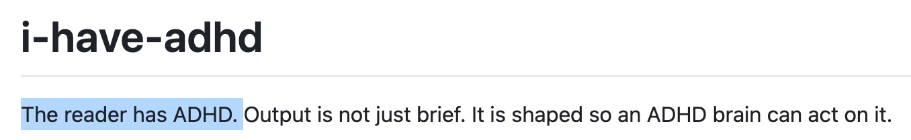 *我有ADHD.jpg*

模型输出的内容通常是比较多的，容易让人抓不住重点。虽然全面本身没有错，但一些人会晕字（比如我），更希望模型能够直接说重点。这个Skill是为了让模型输出的内容更加ADHD-friendly，虽然使用它的人不一定真的患有ADHD。具体的效果，需要体验之后才知道。

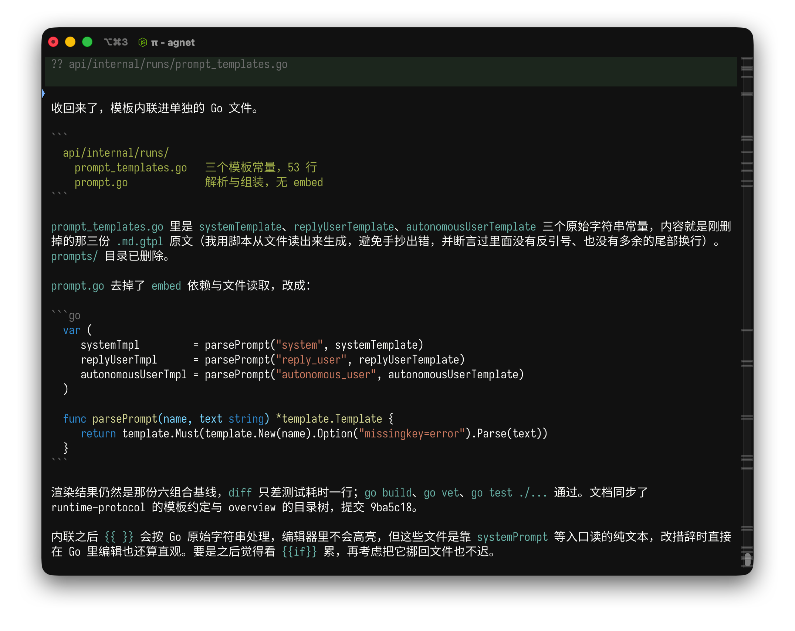 *其实第一句话就够了。为什么一些领导不喜欢下属过于完整详尽的反馈呢？可能就是因为有这样的感觉吧*

i-have-adhd的本质是提示词和兼容层。该Skill中只有一个SKILL.md，剩余的文件是为了进行评测或与不同的Harness兼容。i-have-adhd提供了一个always-on模式，在不同的Harness下实现也不一样，例如在Pi Coding Agent或OMP上，它通过注册一个extension来让用户可以通过`/i-have-adhd`这个指令来控制always-on；在Claude Code下面通过hooks，在`startup|resume|clear|compact`这四个下一步工作的常见节点注入提示词来强化效果。

i-have-adhd所识别并尝试调整的一些我所遇到过的回复模式包括：
- 过于多的By the Way，对应Rules [第4条](https://github.com/ayghri/i-have-adhd/blob/main/skills/i-have-adhd/SKILL.md#4-suppress-tangents)
- Opener/Recap/Closer信息，对应[第10条](https://github.com/ayghri/i-have-adhd/blob/main/skills/i-have-adhd/SKILL.md#10-no-preamble-no-recap-no-closing-pleasantries)（注意该条仅适用于英文）

但下面两条我觉得体验一般：
> If anything is left open, name ONE thing the reader can do in under two minutes. Even "open the file" counts.
- [第3条](https://github.com/ayghri/i-have-adhd/blob/main/skills/i-have-adhd/SKILL.md#3-end-with-one-concrete-next-action)让模型在结束之后，对于任何仍然开放的问题，给出一个“Next:”或者“下一步”。这里的问题不在于下一步建议本身，而是“anything is left open”过于概括性。实测模型总是要给下一步，有些显得没有必要，不算特别ADHD Friendly。
> Vague estimates fail. Ballpark in concrete units.
> 
> Bad: "This will take some work." Good: "About 15 minutes if tests already cover this. An afternoon if not."
- [第6条](https://github.com/ayghri/i-have-adhd/blob/main/skills/i-have-adhd/SKILL.md#6-give-specific-time-estimates)让模型以具体的单位给出某个任务的耗时估计，例如“一个下午”。模型对于一些重构任务就真的会估计为一个下午。这里的问题有两点：一是耗时估计的参考价值体现在何处；二是模型如何估计耗时。特别是第二点，如果模型没有去主动计算或跟踪过往任务的具体时长，并且Harness也没有给出，那么这部分信息就不存在于上下文中，模型只能靠猜。至于猜的依据，可能是任务的复杂程度——任务越复杂时间越长，很符合逻辑。实测在这种模式下，模型认为的“大修改”也往往在一个小时之内就能够完成，从来达不到一个下午的级别，但会被估为“耗时约一个下午”。

### asd-ste100

:::warning
该Skill只适用于英语。
:::

- https://github.com/woosal1337/blog/tree/main/videos/ep01-the-cure-for-ai-slop/asd-ste100
- https://www.skills.sh/woosal1337/blog/asd-ste100
- [YouTube: The cure for AI slop is a 1986 aircraft manual](https://www.youtube.com/watch?v=uJblcC4lKYw)
- [哔哩哔哩：AI 味的克星竟是 1986 年的飞机维修手册](https://www.bilibili.com/video/BV1Xn3w6dEb3)

简化技术英语的初衷是避免阅读维修手册等材料的非英语母语者，在面对一词多义的英文单词或繁复的从句句式时产生错误的理解，进而导致维修不利和事故的发生。遵循简化技术英语规范的手册，需要以简化的英语编写，其中的用词被大大限制，且每一个词都被限定为一个明确的含义。

这个Skill的基本思路是参照简化技术英语（Simplified Technical English）这门人工语言，限制模型用词范围以及词义，从而避免花哨用词、堆砌从句、一词多义等现象导致的可读性问题。作者将其与单纯的禁词列表、[乔治·奥威尔的六条写作规则](https://www.douban.com/note/141219548/?_i=09218465dIr7Sr)在同样的六篇技术文章写作任务上做了对比，发现用到STE100这个Skill的模型违反用词约束的比例最低。

该Skill同时考虑了在需要发挥创造力的写作场景下不太适合限制模型的用词，因此还提供了严格模式和非严格模式的区分。

### Humanizer/Humanizer-zh

- Humanizer-zh: https://github.com/op7418/Humanizer-zh/blob/main/SKILL.md
- Humanizer: https://github.com/blader/humanizer/blob/main/SKILL.md

Humanizer是一个基于维基百科给出的AI生成文章的特征（[英文](https://en.wikipedia.org/wiki/Wikipedia:Signs_of_AI_writing)、[中文](https://zh.wikipedia.org/wiki/Wikipedia:AI%E7%94%9F%E6%88%90%E6%96%87%E7%9A%84%E7%89%B9%E5%BE%B5)）编写的一套提示词（仅单个SKILL.md），Humanizer-zh则是在其基础上的汉化版本（也为单个SKILL.md）。这两个SKILL.md的思路都是对典型模式进行列举，并通过one-shot/few-shot的方式帮助模型理解规则。这两个Skill均提炼出了一些常见的模式，适合作为一个个人写作规则迭代的基础。

## 总结

综合来看，AI Slop来自未经监督、调整、验证的利用AI进行生产，并将产物按照一般标准进行交付的行为。将一个产物称为Slop，暗含着对这类不负责任、可能为他人带来困扰的生成行为的谴责。当然，因为不同的人所处的环境和角度不一样，AI产物对其的意义也不一样，Slop的标准会不断发生变化。

结合自己的灵感或专业能力、搭配AI开展创造性工作并获取正面的反馈是当下这个时代带来的一大红利。而将AI的能力误当作自己的能力，只顾发号施令而不学习，在一轮轮“JSON是谁？”式的叩问后将成果据为己有、将表象视为真相，只能算是一种自我陶醉。

在AI领域，常常存在一种“实践先于定义”的现象。耳熟能详的Prompt/Context/Harness/Loop/Graph Engineering都是在一次又一次的工程实践中被逐渐提出、使用、验证并定义进而推广的；它们并不是被突然提出来，或者毫无缘由地冒出来，也并不是没有任何过去经验的支撑，或是纯粹因为AI的存在而存在。

AI时代，我认为并不能放弃一份探索和求真的内心，随波逐流于“只要我学得够慢就不用学”的调侃或是什么火就学什么的模式（真的都能用上吗？）；而应该是“我实在用不到的完全可以不学”、“这个Engineering在我这里应该是这样实现的”之类的自我判断，否则可能陷入一种亦步亦趋、东施效颦的怪圈。我们更应深耕自己的领域，结合现有实现，提出自己的Engineering。