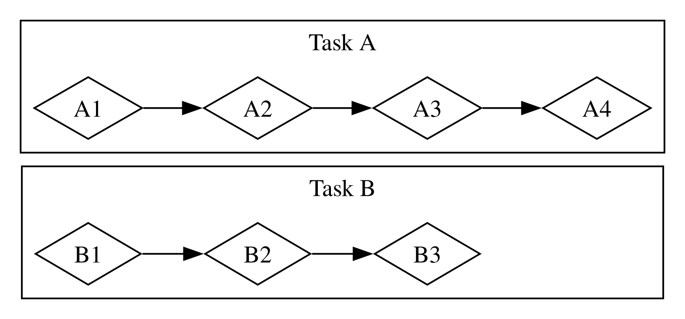
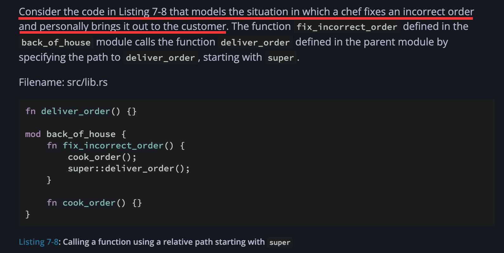

# 读《Rust 程序设计语言》

## 目录

## 1. Cargo

### 在 macOS 上安装 Rust & Cargo

用于管理 Rust 本身版本以及相关工具链的工具是 rustup。某种程度上，安装 Rust 就是在安装 rustup，因为离开了 rustup 再去安装 Rust 就不再是几行指令能完成的了。
- 安装 rustup：`curl --proto '=https' --tlsv1.2 https://sh.rustup.rs -sSf | sh`

这会安装一部分常用的 Rust 工具链，它们共同构成了 Rust 的基本语言功能。

<details>
<summary>rustup show 输出示例</summary>

```
me@cyberbook ~ % rustup show
Default host: aarch64-apple-darwin
rustup home:  /Users/me/.rustup

installed toolchains
--------------------
stable-aarch64-apple-darwin (active, default)

active toolchain
----------------
name: stable-aarch64-apple-darwin
active because: it's the default toolchain
installed targets:
  aarch64-apple-darwin
```
</details>

<details>
<summary>rustup component list 输出示例</summary>

```
me@cyberbook ~ % rustup component list
cargo-aarch64-apple-darwin (installed)
clippy-aarch64-apple-darwin (installed)
llvm-bitcode-linker-aarch64-apple-darwin
llvm-tools-aarch64-apple-darwin
rust-analysis-aarch64-apple-darwin
rust-analyzer-aarch64-apple-darwin
rust-docs-aarch64-apple-darwin (installed)
rust-src (installed)
rust-std-aarch64-apple-darwin (installed)
rust-std-aarch64-apple-ios
rust-std-aarch64-apple-ios-macabi
rust-std-aarch64-apple-ios-sim
rust-std-aarch64-linux-android
...
```
</details>

### 创建项目

#### a. 创建空项目

- 创建项目 `cargo new <项目名称>`
  - 以`<项目名称>`创建目录
  - 在目录下创建 **Cargo 配置文件** `Cargo.toml`、src 目录。src 目录下附带有 main.rs 文件
  - 使用默认 VCS（通常是 git）初始化一个项目，可以通过 `--vcs` 来修改

:::note
**Cargo.toml 默认内容**
```toml
[package]
name = "hello_cargo"
version = "0.1.0"
edition = "2024"

[dependencies]
```
:::

:::note
**main.rs 默认内容**
```rust
fn main() {
    println!("Hello, world!");
}
```
:::

#### b. 从已有的代码创建

约定@表示项目根目录。

1. 在@下创建 src 目录，并将已有代码放入 src 文件夹
2. 在@下执行 `cargo init` 来快速创建一个 Cargo.toml（或者自行填写）。

### 构建/运行 Cargo 项目

- 构建项目 `cargo build` 生成的文件在 @/target/debug 内。默认为 debug build，相比于 release build 编译速度更快，不执行优化。
  - `cargo build --release` 进行 release build，在 @/target/release 下面创建优化后的可执行文件。
- 运行项目 `cargo run` 相当于编译并直接运行
- 检查项目 `cargo check` 检查项目能否成功构建，比 `cargo build` 运行快。

## 2. 常见编程概念

### 变量/可变性

- 可变 mutability, mutable, immutable

使用 `let` 来声明和定义不可变的变量，使用 `let mut` 来声明和定义可变变量。`let` 和 `mut` 是两个独立的 keyword。

使用 `const` 来声明和定义常量。

常量相比于不可变变量多出的特点
- 常量必须标注数据类型
- 常量必须为可以在 compile time 计算出结果的表达式
- 常量可以在任何作用域中声明

```rust
const THREE_HOURS_IN_SECONDS: u32 = 60*60*3;
```

:::note
**Rust naming convention**

Constants: uppercase with underscores between words
:::

#### 遮蔽 Shadowing

同一个*变量*可以**重复定义**。被重复定义的变量，后定义的遮蔽之前定义的变量。

```rust
fn main() {
    let x = 5;

    let x = x + 1; // 6 遮蔽 5

    {
        let x = x * 2; // 12 遮蔽 6
        println!("The value of x in the inner scope is: {x}");

        // 12 退出作用域
    }

    println!("The value of x is: {x}"); // 6
}
```

遮蔽本质上是对同一个变量名的重复使用，它创建的是新的变量。特点：
- **在遮蔽的表达式中，遮蔽还未发生**，因此 `let x = x + 1` 这样的表达式可以达到目的。
- **遮蔽可以改变变量类型**，因为被遮蔽变量与遮蔽变量之间除了名称外没有任何联系。

### 数据类型

Rust 是静态类型语言（statically typed lang），编译时必须知道所有变量的类型，因此对于一些类型不明确的场景，必须指定变量类型。

- 将 guess 指定为 `u32`，使得 "42" 解析出的结果正是 `u32`，不是其它。
```rust
let guess: u32 = "42".parse().expect("not a number!");
```
- 将 v 指定为 `Vec<i32>`。
```rust
let v: Vec<i32> = Vec::new();
```

换句话说，这种类型的标注并不是单纯的 annotation（例如 TypeScript 中的那样），而是真正起到作用的类型声明（与 Java 类似），只是一般可以被省略。

#### 标量类型 Scalar Type

标量类型表示一个单值的类型（类似于 JavaScript 中的 primitive type），Rust 中有 4 种标量类型：整型、浮点型、布尔型和字符类型。

##### 1. 整型

整型分为有符号数和无符号数，分别用 `i`x 和 `u`x 表示。根据大小不同，可以划分为 8、16、32、64、128 位五个量级，还有一个特殊的 size 量级。通过与量级进行组装，就得到了相应大小的有/无符号整型类型。

- `i8` 有符号 8b 整型
- `u128` 无符号 128b 整型
- `isize`、`usize` 是架构相关的有符号/无符号整型，在 64 位计算机上，这里的 size 就是 64。

:::note
整型的默认类型是 i32。
:::

可以按照补码来获得整型的范围

- `i`x 的表示范围是 $$ [-2^{x-1}, 2^{x-1}-1] $$
- `u`x 的表示范围是 $$ [0, 2^x-1] $$

整型的字面量分为十进制、十六进制、八进制、二进制和字节。

- 十六进制、八进制、二进制前缀为 `0x`、`0o`、`0b`
- 字节（ASCII 字符）用 `b'A'` 格式表示（该格式字面量的类型一定是 `u8`）
- 十进制、十六进制、八进制、二进制表示法均可以用 `_` 来无影响地分隔数字

其他要点：

- **整型后缀**（类似 Java）：对于可以对应多种数据类型的字面量，可以在结尾加上类型名后缀，例如要将 57 规定为一个 u8 而不是默认的 i32，就将其字面量写成 `57u8`。
- **整型溢出（integer overflow）**在 dev build 时会报错，但是在 release build 时**不会报错**，运行时如果溢出，将进行二进制补码 wrapping。为了避免这种隐式行为导致的意外结果，可以使用在整型值上存在的一系列方法来进行运算，而不是直接使用会导致溢出的 operator。
  - 环运算 `wrapping_add`/`sub`/`mul`/`div` 相当于将以上的默认隐式行为显化，这是更好的做法
    - u8: 255+1=0
  - 带检查的运算 `checked_add`/... 如果有溢出，就返回 `None`。其他时候返回一个 `Some(result)`
    - u8: 255+1=None, 254+1=Some(255)
  - 带溢出的运算 `overflowing_add`/... 一定返回一个元组 `(result, bool)`，其中 `result` 是未经修改的结果（经过了隐式 wrapping），`bool` 指示是否出现了溢出（发生了 wrapping）
    - u8: 255+1=(0, true), 254+1=(255, false)
  - 饱和运算 `saturating_add`/... 如果有溢出，就将其值定在上界（或者下界）
    - u8: 255+1=255, 0-1=0

##### 2. 浮点型

Rust 中有 `f32` 和 `f64` 两种浮点型，默认类型为`f64`，因其精度更高，且在现代CPU上速度与 `f32` 类似。

- 所有浮点型都有符号
- 浮点型遵从 IEEE754

类似于 C，整数与整数的运算永远是一个整数。在 Rust 中，整数除以整数进行向 0 的舍入
- -5 ÷ 3 = -1，-1.6666... 向 0 舍入到 -1。

##### 3. 布尔类型

Rust 中的布尔值用小写的 `true`/`false` 表示，类型名为布尔 `bool` 而非布林（boolean），大小占 1B。

##### 4. 字符类型

在 Rust 中，用单引号声明的是字符字面值，用双引号声明的是字符串字面值。

字符型为 `char`，大小占 **4B**（32b）。

C 中的 `char` 大小为 1B，被设计为存储 **ASCII 字符**而不是 Unicode 标量。在 Rust 中，`char` 代表的是一个 **Unicode 标量值**，可以比 ASCII 表示更多信息，带变音符号的字母（Accented letters），中文、日文、韩文等字符，Emoji（绘文字）以及零长度的空白字符都是有效的 `char` 值。
- `let c = 'ℤ'`
- `let c = '🤔'`

#### 复合类型 Compound Type

Rust 中有两种原生的复合类型：元组和数组

##### 1. 元组 tuple

元组是**定长、有序的一组值**，这些值的类型可以不同，元组的长度无法改变。

```rust
fn main() {
    let tup = (500, 6.4, 1);

    // 还可以添加类型注解，为每一个位置的元素指定一个明确的类型
    let tup: (i32, f32, u8) = (500, 6.4, 1);

    let (x, y, z) = tup;

    println!("The value of y is: {y}"); // 6.4
}
```

**元组解构**<br/>可以使用模式匹配（pattern matching）来解构（destructure）元组的值。这里的模式（pattern）指的是 `(x, y, z)`，解构是指将元组中的值分配到模式的不同变量上的过程。

**索引访问**<br/>元组中的单个元素可直接用点号+索引访问 `tup.0 == 500`

**单位元组**<br/>不带任何值的元组 `()` 称为单位元组（unit tuple，简称为 unit）。

Rust 没有空值，单位元组代表的是函数的空返回值。如果一个函数不返回内容，那么它的返回值*以及*返回值类型就是 `()`（如同 `(i32, u64)` 是一个类型，单位元组也是一种类型）。

这里的 `()` 含义类似于 C 中的 void，但又不完全相同：Rust 中不返回内容的函数会**隐式地返回一个 unit**，而 void 表示的是确实没有任何值被返回。

##### 2. 数组 array

数组是**定长、有序**的**相同类型**元素的组合。数组是可以在**栈（stack）**上分配的**已知固定大小**的单个内存块。

与 C 类似，数组的长度自一开始就已经确定，不能改变。

```rust
// 创建一个元素类型为i32，长度为5的数组
let a: [i32; 5] = [1, 2, 3, 4, 5];

// 创建一个长度为5的数组，将其中的元素初始化为0
let a = [0; 5]
// 相当于
let a = [0, 0, 0, 0, 0]
```

与 C 不同，在 Rust 中下标越界会直接导致 panic（类似于 Java 等较软的语言），而不是访问到垃圾数据。

### 函数与表达式

Rust 的函数由多个**语句**和一个可选的返回**表达式**组成。*返回表达式*是指位于函数体末尾的一个表达式，它就是函数的返回值（也可以用 `return` 提前返回）。例如

```rust
fn five() -> i32 {
	5
}
```

该函数的唯一作用是返回一个 `i32` 5。这里的 5 不需要加分号，因为它就是位于函数体末尾的表达式，即返回表达式。如果写成 `return 5;` 不会导致报错，但这里的 `return` 是多余的。

从这里就可以看出 Rust 的一些独特之处。它是一个基于表达式的语言（expression-based language）[^1]，需要特别区分语句（statement）和表达式（expression）。
- **语句**总是以 `;` 结尾，它执行操作，但不返回值
- **表达式**会进行计算（evaluate），并产生一个值，作为该表达式的结果值（resultant value）

[^1]: https://doc.rust-lang.org/book/ch03-03-how-functions-work.html##:~:text=Rust%20is%20an%20expression%2Dbased%20language

基于以上的区分，可以发现 Rust 与 C 不同，`a = b = 1;`（`let a = (let b = 1);`）的写法无法通过编译，因为 `let b = 1;` 是语句，不返回值。

#### 表达式

表达式的特点是末尾**不带分号**。

- 表达式可以是语句的一部分，例如 `let a = 1 + 2;` 是一个语句，其中 `1 + 2` 是一个表达式。
- 函数/宏调用是一个表达式。
- 用 `{}` 创建的块作用域是一个表达式，例如
```rust
{
	let x = 3;
	x + 1
}
```
整体是一个表达式，它的值是 4。其中 `x + 1` 没有分号，相当于产生该表达式最终结果的返回表达式。这种写法可以按函数体理解，只不过这一个块作用域的内容是立即求值的。

### 控制流

#### if

在 Rust 中，`if` 语句本质是一个**表达式**。

```rust
fn main() {
    let condition = true;
    let number = if condition { 5 } else { 6 };

    println!("The value of number is: {number}");
}
// The value of number is: 5
```

上面的例子中，if 并没有起到控制流程的作用，而是发挥着类似三目表达式的作用。如果把 if 独立出来，不放在等号的后面，就成了常见的用于控制流程的 if（带上分号后自动成为 statement）。

:::note
这种 if 表达式的值取决于哪一个分支的代码块被执行，它的两个分支必须返回相同类型的值，否则将给出错误 **error[E0308]: `if` and `else` have incompatible types**。
:::

在 Rust 中，if 后紧跟的值的类型必须为 bool。Rust 不会进行隐式类型转换，因此 `if 1 {}` 并不等价于 `if true {}`。

#### 循环语句

Rust 中有三种循环语句，它们都可用作表达式。

- `loop` 用于开始一个无条件的循环，可用 break 和 continue 来显式控制其执行。
- `while` 用于开始一个带条件的循环，当条件满足时会持续执行。while 也可以用 loop 搭配 if-else & break 来实现。
- `for` 循环用于针对一个数组、range 进行遍历

```rust
// 一个 for 的示例
for number in (1..4).rev() {
    println!("{number}!");
}
```

##### break 语句

break 语句的一大作用是打破循环，其后也可以跟一个表达式用来将值从循环中返回出去，可理解为“属于循环的 return”，或者“属于循环的返回表达式”（这里不能直接使用返回表达式是因为循环体没有明确的结束位置）。下面的例子充分利用了 loop 是表达式和 break stmt 两点。

```rust
fn main() {
    let mut counter = 0;

    let result = loop {
        counter += 1;

        if counter == 10 {
            break counter * 2; // break后跟值来返回
        }
    };

    println!("The result is {result}");
}
// The result is 20
```

##### 循环标签

可以在循环语句之前加上 `'label':` 来为循环添加一个标签，从而更好地控制嵌套的循环。break 和 continue 默认总是作用于最内层的循环，如果在其后跟循环标签，则直接作用于相应循环。

## 3. 所有权

**所有权**（ownership）是 Rust 用于管理内存的一组规则。

1. Rust 中的每一个值都有一个 所有者（owner）。
2. 值在任一时刻有且只有一个所有者。
3. 当所有者离开作用域，这个值将被丢弃。

其它语言中对于内存的处理，大抵有下面的策略

- Java、Go 等语言中有 GC 机制，自动进行内存垃圾回收
- C/C++ 语言需要程序员自行分配和释放内存

而 Rust 通过所有权管理内存，如果违反了所有权的规则，程序无法编译，从而可以让程序员（在理想状态下）自然写出内存管理良好的程序。Rust 所有权系统是一种零成本抽象（zero-cost abstraction），它不会减慢程序的运行。

<details>
<summary>ChatGPT 列出的更多机制和语言</summary>

* **编译期所有权/借用**：Rust、Move（资源语义）
* **引用计数/ARC**：Swift、Objective-C（ARC）、Python（主机制）
* **垃圾回收（GC）**：Java、Go、C#、JavaScript、Haskell、Ruby
* **RAII/确定性析构**：C++、D
* **线性类型**：Clean、部分 Haskell/Idris 扩展
* **手动管理**：C、C++（可被 RAII/智能指针覆盖）
</details>

### 基础知识

#### 栈与堆

Rust 中数据在栈上还是在堆上影响了语言的行为。

- **栈**是 LIFO 结构，向栈中增加数据为入栈（push onto the stack），删除数据为出栈（pop off the stack）。栈中的所有数据有**已知且固定**的大小。
- **堆**是缺乏组织的结构。向堆中增加数据时，必须先申请空间，内存分配将找到这一部分空间，并返回这一位置的指针。这一过程称为在堆上分配内存（allocating on the heap），简称分配。虽然数据的大小是未知的，但指针的大小总是已知且固定的，因此指针都可以存到栈上。

一个事实是，入栈比在堆上分配内存要快，访问栈上的数据也比访问堆上的数据要快。

> 跟踪正在使用堆上的数据的代码以及它们所使用的数据，最大限度的减少堆上的重复数据的数量，清理堆上不再使用的数据，确保不会耗尽空间，这些问题正是所有权系统要处理的。 [^2]

[^2]: https://kaisery.github.io/trpl-zh-cn/ch04-01-what-is-ownership.html#%E6%A0%88stack%E4%B8%8E%E5%A0%86heap

#### 作用域

作用域是一个项在程序中的有效范围。

```rust
{                      // s 在这里无效，它尚未声明
    let s = "hello";   // 从此处起，s 是有效的

    // ...
}                      // 此作用域已结束，s 不再有效
```

上面的例子说明，声明并定义 `s` 之后，它就变得有效，称为 **`s` 进入了作用域**，它的有效性一直持续到它离开作用域（即它所在的作用域结束），这与其它高级语言是类似的。

#### Rust 中的 RAII：自动的手动释放

:::note
**String**
Rust Book 中的这一章用来作为例子介绍所有权的类型是 String。String 是一个相对复杂的类型，它可以看成是 ptr、len 和 capacity 三个字段构成的结构体。其中 ptr 是指向堆上存储的字符数据的指针。
:::

在 String 中，为了支持可变长度的文本片段，需要在堆上分配一块 compile time 大小未知的内存来存放内容，这意味着

1. 需要在 runtime 向**内存分配器**（memory allocator）请求内存
2. 需要一个将内存空间归还给分配器的方法

第一点已经在 `String::from()` 中实现了，该方法可以根据字面量内容请求内存。对于第二点

- 在有 GC 的语言中，我们不需要关心。
- 在需要手动释放的语言中，这需要我们自己释放。“自己释放”并非易事，要正确地释放，必须对每一个 allocate 都在正确的时机精确对应唯一的 free，这是因为
  - **不回收**会浪费内存，性能损失
  - **过早回收**会造成无效的变量，野指针
  - **重复回收**也会造成问题

Rust 没有 GC，但更倾向于自动释放。当一个变量离开它的作用域后，就会被自动释放（背后借助的是 `drop` 函数）。在 C++ 中，一个项在生命周期结束时释放资源的模式有时被称作 **资源获取即初始化**（Resource Acquisition Is Initialization），Rust 的这种自动释放的行为就类似于 RAII。

### 数据的移动（move）

```rust
let s1 = String::from("hello");
let s2 = s1;
```

用最简单的话语来概括，上面的代码是将 s1 赋给了 s2，这背后发生了什么？

该代码将 s1 的内容“浅拷贝”（一种不严格的说法，实际上是只复制结构体本身，不复制 ptr 所指向的堆中数据）到 s2 中，**并将 s1 标为无效**，整个过程被形象地称为**移动**（move），换句话说，s1 所携带的值的所有权被转交给了 s2。

这种移动确保了离开作用域时对于同一个数据释放行为的唯一性。如果 s1 没有为标为无效，那么就会导致重复回收。

Rust 不会自动地创建数据的“深拷贝”。因此，任何自动进行的复制行为都可以认为对运行时性能影响较小。

:::note
**关于此处的深/浅拷贝**

这里的深/浅拷贝的形容，主要集中在堆上的数据。堆上的数据是“昂贵的”，如果不加考虑就随意复制就会导致内存的浪费，降低性能。但堆上的数据并不是不能复制，只不过这种复制应是一种显式的行为，即所谓克隆，它对应的是“深拷贝”。
:::
如果一些数据并不涉及到堆，而只是存在于栈上，例如整型，它们之间不会存在深/浅拷贝的区分。上面对 s1、s2 的操作，对于栈上的数据都相当于拷贝。

```rust
let s1 = 1;
let s2 = s1; // 直接拷贝，不移动
```


在向函数传递参数的时候，与赋值类似，也有移动和复制的区别。

```rust
fn main() {
	let s = String::from("hello");
	
	some_function(s);
	
	// 这里再使用s会导致编译错误
}
```

将 s 直接传入一个具有获取所有权形参的函数时，其携带的值的所有权也被移动。此时 s 中的值将跟随 `some_function` 中的作用域存活，而不再跟随 `main`。如果在所有权被移动之后继续尝试使用该值，将无法通过编译。

#### 赋值可能使项离开作用域

```rust
let mut s = String::from("hello");
s = String::from("ahoy");

println!("{s}, world!");
// ahoy, world!
```

上面的代码中，在 `s` 中的数据被替换为 String ahoy 的时候，String hello 立即离开了作用域，也就立即被 drop 了。

#### 返回值与作用域

传入参数将外部项的所有权交付给函数，反过来，函数的返回值将相关值的所有权移出函数体。

```rust
fn main() {
	let s = gives_ownership();
}
// s在这里被释放

fn gives_ownership() {
	let some_string = String::from("yours");
	
	some_string // 这里将some_string返回以后，其值的所有权也被移出此作用域
}
```

### 引用与借用

数据的所有权是一个非常严格的系统，在面对一些简单的需求，例如计算某个 String 的长度时，我们并不需要真正获取其所有权，只需要援引该 String 上的一些方法就已经足够。这就是引用（reference）的作用。借助引用，可以编写出一个不会获取所有权，但仍然能访问其携带的方法的函数：

```rust
fn main() {
    let s1 = String::from("hello");

    let len = calculate_length(&s1);

    println!("The length of '{s1}' is {len}.");
}

fn calculate_length(s: &String) -> usize {
    s.len()
}
```

这里 `calculate_length` 函数的参数 s 的类型是 String 的引用类型 &String，代表其对应的实参只获取其值但不获取所有权，`s.len()` 返回一个 usize 的所有权。

引用就像是一个指针，但与指针不同的是，引用一定指向有效的数据对象，否则会出现编译错误。

要对已有的量创建引用，在前面加上 `&`，例如 `&s1`。

创建一个引用的行为称为**借用（borrowing）**。

#### 可变/不可变引用

创建出的引用默认是不可变的，在不可变的引用上执行一些修改操作，会导致编译错误。这是因为修改操作相关方法需要获取可变引用，而可变引用和不可变引用不能共存。

```rust
fn main() {
    let s = String::from("hello");

    change(&s);
}

fn change(some_string: &String) {
    some_string.push_str(", world"); // 编译错误
}
```
*尝试在不可变引用上进行更改*

要创建可变引用，变量本身必须先是可变的。可变引用使用 `&mut` 来创建。改为下面的代码即可正常编译。

```rust
fn main() {
    let mut s = String::from("hello");

    change(&mut s);
}

fn change(some_string: &mut String) {
    some_string.push_str(", world");
}
```
*使用可变引用重写的 change 函数*

##### 限制

可变/不可变引用的限制在于，在同一个作用域（注意是[引用的作用域](#引用的作用域)）内，
- 同一个量的可变引用至多有一个。
- 两种引用不能共存。

因此，两个 `&mut s`、一个 `&s` 和一个 `&mut s` 共存均会导致编译错误，不过多个 `&s`（多个不可变引用）没有问题。上面的约束均发生在同一个作用域下，下面的代码是可以正确编译的。

```rust
let mut s = String::from("hello");

{
    let r1 = &mut s;
} // r1 在这里离开了作用域，所以我们完全可以创建一个新的引用

let r2 = &mut s;
```

#### 引用的作用域

一个引用的作用域不等同于被借用变量的作用域，它从引用被创建开始，一直持续到最后一次被使用的位置（是“变化”的）。下面的例子中假设了 r1 和 r2 最后一次使用是在第一个 `println!`，之后不再使用，所以在 r3 创建的可变引用不会报错。

```rust
let mut s = String::from("hello");

let r1 = &s; // 没问题
let r2 = &s; // 没问题
println!("{r1} and {r2}");
// 此位置之后 r1 和 r2 不再使用

let r3 = &mut s; // 没问题
println!("{r3}");
```

#### 悬垂引用

悬垂引用是不合法的引用，将会导致编译错误。引用应当始终指向有效的数据。

```rust
fn main() {
    let reference_to_nothing = dangle();
}

fn dangle() -> &String {
    let s = String::from("hello");

    &s
    // 这里 s 数据本体离开了作用域，所有权并没有交接，但又返回了对它的引用
}
```

### 切片

切片（slice）是一种特殊的引用，最常见的是字符串 slice，其类型用 `&str` 表示。在 Rust 中，字符串字面量的类型就是 &str（而不是 String）。

创建切片引用通过类似于 `&s[a..b]` 的语法，其中 `a` 表示要截取的开始元素位置（下标），`b` 表示截取结束元素位置的下一个位置。此处满足 $$ b-a=截得元素个数 $$。如果 a=0 或者 b=最后一个字符的下一位，可以省略不写。

- `let world = &s[6..11];` 表示一个字符串 Slice，`[6..11]` 表示该 slice 截取了字符串第 6~10 个字符（包含两端，下同），字符个数为 11-6=5。
- `let slice = &s[..2];` 截取字符串的第 1~2 位字符，共 2 个。
- `let slice = &s[3..];` 截取字符串的第 3~length 位字符，共 length - 3 个。
- `let slice = &s[..];` 截取字符串的全部字符，共 length 个。这种写法用于获取一个 String 对应的 `&str`（而不是 `&String`）。

#### Slice Usage Example: 编写算法获取一串单词序列的第一个单词

例如单词序列为
```rust
let s = String::from("quick brown fox jumps over lazy dog");
```

在不使用 slice 时，如果要获取第一个单词 quick，由于不能直接将这个片段返回出去，可以返回位置来代替。于是，可以从这个字符串的第一个字符开始看，遇到空格时就将其下标返回出去，这就得到了第一个单词的位置。如果要获取第二个、第三个···单词的位置，可以沿用这种看空格的方式。

缺点很明显：对于不同位置的单词，要看的空格数量不一样，函数的实现也不一样。并且返回的数据不够直观。

```rust
fn first_word(s: &String) -> usize {
    let bytes = s.as_bytes();

    for (i, &item) in bytes.iter().enumerate() {
        if item == b' ' {
            return i;
        }
    }

    s.len()
}
```
*不使用 Slice 编写的获取 String 中第一个单词的函数（只能返回位置）*

使用 slice 以后上面的函数可以直接以 String slice 返回单词，。

```rust
fn first_word(s: &String) -> &str {
    let bytes = s.as_bytes();

    for (i, &item) in bytes.iter().enumerate() {
        if item == b' ' {
            return &s[0..i];
        }
    }

    &s[..]
}
```
*获取 String 中第一个单词的 slice 的函数*

需要注意 Slice 本质上仍然是引用，也有可变与不可变之分。上面的 `first_word` 本质上是接受一个 &String，返回一个对这个 String 值本体的 &str 引用。下面的代码中，word 是一个 s 的 String slice，也是对 s 的不可变引用。

```rust
fn main() {
    let mut s = String::from("hello world");

    let word = first_word(&s);

    s.clear(); // 错误！

    println!("the first word is: {word}");
}
```

如果此时在 word 的作用域内对 s 进行修改操作，势必会获取其可变引用，这就导致 s 的可变引用和不可变引用共存，引发编译错误。

#### 字符串字面量就是 Slice

```rust
let s = "Hello, world!";
```

s 的类型是 &str，它是对内存中预先存有的一些数据的不可变 slice 引用。`first_word` 的函数签名可以改写为

```rust
fn first_word(s: &str) -> &str
```

如果一个参数是 `&str` 类型，那么它既可以处理 `&String` 也可以处理 `&str`。

```rust
fn main() {
    let my_string = String::from("hello world");

    // 以下两种写法等价
    let word = first_word(&my_string[..]); // 传入的是 &str
    let word = first_word(&my_string); // 传入的是 &String，会被转换为按 [..] 截取 &str

    let my_string_literal = "hello world"; // &str 类型

    // 以下两种写法带&是因为要对&str进行截取
    let word = first_word(&my_string_literal[0..6]); // 针对 &str 继续截取
    let word = first_word(&my_string_literal[..]); // 针对 &str 截取 [0..6]
    // 由于其本身已经是&str，如果不截取可以直接传入，不带&
    let word = first_word(my_string_literal);
}
```

#### 其它类型的 Slice

数组也可以有 slice，其截取语法与字符串相同。下面的例子中，slice 的类型为 &[i32]

```rust
let a = [1, 2, 3, 4, 5];

let slice = &a[1..3];

assert_eq!(slice, &[2, 3]);
```

## 4. 结构体

### 定义结构体

使用 `struct` 关键字可以定义一个结构体，其语法如下面例子中所示，与 TypeScript 的 interface 定义类似，但每一行需要以 `,` 结尾。

结构体与元组都是存储多个不同类型数据的方式，其中一个主要区别是结构体中的每一个数据都可以有名字（字段名），而元组是以下标来标识数据。

```rust
struct User {
    active: bool,
    username: String,
    email: String,
    sign_in_count: u64,
}

fn main() {
    let user1 = User {
        active: true,
        username: String::from("someusername123"),
        email: String::from("someone@example.com"),
        sign_in_count: 1,
    };
}
```

上面的 user1 是结构体的一个**实例**（instance），它包含了各个字段的具体值。

不要忘了可变性的限制：仅当实例为可变时，可以用点号来改变其中的字段，如 `user1.email = String::from(...)`。实例中的字段要么全部可变（结构体实例本身可变），要么全部不可变，不支持将单个字段标记为可变。

#### 字段初始化简写语法

如果要将一个变量填入到结构体中的一个同名字段，可以用字段初始化简写（field init shorthand）语法：

```rust
fn build_user(email: String, username: String) -> User {
    User {
        active: true,
        username,
        email,
        sign_in_count: 1,
    }
}
```

类似于 JS，可以用上面的 `username, email` 写法来代替 `username: username, email: email`。

#### 结构体更新语法

如果要从一个结构体实例派生出另一个实例，只修改其中一小部分字段，可以借助结构体更新语法（struct update syntax）：

```rust
let user2 = User {
    active: user1.active,
    username: user1.username,
    email: String::from("another@example.com"),
    sign_in_count: user1.sign_in_count,
};

// 可以写成

let user2 = User {
    email: String::from("another@example.com"),
    ..user1
};
```
*结构体更新语法免去了一个个传入值的过程。需要注意，在结构体更新语法中，值看起来很像没有被传入，因而容易忽略掉这里的所有权问题。*

这种语法中 `..user1` 的写法类似于 JS 中的[展开（spread）](https://developer.mozilla.org/en-US/docs/Web/JavaScript/Reference/Operators/Spread_syntax)。注意：这里用的是两个点号而非三个，且 `..user1` 必须放在结构体定义的**最后**。

<details>
<summary>关于这里语法与 JS 的高度相似性，ChatGPT 的回答</summary>

Rust 的这两处语法，其实是多方语言设计思想的汇聚，并不存在“一方直接借鉴另一方”的简单线性关系。下面按功能分别梳理它们的来龙去脉：

**1. 字段初始化简写（field init shorthand） vs. JS 对象属性简写**

- **JavaScript** 在 2015 年发布的 ECMAScript 2015（ES6）规范中，引入了对象字面量的属性值简写：当属性名和变量名相同时，可以写成 `{ x, y }` 而不是 `{ x: x, y: y }` ([Stack Overflow](https://stackoverflow.com/questions/38819621/object-literal-property-value-shorthand?utm_source=chatgpt.com))。
- **Rust** 在 2016 年 7 月提交的 RFC 1682《field-init-shorthand》中，明确将此写法作为字段初始化的语法糖：“允许将 `field` 视为 `field: field` 的简写”([rust-lang.github.io](https://rust-lang.github.io/rfcs/1682-field-init-shorthand.html))。RFC 中也直接声明，它的灵感（inspiration）来源于 Haskell 的 NamedFieldPuns 扩展和 ES6 的 shorthand property names。
- **结论**：Rust 的字段初始化简写是在 ES6 之后提出的，Rust 借鉴了 ES6（以及 Haskell）的语法设计；JavaScript 方面并未直接从 Rust 借用这点。

**2. 结构体更新语法（struct update syntax） vs. JS 对象展开（spread）**

- **Rust** 的 `Foo { x: new_x, ..old }` 语法，从 Rust 1.0（2015 年 5 月）起就已存在，用于“创建一个新结构体，保留旧实例中未显式列出的字段”([Massachusetts Institute of Technology](https://web.mit.edu/rust-lang_v1.25/arch/amd64_ubuntu1404/share/doc/rust/html/book/first-edition/structs.html))。这种“记录更新”（record update）一脉源自 Haskell（`r { field = v }`）等 ML 方言。
- **JavaScript** 直到 2018 年（ES2018），才在对象字面量里支持同名展开属性 `{ ...obj, x: newX }`，且使用三个点 `...`，与 Rust 的两个点 `..` 并不相同([v8.dev](https://v8.dev/features/object-rest-spread?utm_source=chatgpt.com))。JS 的 rest/spread 提案也更多地沿用了数组的 rest/spread 概念（最早在 ES6 的数组上下文中引入）。
- **结论**：Rust 的 `..` 更新语法并非源自 JavaScript，而是更早且独立地源自函数式语言；JavaScript 后来为对象引入的 `...` 展开，也不是基于 Rust。

---

**综合来看**：

- **Rust field-init shorthand** 是在 ES6 之后、RFC 1682 中“向 Rust 添加”并明确借鉴了 ES6 shorthand property 的功能。
- **Rust struct update syntax** 更早出现在 Rust 1.0（2015），灵感主要来自 Haskell 等语言的记录更新，不是源自 JS。
- **JavaScript 的对象属性简写/展开**，则分别在 ES6（2015）和 ES2018（2018）中被标准化，它们并不是直接从 Rust 借鉴而来。

因此，严格地说：

1. Rust 的字段初始化简写借鉴了 ES6（和 Haskell）。
2. Rust 的结构体更新语法借鉴了 Haskell 等 ML 方言，而 JS 的对象展开则是后来基于自身数组展开发展而来，二者并无直接借鉴关系。
</details>

:::note
**讨论：这里是否发生了一些数据的移动？**

User 结构体中，只有 active 和 sign_in_count 是实现了 copy trait 的类型，而 username 和 email 上的 String 没有 copy trait，在赋值后会被移动出去（所有权从 user1 移动到 user2 上）。
:::
因此，在完成了上面的 user2 赋值以后
- user1.username 不再可用，它被移动到了 user2.username
- 因为 user2 已经指定了 email（user1.email 不需要移动），所以 user1.email 仍然可用
- active 和 sign_in_count 实现了 copy trait，所以 user1.active 和 user1.sign_in_count 仍然可用

    

### 元组结构体 Tuple Struct

结构体字段并不是必须有名称。如果结构体中所有数据都没有名称，它就是元组结构体。

```rust
struct Color(i32, i32, i32);
struct Point(i32, i32, i32);

fn main() {
    let black = Color(0, 0, 0);
    let origin = Point(0, 0, 0);
}
```
*元组结构体的一种用途：Color 量、Point 量的三个维度 RGB 和 XYZ 的名称可以省略*

虽然 black 和 origin 在形式上都是 (i32, i32, i32)，但它们是不同（名称）的结构体实例，其类型是不同的。与元组类似，元组结构体也支持解构，需要在模式前面加上结构体的名称。

```rust
let Color(r, g, b) = black;
// r=0,g=0,b=0
```

#### 类单元结构体 Unit-like Struct

没有任何字段的结构体称为类单元结构体，这里的“类单元”是指类似于**单元**（unit），即单位元组 `()`。类单元结构体直接使用 `struct <结构体名>` 来定义。

> 类单元结构体常常在你想要在某个类型上实现 trait 但不需要在类型中存储数据的时候发挥作用。

```rust
struct AlwaysEqual;

fn main() {
    let subject = AlwaysEqual;
}
```

### 通过派生 Trait 增加实用功能

在结构体上可以通过派生一些存在的 Trait，来为结构体添加一些功能和特性。

#### 结构体的 debug 打印

定义以下简单结构体 Rectangle

```rust
struct Rectangle {
    width: u32,
    height: u32,
}
```

如果按照一般的方式（使用 `{}` 占位）尝试在 println! 宏中打印 Rectangle 实例，会出现一个错误 **error[E0277]: `Rectangle` doesn't implement `std::fmt::Display`**。这表示我们的结构体没有实现 Display trait。

println! 宏还支持使用其它占位符，如 `{:?}` 占位符，其含义是将相应的值 debug 输出。但当用它打印结构体时，仍然会报错 **error[E0277]: `Rectangle` doesn't implement `Debug`**，指示结构体没有实现 Debug trait。

在这里先不考虑实现 trait。Debug trait 是可以直接派生的，使用下面的语法，在 struct Rectangle 的前面加上一行 `#[derive(debug)]` 即可让 Rectangle 派生 Debug trait。

```rust
#[derive(Debug)]
struct Rectangle {
    width: u32,
    height: u32,
}
```

这样就可以使用 `{:?}` 或者 `{:#?}` 占位符将其打印出来了。

#### `dbg!` 宏

dbg! 宏是将值输出的另一种方式，与 println! 不同的是，dbg! 宏接收的是表达式的所有权（println! 仅获取引用）。dbg! 宏作为表达式时，会将它收到的所有权返回出去。

```rust
#[derive(Debug)]
struct Rectangle {
    width: u32,
    height: u32,
}

fn main() {
    let scale = 2;
    let rect1 = Rectangle {
        width: dbg!(30 * scale), // 这里30*scale的所有权被传入dbg!后再返回出来。
        height: 50,
    };

    dbg!(&rect1);
}
```

最后的 `dbg!(&rect1)` 没有使 dbg! 获取 rect1 的所有权，因其传递的是一个引用。

以上代码的执行效果输出：

```
[src/main.rs:10:16] 30 * scale = 60
[src/main.rs:14:5] &rect1 = Rectangle {
	width: 60,
	height: 50,
}
```

它打印出了 width 字段以及 &rect1 本身，同时还附带了这些量的行号。

### 结构体方法

在结构体中，**方法**是依附于结构体存在的函数。这一点与 Go 的设计比较类似。

要向结构体添加方法，需要**实现**（implement）该结构体——为该结构体添加一个 `impl` 块。在 impl 块中定义的函数就是该结构体的方法。

```rust
#[derive(Debug)]
struct Rectangle {
    width: u32,
    height: u32,
}

impl Rectangle {
    fn area(&self) -> u32 {
        self.width * self.height
    }
}
```

注意：同一个结构体的 impl 块可以有多个。方法的名称可以与字段名称重复。

:::note
**Convention**

一般与字段名称相同的方法是该字段的 Getter
:::

上面的 `area` 函数的第一个参数是 `&self`，这与 Python 非常相似。函数体中使用 self 拿到被调用实例的 width 和 height 值。

#### self 参数

方法的第一个参数必须是一个 self 参数，它是该方法被调用时所依附于的结构体实例，会被自动作为第一个参数传入，供方法的逻辑使用。self 参数可以表现为多种形式
- 获取结构体的不可变引用：`&self`
- 获取可变引用 `&mut self`
- 获取所有权：`self`（少用）

这里 `&self` 是 `self: &Self` 的简写，首字母小写的 `self` 是形参的名称，首字母大写的 `Self` 是一个特殊的类型，它在 impl 块中用于代指该 impl 块的目标类型，例如在 impl Rectangle 中，Self 就是 Rectangle 的别名。因此，上例中 `&self` 等价于 `self: &Rectangle`。

#### 方法调用时的自动引用和解引用

自动引用和解引用（automatic referencing and dereferencing）是指，对于 `object.something()` 这样的方法调用，Rust 会自动地为 `object` 加上 `&`/`*`/`&mut` 来匹配相应方法的行为。如果 `something` 是一个获取所有权的方法，那么 `p1.something(&p2)` 和 `(&p1).something(&p2)` 是等价的，Rust 会将后者自动解引用（自动变为 `*(&p1).something(&p2)`）。

这种自动行为在一定程度上屏蔽了每一个方法的 self 参数类型，无论是获取所有权、可变引用还是不可变引用，都对外表现为一致的点号调用。

作为对比，C++ 甚至专门为 `(*p).` 设计了一个语法糖 `->`，但没有合并两种用法。

#### 含有多个参数的方法

与 Python、C++（operator）中的考虑类似，方法的 self 参数之后的参数就是外部传入的参数。

```rust
impl Rectangle {
    fn area(&self) -> u32 {
        self.width * self.height
    }

    fn can_hold(&self, other: &Rectangle) -> bool {
        self.width > other.width && self.height > other.height
    }
}
```

#### 关联函数 Associated Function

**关联函数**（associated function）是对所有存在于 impl 块中的函数的总称，带 self 参数的函数是方法，不带 self 参数的函数不称为方法，只属于关联函数。

例如在 Rectangle 上可以实现一个与结构体实例无关的关联函数 `square`，它返回 Rectangle 的一个熟知特例，即正方形。

```rust
impl Rectangle {
    fn square(size: u32) -> Self {
        Self {
            width: size,
            height: size,
        }
    }
}
```

在 Rust 中，`new` 不是关键字，一般可以实现一个名为 new 的关联函数来返回相应结构体的实例，类似于其他语言中的构造函数。

非方法的关联函数调用类似于调用类的静态成员：`Rectangle::square(3);`。

## 5. 枚举

### 定义枚举

**枚举**（enum）用来声明一组值，来表明这些值同属于一个集合。枚举中的项目称为**枚举变体**（variant）。

例如，IP 地址的两种类型（IPv4 和 IPv6）可以用下面的枚举来表示

```rust
enum IpAddrKind {
	V4,
	V6,
}
```

使用 `::` 获取枚举中的变体，可将其赋值给一个量。

```rust
let four = IpAddrKind::V4;
```

这里的 `IpAddrKind::V4` 和 `IpAddrKind::V6` 两个变体，在类型上都是 IpAddrKind，这表示在编写函数时，可以用 IpAddrKind 类型来表示接受 IpAddrKind 枚举的任何枚举变体。

```rust
fn route(ip_kind: IpAddrKind) {}
```

#### 让枚举变体容纳值

目前，枚举只能充当一个简单集合。枚举变体中还可以包含一些值，类似于元组结构体：

```rust
enum IpAddr {
    V4(u8, u8, u8, u8),
    V6(String),
}

let home = IpAddr::V4(127, 0, 0, 1);

let loopback = IpAddr::V6(String::from("::1"));
```
*让 V4 和 V6 存储具体的 IP 数据*

```rust
enum Message {
    Quit,
    Move { x: i32, y: i32 },
    Write(String),
    ChangeColor(i32, i32, i32),
}
```
*定义四种 Message 类型，每个类型包含的值的类型不一样*

#### 枚举的 impl

枚举也可以有 impl 块，也可以编写带 self 参数的函数作为枚举变体的方法。

```rust
impl Message {
    fn call(&self) {
        // 在这里定义方法体
    }
}

let m = Message::Write(String::from("hello"));
m.call();
```
*创建一个 Message 类型的枚举值，变体为 Write，变体携带一个 String 数据。然后调用定义在 Message 上的 call 方法*

### Option

<details>
<summary>Background: Null（的存在）是一个十亿美元代价的错误<br/>- Tony Hoare, the inventor of `null`, “Null References: The Billion Dollar Mistake” 2009</summary>

I call it my billion-dollar mistake. At that time, I was designing the first comprehensive type system for references in an object-oriented language. My goal was to ensure that all use of references should be absolutely safe, with checking performed automatically by the compiler. But I couldn't resist the temptation to put in a null reference, simply because it was so easy to implement. This has led to innumerable errors, vulnerabilities, and system crashes, which have probably caused a billion dollars of pain and damage in the last forty years.
</details>

Option 是 Rust 自带的一种枚举，它用于取代 null 的存在，其定义如下

```rust
enum Option<T> {
    None,
    Some(T),
}
```

显然，通过创建该枚举中的变体实例，可以表示“可能存在也可能不存在的值”，例如

```rust
let some_number = Some(5); // Option<i32>
let some_char = Some('e'); // Option<char>

let absent_number: Option<i32> = None; // None不携带泛型信息，此处必须明确指定类型
```

`Option<T>`与 `T` 在本质上的不同，避免了空值的泛滥。这也要求在使用一个可能有可能没有的值时明确地处理它（也就是将 `Option<T>` 转换为 T 的过程）。

### `match` 语句

match 语句是一个表达式，可对一个枚举进行匹配并返回值。

match 中的每一个分支为 `A => B,` 的形式，A 是一个模式，B 是一个表达式。匹配按照从上到下的顺序执行。

match 是**穷尽的**（exhaustive），它必须覆盖被匹配对象的每一个可能状况，否则编译器将给出 **error[E0004]: non-exhaustive patterns: <...> not covered** 的报错。

```rust
enum Coin {
    Penny,
    Nickel,
    Dime,
    Quarter,
}

fn value_in_cents(coin: Coin) -> u8 {
    match coin {
        Coin::Penny => 1,
        Coin::Nickel => 5,
        Coin::Dime => 10,
        Coin::Quarter => 25,
    }
}
```
*value_in_cents 根据美元的硬币种类，返回相应的金额数值（以美分为单位）*

#### 值绑定

下面的例子展示了 `A => B,` 中，A 作为模式的一种复杂写法 `Coin::Quarter(state)`。这里模式发挥的作用不仅是匹配相应的变体，还捕获了该变体上携带的 UsState 到 state 中，可以在分支 body 中使用。

```rust
#[derive(Debug)]
enum UsState {
    Alabama,
    Alaska,
    //...
}

enum Coin {
    Penny,
    Nickel,
    Dime,
    Quarter(UsState),
}

fn value_in_cents(coin: Coin) -> u8 {
    match coin {
        Coin::Penny => 1,
        Coin::Nickel => 5,
        Coin::Dime => 10,
        Coin::Quarter(state) => {
            println!("State quarter from {state:?}!");
            25
        }
    }
}
```

#### 用 match 处理 Option

使用值绑定可以很方便地处理 Option。Some 变体上携带了类型为 T 的值，可以用 `Some(value)` 的模式来匹配 T。

```rust
fn plus_one(x: Option<i32>) -> Option<i32> {
    match x {
        None => None,
        Some(i) => Some(i + 1),
    }
}

let five = Some(5);
let six = plus_one(five);
let none = plus_one(None);
// six仍然是Option<i32>类型，关联值为6
// none+1=none
```

#### 通配模式、underscore `_`

匹配是穷尽的，也就是说无论被匹配的值有多么复杂，匹配中必须列举出所有的情况。通过使用**通配模式**，可以直接捕获被匹配的值（相当于该模式匹配任意值），它直接以一个变量的形式呈现，名称任意。

```rust
let dice_roll = 9;
match dice_roll {
    3 => add_fancy_hat(),
    7 => remove_fancy_hat(),
    other => move_player(other),
}

fn add_fancy_hat() {}
fn remove_fancy_hat() {}
fn move_player(num_spaces: u8) {}
```

这里的 `other` 捕获了所有不匹配 3、7 的 dice_roll 值，使得可以在该分支中对这些值进行处理。

通配模式会将值拦下来，如果不需要捕获其具体值，可以使用下划线 `_` 来代替通配模式，这是一种显式的忽略（explicitly ignore）。

通配模式不会破坏 match 的穷尽性。

### if let 与 let else

#### if let …

if let 的作用是简化下面的结构

```rust
let config_max = Some(3u8);
match config_max {
    Some(max) => println!("The maximum is configured to be {max}"),
    _ => (),
}
```

该结构使用 match 处理了 config_max 的一种变体情况 Some(T)，忽略了其它所有情况（在这里只有 None 一种）。由于 match 是穷尽的，上面的 `_ => ()` 不可省略。这样的结构一旦重复，会显得非常啰嗦。此时，可以用 if let 来替代。以上代码等价于

```rust
let config_max = Some(3u8);
if let Some(max) = config_max {
    println!("The maximum is configured to be {max}");
}
```

这里的 if let 相当于是原例中的 match 的第一个分支，其余的分支不处理。由于没有使用 match，这里没有穷尽性的要求，else 是可选的。

```rust
let mut count = 0;
if let Coin::Quarter(state) = coin {
    println!("State quarter from {state:?}!");
} else {
    count += 1;
}
```

这里的 else 块充当 `_ => B,` 中的 B。

#### let … else

```rust
impl UsState {
    fn existed_in(&self, year: u16) -> bool {
        match self {
            UsState::Alabama => year >= 1819,
            UsState::Alaska => year >= 1959,
            // -- snip --
        }
    }
}

fn describe_state_quarter(coin: Coin) -> Option<String> {
    if let Coin::Quarter(state) = coin {
        if state.existed_in(1900) {
            Some(format!("{state:?} is pretty old, for America!"))
        } else {
            Some(format!("{state:?} is relatively new."))
        }
    } else {
        None
    }
}
```

上面的例子尝试根据一个硬币所在的州的年份信息来返回一句吐槽，如果这个州的年份足够久（1900 年之前），函数就返回一句“这个州对于美国历史来说已经很老了！”（{state} is pretty old, for America!），如果不够久，就返回一句“这个州相对较新”（{state} is relatively new.）。如果缺少硬币的州信息，就返回 None。

Happy Path: 为了提升代码的可读性，可以把 if let 中存在的复杂逻辑分离出来。这样做的一个理由是 if let 本质上是在做 match 的工作，最好也只做 match 的工作；此外这样做可以一定程度上避免潜在的 if 嵌套地狱。

<details>
<summary>何为 Happy Path - ChatGPT</summary>

“愉快路径”（Happy Path）是软件开发和测试领域的一个术语，指在理想情况下、所有输入均有效且各个环节都按预期正常执行时的执行流程。

* **特点**

  * 不考虑或绕过任何错误、异常或边界情况。
  * 流程简单直接，从开始到结束都能顺利完成目标操作。
  * 常用于功能演示、基本功能测试和文档示例。
* **对比**

  * **异常路径（Sad Path／Unhappy Path）**：处理输入无效、系统错误或资源不足等情况的流程分支；
  * **边界路径（Edge Case）**：处理非常规或极端输入条件下的流程。
* **举例**
  比如在一个登录功能中：

  1. 用户输入正确格式的用户名和密码；
  2. 系统验证通过；
  3. 成功跳转到主页面。
     以上就是“愉快路径”。
     如果用户输错密码，那就是“异常路径”；如果用户名长度达到最大限制或包含特殊字符，则是“边界路径”。
* **作用**

  * 便于快速验证系统核心功能在正常条件下是否可用；
  * 帮助开发者和产品经理共同讨论流程；
  * 在自动化测试中常作为首要编写的测试用例。

简单来说，“愉快路径”就是“没遇到坑，一路绿灯”的理想流程。
</details>

相比于之前，下面这段代码中匹配逻辑与后面的判断逻辑（该逻辑可以看做是任意的）分离了，提升了代码的可读性。

```rust
fn describe_state_quarter(coin: Coin) -> Option<String> {
    let state = if let Coin::Quarter(state) = coin {
        state
    } else {
        return None;
    };

    if state.existed_in(1900) {
        Some(format!("{state:?} is pretty old, for America!"))
    } else {
        Some(format!("{state:?} is relatively new."))
    }
}
```

形如下面的表达式，可以用 let ... else 改写。


- if let
```rust
    let state = if let Coin::Quarter(state) = coin {
        state
    } else {
        return None;
    };
```
- let else（更简洁）
```rust
    let Coin::Quarter(state) = coin else {
        return None;
    };
```

let 和 else 之前是一个模式匹配，如果该匹配不能完成，就计算 else 后的表达式。

## 6. 项目组织

这一章建议直接看 [Rust Book 原文](https://doc.rust-lang.org/book/ch07-00-managing-growing-projects-with-packages-crates-and-modules.html)，因为其中的一些概念不太适合被翻译成中文，如 package 和 crate。

### crate

> A crate is the smallest amount of code that the Rust compiler considers at a time. 

crate 是 Rust 进行编译的最小代码单位。在用 cargo 或者 rustc 去编译一个 `rs` 文件，这个文件就被看做是一个 crate。

crate 的概念与其它语言中的一个“包”类似。

crate 可以分为 binary crate 和 library crate 两种
- binary crate 一定有一个 main 函数，它可以被编译为可执行文件执行，main 就是执行的入口。
- library crate 不可编译，它用于对外提供功能，而不是被编译为可执行文件。

一个 package 下至少要包含一个 crate，至多包含一个 library crate。crate 的组织总是从一个 crate root 开始。

在 Rust 开发领域一般讨论的 crate（简称）指的是 library crate，因为这些 crate 可以被远程下载并使用，与其他语言中的外部库类似。

### package

package 是一系列 crate 的组合，包含一个用来指导如何组织这些 crate 的配置文件 Cargo.toml。

package 的概念与其它语言中的一个“项目”类似。

:::note
**Convention**

Cargo 默认认为 src/main.rs、src/lib.rs 是 crate root（分别是 binary crate root 和 library crate root），并且它们的 crate 名与 package 名相同。
:::

### 模块（module）

**模块**是 Rust 中用来划分代码的一种机制，与之相联系的是 Rust 的模块系统（module system）。

要创建模块，一个基本的方法是用 `mod` 关键字，后跟的 block 就是模块的内容。

```rust
mod front_of_house {
    mod hosting {
        fn add_to_waitlist() {}

        fn seat_at_table() {}
    }

    mod serving {
        fn take_order() {}

        fn serve_order() {}

        fn take_payment() {}
    }
}
```

以上代码中包含三个模块，并构成了下面的树结构。这种树形结构叫做模块树（module tree）。

一个模块树的树根名为 `crate`，它是 crate root 在模块树中的**专门名称**。对于 library crate，其 crate root 就是 lib.rs 文件，该文件形成的模块在模块树中就被称为“crate”。

```
crate
 └── front_of_house
     ├── hosting
     │   ├── add_to_waitlist
     │   └── seat_at_table
     └── serving
         ├── take_order
         ├── serve_order
         └── take_payment
```

#### 路径（path）

在模块树中，可以用**路径**来指代某一个具体的项目。之所以称之为路径，是因为它与 filesystem 中的路径有许多相似之处，例如也可以分为绝对路径和相对路径等。

- 绝对路径：从 crate root 开始的路径，总是以 `crate` 或者 package 本身的名称（=crate root 的 crate 名）开头。就像文件系统中的绝对路径总是以 `/` 开始一样。
- 相对路径：从当前模块开始的路径，以 self, super 或模块的名称开头。

```rust
mod front_of_house {
    mod hosting {
        fn add_to_waitlist() {}
    }
}

pub fn eat_at_restaurant() {
    // 绝对路径
    crate::front_of_house::hosting::add_to_waitlist();

    // 相对路径
    front_of_house::hosting::add_to_waitlist();
}
```
*在当前文件中声明了一个模块 front_of_house 及其子模块 hosting，并尝试在该模块之外用绝对路径和相对路径来调用内部的成员*

在实际应用中，选择绝对路径还是相对路径取决于文件的变动是否会直接导致相应路径的变化。对此加以考虑，可以降低重构的成本。

##### super

```rust
fn serve_order() {}

mod back_of_house {
    fn fix_incorrect_order() {
        cook_order();
        super::serve_order();
    }

    fn cook_order() {}
}
```
*在 back_of_house 中使用 super，相当于跳到了该模块的上一级*

super 相当于文件系统中的 `..`，表示当前模块的上一级。

##### self

self 相当于文件系统中的 `.`，一般可以省略。

#### 可见性

默认情况下，Rust 中所有的项目是私有的，包括函数、模块、结构体等等。

这种私有体现为父模块无法访问子模块的私有项目，但是反过来可。如果项目位于同一个作用域内，则不存在可见性的问题。

用来控制可见性的是 `pub` 关键字，被 pub 修饰的项目就不再私有。

例如，要在 front_of_house 同级作用域调用 add_to_waitlist 函数，需要先将 hosting、add_to_waitlist 都暴露出去才行。

```rust
mod front_of_house {
    pub mod hosting {
        pub fn add_to_waitlist() {}
    }
}
```

需要注意

- 当结构体本身被设置为可见时（`pub struct`），其字段仍然为**私有**。
- 当枚举被设置为可见时（`pub enum`），其中的变体均为可见。

#### `mod` 引入完整模块

前面的叙述中隐含了一种情况，那就是在没有任何 mod 关键字的情况下，模块是如何形成的呢？每一个文件都可以是一个模块。

使用 `mod` 来定义的模块，称为**内联模块**（inline module）。一般为了项目结构的清晰，较多使用的是文件自成的模块。

`mod` 关键字除了定义模块外，还可以将一个模块引入到当前的作用域中，其语法为 `mod 模块路径;`。

```rust
mod front_of_house;
```

该语句的含义是将（当前路径下）名为 front_of_house 的模块加载到当前作用域里。

在当前目录下，名为 x 的模块被视为

1. ./x.rs 形成的模块
2. 或 ./x/mod.rs 形成的模块

### `use` 引入模块元素

在前面的例子中，add_to_waitlist 函数的绝对路径表示为：

```rust
crate::front_of_house::hosting::add_to_waitlist
```

有了这个绝对路径，就可以在任何文件中调用它。但如果每次调用都写一遍这个路径，显然太长了。此时，需要用到 `use`。

`use` 用于将一个路径对应的项目引入到当前的作用域，这样就可以直接调用它。

> [!NOTE]
> 
> use 只会将项目引入到 use 语句所在的作用域。在下面的例子中，use 将 hosting 引入了最外部的作用域，而 customer::eat_at_restaurant 函数体的作用域中并没有 hosting 存在，将会编译失败。
> 
> ```rust
> mod front_of_house {
>     pub mod hosting {
>         pub fn add_to_waitlist() {}
>     }
> }
> 
> use crate::front_of_house::hosting;
> 
> mod customer {
>     pub fn eat_at_restaurant() {
>         hosting::add_to_waitlist();
>     }
> }
> ```
> 
> 修复方法是将 use 语句放在 `mod customer` 内，或者在内部用 `super::hosting` 去引用。


#### use … as … 别名引入

可以使用 `use ... as ...` 语法来为引入的项目创建别名

```rust
use std::fmt::Result;
use std::io::Result as IoResult;

fn function1() -> Result {
    // --snip--
}

fn function2() -> IoResult<()> {
    // --snip--
}
```

#### pub use 引入再导出

一个被引入到当前作用域的项目，默认也是私有的。如果希望这个被引入的项目可以被其他地方的代码引入，使用 `pub use` 将其引入再导出。

```rust
mod front_of_house {
    pub mod hosting {
        pub fn add_to_waitlist() {}
    }
}

pub use crate::front_of_house::hosting;
```

#### 同时引入多个项目

```rust
use std::collections::HashMap;
use std::collections::BTreeMap;
use std::collections::HashSet;

use std::cmp::Ordering;
use std::io;
```

可以简写为

```rust
use std::collections::{HashMap,BTreeMap,HashSet};
use std::{cmp::Ordering, io};
```

在 `{}` 中填 `self` 可表示引入自身所代表的项目，例如 `use std::{self, io}` 引入的是 `std::io` 和 `std`。

可使用通配符来引入一个模块下的所有项目。需要注意这样容易出现名称的冲突，被引入的项目总是会被本地的同名项目所覆盖。

```rust
use std::collections::*;

struct HashMap;
fn main() {
   let mut v = HashMap::new();
   v.insert("a", 1); // 失败
}
```

### 外部库

要在项目中使用外部库，先在 Cargo.toml 的 `[dependencies]` 中添加，再等待下载。

下载完毕后，可以使用use将其引入。

```rust
use rand::Rng;

fn main() {
    let secret_number = rand::thread_rng().gen_range(1..101);
}
```

常用网址：

- https://lib.rs/
- https://crates.io/

### 受限的可见性

如果希望更加精细地控制可见性，可以使用 `pub(in ...)`，其中 `(in ...)` 相当于是对 pub 关键字的一种修饰，表示该项目只对相应的范围是公开的。

```rust
pub mod a {
    pub const I: i32 = 3;

    fn semisecret(x: i32) -> i32 {
        use self::b::c::J;
        x + J
    }

    pub fn bar(z: i32) -> i32 {
        semisecret(I) * z
    }
    pub fn foo(y: i32) -> i32 {
        semisecret(I) + y
    }

    mod b {
        pub(in crate::a) mod c {
            pub(in crate::a) const J: i32 = 4;
        }
    }
}
```

以上代码中，只有 a 模块可以看见 c 和 J，其余模块均无法访问。

- `pub(crate)` 表示在当前 package 内可见（`crate` 是 crate root）
- `pub(self)` 表示在当前模块内可见
- `pub(super)` 表示在父模块可见
- `pub(in <path>)` 表示在指定路径的模块可见，**path 必须≥父模块**

## 7. 常见集合

**集合**（collection）是 Rust 提供的一类数据结构，包括向量、字符串和 Hashmap。

- 向量 Vector：存储一系列数量可变的值
- 字符串 String：是字符的集合，即`String`类型
- Hashmap：将值与键相关联

元组和数组两种相对基础的数据结构将数据存储在**栈**上，而这里的高级集合数据结构可存储数量不定的数据，将数据存放在**堆**上。

### 向量 Vector

向量用于存储一系列相同类型的值，它们在内存中彼此相邻排列。向量与数组类似，比数组更灵活。

#### 创建

Vector 的创建有两种方法

1. 调用 new 关联函数。如果没有提供初始值，需要提供类型注解。

```rust
let v: Vec<i32> = Vec::new();
```

2. 使用 vec! 宏

```rust
let v = vec![1, 2, 3];
```

#### 添加内容 push

可使用 `push` 方法向其中添加内容。注意：此时的变量必须是可变的。

```rust
let mut v = Vec::new();

v.push(5);
v.push(6);
v.push(7);
v.push(8);
```

#### 访问

1. 下标访问。与数组一样，如果该下标不存在，将导致 panic。

```rust
let third: &i32 = &v[2];
println!("The third element is {third}");
```

2. `get` 方法，返回一个 Option<&T>。如果此处存在元素，返回一个 Some。

```rust
let third: Option<&i32> = v.get(2);
match third {
    Some(third) => println!("The third element is {third}"),
    None => println!("There is no third element."),
}
```

##### 对元素的引用也是向量本身的一种引用

```rust
let mut v = vec![1, 2, 3, 4, 5];

let first = &v[0];

v.push(6);

println!("The first element is: {first}");
```

对 v 中元素的不可变引用也是对 v 的一种不可变引用。上面的代码中在 first 作用域执行 push，导致 v 的不可变引用和可变引用共存。

#### 使用 for 遍历

可以用 for 以可变引用或者不可变引用的方式遍历一个 vector

```rust
let v = vec![100, 32, 57];
for i in &v {
    println!("{i}");
}

let mut v = vec![100, 32, 57];
for i in &mut v {
    *i += 50; //当要修改元素时，需要用*来解引用。
}
```

根据借用规则，在这样的for循环里面，不能再次创建任何可变引用（不能在这样的遍历里面对 v 进行 push 等操作）。

- 对于第一个 for，是因为可变引用与不可变引用不能同时存在
- 对于第二个 for，是因为不能同时存在两个可变引用

#### 使用枚举实现在 vector 中存储不同类型的值

借助枚举，可以间接实现在 vector 中存储不同类型的值，因为所有的枚举变体都是同一种枚举类型，而枚举变体可以包含不同类型的值。

```rust
enum SpreadsheetCell {
    Int(i32),
    Float(f64),
    Text(String),
}

let row = vec![
    SpreadsheetCell::Int(3),
    SpreadsheetCell::Text(String::from("blue")),
    SpreadsheetCell::Float(10.12),
];
```

#### 元素随容器丢弃

当 vector 离开作用域被丢弃时，其中的所有元素也会被一并丢弃。

借用检查器会保证 vector 内元素的引用仅当 vector 本身有效时才有用。

### 字符串

在 Rust 中，字符串可能指 String 或者 &str，二者均用 UTF-8 编码。

#### 创建

String 本质上是一个对 `Vec<T>` 的封装，可以通过下面几种方式创建

1. new `let string = String::new();`
2. 将 &str 转换为 String `let string = "abc".to_string();`
3. from `let string = String::from("abc");`

其中 2 和 3 是一样的。

#### 追加字符串 `push_str`
push_str 方法用来向 String 追加一个 &str（或者 &String），它接受的参数获取的是 &str 而非所有权。

:::note
**解引用强制转型**

Rust 的 deref coercion 特性使得任何接受 &str 的地方也可以接受 &String，在此处 &String 会被自动截取 [..] 范围的 slice 从而成为 &str
:::

```rust
let mut s1 = String::from("foo");
let s2 = "bar";
s1.push_str(s2);
println!("s2 is {s2}"); // OK
```

#### 追加字符 `push`

push 方法用来向 String 追加一个 char。

```rust
let mut s = String::from("lo");
s.push('l'); // 获取'l'的所有权
```

#### 拼接 `+`/`add`

String 的 add 方法用来拼接两个字符串，它接收受拼接字符串的所有权和一个拼接字符串的引用，返回一个 String 所有权。

```rust
fn add(self, s: &str) -> String
```

`+` 符号可以用来代替 `add` 调用，左侧操作数为 self 参数，右侧操作数为 s。

```rust
let s1 = String::from("Hello, ");
let s2 = String::from("world!");
let s3 = s1 + &s2; // 注意 s1 被移动了，不能继续使用
```

#### 格式化字符串 `format!`

格式化字符串使用 format! 宏，它不获取任何所有权。

```rust
let s1 = String::from("tic");
let s2 = String::from("tac");
let s3 = String::from("toe");

let s = format!("{s1}-{s2}-{s3}");
```

#### 字符

Rust 中**不能**用下标直接访问字符串来获取其中的元素。这是因为此处“元素”的概念并不明确。String 用 UTF-8 编码，String 本质上是 `Vec<u8>`（字节 Vector），在面对一些非 ASCII 字符时，下标得到的东西可能令人费解：

```rust
let s1 = String::from("hi");
let h = s1[0];
// 无法编译

let hello = "Здравствуйте";
let answer = &hello[0];
// 无法编译
```

西里尔字母”З”在 UTF-8 中的标量值占 2B，0 下标按照语义应当返回两个字节中的第一个，即 208，而不是“З”本身。这样会令人难以理解，产生 bug。另外，用下标访问通常来说是 $$  $$ O(1) $$  $$ 时间的操作，但是考虑了上面的内容以后，下标访问不可能再保持为 $$ O(1) $$。

##### 字节，标量值，字形簇

以梵文“नमस्ते”为例

- 用字节表示，它的 `Vec<u8>` 是 `[224, 164, 168, 224, 164, 174, 224, 164, 184, 224, 165, 141, 224, 164, 164, 224, 165, 135]`
- 用标量值（char）表示，它是 `['न', 'म', 'स', '्', 'त', 'े']`
- 用字形簇表示，它是 `["न", "म", "स्", "ते"]`

可以推断，在 Rust 中，字符串的字节指的是各个标量值的数值（u8）表示；字符串的标量值指的是其中包含的每一个可分的 Unicode 标量，这些标量对于人类可能有意义，也可能没有意义（例如用于修饰的 `्` 字符）；字形簇指的是一个或多个标量值按字形为单位进行组合，例如 `ते`。

##### 使用 slice 提取标量值

```rust
let hello = "Здравствуйте";

let s = &hello[0..4]; // slice语法
```

这里用到了 slice 引用语法。需要注意这里的数字表示的是**字节的位置**，因此 s 是 hello 从第 0 个 u8 开始，向后延展 4 个的 u8 组成的 &str，对应“Зд”。

通过这种方式获取的 slice 必须是**完整的**。如果尝试获取 &hello[0..1]，即“З”的第一个字节，这将导致运行时的 **panic：byte index 1 is not a char boundary; it is inside 'З' (bytes 0..2) of `Здравствуйте`**。

##### 遍历标量值、字节

- 使用 String 上的 `chars` 方法，可以遍历 String 的字符（标量值）

```rust
for c in "Зд".chars() {
    println!("{c}");
}

З
д
```

- 使用 `bytes` 方法，可以遍历 String 的字节

```rust
for b in "Зд".bytes() {
    println!("{b}");
}

208
151
208
180
```

- 标准库没有提供遍历*字形簇*的方法，可以使用一些第三方库来实现。

### Hashmap

Hashmap 的类型是 `HashMap<K, V>`，K 是键类型，V 是值类型。它通过一个哈希函数（默认使用 SipHash，还可以换用其他函数）来决定如何将键和值放在内存中。

创建 hashmap，首先引入 `std::collections::HashMap`，然后调用 `new` 关联函数：`let mut map = HashMap::new();`

#### 追加 `insert`

使用 `insert` 方法向其中添加内容，第一个参数为 k，第二个参数为 v。insert 方法会转移变量的所有权。

```rust
use std::collections::HashMap; // 需要引入

let mut scores: HashMap<String, i32> = HashMap::new();

scores.insert(String::from("Blue"), 10);
scores.insert(String::from("Yellow"), 50)
```

如果对同一个键多次 insert，前插入的内容将被覆盖。如果不希望发生覆盖，可以使用 `entry` 方法

```rust
// 如果已经存在，就不执行insert
scores.entry(String::from("Yellow")).or_insert(50);
scores.entry(String::from("Blue")).or_insert(50);
```

Note: 这里的 `or_insert` 方法会返回一个 `&mut V`，即新插入值的一个可变引用。

#### 访问 `get`

使用 `get` 方法，用键来访问相应的值

```rust
let team_name = String::from("Blue");
let score = scores.get(&team_name).copied().unwrap_or(0);
```

get 方法返回的是一个 `Option<&V>`（注意是不可变引用的 option），如果此处没有值，就返回 None。

#### 遍历键值对

可使用 `for (k, v) in ...` 的语法来遍历 hashmap 中的键值对

```rust
for (key, value) in &scores {
    println!("{key}: {value}");
}
```

## 8. 错误处理

- 可恢复，不可恢复 recoverable, irrecoverable

Rust 中的错误分为可恢复错误和不可恢复错误。

### 不可恢复错误

在运行时可能遇到不可恢复错误。不可恢复错误也可以手动用 `panic!` 触发。

发生不可恢复错误时，程序默认会开始**展开**（unwinding）并清理数据，这将需要一些额外的代码来实现。

通过在 Cargo.toml 做出下面的配置，可以让不可恢复错误直接导致程序中止，清理数据则交由操作系统进行，这可以缩减二进制文件的大小。

```toml
[profile.release]
panic = 'abort'
```

#### backtrace

运行时，如果 `RUST_BACKTRACE` 变量被设置为非 0 值，遇到错误就会展示调用栈。
- `RUST_BACKTRACE=full` 展示完整调用栈（verbose）

```
$ RUST_BACKTRACE=1 cargo run
thread 'main' panicked at src/main.rs:4:6:
index out of bounds: the len is 3 but the index is 99
stack backtrace:
   0: rust_begin_unwind
             at /rustc/4d91de4e48198da2e33413efdcd9cd2cc0c46688/library/std/src/panicking.rs:692:5
   1: core::panicking::panic_fmt
             at /rustc/4d91de4e48198da2e33413efdcd9cd2cc0c46688/library/core/src/panicking.rs:75:14
   2: core::panicking::panic_bounds_check
             at /rustc/4d91de4e48198da2e33413efdcd9cd2cc0c46688/library/core/src/panicking.rs:273:5
   3: <usize as core::slice::index::SliceIndex<[T]>>::index
             at file:///home/.rustup/toolchains/1.85/lib/rustlib/src/rust/library/core/src/slice/index.rs:274:10
   4: core::slice::index::<impl core::ops::index::Index<I> for [T]>::index
             at file:///home/.rustup/toolchains/1.85/lib/rustlib/src/rust/library/core/src/slice/index.rs:16:9
   5: <alloc::vec::Vec<T,A> as core::ops::index::Index<I>>::index
             at file:///home/.rustup/toolchains/1.85/lib/rustlib/src/rust/library/alloc/src/vec/mod.rs:3361:9
   6: panic::main
             at ./src/main.rs:4:6
   7: core::ops::function::FnOnce::call_once
             at file:///home/.rustup/toolchains/1.85/lib/rustlib/src/rust/library/core/src/ops/function.rs:250:5
note: Some details are omitted, run with `RUST_BACKTRACE=full` for a verbose backtrace.
```

### 可恢复错误

Rust 中的可恢复错误由 Result 枚举来表示。Result 枚举的类型为 `Result<T, E>`，T 和 E 分别是成功和失败两种情况下得出的数据。

```rust
enum Result<T, E> {
    Ok(T),
    Err(E),
}
```

一个返回 Result 枚举的例子是用来打开一个文件的 `File::open` 函数。
- 如果成功，它返回一个 Ok 实例并携带一个文件句柄
- 否则返回一个 Err 实例，携带错误信息

```rust
use std::fs::File;

fn main() {
    let greeting_file_result = File::open("hello.txt");
}
```

Result 本质上是一个枚举，因此在 Rust 中的错误处理通过 match 进行：

```rust
use std::fs::File;

fn main() {
    let greeting_file_result = File::open("hello.txt");

    let greeting_file = match greeting_file_result {
        Ok(file) => file,
        Err(error) => panic!("Problem opening the file: {error:?}"),
    }
```

更进一步地，在 Err 分支里可以根据具体的错误类型进行处理。在捕获到的 error 量上调用 `kind` 方法，它会返回一个 `ErrorKind` 枚举，该枚举中包含了各种错误类型。

```rust
Err(error) => match error.kind() {
    ErrorKind::NotFound => match File::create("hello.txt") {
        Ok(fc) => fc,
        Err(e) => panic!("Problem creating the file: {e:?}"),
    },
    _ => {
        panic!("Problem opening the file: {error:?}");
    }
},
```

#### `unwrap` & `expect`

`unwrap` 和 `expect` 是 Result 上的两种方法。

unwrap 类似于强制解包（提取出 Ok 中的 T），如果解包失败就直接触发 panic，一般只有在非常明确的场景下才适合使用。expect 相比于 unwrap，多了一个可传入的自定义错误信息。

#### 错误传播

如果希望不处理错误，可以将其传播出去，也就是返回一个 Result。下面的函数尝试从一个文件中读取用户名，并返回一个 Result。

```rust
use std::fs::File;
use std::io::{self, Read};

fn read_username_from_file() -> Result<String, io::Error> {
    let username_file_result = File::open("hello.txt");

    let mut username_file = match username_file_result {
        Ok(file) => file,
        Err(e) => return Err(e), // 注意：这里的return是相对于fn的语句，不是match。
    };

    let mut username = String::new();

    match username_file.read_to_string(&mut username) {
        Ok(_) => Ok(username),
        Err(e) => Err(e),
    }
}
```

可以看到，这里为了将错误传播出去，需要手写结构上重复的 match，并编写 `return Err(e)` 这样的返回语句。

##### `?` 运算符

为了简化，可以使用 `?` 运算符，放在一个 Result 值的末尾。其含义与 unwrap 相近：如果为 Ok 就将包装的结果解出来，否则就向外返回一个 Err（相当于这里有隐式的 return 语句）。

由于这里存在隐藏的返回操作，`?` 只能在符合要求的函数体里面使用。

上面的代码可以改写为

```rust
use std::fs::File;
use std::io::{self, Read};

fn read_username_from_file() -> Result<String, io::Error> {
    let mut username_file = File::open("hello.txt")?;
    let mut username = String::new();
    username_file.read_to_string(&mut username)?;
    Ok(username)
}
```

> main 函数的返回值类型是有限制的，不过它的确可以返回 `Result<(), E>`

`?` 还可以用于 Option，其工作原理类似，是针对 Some 和 None 的判断行为。

## 9. 泛型，Trait 和生命周期

### 泛型

Rust 中的泛型相关语法与 TypeScript 类似。泛型不会造成性能的损失，编译时会进行单态化。

- 函数：泛型参数的声明放在函数名的后面，参数列表的前面，用 `<>` 包围。如果要对泛型参数施加限制，可以在其后跟 `:`，再加上该泛型需要满足的类型。

```rust
fn largest<T>(list: &[T]) -> &T
```

```rust
// 不是任何元素都可以比较大小，需要让 T 满足 std::cmp::PartialOrd
fn largest<T: std::cmp::PartialOrd>(list: &[T]) -> &T {
```

- 结构体：泛型参数的声明放在结构体名称的后面

```rust
struct Point<T> {
    x: T,
    y: T,
}
```

#### 方法定义中的泛型

如果要为 `Point<T>` 实现方法，泛型参数放在 impl 关键字的后面。

```rust
impl<T> Point<T> {
    fn x(&self) -> &T {
        &self.x
    }
}
```

:::note
**语法细节**

从语法上来看，这里 `Point<T>` 中的 T 是 impl 后定义的 T 的代入，表示为任意 T 对应的 `Point<T>` 实现，而非直接对类型 `Point<T>` 实现。这种泛型参数与 impl 块本身绑定的特点可以用来帮助理解 blanket implementation 写法。
:::

如果 impl 后面不跟泛型参数，可以对某一个确定的 `Point<T>` 实现，例如 `Point<f32>`。实现的方法只会存在于相应的类型上。

```rust
impl Point<f32> {
    fn distance_from_origin(&self) -> f32 {
        (self.x.powi(2) + self.y.powi(2)).sqrt()
    }
}
```

除了 impl 本身的（块级）泛型，其内部的方法定义也可以引入自己的泛型，并混合使用。

```rust
struct Point<X1, Y1> {
    x: X1,
    y: Y1,
}

impl<X1, Y1> Point<X1, Y1> {
    fn mixup<X2, Y2>(self, other: Point<X2, Y2>) -> Point<X1, Y2> {
        Point {
            x: self.x,
            y: other.y,
        }
    }
}
```

### Trait

Rust 中的 Trait（直译为特征）类似于其它编程语言的接口（Interface）。

使用 `trait` 关键字定义一个 Trait，其后跟一个 trait 块。与 impl 类似，内部可以声明一些方法（带 self 参数）或者关联函数。

在 trait 块里定义的函数可以是虚拟的，也可以有函数体。函数体看作是相关函数的一种默认实现，其中可以调用虚拟函数。

```rust
pub trait Summary {
    fn summarize(&self) -> String;
}
```

#### 实现 Trait

所谓实现 Trait，就是为一个类型实现一个 trait 块内定义的各种函数。上面的 Summary trait 要求对象实现一个 summarize 方法。

实现 trait 使用 `impl <Trait> for <Type>` 语法，其后跟的 impl 块内编写具体的实现。下面的代码展示了在 NewsArticle 和 SocialPost 两个结构体上面实现同一个 Summary trait。

```rust
pub struct NewsArticle {
    pub headline: String,
    pub location: String,
    pub author: String,
    pub content: String,
}

impl Summary for NewsArticle {
    fn summarize(&self) -> String {
        format!("{}, by {} ({})", self.headline, self.author, self.location)
    }
}

pub struct SocialPost {
    pub username: String,
    pub content: String,
    pub reply: bool,
    pub repost: bool,
}

impl Summary for SocialPost {
    fn summarize(&self) -> String {
        format!("{}: {}", self.username, self.content)
    }
}
```

实现以后可以说 NewsArticle 和 SocialPost 都实现了 Summary trait，它们都有一个用于总结其内容的 summarize 方法。

#### impl ... for 的相干性（coherence）

这里的相干性是指，只有在 trait 和目标类型**至少有一个**在当前作用域中存在时，才能进行 impl for。

例如，可以为我们自己在当前作用域里定义的类型，实现一个不属于当前作用域的外部的 trait，例如 Display；也可以为一个外部的类型如 `Vec<T>` 实现我们自己定义的 trait；但是不能为一个外部的类型 `Vec<T>` 实现外部的 trait Display。

#### 在参数列表中指定 trait

Trait 为不同的数据类型指定的一个共享的部分，或可直接称之为特征。如果函数的某个参数只需实现了某些特征的类型，可以用 `impl <Trait>` 语法来代指这样的类型。

```rust
pub fn notify(item: &impl Summary) {
    println!("Breaking news! {}", item.summarize());
}
```

`impl Summary` 这一个整体可以被理解为指向“任何实现了 Summary trait 的类型”。

#### Trait Bound

上面所写的代码看似没有使用泛型，但其语义表明肯定有泛型的参与。`impl Summary` 写法是下面泛型写法的语法糖。

```rust
pub fn notify<T: Summary>(item: &T) {
    println!("Breaking news! {}", item.summarize());
}
```

由此可见 `T:` 后面不仅可以跟类型，也可以跟 Trait。Trait 和一般的类型在泛型中是同等地位的存在，均可以作为泛型的限制条件。这种作为限制条件的 Trait 称为 trait bound。

:::note
**`impl Trait` 语法糖会引入多个泛型参数**


1.
```rust
pub fn notify(item1: &impl Summary, item2: &impl Summary) {
```
2.
```rust
pub fn notify<T: Summary>(item1: &T, item2: &T) {
```

以上的代码并不等价。1 中的每一个 `impl Summary` 都会对应一个泛型参数，所以这里 item1 和 item2 的类型无关，只需满足都实现了 Summary trait。2 的 trait bound 写法明确指出了只有 T 一种泛型参数，且需要实现 Summary trait，这表示 item1 和 item2 不仅需要都实现 Summary trait，其具体类型也要一样。

1 的等价 trait bound 写法为
```rust
pub fn notify<T: Summary, K: Summary>(item1: &T, item2: &K) {
```
这样的泛型写法需要为每一个泛型参数都指定一个名称。如果仅仅为了让 item1 和 item2 的类型可以不同，而没有其他更精细的控制，那么这种写法不如直接使用 impl Summary 简洁。
:::

##### 多个 trait bound

可以使用 `+` 符号来表示需要同时实现多个 trait bound。

```rust
pub fn notify(item: &(impl Summary + Display)) {
```

##### 可读性 `where`

对泛型的约束不一定要写在函数名后的 `<>` 里，还可以写在返回值类型的后面，用 `where` 关键字开头。`<>` 中只需要给出泛型参数的名称。

- 单行写法
```rust
fn some_function<T: Display + Clone, U: Clone + Debug>(t: &T, u: &U) -> i32 {
```
- 多行 where 写法，适合复杂场景
```rust
fn some_function<T, U>(t: &T, u: &U) -> i32
where
    T: Display + Clone,
    U: Clone + Debug,
{
```

##### 返回值中的 trait

返回值类型同样可以用 impl trait 语法糖来代替泛型。

注意：在这种写法下，这里返回的值必须是一个实现了 Summary 的单一类型，而不是实现了 Summary 的任意类型。

换句话说，返回值只能有一种类型，不可以既返回 SocialPost 又返回 NewsArticle。

```rust
fn returns_summarizable() -> impl Summary {
    SocialPost {
        username: String::from("horse_ebooks"),
        content: String::from(
            "of course, as you probably already know, people",
        ),
        reply: false,
        repost: false,
    }
}
```

##### 有条件地实现 Trait

在 `impl` 后的泛型参数里面也可以放上 trait bound，来表示该实现是有条件的。

下面的例子中，第一个 impl 块为所有的 `Pair<T>` 实现了 new，第二个 impl 块则只为那些 T 实现了 Display 和 PartialOrd 的 `Pair<T>` 实现了 cmp_display 方法，如果 T 没有实现则 `Pair<T>` 不具有 cmp_display 方法。

```rust
use std::fmt::Display;

struct Pair<T> {
    x: T,
    y: T,
}

impl<T> Pair<T> {
    fn new(x: T, y: T) -> Self {
        Self { x, y }
    }
}

impl<T: Display + PartialOrd> Pair<T> {
    fn cmp_display(&self) {
        if self.x >= self.y {
            println!("The largest member is x = {}", self.x);
        } else {
            println!("The largest member is y = {}", self.y);
        }
    }
}
```

##### Blanket Implementation

blanket implementation 指的是针对所有满足某些条件的类型进行的实现，这种条件的指定借助于 trait bound。blanket impl 的通式是

```rust
impl<T> Trait for T where ... {

}
```

显然，以上 impl 块所做的就是为任何满足 where 后跟条件的类型 T 实现一些方法。blanket impl 很常用，例如在标准库中，所有实现了 Display trait 的类型都被实现了 ToString trait。

```rust
impl<T: Display> ToString for T {
    // --snip--
}
```

### 生命周期

**生命周期**（lifecycle）是 Rust 中的一种特殊语法，它标记了一个引用有效的作用域范围，它的存在是为了避免**悬垂引用**的出现。这种生命周期的指定一般发生在结构体字段和函数的参数列表中。

大部分情况下，生命周期可以自动推断；在不能自动推断的情况下，则**必须手动指定**，否则就无法编译。

下面的代码获取了 x 的引用，并将其存入 r 中。x 离开 block scope 后被释放，此时 r 就变成了一个悬垂引用，代码无法编译，报错信息很直白地给出的原因：**error[E0597]: `x` does not live long enough**。

```rust
fn main() {
    let r;

    {
        let x = 5;
        r = &x;
    }

    println!("r: {r}");
}
```

Rust 中通过 **借用检查器（borrow checker）** 来检查这种错误，主要原理是比较元素生命周期的大小。该例子中，x 的生命周期小于 r，所以 r 不能是 x 的引用。

#### 生命周期注解语法

```rust
fn longest(x: &str, y: &str) -> &str {
    if x.len() > y.len() { x } else { y }
}
```

以上代码无法编译：**error[E0106]: missing lifetime specifier**，这是因为 longest 函数返回的引用的生命周期无法推断（可能是 x 的，也可能是 y 的），必须手动指定。

Rust 中的**生命周期注解语法**是用来说明多个引用生命周期相互关系的语法，它仅用于提供信息而不会改变生命周期。

```rust
&i32        // 引用
&'a i32     // 带有显式生命周期的引用
&'a mut i32 // 带有显式生命周期的可变引用
```

为了让 longest 函数正常编译且考虑实际需要，可以用生命周期注解语法改写为这样：

```rust
fn longest<'a>(x: &'a str, y: &'a str) -> &'a str {
    if x.len() > y.len() { x } else { y }
}
```

这里的 `'a` 不是凭空产生的，它被列在了 `<>` 内。`<>` 内不仅可以放泛型参数，也可以放生命周期注解。以上代码的含义是返回的引用的生命周期要么和 x 一样，要么和 y 一样。这样返回值的生命周期就被确定了。

##### 无关量无需携带生命周期

只有与返回值有关的量才需要约定生命周期。例如以下函数返回的是x，与y没有任何关系，所以y上可以不带生命周期。

```rust
fn longest<'a>(x: &'a str, y: &str) -> &'a str {
    x
}
```

##### 签名中的生命周期不一定合法

```rust
fn longest<'a>(x: &str, y: &str) -> &'a str {
    let result = String::from("really long string");
    result.as_str()
}
```

虽然加上了生命周期的注解，但该注解与 x 和 y 都没有关系。此时 `'a` 只能指 result 本身的生命周期，由于其在函数体结束就会被释放，所以不可能是一个合法的生命周期。

#### 结构体定义中的生命周期

如果结构体字段是引用类型，也必须有生命周期的注解。

```rust
struct ImportantExcerpt<'a> {
    part: &'a str,
}
```

以上写法表示 ImportantExcerpt 的生命周期必须 ≤part 字段的引用。换句话说，不能让 part 中引用生命周期结束时 ImportantExcerpt 仍存在。

```rust
fn main() {
    let novel = String::from("Call me Ishmael. Some years ago...");
    let first_sentence = novel.split('.').next().unwrap();
    let i = ImportantExcerpt {
        part: first_sentence,
    };
}
```

以上的例子是合法的，因为 i 与 first_sentence 同时释放（其生命周期相等）。

#### 生命周期省略 Lifetime Elision

约定：函数参数的生命周期，被称为输入生命周期（input lifetimes）；返回值的声明周期被称为输出生命周期（output lifetimes）。

对于一个函数签名，按照下面的 3 个步骤依次进行，如果结束之后仍然没有确定所有引用的生命周期，就报错。

1. 对每一个引用参数都分配一个生命周期 `'a`、`'b`、...
2. 如果只有一个引用参数，那么所有输出参数的生命周期均是它的生命周期。
3. 如果某个**方法**有多个输入生命周期参数，且 self 参数以引用形式存在（&self 或 &mut self），那么所有输出参数的生命周期均为 self 参数的生命周期。

简化来讲：

- 对于**非方法**，当且仅当只有一个引用参数时，生命周期可以省略；且所有返回值的生命周期均为这一个引用参数的生命周期。
- 对于**方法**，当且仅当 self 参数以引用形式存在时，生命周期可以省略；且所有返回值的生命周期均为 self 参数的生命周期。

**Eg 1.** 这是一个非方法，只有一个引用参数 s，当省略生命周期时，返回值的生命周期与 s 的生命周期相同。

```rust
fn first_word(s: &str) -> &str {
```

**Eg 2.** 这是一个非方法，有两个引用参数 x 和 y，由于没有生命周期注解，所以无法确定返回值的生命周期。
```rust
fn longest(x: &str, y: &str) -> &str {
```

#### 静态生命周期

静态生命周期是一种特殊的生命周期，记为 `'static`。具有静态生命周期的变量存活于整个程序的运行期间。

所有的字符串字面值都有 `'static` 生命周期。

```rust
let s: &'static str = "I have a static lifetime.";
// 'static 可以省略
let s: &str = "I have a static lifetime, too.";
```

注意：滥用静态生命周期可能导致悬垂引用。

#### Mixup: 生命周期、泛型类型参数和 Trait Bounds 混合使用

该例创建了一个函数，该函数返回值的生命周期取 x 或 y 的，ann 参数接受所有实现了 Display trait 的类型。

```rust
use std::fmt::Display;

fn longest_with_an_announcement<'a, T>(
    x: &'a str,
    y: &'a str,
    ann: T,
) -> &'a str
where
    T: Display,
{
    println!("Announcement! {ann}");
    if x.len() > y.len() { x } else { y }
}
```

## 9. 泛型，Trait 和生命周期

### 泛型

Rust 中的泛型相关语法与 TypeScript 类似。泛型不会造成性能的损失，编译时会进行单态化。

- 函数：泛型参数的声明放在函数名的后面，参数列表的前面，用 `<>` 包围。如果要对泛型参数施加限制，可以在其后跟 `:`，再加上该泛型需要满足的类型。

```rust
fn largest<T>(list: &[T]) -> &T
```

```rust
// 不是任何元素都可以比较大小，需要让 T 满足 std::cmp::PartialOrd
fn largest<T: std::cmp::PartialOrd>(list: &[T]) -> &T {
```

- 结构体：泛型参数的声明放在结构体名称的后面

```rust
struct Point<T> {
    x: T,
    y: T,
}
```

#### 方法定义中的泛型

如果要为 `Point<T>` 实现方法，泛型参数放在 impl 关键字的后面。

```rust
impl<T> Point<T> {
    fn x(&self) -> &T {
        &self.x
    }
}
```

:::note
**语法细节**

从语法上来看，这里 `Point<T>` 中的 T 是 impl 后定义的 T 的代入，表示为任意 T 对应的 `Point<T>` 实现，而非直接对类型 `Point<T>` 实现。这种泛型参数与 impl 块本身绑定的特点可以用来帮助理解 blanket implementation 写法。
:::

如果 impl 后面不跟泛型参数，可以对某一个确定的 `Point<T>` 实现，例如 `Point<f32>`。实现的方法只会存在于相应的类型上。

```rust
impl Point<f32> {
    fn distance_from_origin(&self) -> f32 {
        (self.x.powi(2) + self.y.powi(2)).sqrt()
    }
}
```

除了 impl 本身的（块级）泛型，其内部的方法定义也可以引入自己的泛型，并混合使用。

```rust
struct Point<X1, Y1> {
    x: X1,
    y: Y1,
}

impl<X1, Y1> Point<X1, Y1> {
    fn mixup<X2, Y2>(self, other: Point<X2, Y2>) -> Point<X1, Y2> {
        Point {
            x: self.x,
            y: other.y,
        }
    }
}
```

### Trait

Rust 中的 Trait（直译为特征）类似于其它编程语言的接口（Interface）。

使用 `trait` 关键字定义一个 Trait，其后跟一个 trait 块。与 impl 类似，内部可以声明一些方法（带 self 参数）或者关联函数。

在 trait 块里定义的函数可以是虚拟的，也可以有函数体。函数体看作是相关函数的一种默认实现，其中可以调用虚拟函数。

```rust
pub trait Summary {
    fn summarize(&self) -> String;
}
```

#### 实现 Trait

所谓实现 Trait，就是为一个类型实现一个 trait 块内定义的各种函数。上面的 Summary trait 要求对象实现一个 summarize 方法。

实现 trait 使用 `impl <Trait> for <Type>` 语法，其后跟的 impl 块内编写具体的实现。下面的代码展示了在 NewsArticle 和 SocialPost 两个结构体上面实现同一个 Summary trait。

```rust
pub struct NewsArticle {
    pub headline: String,
    pub location: String,
    pub author: String,
    pub content: String,
}

impl Summary for NewsArticle {
    fn summarize(&self) -> String {
        format!("{}, by {} ({})", self.headline, self.author, self.location)
    }
}

pub struct SocialPost {
    pub username: String,
    pub content: String,
    pub reply: bool,
    pub repost: bool,
}

impl Summary for SocialPost {
    fn summarize(&self) -> String {
        format!("{}: {}", self.username, self.content)
    }
}
```

实现以后可以说 NewsArticle 和 SocialPost 都实现了 Summary trait，它们都有一个用于总结其内容的 summarize 方法。

#### impl ... for 的相干性（coherence）

这里的相干性是指，只有在 trait 和目标类型**至少有一个**在当前作用域中存在时，才能进行 impl for。

例如，可以为我们自己在当前作用域里定义的类型，实现一个不属于当前作用域的外部的 trait，例如 Display；也可以为一个外部的类型如 `Vec<T>` 实现我们自己定义的 trait；但是不能为一个外部的类型 `Vec<T>` 实现外部的 trait Display。

#### 在参数列表中指定 trait

Trait 为不同的数据类型指定的一个共享的部分，或可直接称之为特征。如果函数的某个参数只需实现了某些特征的类型，可以用 `impl <Trait>` 语法来代指这样的类型。

```rust
pub fn notify(item: &impl Summary) {
    println!("Breaking news! {}", item.summarize());
}
```

`impl Summary` 这一个整体可以被理解为指向“任何实现了 Summary trait 的类型”。

#### Trait Bound

上面所写的代码看似没有使用泛型，但其语义表明肯定有泛型的参与。`impl Summary` 写法是下面泛型写法的语法糖。

```rust
pub fn notify<T: Summary>(item: &T) {
    println!("Breaking news! {}", item.summarize());
}
```

由此可见 `T:` 后面不仅可以跟类型，也可以跟 Trait。Trait 和一般的类型在泛型中是同等地位的存在，均可以作为泛型的限制条件。这种作为限制条件的 Trait 称为 trait bound。

:::note
**`impl Trait` 语法糖会引入多个泛型参数**

1. 
```rust
pub fn notify(item1: &impl Summary, item2: &impl Summary) {
```
2. 
```rust
pub fn notify<T: Summary>(item1: &T, item2: &T) {
```

以上的代码并不等价。1 中的每一个 `impl Summary` 都会对应一个泛型参数，所以这里 item1 和 item2 的类型无关，只需满足都实现了 Summary trait。2 的 trait bound 写法明确指出了只有 T 一种泛型参数，且需要实现 Summary trait，这表示 item1 和 item2 不仅需要都实现 Summary trait，其具体类型也要一样。

1 的等价 trait bound 写法为
```rust
pub fn notify<T: Summary, K: Summary>(item1: &T, item2: &K) {
```
这样的泛型写法需要为每一个泛型参数都指定一个名称。如果仅仅为了让 item1 和 item2 的类型可以不同，而没有其他更精细的控制，那么这种写法不如直接使用 impl Summary 简洁。
:::

##### 多个 trait bound

可以使用 `+` 符号来表示需要同时实现多个 trait bound。

```rust
pub fn notify(item: &(impl Summary + Display)) {
```

##### 可读性 `where`

对泛型的约束不一定要写在函数名后的 `<>` 里，还可以写在返回值类型的后面，用 `where` 关键字开头。`<>` 中只需要给出泛型参数的名称。

- 单行写法
```rust
fn some_function<T: Display + Clone, U: Clone + Debug>(t: &T, u: &U) -> i32 {
```
- 多行 where 写法，适合复杂场景
```rust
fn some_function<T, U>(t: &T, u: &U) -> i32
where
    T: Display + Clone,
    U: Clone + Debug,
{
```

##### 返回值中的 trait

返回值类型同样可以用 impl trait 语法糖来代替泛型。

注意：在这种写法下，这里返回的值必须是一个实现了 Summary 的单一类型，而不是实现了 Summary 的任意类型。

换句话说，返回值只能有一种类型，不可以既返回 SocialPost 又返回 NewsArticle。

```rust
fn returns_summarizable() -> impl Summary {
    SocialPost {
        username: String::from("horse_ebooks"),
        content: String::from(
            "of course, as you probably already know, people",
        ),
        reply: false,
        repost: false,
    }
}
```

##### 有条件地实现 Trait

在 `impl` 后的泛型参数里面也可以放上 trait bound，来表示该实现是有条件的。

下面的例子中，第一个 impl 块为所有的 `Pair<T>` 实现了 new，第二个 impl 块则只为那些 T 实现了 Display 和 PartialOrd 的 `Pair<T>` 实现了 cmp_display 方法，如果 T 没有实现则 `Pair<T>` 不具有 cmp_display 方法。

```rust
use std::fmt::Display;

struct Pair<T> {
    x: T,
    y: T,
}

impl<T> Pair<T> {
    fn new(x: T, y: T) -> Self {
        Self { x, y }
    }
}

impl<T: Display + PartialOrd> Pair<T> {
    fn cmp_display(&self) {
        if self.x >= self.y {
            println!("The largest member is x = {}", self.x);
        } else {
            println!("The largest member is y = {}", self.y);
        }
    }
}
```

##### Blanket Implementation

blanket implementation 指的是针对所有满足某些条件的类型进行的实现，这种条件的指定借助于 trait bound。blanket impl 的通式是

```rust
impl<T> Trait for T where ... {

}
```

显然，以上 impl 块所做的就是为任何满足 where 后跟条件的类型 T 实现一些方法。blanket impl 很常用，例如在标准库中，所有实现了 Display trait 的类型都被实现了 ToString trait。

```rust
impl<T: Display> ToString for T {
    // --snip--
}
```

### 生命周期

**生命周期**（lifecycle）是 Rust 中的一种特殊语法，它标记了一个引用有效的作用域范围，它的存在是为了避免**悬垂引用**的出现。这种生命周期的指定一般发生在结构体字段和函数的参数列表中。

大部分情况下，生命周期可以自动推断；在不能自动推断的情况下，则**必须手动指定**，否则就无法编译。

下面的代码获取了 x 的引用，并将其存入 r 中。x 离开 block scope 后被释放，此时 r 就变成了一个悬垂引用，代码无法编译，报错信息很直白地给出的原因：**error[E0597]: `x` does not live long enough**。

```rust
fn main() {
    let r;

    {
        let x = 5;
        r = &x;
    }

    println!("r: {r}");
}
```

Rust 中通过 **借用检查器（borrow checker）** 来检查这种错误，主要原理是比较元素生命周期的大小。该例子中，x 的生命周期小于 r，所以 r 不能是 x 的引用。

#### 生命周期注解语法

```rust
fn longest(x: &str, y: &str) -> &str {
    if x.len() > y.len() { x } else { y }
}
```

以上代码无法编译：**error[E0106]: missing lifetime specifier**，这是因为 longest 函数返回的引用的生命周期无法推断（可能是 x 的，也可能是 y 的），必须手动指定。

Rust 中的**生命周期注解语法**是用来说明多个引用生命周期相互关系的语法，它仅用于提供信息而不会改变生命周期。

```rust
&i32        // 引用
&'a i32     // 带有显式生命周期的引用
&'a mut i32 // 带有显式生命周期的可变引用
```

为了让 longest 函数正常编译且考虑实际需要，可以用生命周期注解语法改写为这样：

```rust
fn longest<'a>(x: &'a str, y: &'a str) -> &'a str {
    if x.len() > y.len() { x } else { y }
}
```

这里的 `'a` 不是凭空产生的，它被列在了 `<>` 内。`<>` 内不仅可以放泛型参数，也可以放生命周期注解。以上代码的含义是返回的引用的生命周期要么和 x 一样，要么和 y 一样。这样返回值的生命周期就被确定了。

##### 无关量无需携带生命周期

只有与返回值有关的量才需要约定生命周期。例如以下函数返回的是x，与y没有任何关系，所以y上可以不带生命周期。

```rust
fn longest<'a>(x: &'a str, y: &str) -> &'a str {
    x
}
```

##### 签名中的生命周期不一定合法

```rust
fn longest<'a>(x: &str, y: &str) -> &'a str {
    let result = String::from("really long string");
    result.as_str()
}
```

虽然加上了生命周期的注解，但该注解与 x 和 y 都没有关系。此时 `'a` 只能指 result 本身的生命周期，由于其在函数体结束就会被释放，所以不可能是一个合法的生命周期。

#### 结构体定义中的生命周期

如果结构体字段是引用类型，也必须有生命周期的注解。

```rust
struct ImportantExcerpt<'a> {
    part: &'a str,
}
```

以上写法表示 ImportantExcerpt 的生命周期必须 ≤part 字段的引用。换句话说，不能让 part 中引用生命周期结束时 ImportantExcerpt 仍存在。

```rust
fn main() {
    let novel = String::from("Call me Ishmael. Some years ago...");
    let first_sentence = novel.split('.').next().unwrap();
    let i = ImportantExcerpt {
        part: first_sentence,
    };
}
```

以上的例子是合法的，因为 i 与 first_sentence 同时释放（其生命周期相等）。

#### 生命周期省略 Lifetime Elision

约定：函数参数的生命周期，被称为输入生命周期（input lifetimes）；返回值的声明周期被称为输出生命周期（output lifetimes）。

对于一个函数签名，按照下面的 3 个步骤依次进行，如果结束之后仍然没有确定所有引用的生命周期，就报错。

1. 对每一个引用参数都分配一个生命周期 `'a`、`'b`、...
2. 如果只有一个引用参数，那么所有输出参数的生命周期均是它的生命周期。
3. 如果某个**方法**有多个输入生命周期参数，且 self 参数以引用形式存在（&self 或 &mut self），那么所有输出参数的生命周期均为 self 参数的生命周期。

简化来讲：

- 对于**非方法**，当且仅当只有一个引用参数时，生命周期可以省略；且所有返回值的生命周期均为这一个引用参数的生命周期。
- 对于**方法**，当且仅当 self 参数以引用形式存在时，生命周期可以省略；且所有返回值的生命周期均为 self 参数的生命周期。

**Eg 1.** 这是一个非方法，只有一个引用参数 s，当省略生命周期时，返回值的生命周期与 s 的生命周期相同。

```rust
fn first_word(s: &str) -> &str {
```

**Eg 2.** 这是一个非方法，有两个引用参数 x 和 y，由于没有生命周期注解，所以无法确定返回值的生命周期。
```rust
fn longest(x: &str, y: &str) -> &str {
```

#### 静态生命周期

静态生命周期是一种特殊的生命周期，记为 `'static`。具有静态生命周期的变量存活于整个程序的运行期间。

所有的字符串字面值都有 `'static` 生命周期。

```rust
let s: &'static str = "I have a static lifetime.";
// 'static 可以省略
let s: &str = "I have a static lifetime, too.";
```

注意：滥用静态生命周期可能导致悬垂引用。

#### Mixup: 生命周期、泛型类型参数和 Trait Bounds 混合使用

该例创建了一个函数，该函数返回值的生命周期取 x 或 y 的，ann 参数接受所有实现了 Display trait 的类型。

```rust
use std::fmt::Display;

fn longest_with_an_announcement<'a, T>(
    x: &'a str,
    y: &'a str,
    ann: T,
) -> &'a str
where
    T: Display,
{
    println!("Announcement! {ann}");
    if x.len() > y.len() { x } else { y }
}
```

## 11. 命令行

一些命令行程序常用的语言功能：

1. `std::env`

`std::env` 下的一些方法可用于编写命令行程序时读取一些常用的量。

读取参数（args）
- `std::env::args` 方法，返回一组 String（如果其中包含无效的 Unicode 字符，会 panic）
- `std::env::args_os` 方法，返回一组 OsString
- `std::env::var` 方法，第一个参数为变量名，返回一个 Result，可获取对应变量名的环境变量值

```rust
use std::env;

fn main() {
    // 将 args 返回的 Iterator 收集为 Vec
    let args: Vec<String> = env::args().collect();
    dbg!(args);
}
```

与其他语言中 args 的含义类似——这里 args 的第一个元素是可执行文件的名称，其后才是传入的各个参数。

2. `std::fs` 下有许多与读取文件相关的函数
   - read_to_string 方法接收一个字符串表示的文件路径，它将文件的内容读取到一个单一的 String 里。它返回一个 Result

```rust
use std::env;
use std::fs;

fn main() {
    // --snip--
    println!("In file {file_path}");

    // 使用 expect 将 Result 解包
    let contents = fs::read_to_string(file_path)
        .expect("Should have been able to read the file");

    println!("With text:\n{contents}");
}
```

3.  `std::process` 与进程管理相关的函数
   - 调用 `std::process::exit(状态码)` 可以退出程序。

### 打印到 stderr：`eprintln!`

println! 用于打印到 stdout，eprintln! 则打印到 stderr

## 12. 迭代器与闭包

迭代器与闭包是 Rust 中携带的两个函数式语言特性。

### 闭包 Closure

闭包的概念在许多编程语言中相通，却又不完全相同。在 Rust 中，闭包是指可以保存在变量中或作为参数传递给其他函数的匿名函数，这是闭包较为正统的一种表现。

与函数的区别在于，闭包允许**捕获（capture）**其被定义时所在作用域中的值。由于 Rust 中所有权规则的存在，需要特别注意这里捕获具体产生的效果。

Rust 中的闭包写作

```rust
|x, y, ...| expression
```

用 JavaScript 的箭头函数来对比，`(x, y) => x + y` 在 Rust 中写作 `|x, y| x + y`。

```rust
enum ShirtColor {
    Red,
    Blue,
}

struct Inventory {
    shirts: Vec<ShirtColor>,
}

impl Inventory {
    fn giveaway(&self, user_preference: Option<ShirtColor>) -> ShirtColor {
        user_preference.unwrap_or_else(|| self.most_stocked())
    }

    fn most_stocked(&self) -> ShirtColor {
        // ...
    }
}
```

以上代码中，giveaway 方法的返回值使用到了闭包（无参数）。unwrap_or_else 方法接收一个闭包，如果 unwrap 失败，就会使用该闭包所返回的值。这里的闭包捕获了 giveaway 方法定义作用域内对 self 的不可变引用。

下面展示了Rust中的可用闭包语法

```rust
// 函数语法作为对比
fn  add_one_v1   (x: u32) -> u32 { x + 1 }
// 带类型注解（完整）
let add_one_v2 = |x: u32| -> u32 { x + 1 };
// 省略类型注解，使用 block 表达式
let add_one_v3 = |x|             { x + 1 };
// block 表达式中只有一个返回表达式，{} 可以省略
let add_one_v4 = |x|               x + 1  ; // 闭包只有一个表达式，省略
```

v3 和 v4 由于缺少类型定义，它们不能单独存在（只要声明，就必须使用），要么作为参数传入一个相关类型已经存在的形参位置（这样就可以推断出参数，从而省略），要么存在对其的明确调用。

```rust
let example_closure = |x| x;

let s = example_closure(String::from("hello"));
let n = example_closure(5);
```

以上代码不能正确编译。这里 example_closure 中的类型推断总是基于对它的第一次调用，在这里传入的是 String，因此 example_closure 被推断为 `|x: String| -> String`，`let n` 语句违背了这一推断。

#### 捕获

闭包可以捕获环境中变量的可变引用、不可变引用或所有权。默认情况下，闭包只捕获到它所需要的那一级，例如在只需要不可变引用的情况下，就不会考虑可变引用或所有权。使用 `move` 关键字可以强制闭包捕获到所有权：`move |x, y| {...}`。

```rust
fn main() {
    let list = vec![1, 2, 3];
    println!("Before defining closure: {list:?}");

    // 该闭包的作用是捕获环境中的 list 并将其输出
    let only_borrows = || println!("From closure: {list:?}");

    println!("Before calling closure: {list:?}");
    only_borrows();
    println!("After calling closure: {list:?}");
}
```

在 only_borrows 中提到了 `list`，默认情况下这里捕获的是其不可变引用。因此，以上代码中不存在所有权的移动，两行 println! 均可以执行。

```rust
fn main() {
    let mut list = vec![1, 2, 3];
    println!("Before defining closure: {list:?}");

    // 该闭包中调用了list.push，获取了list的可变引用
    let mut borrows_mutably = || list.push(7);
		
    // 如果在这里有println，将导致同时存在list的可变引用和不可变引用！
    borrows_mutably();
    println!("After calling closure: {list:?}");
}
```

在上面的代码中，borrows_mutably 中捕获的 `&mut list` 持续存在到它的最后一次调用。如果在该最后一次调用之前有 println!，将因为可变引用和不可变引用共存而编译失败。在最后一次调用之后使用 println! 获取不可变引用是可行的。

#### `Fn` trait

Fn trait 是用来描述函数（闭包）特征的一类 trait，具体分为三种：

`FnOnce`<br/>
至多被调用一次。所有的闭包都实现了这个 trait，因为所有的闭包均可以被调用。如果一个闭包只实现了 FnOnce，那么其中的某些操作会将捕获的值的所有权移出自己的作用域。

`FnMut`<br/>
可以被调用多次，且不会移出捕获的值；可能会修改捕获的值。

`Fn`<br/>
可以被调用多次，且不会移出捕获的值；不会修改捕获的值（这也包括不捕获值的闭包）。这类闭包的调用不会改变外部环境，且具有**幂等性**。

以上三者之间的关系是逐级包含的 $$ \text{Fn} \subseteq \text{FnMut} \subseteq \text{FnOnce} $$，FnOnce 是最宽松的 Fn trait。
- 一个 FnOnce 也是一个 FnMut 或者 Fn
- 一个 FnMut 也是一个 Fn

下面是 `Option<T>` 类型上 `unwrap_or_else` 的实现，可以看到它的参数 f 是一个返回指定类型 T 值的 FnOnce。由于有包含关系的存在，实际可以传入任意类型（FnOnce/FnMut/Fn）的闭包。

```rust
impl<T> Option<T> {
    pub fn unwrap_or_else<F>(self, f: F) -> T
    where
        F: FnOnce() -> T
    {
        match self {
            Some(x) => x,
            None => f(),
        }
    }
}
```

如果我们要做的事情并不需要从环境中捕获值，除了使用 Fn 闭包以外，还可以直接传入**函数**。例如 `Option<Vec<T>>` 上调用 `unwrap_or_else(Vec::new)`。这里传入的 `Vec::new` 不是闭包，而是函数。编译器会自动为该函数实现 Fn trait。

```rust
#[derive(Debug)]
struct Rectangle {
    width: u32,
    height: u32,
}

fn main() {
    let mut list = [
        Rectangle { width: 10, height: 1 },
        Rectangle { width: 3, height: 5 },
        Rectangle { width: 7, height: 12 },
    ];

    let mut sort_operations = vec![];
    let value = String::from("closure called");

    list.sort_by_key(|r| {
        sort_operations.push(value);
        r.width
    });
    println!("{list:#?}");
}
```

以上例子中，`list.sort_by_key` 方法接受一个 FnMut，实际可以接受 FnMut 或者 Fn。以上代码无法编译，因为传入的闭包实质是一个 FnOnce。

:::note
**为什么是 FnOnce**

FnOnce：至多被执行一次的闭包，且会主动将值移出作用域
:::

关键在于 push 方法。由于调用了 sort_operations 上的 push 方法，该闭包捕获 sort_operation 的可变引用。push 方法的参数是一个所有权，因此这里闭包捕获了 value 的所有权，而不是简单的不可变引用。

正是由于这里捕获了 value 的所有权，并且执行了 push 操作，value 的所有权被闭包移交给了 sort_operation。于是该闭包就成为了一个 FnOnce。


:::note
**为什么会将所有权移出的闭包就是 FnOnce**

假设闭包可以调用两次，在第二次的时候，由于相应变量的所有权已经被移动到了其它变量内部，闭包完成与之前相同的捕获。
:::

要修复上述问题，可以将 `value` 换为 `value.clone()` 来每次都复制一次（非常违背所有权本意的一种方法），或者 `value.as_str()` 来获取 String 的 &str 不可变引用。

### 迭代器 Iterator

Rust 中，迭代器是一种类型，它是惰性的（lazy）：在调用迭代器的方法之前不会触发任何操作。

迭代器是一种对循环的高级抽象，但它被编译成了与手写的较低层代码性能大体一致的代码。这代表着迭代器的这一层抽象几乎没有引入额外的开销。

下面的代码创建了一个 vector 的迭代器：

```rust
let v1 = vec![1, 2, 3];

let v1_iter = v1.iter();
```

迭代器可以被 `for ... in ...` 语法遍历：

```rust
for val in v1_iter {
    println!("Got: {val}");
}
```

#### Iterator trait 和 `next` 方法

迭代器一定实现了 Iterator trait。这种 trait 只要求实现一个 `next` 方法，它返回一个 `Option<Self::Item>`：没有完成迭代时返回 Some(Self::Item)，结束时返回 None。

要直接调用 next 方法，iterator 必须是可变的。但是用 for 进行遍历时，则不需要 iter 可变，因为 for 语句会获取其所有权，并在后台使其可变。

```rust
let mut v1_iter = v1.iter();

assert_eq!(v1_iter.next(), Some(&1));
assert_eq!(v1_iter.next(), Some(&2));
assert_eq!(v1_iter.next(), Some(&3));
assert_eq!(v1_iter.next(), None);
```

`iter()` 方法给出的是不可变引用的迭代器。除此之外，还有可变引用的迭代器 `iter_mut()` 和获取所有权的迭代器 `into_iter()`。

#### 消费迭代器的方法（消费适配器）

借助 next 方法，还可以实现很多其它功能。这种通过直接调用 next 方法实现功能的逻辑，被称为**消费适配器**（consuming adapter）。

例如，`sum()` 就是一个 consuming adapter，它可以对一个迭代器中的元素进行求和，并得到一个结果。sum 会获取迭代器的所有权，因此调用之后迭代器不再可用。一般认为迭代器都是一次性的。

#### 改变迭代器（迭代器适配器）

Iterator trait 中还定义了一些可用来改变迭代器的方法，被称为迭代适配器（iterator adapter），例如 `filter`、`map` 等。该类别下的方法类似于 Java Stream API 给出的操纵 Stream 对象的方法，还类似于 JavaScript 中数组上的一些方法。

```rust
let v1: Vec<i32> = vec![1, 2, 3];

v1.iter().map(|x| x + 1);
```

以上代码中，map 这一迭代适配器改变了 iter 返回的迭代器内容，相当于将其内容全部都 +1。直接编译上面的代码会给出警告，因为我们没有消费这个迭代器（迭代器是 lazy 的）。

```rust
fn shoes_in_size(shoes: Vec<Shoe>, shoe_size: u32) -> Vec<Shoe> {
    shoes.into_iter().filter(|s| s.size == shoe_size).collect()
}
```

以上代码利用 `into_iter` 创建了一个获取所有权的迭代器，并将其内容用 filter 进行过滤，然后用 collect 返回。这样，shoes 中的内容的所有权都转移到了返回值中，可以被外部重新获取。

## 13. 智能指针

Rust 中的引用的唯一作用是引用数据，不会带来额外的开销。它是用来解决所有权问题的一大方法（在不需要所有权的时候，使用引用代替等）。

Rust 中的指针，为了内存安全主要体现为**智能指针**（smart pointers），这是一种来源于 C++ 的概念。智能指针中除了包含地址以外，还包含一部分元数据。智能指针可以在一定程度上实现内存的自动释放，前提是需要选择正确的指针类型，并且正确地使用它们。

### `Box<T>`

`Box<T>` 是最简单的智能指针，允许将一个值直接放在堆上。Box 指针本身则存储于栈上。可以使用 `Box::new` 方法创建某个值的 Box 指针。

```rust
fn main() {
    let b = Box::new(5);
    println!("b = {b}");
}
```

`Box<T>` 实现了Deref trait，使之可以如同一个引用一样被使用；`Box<T>`也实现了 Drop trait，当指针离开作用域时，指针本身连同堆上的数据都会被释放。

#### 创建递归类型

`Box<T>` 的一大无法替代的作用是创建递归的类型，例如函数式语言中的 *cons list*（一种嵌套的列表）：$$ (1,(2,(3,(4,\cdots)))) $$。

要定义一个 cons list 类型，一个大致的做法是用 enum，其中 `Cons` 代表一个 cons list 层，Nil 表示这一层没有东西（嵌套停止）。

```rust
enum List {
    Cons(i32, List),
    Nil,
}
```

由于以上代码中 List 引用了自身，编译器无法确定 List 的大小，无法编译。


下面使用 Box 的写法则可以编译：`Box<T>` 的大小总是确定的。

```rust
enum List {
    Cons(i32, Box<List>),
    Nil,
}
```

### `Deref` trait

#### 解引用

引用的本质也是一个指针，若想要操作该引用指向的原值，可以先解引用。与 C 相同，解引用使用 `*` 符号。

```rust
fn main() {
    let x = 5;
    let y = &x;

    assert_eq!(5, x);
    assert_eq!(5, *y);
    assert_eq!(5, y); // 无法编译，i32 与 &i32 不能比较
}
```

Box 实现了 Deref trait，它也可以被解引用，方法相同。

```rust
fn main() {
    let x = 5;
    let y = Box::new(x);

    assert_eq!(5, x);
    assert_eq!(5, *y);
}
```
*在这里，x 被复制到了堆上，y 是指向复制后的值的指针。*

#### 实现 Deref trait

下面创建一个新的类型 `MyBox<T>`，它是一个元组结构体，包含一个 T。如果直接针对 MyBox 实例进行解引用，将导致错误 **error[E0614]: type `MyBox<{integer}>` cannot be dereferenced**

```rust
struct MyBox<T>(T);

impl<T> MyBox<T> {
    fn new(x: T) -> MyBox<T> {
        MyBox(x)
    }
}
```

要为 MyBox 实现 Deref trait，先导入该 trait `std::ops::Deref`，然后用 impl for 实现。

```rust
use std::ops::Deref;

impl<T> Deref for MyBox<T> {
    type Target = T;

    fn deref(&self) -> &Self::Target {
        &self.0
    }
}
```

Deref trait 要求实现一个 `deref` 方法，该方法返回一个对 Target 类型的引用。Target 类型的含义见 [deref coercions](#deref-强制转换deref-coercions)。

为什么实现了 `deref` 并使它返回一个引用，就可以对 MyBox 解引用了呢？实质上 `*y` 相当于 `*(y.deref())`，这里仍是在对一个引用进行解引用。“解引用”在 Rust 中顾名思义，是对引用的操作。

#### Deref 强制转换（deref coercions）

deref coercions 是 Rust 中将一种实现了 deref trait 的类型的引用自动转换为另一种类型的引用的机制。常见的例子是 &str 参数位置传入的 &String 会被自动转换为 &str。

这种转换主要受到相应类型的 Deref trait 中的 Target 关联类型的影响。如果一个类型所实现的 Deref trait 的 Target 类型为 T，那么它的指针解引用（转换）的结果就是 T。

下面的函数接收参数类型为 &str，但仍然可以传入 &String，因为 String 的 Deref trait 内 Target 定为 str。

```rust
fn hello(name: &str) {
    println!("Hello, {name}!");
}
```

如果没有 deref coercion，为了向 hello 传入我们的 `MyBox<String>`，需要做下面的操作才可以（先 deref MyBox 获得 String，然后再截取 [..] slice 获得 &str）。

```rust
fn main() {
    let m = MyBox::new(String::from("Rust"));
    hello(&(*m)[..]);
}
```

实现了以后，直接传入一个 `&MyBox<string>` 就可以，deref coercion 会自动完成转换的过程。

deref coercion 的优化发生在编译时，没有运行时的开销。

与 deref coercion 相关的两个 Trait 是
- `Deref<Target = U>`，传入的 `&T` 或 `&mut T` 可被转化为 `&U`
- `DerefMut<Target = U>`，传入 `&mut T` 可被转换为 `&mut U`

不存在 `&T` 转换为 `&mut U` 的情形，这样会违反借用规则（可变引用必须为数据的唯一引用）。

### `Drop` trait

Drop trait 要求实现一个 `drop` 方法，该方法的 self 参数是一个可变引用。当某个值需要被销毁时，编译器会调用 drop 方法（很像 C++ 中的析构函数）。

```rust
struct CustomSmartPointer {
    data: String,
}

impl Drop for CustomSmartPointer {
    fn drop(&mut self) {
        println!("Dropping CustomSmartPointer with data `{}`!", self.data);
    }
}
```

#### `std::mem::drop`

**drop 方法不可手动调用**，否则会导致 **error[E0040]: explicit use of destructor method**。根据这个错误信息就可以知道，drop 方法确实充当着析构函数（destructor）的作用。

不能手动调用的一大原因是，这样极有可能会导致 double free。如果希望某个量在离开作用域之前就被释放，需要用到 `std::mem::drop`，这个函数调用的效果与直接调用 drop 方法（如果可以的话）是类似的，其中包含了预防错误的处理。

### `Rc<T>`

`Rc<T>` 是另一种智能指针，称为**引用计数（reference counting）智能指针**，它使得单个值可以有多个所有者。

#### 共享数据

假设现在已经有一个 cons list $$ (5, (10,)) $$，我们想再构造 $$ (3, (5, (10,))) $$ 和 $$ (4,(5,(10,))) $$，并希望其中的 $$ (5, (10,)) $$ 是共享的，减少空间的浪费。下面的例子是 Box 的做法，由于所有权发生冲突，代码无法编译。

```rust
enum List {
    Cons(i32, Box<List>),
    Nil,
}

use crate::List::{Cons, Nil};

fn main() {
    let a = Cons(5, Box::new(Cons(10, Box::new(Nil))));
    let b = Cons(3, Box::new(a)); // Box::new移动了a的所有权
    let c = Cons(4, Box::new(a)); // 编译失败
}
```

为了解决这一个问题，一个方法是改变 Cons 的签名，使其存放引用，并指定生命周期。另一种较为直观的方法是使用 `Rc<T>` 代替 `Box<T>`。

```rust
enum List {
    Cons(i32, Rc<List>),
    Nil,
}

use crate::List::{Cons, Nil};
use std::rc::Rc;

fn main() {
    let a = Rc::new(Cons(5, Rc::new(Cons(10, Rc::new(Nil)))));
    let b = Cons(3, Rc::clone(&a));
    let c = Cons(4, Rc::clone(&a));
}
```

以上代码几乎只是将 Box 换成了 Rc。不过，这里 a 是用 `Rc::new` 定义的，且 b 和 c 的定义里，使用了 `Rc::clone` 函数。这样，a 就成为了一个 `Rc<List>`，b 和 c 是 `List`。

`Rc::clone` 做了一种复制的操作，但又不是“深拷贝”。它增加了 a 这一个 `Rc<List>` 上的引用计数。

实际上，在 a 上面调用 clone 方法也可以达到同样的目的，但这样会与“深拷贝” clone 相混淆，不是推荐的写法。

#### 获取引用计数

调用 `Rc::strong_count` 函数，可以获取一个 Rc 的引用计数。

```rust
fn main() {
    let a = Rc::new(Cons(5, Rc::new(Cons(10, Rc::new(Nil)))));
    println!("count after creating a = {}", Rc::strong_count(&a)); // 1
    let b = Cons(3, Rc::clone(&a));
    println!("count after creating b = {}", Rc::strong_count(&a)); // 2
    {
        let c = Cons(4, Rc::clone(&a));
        println!("count after creating c = {}", Rc::strong_count(&a)); // 3
    }
    println!("count after c goes out of scope = {}", Rc::strong_count(&a)); // 2
}
```

其中的引用计数随着 a 的拥有者的个数变化，起初只有 a 拥有 $$ (5,(10,)) $$，Rc 的引用计数总是从 1 开始。之后 b 和 c 也拥有了 $$ (5,(10,)) $$，Rc 引用计数变为 2、3；再然后 c 被释放，Rc 引用计数减为 2。

### `RefCell<T>`，内部可变性模式

内部可变性（Interior Mutability）模式是 Rust 中的一个设计模式（design pattern），这种模式允许在没有可变引用的情况下也能修改数据。

#### `RefCell<T>` 与 `Box<T>`

与 `Box<T>` 类似，`RefCell<T>` 封装的值也是单一所有权的，它与 Box 的区别在于 RefCell 的借用规则检查在 runtime，而 Box 的检查在 compile time。RefCell 的内部实现使用了 unsafe 代码，但对外仍然保持安全的 API。

RefCell 一般用于在开发者确定代码遵守借用规则，而编译器却认为不遵守的情形。它可以用来“绕过”编译器的 complaint。

在运行时进行检查，是为了规避一些实际安全但不符合编译时默认规则的行为导致无法编译，代码中总有一些分析是编译器无法实现的。

#### 内部可变性

假设我们需要维护一个 `Vec<String>` 并时常向其中添加项目，类似于发送消息的队列。如果要用函数实现这一点，必须至少拿到 `&mut Vec<String>` 才能执行 push 操作。

在这里考虑使用 RefCell。将 `Vec<String>` 修改为 `RefCell<Vec<String>>` 以后，可以直接在获取到的 RefCell 上（可以是一个不可变引用）调用 `borrow_mut()` 方法来拿到可变引用（类型为`RefMut<T>`），然后调用 push。

除此之外还有 `borrow()` 方法，用于获取不可变引用（`Ref<T>`）。RefMut 和 Ref 都实现了 Deref trait，可以当做正常的引用来使用。

因此，**`RefCell<T>` 可以看成是可变与不可变引用的动态形式**。ref cell 的字面意思可以翻译为“引用组”。它的 borrow 和 borrow_mut 方法分别对应着静态的 &T 和 &mut T。

借用规则在这里仍然适用，但相关检查只会在运行时进行，以 panic 的形式提示。例如，当同一个作用域下存在多个 RefMut 时，将 panic 报错 **already borrowed: BorrowMutError**。

:::note
**与借用的区别**

在借用中，如果要在某个变量上创建可变引用，该变量本身必须是可变的。而在 RefCell 中则不成立。例如，下面的代码无法通过编译：

```rust
let x = 1;
let y = &mut x; // 类型为 &mut i32
println!("{y}");
```
但下面的代码可以，并且可以正常运行。
```rust
let x = RefCell::new(1); // 类型为 RefCell<i32>
let y = x.borrow_mut(); // 类型为 RefMut<i32>
println!("{y}");
```
:::


#### `Rc<T>` 与 `RefCell<T>` 组合

- `Rc<T>` 提供可以有多个所有者的不可变引用
- `RefCell<T>` 提供只有单一所有者的可变或不可变引用

那么 `Rc<RefCell<T>>` 就可以提供有多个所有者的不可变 `RefCell<T>` 引用，也就相当于提供了有多个所有者的可变或不可变引用。

```rust
#[derive(Debug)]
enum List {
    Cons(Rc<RefCell<i32>>, Rc<List>),
    Nil,
}

use crate::List::{Cons, Nil};
use std::cell::RefCell;
use std::rc::Rc;

fn main() {
    let value = Rc::new(RefCell::new(5));

    let a = Rc::new(Cons(Rc::clone(&value), Rc::new(Nil)));

    let b = Cons(Rc::new(RefCell::new(3)), Rc::clone(&a));
    let c = Cons(Rc::new(RefCell::new(4)), Rc::clone(&a));

    *value.borrow_mut() += 10;

    println!("a after = {a:?}");
    println!("b after = {b:?}");
    println!("c after = {c:?}");
}
```

在以上的例子中，value 是一个 i32 值为 5 的 `Rc<RefCell<i32>>`，它被 `Rc::clone` 后传递到a中，成为 $$ (\textcolor{red}{5},) $$ 中的一部分；然后又被 `Rc::clone` 到 b、c 中形成 $$ (3,(\textcolor{red}{5},)) $$ 和 $$ (4,(\textcolor{red}{5},)) $$。

如果不是 RefCell，故事到这里就已经结束了。不过，这里被 Rc 包围的是 RefCell 而非i32本身，因此可以做操作 `*value.borrow_mut()` 来动态获取 value 中 RefCell 所包含的 i32 的可变引用并对其做操作。

- `*value` 是将 `RefCell<i32>` 从 Rc 中解引用出来
- `.borrow_mut()` 是从 RefCell 中获取 i32 的可变引用

### 引用循环与内存泄漏

#### 引用循环

```rust
fn main() {
    let a = Rc::new(Cons(5, RefCell::new(Rc::new(Nil))));

    println!("a initial rc count = {}", Rc::strong_count(&a));
    println!("a next item = {:?}", a.tail());

    let b = Rc::new(Cons(10, RefCell::new(Rc::clone(&a))));

    println!("a rc count after b creation = {}", Rc::strong_count(&a));
    println!("b initial rc count = {}", Rc::strong_count(&b));
    println!("b next item = {:?}", b.tail());

    if let Some(link) = a.tail() {
        *link.borrow_mut() = Rc::clone(&b);
    }

    println!("b rc count after changing a = {}", Rc::strong_count(&b));
    println!("a rc count after changing a = {}", Rc::strong_count(&a));

    // Uncomment the next line to see that we have a cycle;
    // it will overflow the stack.
    // println!("a next item = {:?}", a.tail());
}
```

在上面的代码中，a 为 $$ (5,) $$，b为 `(10, &a)` 即 $$ (10,(5,)) $$。

`*link.borrow_mut() = Rc::clone(&b);` 的行为，是将 a 的第二项，即 $$ (5, X) $$ 中的 $$ X $$ 指向b，a此时成为(5,&b)。这就创建了一个引用循环：

- a 的值可以递归表示为 $$ (5,(10,(5,(10,\cdots)))) $$
- b 的值可以递归表示为 $$ (10,(5,(10,(5,\cdots)))) $$

初始时，a 的引用计数为 2（a 本身，b），b 的引用计数为 1（b 本身）。当 a 的第二项指向 b 时，b的引用计数就变为 2。当 a、b 离开作用域时，按照先 b 后 a 的顺序释放，正常情况下：

- b 离开作用域后，b 的引用计数变为 0，b 被释放
- a 离开作用域后，a 的引用计数减一；b 被释放了，b 不再引用 a，a 的引用计数减一变为 0，a 被释放。

但这里 b 的引用计数变为了 2：

- b 离开作用域后，b 的引用计数变为 1，b 不释放。
- a 离开作用域后，a 的引用计数变为 1，a 也不释放。

这就造成了内存泄露。

如果此时尝试 `println!("a next item = {:?}", a.tail());`，由于是debug输出，输出内容将尝试显示出 `a.tail()` 的全部结构，但由于该结构是无限递归的，该过程将一直持续到栈溢出。

> 内存泄漏在 Rust 中被认为是内存安全的。[^3]

[^3]: https://kaisery.github.io/trpl-zh-cn/ch15-06-reference-cycles.html

#### 弱引用

调用 `Rc::clone` 创建的是一个**强引用**，获取其计数的方法名为 `strong_count` 就可以体现出这一点。与之相对的是弱引用 `Weak<T>`，获取其计数的方法名为 `weak_count`。

`weak_count` 无需等到变为 0 才清理，它只是用来计数有多少个 `Weak<T>` 引用。弱引用不表达所有权关系。

为了使用 `Weak<T>` 指向的值，需要调用 `upgrade` 方法，该方法返回一个 `Option<Rc<T>>`（一个强引用的 Option），如果是 None 代表该值已经被丢弃。

考虑该树形结构

```rust
use std::cell::RefCell;
use std::rc::Rc;

#[derive(Debug)]
struct Node {
    value: i32,
    children: RefCell<Vec<Rc<Node>>>,
}

fn main() {
    let leaf = Rc::new(Node {
        value: 3,
        children: RefCell::new(vec![]),
    });

    let branch = Rc::new(Node {
        value: 5,
        children: RefCell::new(vec![Rc::clone(&leaf)]),
    });
}
```

children 本身是一个 RefCell，说明它可以被动态地调整；其指向一个 `Vec<Rc<Node>>`，该 vector 中的各项可以有多个所有者。

以上代码中，leaf 中的 Node 有两个所有者：leaf 和 branch，可以从 `branch.children` 中拿到 leaf，但不能从 leaf 中拿到 branch。

如果要让 leaf 可以知道 branch 为其父节点呢？需要增加一个 parent 字段，包含了从子到父的引用，该引用的类型需要进行一些考虑。

如果直接使用 `Rc<T>` 来表示父节点的指针，将造成引用循环：branch 的 children 中存有指向 leaf 的指针，leaf 中又存有指向 branch 的指针。

:::note
这是一般意义上的双向链表，其本身就有循环性质，类似的还有头尾相接的循环链表，这些都包含了引用循环。一般在 C/C++ 中使用经典指针来实现这些数据结构时较少考虑这些。C++ 中的智能指针例如 shared_ptr 存在与 Rc 类似的考虑。
:::

从所有权的角度来考虑，当父节点被释放的时候，其子节点也要释放。当子节点被释放时，其父节点不应被释放。于是顺理成章的得到 parent 字段应当使用弱引用。

:::note
这里的考虑默认了该数据结构具有从属关系。一般为了方便，在实现双向链表时没有考虑该从属关系，节点与节点之间是平等的。
:::

```rust
use std::cell::RefCell;
use std::rc::{Rc, Weak};

#[derive(Debug)]
struct Node {
    value: i32,
    parent: RefCell<Weak<Node>>,
    children: RefCell<Vec<Rc<Node>>>,
}
```

```rust
fn main() {
    let leaf = Rc::new(Node {
        value: 3,
        parent: RefCell::new(Weak::new()),
        children: RefCell::new(vec![]),
    });

    println!("leaf parent = {:?}", leaf.parent.borrow().upgrade());

    let branch = Rc::new(Node {
        value: 5,
        parent: RefCell::new(Weak::new()),
        children: RefCell::new(vec![Rc::clone(&leaf)]),
    });

    *leaf.parent.borrow_mut() = Rc::downgrade(&branch); // 将 branch 作为弱引用赋给 leaf 的 parent 字段

    println!("leaf parent = {:?}", leaf.parent.borrow().upgrade());
}
```

这样，如果希望获取 parent 的指针，可以先 borrow 到 `Weak<Node>`，然后尝试 upgrade。当返回的是 None 时，说明没有父节点。

以上代码，leaf 中 `Rc<Node>` 的强引用计数为 2（leaf, branch），branch 中 `Rc<Node>` 的强引用计数为 1（branch），当它们离开作用域时（按照branch, leaf的顺序）

- branch离开，strong-1=0 被释放。leaf 的 strong-1=1
- leaf离开，strong-1=0 被释放。至于 leaf 的 weak，在这里无关。

## 14. 并发

已经执行程序的代码在一个 **进程（process）** 中进行，程序内部可以有多个同时运行的独立部分，称为 **线程（thread）**。

线程的运行可能面临竞态条件（race conditions）、死锁（deadlock）以及其它 bug。Rust 尽可能尝试减轻这些问题，但由于线程的复杂性，其是否会出现问题仍然与具体实现有关。不过有一点可以确定的是，一些普通的数据结构在线程中无法正常使用，例如 Rc。

> The Rust standard library uses a 1:1 model of thread implementation, whereby a program uses one operating system thread per one language thread.
> 
> Rust 标准库采用 1:1 模型的线程实现，每一个语言级别的线程都是一个真正的操作系统线程。

### 线程

使用 `std::thread::spawn` 函数并传入一个闭包，可创建一个线程。下面代码中，新创建的线程无法完全执行完毕，因为当 Rust 主线程结束时，其余的所有线程也会一并结束。

```rust
use std::thread;
use std::time::Duration;

fn main() {
    thread::spawn(|| {
        for i in 1..10 {
            println!("hi number {i} from the spawned thread!");
            thread::sleep(Duration::from_millis(1));
        }
    });

    for i in 1..5 {
        println!("hi number {i} from the main thread!");
        thread::sleep(Duration::from_millis(1));
    }
}
```

#### 阻塞

为了避免主线程结束导致其它线程结束，可使用 `JoinHandle<T>` 上的 join 方法来阻塞线程。

```rust
use std::thread;
use std::time::Duration;

fn main() {
    let handle = thread::spawn(|| {
        for i in 1..10 {
            println!("hi number {i} from the spawned thread!");
            thread::sleep(Duration::from_millis(1));
        }
    }); // spawn 的返回值是一个 JoinHandle<T>

    for i in 1..5 {
        println!("hi number {i} from the main thread!");
        thread::sleep(Duration::from_millis(1));
    }

    handle.join().unwrap(); // 阻塞
}
```

如果将 join 放在主线程 for 的前面，则会阻塞直到 handle 执行完毕再执行主线程 for。

#### 线程中的闭包

闭包总是按需捕获环境中的变量。下面的代码里，由于 println! 只需要用到 v 的不可变引用，所以闭包捕获的就是其不可变引用。

但该代码无法编译：**error[E0373]: closure may outlive the current function, but it borrows `v`, which is owned by the current function**。该报错的含义是 v 的所有者是由外部函数而非闭包所有，而闭包可能比函数存活时间还长。换句话说，v 可能在闭包还没有执行完之前就被释放了，即闭包会访问无效的内存。

因此，闭包在这里应当获取 v 的所有权来规避这种问题。在闭包前面加上 `move` 关键字即可。

```rust
use std::thread;

fn main() {
    let v = vec![1, 2, 3];

    let handle = thread::spawn(|| {
        println!("Here's a vector: {v:?}");
    });

    handle.join().unwrap();
}
```

### 并发（消息传递）

类似于 Go，Rust 中也提供了一种类似于 channel（信道）的实现。Rust 的信道包含两个部分：发送端（transmitter）和接收端（receiver），当缺少其中一个时，信道就变得无效。

```rust
use std::sync::mpsc;

fn main() {
    let (tx, rx) = mpsc::channel();
}
```

:::note
**mpsc**

mpsc 的含义是 multiple producer, single consumer，表示该信道可以有多个发送端，但只能有一个接收端。这种信道也可以叫做多生产者单消费者信道。
:::

使用 `mpsc::channel` 函数可以创建一个信道，它返回的是一个元组：（发送端，接收端），通常记作 `(tx, rx)`。

- 对 tx 调用 `send` 方法，可向信道发送消息。send 方法返回一个 Result，当 channel 无效时，返回 Err。send 函数会将发出量的所有权移出当前线程，移交给接收的那一方。
- rx 有 `recv` 和 `try_recv` 方法用于接收信息。
  - recv 方法返回一个 Result，它**阻塞线程**直到拿到一条信息或者报错。
  - try_recv 方法尝试直接获取一个消息，也返回一个 Result。如果拿不到消息，就返回一个 Err。

#### 发送多个值

```rust
use std::sync::mpsc;
use std::thread;
use std::time::Duration;

fn main() {
    let (tx, rx) = mpsc::channel();

    thread::spawn(move || {
        let vals = vec![
            String::from("hi"),
            String::from("from"),
            String::from("the"),
            String::from("thread"),
        ];

        for val in vals {
            tx.send(val).unwrap();
            thread::sleep(Duration::from_secs(1));
        }
    });

    for received in rx {
        println!("Got: {received}");
    }
}
```

这里将 rx 当成迭代器使用，相当于多次调用 recv，如果为 Err 就结束。信息以 vals 中的排列顺序发送和接收。

#### 多个发送端

同一个 mpsc 信道可以有多个发送端。在已有发送端的基础上进行克隆，就可以产生多个发送端。

```rust
// --snip--

let (tx, rx) = mpsc::channel();

let tx1 = tx.clone();

thread::spawn(move || {
    let vals = vec![
        String::from("hi"),
        String::from("from"),
        String::from("the"),
        String::from("thread"),
    ];

    for val in vals {
        tx1.send(val).unwrap();
        thread::sleep(Duration::from_secs(1));
    }
});

thread::spawn(move || {
    let vals = vec![
        String::from("more"),
        String::from("messages"),
        String::from("for"),
        String::from("you"),
    ];

    for val in vals {
        tx.send(val).unwrap();
        thread::sleep(Duration::from_secs(1));
    }
});

for received in rx {
    println!("Got: {received}");
}
```

### 并发（共享状态）

Rust 中并发的另一种体现是共享状态。信道是一个单一所有权的系统，而共享状态则拓展到了多所有权。

#### 互斥器 Mutex

**互斥器**是一种数据结构，它在同一时间只允许一个线程访问其中的数据。要访问 mutex 中的数据，先要获取 mutex 的锁。互斥器通过锁系统**保护**（guard）其数据。

```rust
use std::sync::Mutex;

fn main() {
    let m = Mutex::new(5);

    {
        let mut num = m.lock().unwrap(); // 尝试获取锁
        *num = 6;
    }

    println!("m = {m:?}");
}
```

:::note
**获取锁**

获取锁的含义是以一种合法的方式获取相应的数据，如果返回的是一个 Ok，那么就可以拿到其中的数据，也就拿到了锁。
:::

如果获取成功，lock 返回一个 MutexGuard 智能指针，它实现了 Deref 使得可以访问指向的数据；也实现了Drop。这里 drop 的含义是，当 MutexGuard 离开作用域时，将自动**释放锁**。

#### `Arc<T>` 线程安全多所有权

为了在多个线程中访问同一个互斥器，需要做一些额外的操作。下面是一个不能编译通过的例子：

```rust
use std::sync::Mutex;
use std::thread;

fn main() {
    let counter = Mutex::new(0);
    let mut handles = vec![];

    for _ in 0..10 {
        let handle = thread::spawn(move || {
            // 获取锁
            let mut num = counter.lock().unwrap();

            *num += 1;
        });

        handles.push(handle);
    }

    for handle in handles {
        handle.join().unwrap();
    }

    println!("Result: {}", *counter.lock().unwrap());
}
```

将导致 **error[E0382]: borrow of moved value: `counter`**。这是因为 10 个线程中的每一个 handle 都在尝试把 counter 移动进去，显然不可以；并且 main 的最后调用了 counter 来得到结果。需要使用多所有权来解决这个问题，一个自然的想法是 `Rc<T>` 智能指针，将一个 Mutex 封装为 `Rc<Mutex<T>>`。

```rust
use std::rc::Rc;
use std::sync::Mutex;
use std::thread;

fn main() {
    let counter = Rc::new(Mutex::new(0));
    let mut handles = vec![];

    for _ in 0..10 {
        let counter = Rc::clone(&counter); // 遮蔽
        let handle = thread::spawn(move || {
            let mut num = counter.lock().unwrap();

            *num += 1;
        });
        handles.push(handle);
    }

    for handle in handles {
        handle.join().unwrap();
    }

    println!("Result: {}", *counter.lock().unwrap());
}
```

然而，这个还是不能编译：**error[E0277]: `Rc<Mutex<i32>>` cannot be sent between threads safely**。编译器表示这样做是线程不安全的，这是因为 Rc 无法确保计数改变的操作不会被其他线程打断。

由此可以引出在多线程场景下取代 Rc 的工具：原子引用计数（atomic rc）`Arc<T>`，它的使用类似于 `Rc<T>`。线程安全必然会造成性能损失，因此虽然它们的作用相近，但各自有适合的使用场景。

#### RefCell/Rc vs Mutex/Arc

RefCell/Rc 和 Mutex/Arc 两组数据结构在作用上是非常类似的。

- 上面的例子中，counter（for 内的）是不可变引用，但可以通过 lock 拿到可变的引用，这表明 Mutex 具有类似于 RefCell 的内部可变性。
- Rust 编译器无法发现 Mutex 带来的逻辑错误。Rc 有可能导致循环引用，Mutex 也有可能导致死锁。

### `Sync` & `Send` trait

Sync 和 Send 两个 trait 是 Rust 中几乎所有类型都实现的 trait，但仍有例外。理解这两种 trait 的作用，可以帮助区分何时使用哪些类型。

- 实现了 Send trait 的类型的值所有权可以在线程之间传送。几乎所有 Rust 类型都是 Send，但有例外，如 `Rc<T>`。`Rc<T>` 无法实现 Send trait。
- 实现了 Sync trait 的类型的引用可以存在于多个线程中。如果 &T（不可变引用）实现了 Send，那么 T 也实现了 Sync。几乎所有类型都实现了Sync。

**手动实现 Sync 或 Send 的行为是 unsafe 的。** 通常不需要手动实现 Send 和 Sync。他们本身也只是标记 trait（mark trait）。若要实现，则涉及到编写不安全的Rust。

## 15. `async`/`await`

### 并行与并发

并发（concurrency）和并行（parallel）都是多线程地执行任务。并发是在不同线程之间切换执行，并行的不同线程可以同时进行。




Rust 中的 Async/Await 处理的是**并发**问题。

### Future 与 Async 语法

Future 是一个 trait，定义了异步操作的基础数据结构。一个实现了 Future trait 的类型，在并发场景下可以称为 future。每一个 future 都会维护自身所处的执行状态。

`async` 关键字作用于代码块或函数，标志着它们可以被中断并恢复（并发）。**一个块被标记为 async 后，它就成了一个 future。**

`await` 关键字只存在于 async 块中，用于等待一个 future 就绪（ready）。每一个 await 语句都可能是该 async 块的中断恢复点。Rust 使用**轮询**（polling）来检查 future 的值是否准备就绪。

:::note
**async/await 的本质**

在这里，async 的本质是一个标记，await 的本质是一个断点。
:::

在并发任务中，执行器会在不同任务之间切换，在某一个任务中遇到 await 时，执行器就明白可以切换到另外一个任务执行，等到 await 结束再回来继续执行。

await 的目标总是一个 Future，当该 Future 不处于 ready 状态时，执行器轮询将收到 `Poll::pending` 的结果，也就代表此时可以执行其它任务。


### 编写异步程序

下面的代码展示了在实操中的 async/await 语法。await 并不像在 Python 或者 JavaScript 那样放在调用的前面，而是放在一个 Future 之后，且用了 `.` 号。
- `trpl::get` 方法发送 HTTP GET 请求

```rust
use trpl::Html;

async fn page_title(url: &str) -> Option<String> {
    let response = trpl::get(url).await; // get 返回 future
    let response_text = response.text().await; // text 返回 future
    Html::parse(&response_text)
        .select_first("title")
        .map(|title_element| title_element.inner_html())
}
```

高亮的两行可以简化为 chain call：

```rust
let response_text = trpl::get(url).await.text().await;
```

一个 async 代码块，相当于一个实现了 Future trait 的匿名数据类型。上面的 `async fn` 实质上是下面的非异步函数的简写：

```rust
use std::future::Future;
use trpl::Html;

fn page_title(url: &str) -> impl Future<Output = Option<String>> {
    async move {
        let text = trpl::get(url).await.text().await;
        Html::parse(&text)
            .select_first("title")
            .map(|title| title.inner_html())
    }
}
```

在这里 `Html::parse` 给出的是 `Option<String>`，它成为了返回值 `Future<T>` 的关联类型 Output。还可以发现 async 块具有 `impl Future<Output = ?>` 类型。

**main 函数不能被标记为 async。** 因此 future 不能简单地在 main 中被 await。这是因为异步代码的运行至少需要一个运行时（一个管理执行异步代码细节的 crate），main 函数可以初始化一个运行时（但其本身不是一个运行时）。下面代码中的 run 提供了运行时。

```rust
fn main() {
    let args: Vec<String> = std::env::args().collect();

    trpl::run(async {
        let url = &args[1];
        match page_title(url).await {
            Some(title) => println!("The title for {url} was {title}"),
            None => println!("{url} had no title"),
        }
    })
}
```

### 用 `async` 代替线程写法

> 这部分包含很多 trpl 的内容，我认为对语言本身的学习帮助不大。


上一章中的线程写法可以借助 async 块来实现。

```rust
use std::time::Duration;

fn main() {
    trpl::run(async {
        trpl::spawn_task(async {
            for i in 1..10 {
                println!("hi number {i} from the first task!");
                trpl::sleep(Duration::from_millis(500)).await;
            }
        });

        for i in 1..5 {
            println!("hi number {i} from the second task!");
            trpl::sleep(Duration::from_millis(500)).await;
        }
    });
}
```

这里仍然会出现内层任务提前终止的问题，因为外层任务没有等待内层任务执行结束。类似于 join，await 可以在这种写法下起到等待的作用。

```rust
        let handle = trpl::spawn_task(async {
            for i in 1..10 {
                println!("hi number {i} from the first task!");
                trpl::sleep(Duration::from_millis(500)).await;
            }
        });

        for i in 1..5 {
            println!("hi number {i} from the second task!");
            trpl::sleep(Duration::from_millis(500)).await;
        }

        handle.await.unwrap();
```

#### 使用 `trpl::join` 同时 await 两个 async 块

```rust
        let fut1 = async {
            for i in 1..10 {
                println!("hi number {i} from the first task!");
                trpl::sleep(Duration::from_millis(500)).await;
            }
        };

        let fut2 = async {
            for i in 1..5 {
                println!("hi number {i} from the second task!");
                trpl::sleep(Duration::from_millis(500)).await;
            }
        };

        trpl::join(fut1, fut2).await;
```

#### 使用 `trpl::channel` 进行消息传递

```rust
        let (tx, mut rx) = trpl::channel();

        let val = String::from("hi");
        tx.send(val).unwrap();

        let received = rx.recv().await.unwrap();
        println!("Got: {received}");
```

在这里 recv 是异步的，需要用 await 来明确表示等待获取值。send 本身不需要等待。等待多条信息可以用 `while let` 语法，只要相关模式有匹配，循环就会一直进行。

```rust
        let (tx, mut rx) = trpl::channel();

        let vals = vec![
            String::from("hi"),
            String::from("from"),
            String::from("the"),
            String::from("future"),
        ];

        for val in vals {
            tx.send(val).unwrap();
            trpl::sleep(Duration::from_millis(500)).await;
        }

        while let Some(value) = rx.recv().await {
            println!("received '{value}'");
        }
```

上面的程序有两个问题：

- rx 没有被关闭，`rx.recv().await` 将陷入等待，而非结束循环。当 tx 或 rx 离开作用域时，recv 返回 none，但如果 while 没有结束执行，tx 或 rx 就不会离开作用域。
- 当所有消息都发送完以后，代码才得以进行到下面的 while，导致信息并不是以预料的 500ms 间隔出现的。

将发送和接收封装到两个独立的async中，并使用join来进行，即可解决第二个问题。

```rust
        let tx_fut = async {
            let vals = vec![
                String::from("hi"),
                String::from("from"),
                String::from("the"),
                String::from("future"),
            ];

            for val in vals {
                tx.send(val).unwrap();
                trpl::sleep(Duration::from_millis(500)).await;
            }
        };

        let rx_fut = async {
            while let Some(value) = rx.recv().await {
                println!("received '{value}'");
            }
        };

        trpl::join(tx_fut, rx_fut).await;
```

对于第一个问题，我们需要让 rx.recv() 返回 None 才能正确结束循环。与闭包类似，async 块默认只按需借用数据，在这里我们可以让 tx_fut 成为一个 async move，这样 tx 的所有权会被移动到块以内，当块执行结束时也就是信息全都发送完毕时，tx 会被丢弃，这样 rx.recv() 会返回 None，程序结束。

#### 使用 `trpl::join_all` 等待多个 async 块

除了 join、join3 和 join!，还可以用 join_all 来等待一个 async 块的 iterator。

```rust
        let futures = vec![tx1_fut, rx_fut, tx_fut];

        trpl::join_all(futures).await;
```

然而以上代码是不能编译的。这是因为每一个async块虽然都实现了 `Future<Output>` trait，但它们属于不同的实现了该 trait 的类型。

最简单的方式是使用 Box 进行一次封装，这样它们的类型就是一样的了。

```rust
        let futures: Vec<Box<dyn Future<Output = ()>>> =
            vec![Box::new(tx1_fut), Box::new(rx_fut), Box::new(tx_fut)];

        trpl::join_all(futures).await;
```

这里必须对futures的类型进行正确标注 `Vec<Box<dyn Future<Output = ()>>>`。但这样还不够，将遇到 **error[E0277]: `{async block@src/main.rs:8:23: 20:10}` cannot be unpinned** 之类的错误。完整的修复如下：

```rust
use std::pin::Pin;

// -- snip --

        let futures: Vec<Pin<Box<dyn Future<Output = ()>>>> =
            vec![Box::pin(tx1_fut), Box::pin(rx_fut), Box::pin(tx_fut)];
```

显然，这不是我们想要的。我们最初只是想要统一一下数据类型以便可以放入 vec 中。Box 将数据放在了堆上，这也不是我们最初想要的，并且越来越复杂。

可以直接使用 pin! 宏来包含 async 块：

```rust
use std::pin::{Pin, pin};

// -- snip --

        let tx1_fut = pin!(async move {
            // --snip--
        });

        let rx_fut = pin!(async {
            // --snip--
        });

        let tx_fut = pin!(async move {
            // --snip--
        });

        let futures: Vec<Pin<&mut dyn Future<Output = ()>>> =
            vec![tx1_fut, rx_fut, tx_fut];
```

这样就无需用到 Box。

因此，像 join! 这样的宏并不能完全被 join_all 代替，join! 宏在面对一些不同类型的 async 块时有重要的作用。

#### Future 竞争

在 Rust 中，await 语句的含义是可用于切换控制权的 checkpoint。当 await 语句的 future 还没有准备好数据，运行时可以暂停当前任务并切换到其它任务来执行。

那么反过来说，目前只有在遇到 await 语句时，运行时才有机会来执行其它的任务，保证并发性。await 语句与 await 语句之间对于并发而言是阻塞的。如果一个 async 块中没有 await 块，那么该 async 块是完全阻塞的，如果其中有什么长耗时任务或者死循环，将导致其它的 future 没有机会执行，即 future starving。

yield 用于解决这一问题。

#### yield

```rust
        let a = async {
            println!("'a' started.");
            slow("a", 30);
            slow("a", 10);
            slow("a", 20);
            trpl::sleep(Duration::from_millis(50)).await;
            println!("'a' finished.");
        };

        let b = async {
            println!("'b' started.");
            slow("b", 75);
            slow("b", 10);
            slow("b", 15);
            slow("b", 350);
            trpl::sleep(Duration::from_millis(50)).await;
            println!("'b' finished.");
        };

        trpl::race(a, b).await;
```

上面的代码中，slow 表示一个长耗时任务，时间单位为 ms。以上代码的运行结果为

```
'a' started.
'a' ran for 30ms
'a' ran for 10ms
'a' ran for 20ms
'b' started.
'b' ran for 75ms
'b' ran for 10ms
'b' ran for 15ms
'b' ran for 350ms
'a' finished.
```

可以看到，只有当 a 执行到了第一个 await 时，b 才有机会开始进行。并且 a 先于 b 完成，且一定先于 b 完成。b 被提前结束了（b finished 信息没有打印）。如果这时 a 没有 await，那么 b 根本没有机会进行。

如果我们想要尽可能地为 b 制造运行机会，可以考虑在每一个 slow 后面都加上 await 来让运行时运行 b。

```rust
        let one_ms = Duration::from_millis(1);

        let a = async {
            println!("'a' started.");
            slow("a", 30);
            trpl::sleep(one_ms).await;
            slow("a", 10);
            trpl::sleep(one_ms).await;
            slow("a", 20);
            trpl::sleep(one_ms).await;
            println!("'a' finished.");
        };

        let b = async {
            println!("'b' started.");
            slow("b", 75);
            trpl::sleep(one_ms).await;
            slow("b", 10);
            trpl::sleep(one_ms).await;
            slow("b", 15);
            trpl::sleep(one_ms).await;
            slow("b", 350);
            trpl::sleep(one_ms).await;
            println!("'b' finished.");
        };
```

但这里只是需要一个交还控制权的手段，而非真的等待 1ms（sleep 虽然可以显著地让出控制权，但是它有时间粒度的考虑，到底是 1ms？还是 1ns？不方便考虑）。这时，可以使用 `trpl::yield_now` 来实现。

:::note
**Wow!**

读到这里我才发现，yield 这一功能不是 Rust 自带的函数或关键字！
:::

以上的考虑都在于避免并发串行化。当一个并发任务阻塞太久，就会导致一定程序的串行化，无法实现性能的提升。

#### 构建自己的异步抽象

下面假设要实现一个 timeout 函数来限制任务可以运行的时间，其具体工作方式为：

```rust
        let slow = async {
            trpl::sleep(Duration::from_millis(100)).await;
            "I finished!"
        };

        match timeout(slow, Duration::from_millis(10)).await {
            Ok(message) => println!("Succeeded with '{message}'"),
            Err(duration) => {
                println!("Failed after {} seconds", duration.as_secs())
            }
        }
```

timeout 返回的是一个 Future，准确来说是 `Future<Output = Result<?, Duration>>` 其中问号指的是它所等待的那个函数的具体返回值类型。

```rust
async fn timeout<F: Future>(
    future_to_try: F,
    max_time: Duration,
) -> Result<F::Output, Duration> {
    // ...
}
```

这里的 `F::Output` 对应了上面的问号，F 是一个任意的 future。

timeout 可以通过上面的 race 方法来实现：

```rust
async fn timeout<F: Future>(
    future_to_try: F,
    max_time: Duration,
) -> Result<F::Output, Duration> {
    match trpl::race(future_to_try, trpl::sleep(max_time)).await {
        Either::Left(output) => Ok(output),
        Either::Right(_) => Err(max_time),
    }
```

其中 `trpl::sleep(max_time)` 就是与 `future_to_try` 的竞争任务。

## 写在最后：一些 Rust Book 阅读感受

> 这一部分的内容包含了我的一些未经专门整理的观点和想法，它们集中写于 2025 年 8 月到 9 月期间。我不会掩饰我的真实想法，但随着时间的推移和认知的改变，想法是会发生变化的，在此声明：以下内容中涉及到的观点只是单纯的记录，并不代表我此时此刻的想法。

在阅读 Rust Book 的时候，我首先察觉到的是其地位和意图——一个完整的、官方认定的、从零开始的 Rust 教程，摆放在你接触这一语言时所能看到的明显位置，使人有一个非常明确的开始点。其它语言，尤其是比较成熟的老语言，就几乎没有这样的存在。我相信这本书在 Rust 的推广过程中起到了相当大的作用。

目前为止，我的学习都是基于这本 Rust Book（和 Kaiser Y 的中文翻译），全程阅读下来并没有花很长时间，却的确可以对 Rust 本身的语法、特性有一个初步的认识。

我先前已经接触了比较多的软编程语言，即不太接触底层硬件的语言。虽然软，因为都是高级语言，它们与 Rust 之间大概率有内容是相通的。我从 Rust Book 中给出的整体信息观察到，它似乎预设读者并没有其它语言的编程经验，在一些基础的概念上做了一些解释，例如在第 4 章的 [What is Ownership?](https://doc.rust-lang.org/book/ch04-01-what-is-ownership.html) 中对 Heap 和 Stack 的解释，这对读者理解所有权的意义很有帮助。但这里的一些更基础的概念的解释对于有些人而言可能显得啰嗦，因此喜欢精读的朋友可能仍然需要考虑在这本精心撰写的书上施加一些跳过。

我个人并不是很喜欢在语言学习的一开始就去做题目，尤其是这些题目建立在一些虚拟的需求上时，这让我觉得一定要陷入某种思维定式才能做下去。我更希望学到后期直接开始做真实项目练手。Rust Book 也考虑到了这一点（which 让我感觉很惊喜），虽然它在第 2 章就开始忍不住介绍如何做一个猜数的游戏，但作者也在 Introduction 中提到
> If you’re a particularly meticulous learner who prefers to learn every detail before moving on to the next, you might want to skip Chapter 2 and go straight to Chapter 3, returning to Chapter 2 when you’d like to work on a project applying the details you’ve learned.

*...我还不知道这种“喜欢看完完整内容再去实操”的习惯可以被描述为 “meticulous learner”。*

唯一让我觉得有些灾难的章节，是第 7 章，介绍 Rust 的包管理工具和相关概念的一章。由于 Rust 中的 crate、包（package）、项目（project）等概念的命名方式与其它语言中的惯例大相径庭，又没有规范化的中文翻译（其实也难以规范化），这一章的内容本就有些难懂。

在跟着中文翻译进行阅读时，这一章一开始就让我蒙圈了，后续内容更是难以跟进。尤其是作者在 [7.2 Defining Modules to Control Scope and Privacy](https://doc.rust-lang.org/book/ch07-02-defining-modules-to-control-scope-and-privacy.html) 中的一开始插入的一个 Cheat Sheet。由于是 Cheat Sheet，其中的文字描述是简化的口语形式，很令初学者费解，也让翻译很难办（可以去看看这一节的[中文翻译](https://kaisery.github.io/trpl-zh-cn/ch07-02-defining-modules-to-control-scope-and-privacy.html)。我原以为是翻译的问题，但...翻译也是尽力了）。

读完后我发现，如果你真的是第一次阅读 Rust Book，最好的做法是直接把这个 Cheat Sheet 跳过，因为它本质上就是一个 Reference，which 并不适合初学者看。但我依然不能理解为什么作者突然在这里要插入一个 Reference。

同样在 7.2 中，作者引入了一个餐馆的前厅和后厨的示例来说明 scope and privacy，乍一看似乎没什么问题，但如果将目光转向 7.3 就会发现，后面的例子全是围绕着一个抽象的餐厅来进行，其中的一些需求的来源无从得知。对我来说，要是抛开这里的情景，直接读代码的结构，反而更好理解。

```rust
mod back_of_house {
    pub struct Breakfast {
        pub toast: String,
        seasonal_fruit: String,
    }

    impl Breakfast {
        pub fn summer(toast: &str) -> Breakfast {
            Breakfast {
                toast: String::from(toast),
                seasonal_fruit: String::from("peaches"),
            }
        }
    }
}
```



在 [6.3 Concise Control Flow with if let and let else](https://doc.rust-lang.org/book/ch06-03-if-let.html) 中，作者举的例子多是基于美国本土的一些常识，例如美元和州。这为一些不了解相关知识的读者增添了不必要的麻烦。作者可能本身并没有考虑到这些。

美元的例子由于只涉及数字，比较好理解。

而到 [describe_state_quarter 这一个函数的例子](https://doc.rust-lang.org/book/ch06-03-if-let.html#staying-on-the-happy-path-with-letelse)上时，不了解的读者很难不蒙圈。我在读的时候即使马上看懂了函数的名称，也很好奇：对某个州的 quarter 的描述，应该是什么样的？后来我发现，这个函数名称里的 describe 更适合翻译为“吐槽”而非“描述”。

```rust
fn describe_state_quarter(coin: Coin) -> Option<String> {
    if let Coin::Quarter(state) = coin {
        if state.existed_in(1900) {
            Some(format!("{state:?} is pretty old, for America!"))
        } else {
            Some(format!("{state:?} is relatively new."))
        }
    } else {
        None
    }
}
```
*我们要编写的其实是一个按情况返回一个字符串的函数？*

坦白讲，脱离语境去理解这段代码的意思并不困难，然而这个例子恰好出现在一个“Staying on the Happy Path”的议题之上。使用这样的例子，能否让读者理解所谓 happy path 在哪里，就有些难说了。当然，如果抛开这里例子原本的含义，是可以轻松理解后面是如何改写代码来达到 happy path 的（也就是将 if 铺平，做排除而非检查），这似乎更说明了这一例子本身的干扰性质。

总之，这些问题对于一些默认会自动排除例子的语境，直接看代码结构的读者，可能并不存在。但对于一些较为细致、倾向于将代码完全读懂的读者，这些例子似乎都设下了一些障碍——除非你已经有了相关常识，并且可以跟着作者举例子的脑洞走。

我之所以会产生上面的想法，是因为我总是默认以一个较为严肃的视角去阅读这样的文档，但它似乎又不够严肃（但有的地方却又足够严肃），有些地方显得有些弯弯绕绕，不够直接——所以上面写的并不太算是我对这些章节的批评，而是在一些假设之上的感触。

其实，如果多看几遍 Rust Book，就会发现这本书的行文风格某种程度上是非常 illustrative 或者说 example-driven 的。

在 [17.1 Futures and the Async Syntax](https://doc.rust-lang.org/book/ch17-01-futures-and-syntax.html) 中，作者直接引入了一个名为 trpl（The Rust Programming Language 的缩写）的远端 crate，并在后面大量使用来自 trpl 的内容。作者解释了 trpl 是一个什么样的 crate，并说明了底层使用了 tokio。但这对我来说并不是很 beginner friendly 的举例方式[^4]。按照我过往的理解，Future 等相关特性应该是语言自行提供的（就像 Java 那样），但似乎 Rust 中并不是这样，或者可能很底层/麻烦——即使是对 Rust 语言本身的介绍和教学，作者也不免需要引入一个来自于外部的库来说明。

作者将引入 trpl 的目的定为“To keep the focus of this chapter on learning async rather than juggling parts of the ecosystem”，但我不理解 learning async 里面为什么不包含这里的“juggling parts of the ecosystem”。此外，作者还表明 trpl 是对一些“original API”的封装——所以 original API 其实算是一些 advanced 内容？

> In some cases, trpl also renames or wraps **the original APIs** to keep you focused on the details relevant to this chapter. If you want to understand what the crate does, we encourage you to check out its source code. You’ll be able to see what crate each re-export comes from, and we’ve left extensive comments explaining what the crate does.

如果确实想要了解 trpl 究竟干了什么，则可以直接去阅读它的源码，作者也留下了一些额外的解释。这句话加上以后，这里 trpl 的出现就显得合理得多了。现在我觉得 trpl 的出现大概是作者对篇幅的一些考虑吧。然而在 [17.2 Applying Concurrency with Async](https://doc.rust-lang.org/book/ch17-02-concurrency-with-async.html) 中，作者类比了 JoinHandle 上的 join 方法，并开始介绍可完成类似功能的 `trpl::join`，然后另开了一个小节来讲如何使用 `trpl::channel` 提供的信道；17.3 中介绍的一个“让出执行权”的方式“yielding”也是使用来自 trpl 的 `trpl::yield_now` 来实现的。这又让我疑惑。trpl 在这里原来不单是一个用来举例的工具，还是教学的对象？

在 [17.3 Working with Any Number of Futures](https://doc.rust-lang.org/book/ch17-03-more-futures.html) 中，如标题所述，作者花了大篇幅解决这样一个问题：如何使用 `trpl::join_all` 来等待一个具有不同 Output 关联类型的 Future 组。

```rust
let futures = vec![tx1_fut, rx_fut, tx_fut];
trpl::join_all(futures).await;
```

作者先后用了三次报错，逐级从最基本的无标注 Vec 类型拓展到了 `Vec<Pin<Box<dyn Future<Output = ()>>>>` 类型，涉及到大量显式或隐式的“关于 X 的详细解释，我们之后再说”，却没有省略对这些尚未介绍内容的“简单介绍”，以至于我在读 17.3 的时候，一直看不懂这一部分究竟想表达什么样的知识点——既然知识点都在后面，为什么这里要提？为什么要深入一个来自 trpl 封装的函数（这个疑问跟之前的观点有些重合），这和 library documentation 有什么区别？以及为什么要跟着编译器的提示从头改到尾（这读者自己也可以做），而不是解释其中读者无从而知的部分？...
- (Listing 17-15) Unfortunately, this code doesn’t compile. Instead, we get this error: `error[E0308]: mismatched types` ...
- (Listing 17-16) Unfortunately, this code still doesn’t compile. In fact, we get the same basic error we got before for both the second and third Box::new calls, as well as new errors referring to the Unpin trait.
- (Listing 17-17) Now when we run the compiler, we get only the errors mentioning Unpin. Although there are three of them, their contents are very similar. `error[E0277]: dyn Future<Output = ()> cannot be unpinned`...

---

Rust Book 中其实也存在一部分较为直截了当的定义，但大部分概念都是用例子[^5]，乃至报错来引出。如果你更倾向于一些 formal 的叙述，则可能会对这本官方的 Rust Book 失望。当然，这并不*太*算是 Rust Book 的缺点。

[^4]: 具体来说，在封装细节被隐去以后，trpl 本身变成了一种“万能的工具库”。在读者真正有精力去阅读 trpl 源码之前，它是一个黑箱的存在。至于它暴露了哪些方法，读者无从得知；并且对这些方法的理解，也需要读者具有一定的经验，例如针对 Html 的 parse 操作是什么含义？更基础地，get 函数是干什么用的？这些问题由于封装的存在，都留给了读者。由此看来，将 trpl 引入到例子里是一种完美的节约篇幅的方法。
[^5]: 拓展开来，例子之多以至于需要分类。比如，用于说明语言本身特性的例子就非常初级，容易理解；用于说明 module system 的例子包含了作者的一些想象力，如果你跟不上就可能干扰代码的理解；而用于说明 async/await 的例子则直接用到了外部的库。