# 港澳漫游（一）

## 目录

## 2025.08.16 香港中文大学 with 表姐

### 上午 9 点：早饭

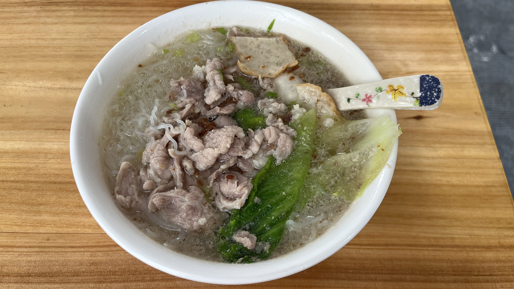 

早饭是在表姐家楼下的早餐店吃的。这家店的粉丝不像我印象中那样又长又滑，它们似乎都有一种韧劲（吃起来也是），每一根粉丝都保有它自己的弯曲形状。汤的咸度正正好，搭配上蔬菜和肉丝（片），让我发觉其实不吃辣也能吃得很舒服。吃完早饭大概 9:30，我们一起搭地铁去往罗湖口岸。这是我走过的第二个深港口岸。

### 中午 12 点：午饭

出乎意料但似乎又在意料之中[^1]的是，在罗湖过关的时候我被拦下来了，好在工作人员盘问了几句要去哪里，要干什么之类的问题就让我走了（但这在某种程度上代表我最好后面都走相对不那么方便的人工通道）。真正进入香港已经是中午了。

[^1]: 2024 年 8 月我尝试在深圳给港澳通行证续签时，被机器通知不支持办理，后来发现自己的湖北户籍被列为敏感，原因至今不明。一年后的 2025 年 8 月在深圳可以正常且多次续签。

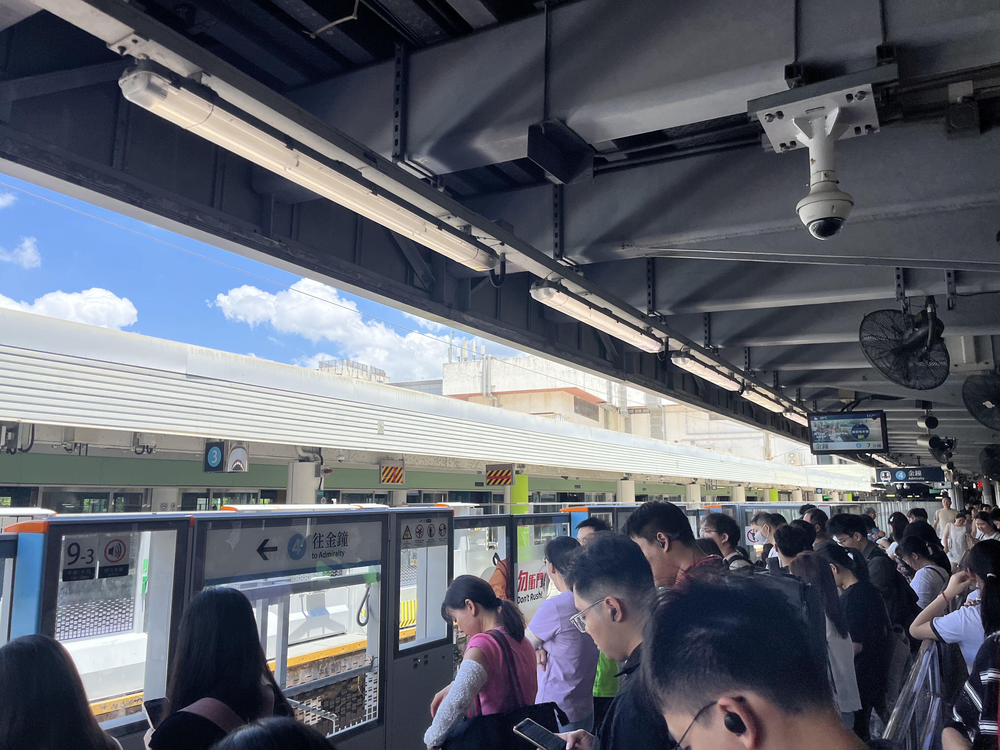 *在 MTR 罗湖等车*

因为已经到了饭点，我们考虑先去东铁线上的大围（距离学校不远）寻找小红书推荐的一家冰室。但到了地方，才发现这家冰室似乎早就销声匿迹。经过几番转悠以后，我们决定去吃商场里的敏华冰厅。

排了大约十分钟左右的队，进到餐厅里面。刚看到座位，我就被震惊住了。原本的四人桌硬生生被一块模糊隔板从中间分隔开，成了两个二人座，还是面对面的那种。虽然隔板之高让你看不到对方人脸，但依然能看到对方人脸的模糊影子...。桌子大小本身明显不是为此而设计的。

而因为我们的确只有两个人，只好坐下。

我点的饭如下图所示，饱腹感很强，味道也还可以。

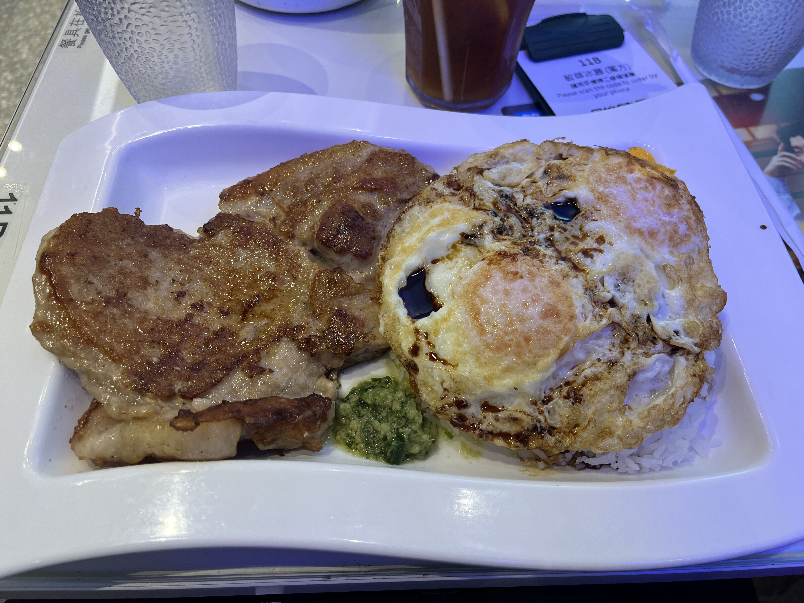 *我的这份猪排+流心双蛋+米饭+冻柠茶，味道还可以，比较“西式”*

冻柠茶喝之前一定要戳！这是我从大概一个月前我在哔哩哔哩看视频的时候刷到的一个香港本地人冻柠茶老字号探店视频里学到的。如果不戳的话，主观感受是会比较寡淡，少了柠檬的酸味和涩味（而这是冻柠茶好喝的关键），像是在喝单纯的甜水或者不那么酸的酸梅汤。

### 抵达大学

吃完午饭，我们就从商场再坐东铁线到大学。这里所谓大学，就是指的香港中文大学，因为它的车站比香港大学建得早，又不大愿意改名，于是就把如此简单粗暴的一个名字（站名英文也是 University）留到了今天。

到了大学站以后，从 C 口出去直接就是进入校园的关卡。不得不提的是，进入香港中文大学的过程的体验是非常好的。

这里明确区分了校内人员通道和访客通道。访客通道走起来很丝滑，尤其是对 i 人特别友好：工作人员在桌子上放一个长方体无盖塑料容器，恰好能斜着装下港澳通行证。把通行证丢到容器里，工作人员马上拿着容器在纸上登记，登记完以后把通行证取走，然后就可以畅游校区了。这个时候的登记似乎只是记下你的通行证信息，因而不需要任何交流，容器似乎是用来作为“提交处”使用的。

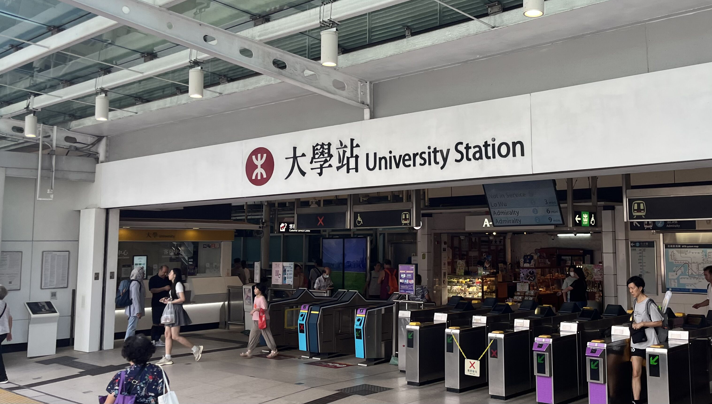 *MTR 大学站*

### 大概算是一次 Campus Tour——坐上小巴

表姐上课要前往利黄瑶碧楼（Esther Lee Building）——这也是此行的主要目标。

刚进入校区，我们就坐上了在一旁停靠等待乘客的小巴，后来发现似乎去这座楼只需要走路就可以...

这小巴单程票价是 HK$5.5。在小巴上坐了一会儿，我们发现这小巴好像怎么也到不了利黄瑶碧楼，但又似乎会经过楼前的崇基路。坐在车上和目的地之间颇有若即若离的感觉，于是每一个停靠站我们都没有下，就这样一直坐到了靠近山顶的终点。在终点，我们又刷了 $5.5 再坐回到山脚下的入口附近，然后步行到了目的地。

不过这一来回也不算是白坐，大概可以算是这次校园探索的一支预告片？路上能隐隐地看到树木遮挡着的海，还有一些其他吸引人的景色，让我时不时想要下车立马开始我的步行探索。对了，坐了这趟车才知道原来香港中文大学的主体在一座山上。

我从利黄瑶碧楼出来以后，就开始沿着记忆中小巴的上山路线开始走路。事实证明在 8 月的热带天气里爬不算平缓的一大片山坡并不是一个很好的主意，但走路的好处就在于非常自由，可以随时停下来驻足观赏。我还是坚持从山脚一直走到了合一亭。

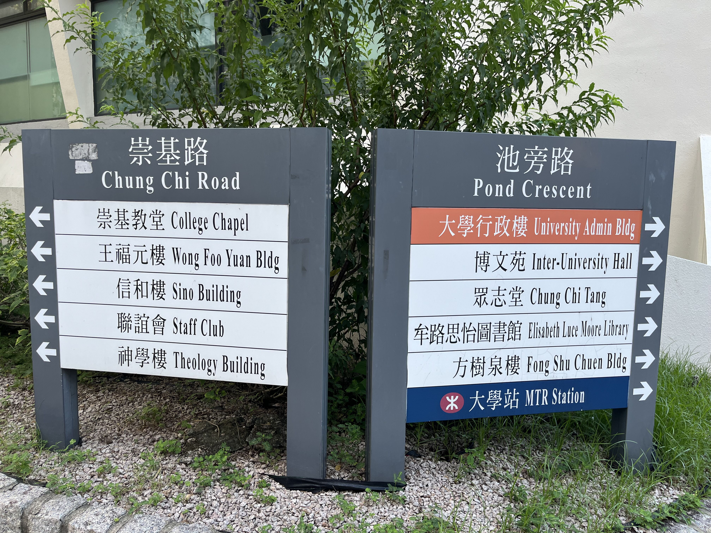 *校园内的指路牌，有不少楼都是用人命名*
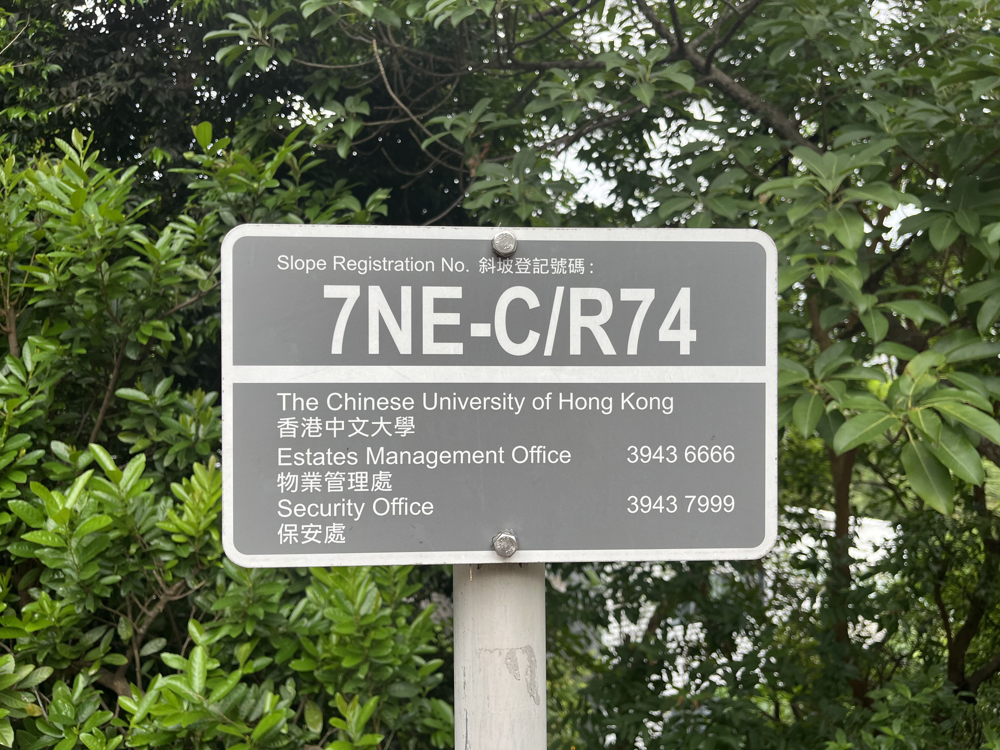 *每一个斜坡都有一个编号*

### 前往合一亭

合一亭是我在小红书上搜索到的一个 CUHK 打卡点。单看照片或文字，其实很难想象那里的结构是怎么样的——水池中的水酷似镜子，原原本本地倒映出对面的山和房屋和它们所倚靠的海，两幅对称的景就这样完美地融合在一起——正如其名合一亭，或者也可以叫作“天人合一”。

下图展示了我凭记忆在 CUHK 地图上画出的游览路线。蓝色的箭头是我从利黄瑶碧楼出发，前往合一亭的路线。

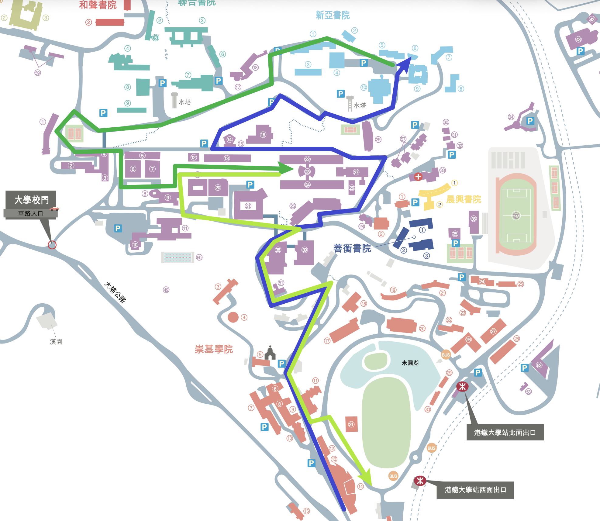 *凭记忆在地图上整理出的游览路线*

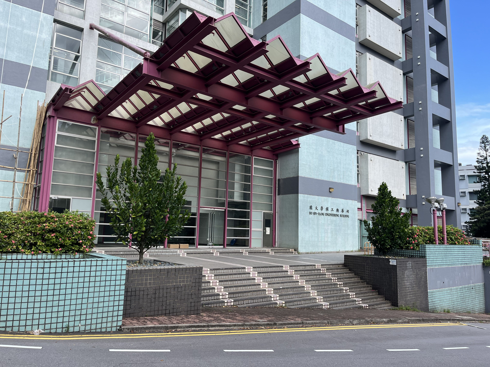 *何善衡工程学大楼门口*

经过何善衡工程学大楼一直上坡，就可以看到沿着山而建的逸夫科学馆。这座建筑很大，无论从地图上还是现实中，都可以看出它沿着山路的走向自然弯曲，外墙是缤纷的蓝色、橙色、绿色玻璃。

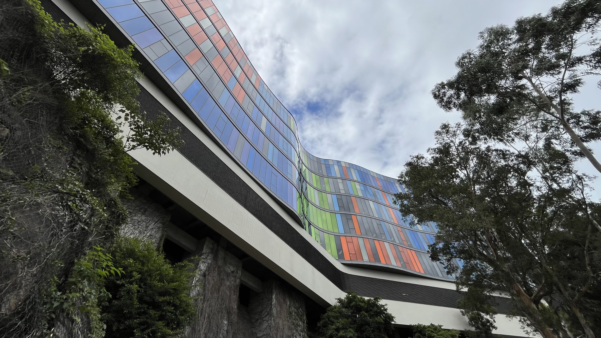 *逸夫科学馆外墙*

一直沿着线路图上的蓝色线路走，就到达了合一亭。先前天还有些阴暗，颇有要下雨的趋势；而到了合一亭，天就马上放晴了，可以说非常幸运。

一路上见不到几个人（准确来说只见到了两名工人和一些游学的学生队伍），合一亭这里却又有不少人，前来的游客如同在国内景点那样，排队（其实没有）挨个走向水池旁边，拍下一张真正的“天人合一”。

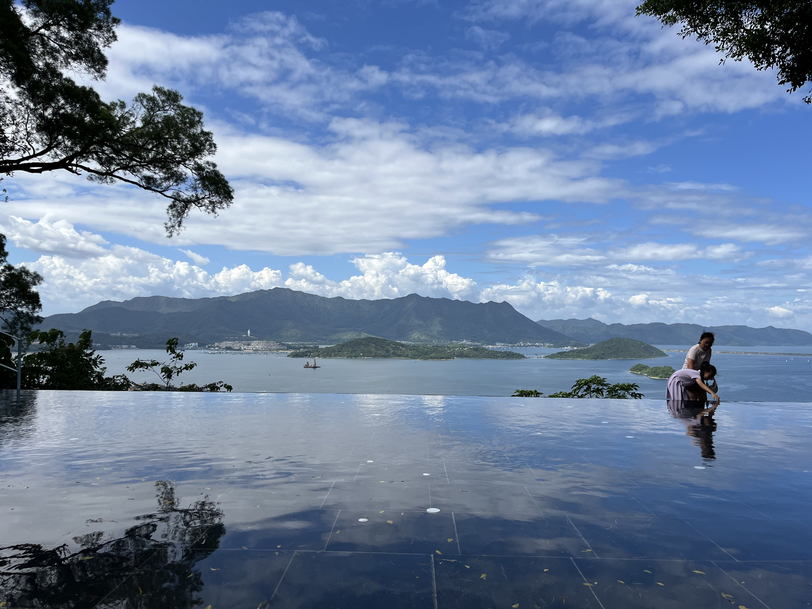 *天人合一*

一张照片中为什么一定要包含人物呢？此刻我的想法

就在这个时候，我突然有些顿悟，或者说改变。或许是被合一亭的风景所撼动，我开始思考独自一人的我该如何在这里拍一张属于自己的照片。

我一下子回想起小时候和父母一起出去旅游时，他们拍照的重心总是我和我们。一次旅游出去，所有的照片里都有人。我却有不一样的想法：照片应当纯粹，忠实地反映眼前所看到的景物。我一直按照我的这种执念行事了多年，每一次旅游，哪怕是跟父母一起去的那些，我的身影依然只能见于他们的手机。我一直觉得我是景物的收藏家。

但现在想到这里，我开始思考一个问题。为什么他们会那样喜欢将人包含在照片里呢？我得到了一个我本该多年前就应该得到的答案：他们并不是想让照片中有人，而是想让照片中有**我们**。他们的这种念想也并非刻意——这是一种留下纪念该有的正常想法。只有在照片中留下**我们**，这张照片才真正为我们所有，而不再是被记录的客观景象——客观景象不需要被记录，它就在那里，除非你是摄影师，或者历史的见证人。作为普通人的一次普通旅游，在一张照片中留下痕迹的方式——就是将自己包含进去。当一张照片真正属于自己以后，就不必担心这张照片会因为打卡点的重合而变得重复多余。照片上的人为这张照片明确地掺入了个人纪念的成分。

*后来再读这里写的想法，发现这里说得有些过于绝对——在这里所指的其实是那种一眼便能看出照片是属于谁的照片，但有些照片不是这样的。照片可能只是为了记录当时的想法，或者观察，换句话说就是发现美的眼睛。只是对于我来说，这些个观察因为过多且一直作为主要目的，却不像专业摄影师那样存在正反馈，因此显得没那么重要了。*

这里让我很容易想起美剧里经常能见到的高档酒店或别墅带有的无边泳池，不过合一亭这里的只是一个很浅的水池。在边缘，也就是人们所站立摆 pose 的地方，是一条不算窄的过道，下方就是用围栏围起来的山坡。山脚下的公路是吐露港公路。

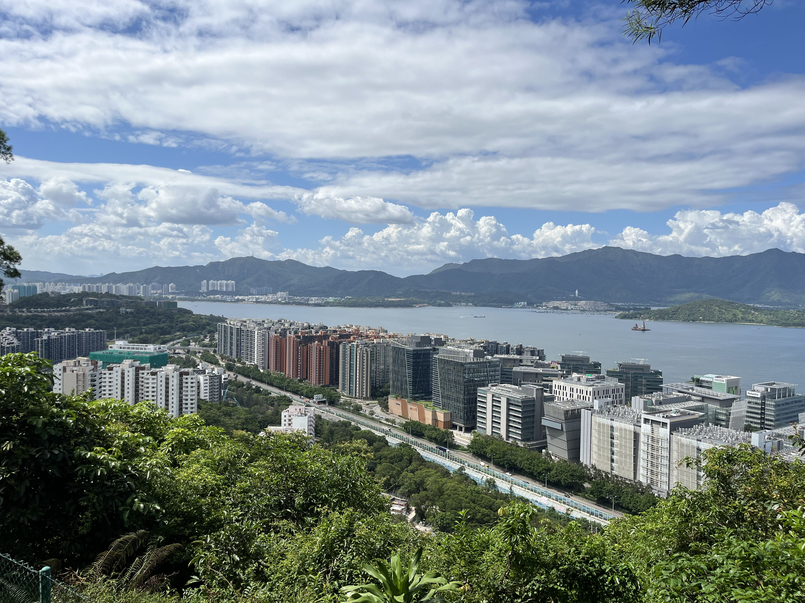 *从天人合一看吐露港公路和对面的大埔海滨公园*

### 大学图书馆，校徽

合一亭算是 CUHK 的高点了，我决定拍完照片休息一会儿就下山。下山的路线是线路图上的绿色箭头（两条一起）。我先从合一亭出发，绕到了地图上 1 号建筑的后方（因为这里不会走回头路）下山。

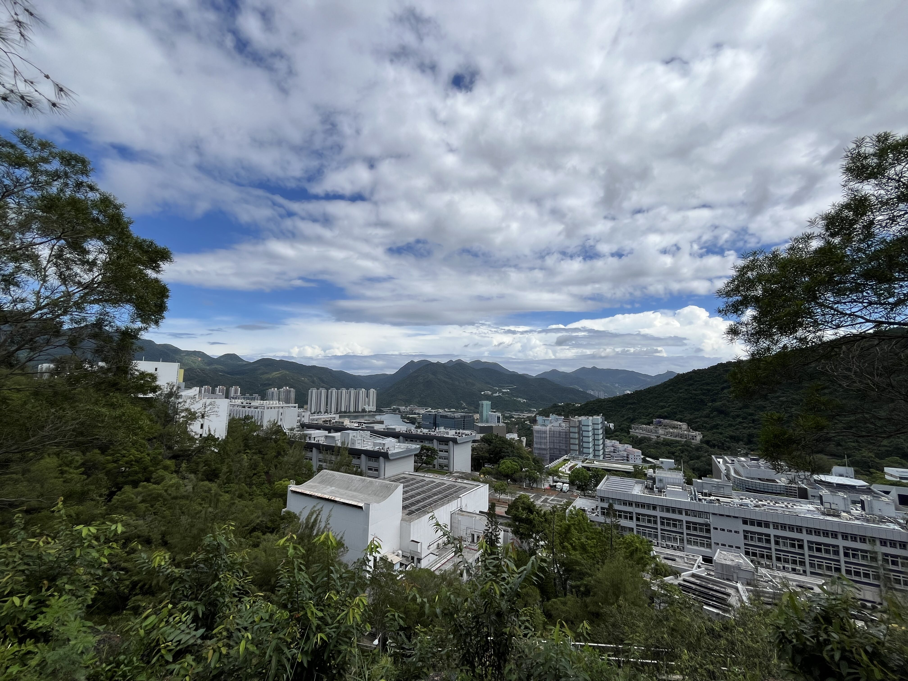 *下山路上从高处看校园一角*

路上我经过了公交站，但不是很敢坐，同时觉得还是把步行探索环节完成比较好。公交站的对面应该是校内的广告位，在这里看到了和 Chiikawa 有关的宿舍活动宣传物料，看来这里的大学校园生活还是丰富很多。就在站立拍照的时候，一辆公交车驶来，我并没有招手，它却准备停下来，于是我尴尬地开始远离公交站，车几乎快要停下来，然后司机又踩下油门加速开走了——呃...感觉有点不太好意思。

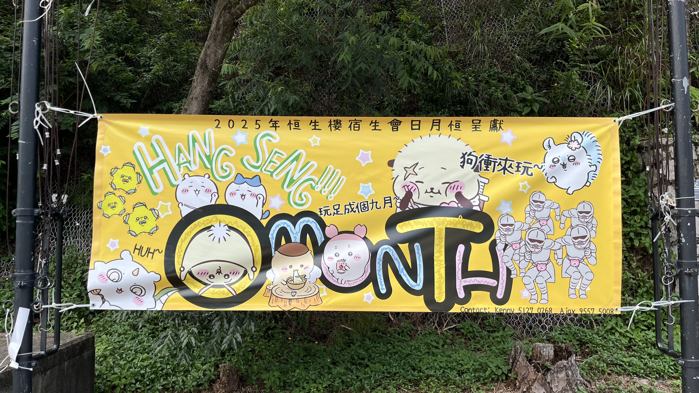 *Chiikawa 宿舍活动宣传？*

走着走着，回到了先前经过的邵逸夫堂（Sir Run Run Shaw Hall）。先前路过的时候还不太懂这里的街道结构，后来才发现其实旁边就是大学图书馆。就这样在回程的路上把先前错过的内容又补了回来。

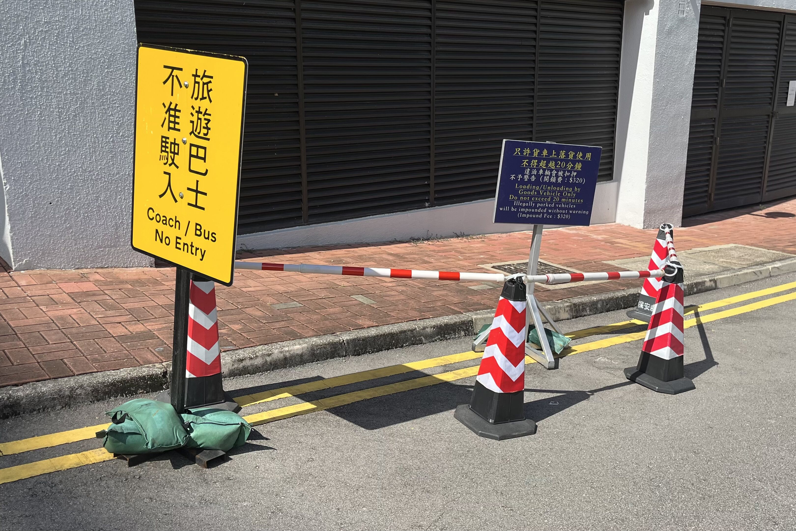 *停车警示牌*

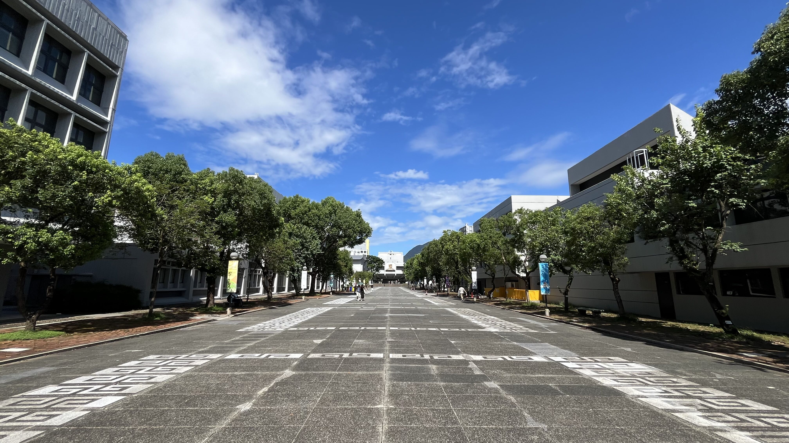 *这条路一直往前走就可以看到 CUHK 的大校徽，并且那里其实就是邵逸夫堂的附近*

在图书馆附近，准确来说是中国文化研究所旁边可以看到台阶，在这里直接下台阶就不必再沿着公路盘山了，自此进入到线路图上的浅绿色路线部分；后面的路由于是原路返回，就没有什么额外的照片了。

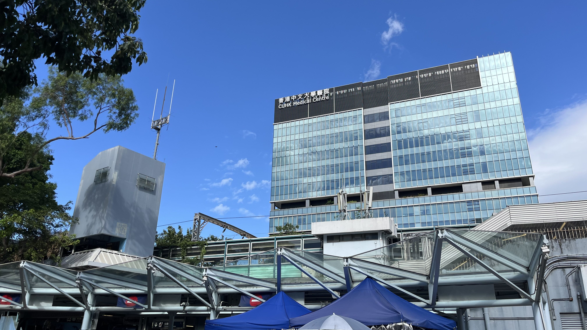 *从大学望向大学站外面的香港中文大学医院*

虽然没有预先规划路线（其实就算拿到地图也不知道怎么规划），但是我觉得这次“顺其自然”走的路线（在天人合一的目标指引下）从线路图上来看还算比较全面，路途也恰到好处，稍微再远一点估计就走不动了，也没什么太大的必要。就这样，一次 CUHK 浅度游就圆满结束了。

我从大学站 C 口附近的校园关卡出去以后，发现其实可以走通道去到站外面。

我特别的口渴，于是找了一家 711 买了一些喝的，一口干完。十分推荐这个港版（或者说本地版）维他，无论哪种味道，都不是齁甜，并且保有一定的茶香。不过在 711 或者 Circle K 买并不是很划算，相对来说价格较低的在他们自己的贩卖机上（在中环码头附近买的 $10 左右，不同味道价格略有不同）。只可惜大陆并不卖（只有淘宝水货，也很贵，一盒大约三四十完全没必要）。

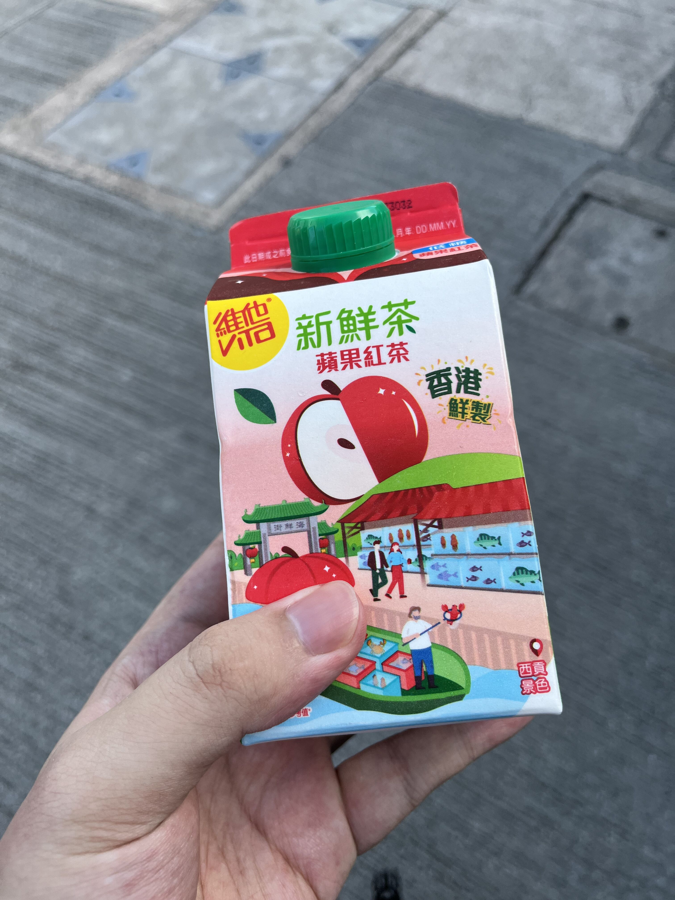 *维他新鲜茶 苹果红茶 只有香港有*

### 下午 6 点：尖沙咀 晚饭

表姐上完课大概是五点半。刚好校门口就是东铁线。我们来到尖沙咀附近吃晚餐。我们选择了排队较少的一家红茶。吃的很饱，牛河的分量很顶；第一次吃到了菠萝油，原来直接吃没有融化的黄油并不是一种很诡异吃法......

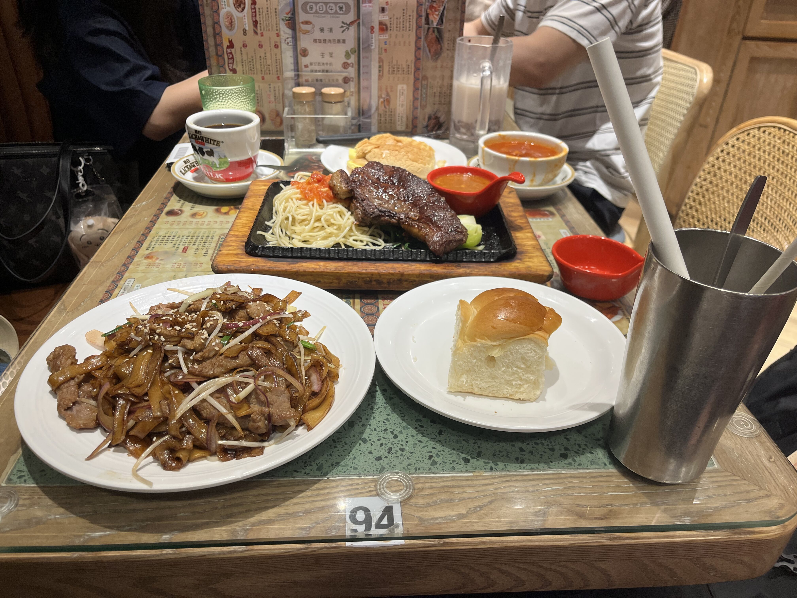 *在红茶的晚餐。这里也是一张桌子分两半坐，但体验相对比中午好一些——中午的那个面对面塑料隔板实在有些抽象。这里没有刻意将人分隔开来，还显得自然了一些。印象里模糊记得旁边坐的本地人教我如何吃什么东西来着。*

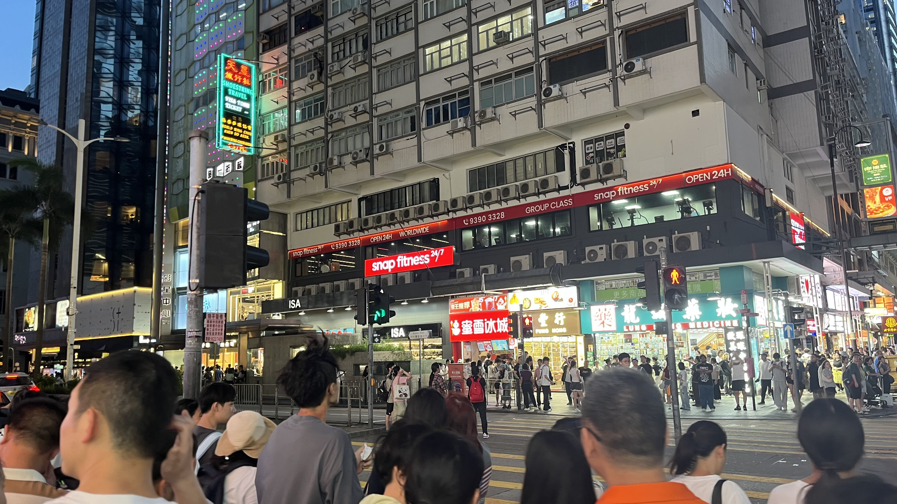 *前往维港中，走弥敦道，路过的蜜雪冰城，以及等着过马路的超多人群*

吃完饭以后步行到维多利亚港岸边，走一走感受一下人潮。虽然这个时候已经临近暑假尾声，这里的人依然不少。当然比起国庆那是要差一点，但也是好事。

回程继续坐港铁，发现这里有的闸机被换成了 Chiikawa 的声音，呜哇呜哇的。这次来香港和 Chiikawa 太有缘了吧，我要是 Chiikawa 的狂热粉丝直接疯癫（可惜我不是）。

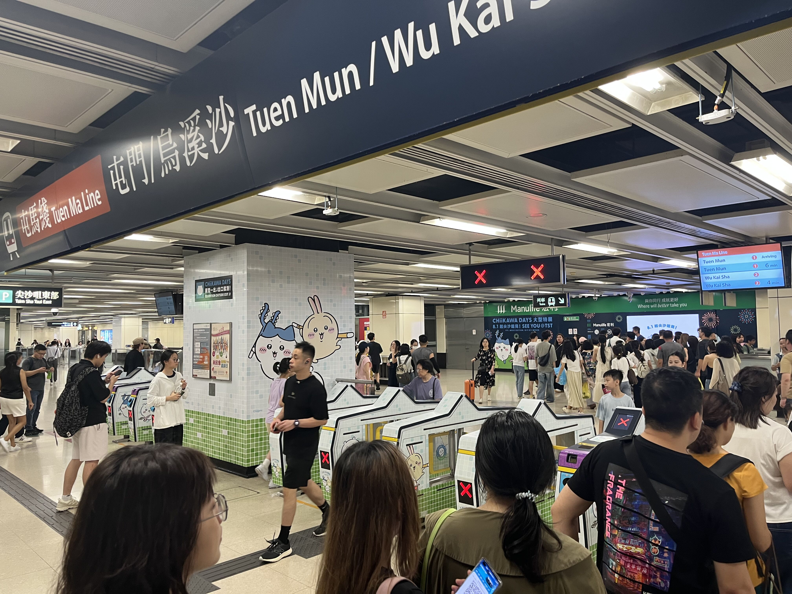 *Chiikawa 占领 MTR*

## 2025.08.17 西涌与深圳市天文台

深圳的东部，从罗湖的东部、盐田一直到大鹏，几乎全是山海连片的风景。对这片区域的探索，始于两年前。2023 年，我第一次去到大梅沙、沙头角，2024 年继续往东去到了杨梅坑、桔钓沙、南澳（深圳），今年则再次往东（南），去到西涌。深圳市天文台就位于西涌四号沙滩旁的山顶上。

游客可以通过预约造访天文台，也可以只走天文台下的栈道（无需预约）。这栈道沿着山坡和山脊而建，底部通往海边的礁石，非常出片。可以直接从礁石这里步行，沿着海岸线回到西涌的沙滩上。

这次前往原定是去栈道上看一看，如果可以的话就走到礁石那里去。然而前一天还是晴天，第二天就已经是阴雨连绵了，除此之外还有许多“意外”。

:::tip
说到这里的礁石让我想起了哔哩哔哩上的一个专门制作野外探险、洞穴潜水发生意外事故及其救援过程的博主[神秘园](https://space.bilibili.com/87670515)，看了上面关于望郎归的事故以后，现在想想幸好当时没有冒着大雨往下走。
:::

### 不按套路停车的东部公交

和去年去一样，这次去大鹏也是坐的公交。上午十点左右，在莲塘口岸地铁站的 D 口广岭公交站乘公交。

这一次要去的是西涌，高德推荐的路线是在广岭乘坐 PJ4 路在南澳的月亮湾换乘 M232 去往鹤薮村公交站。PJ4 路单程就要￥20，全程大概要一两个小时，停靠 5 个站左右，终点是杨梅坑。

月亮湾是 PJ4 路从广岭开出的第一站——然而，它并没有往那个方向走，而是直接开到了杨梅坑（去年已经去过）...由于当天是周末，这车在杨梅坑前面的路上堵了超过半个小时，有种“偏向虎山行”的既视感——这直接破坏了我的换乘计划，导致行程时间要多至少一个半小时。

我在杨梅坑下车的时候检查了一下车身电子屏上的显示，它确实没有按照计划停车。

...省略复杂的换乘~~和坐反~~的过程。

到了鹤薮村以后，可以继续等公交，也可以步行去到西涌 4 号沙滩。

在鹤薮村下车以后马上有一大堆人拉客，原因可想而知：最后一公里的公交其实很难等。我等了将近十分钟也没有见到有公交来，所以直接按照导航步行了，实测步行约 1km 左右。比较有趣的是，当我按照高德导航走路时，先前没有拉到客的疑似村民过来告诉我这条路很难走，要走 3km 才能到！但实际上这是一条正路。

> 从莲塘口岸起到鹤薮村，全程加转车加堵车用时约 4 小时，花费￥24.4
> - PJ4 ￥20 广岭→桔钓沙（桔钓沙就在杨梅坑附近）
> - M274 ￥2.4 桔钓沙→南澳医院
> - M232 ￥2 南澳医院→鹤薮村
> 
> *均为上车一次性付款。

### 上山下山

到了 4 号沙滩以后，在入口对面的一个停车场+发车场旁可以找到登山口。可以走路大约 40min 上山，也可以花￥10 坐车上山。这个价格我觉得并不贵，所以选择坐车上山。到排队处付款，人工检查以后就进入队伍，我大概等了将近半个小时，等这些车送了两个来回以后才坐上车。这时，天已经非常暗了。

车一发出，天就开始下雨，这原本没啥。但到了终点后，眼前客流让我直接愣住——正在等车离开的人流把栈道入口堵的严严实实。雨下的没有很大，我心想**来都来了**，就算下雨也要去看看栈道是什么样子的。

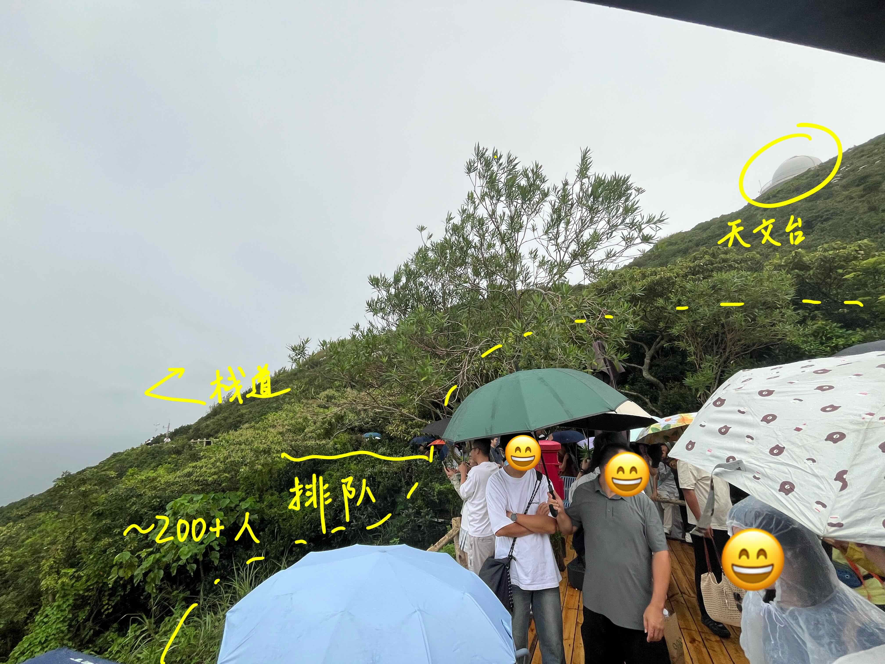 *半山腰地点示意*

我穿过拥挤的人流，尝试前往栈道的起点。刚离开大排长龙，外面的狂风就把我的伞给吹翻了。在这个风力下，如果还想要伞的话就不能再继续打了，否则要么被坏掉，要么吹飞下去。伴随着狂风的还有雨，直接迎面而来打在脸上和眼镜上。这时的体感温度估计已经低于 25 摄氏度，甚至有点冷。

我看到下山的栈道上仍然有人。但这个风力...大的时候甚至站不太稳。我已经不敢下去了，只好原路返回。

由于等车的人实在是太多了，我直接尝试走路下山。坡度其实还可以，不过需要经常注意来车，以及下到最底下会有一大段陡坡需要注意。用时大约二十分钟。

这个时候雨下的越来越大，于是我直接跳过了西涌沙滩，准备返程了。

### 离开鹤薮村

原路返回鹤薮村的过程中，雨从普通的中小雨，演变成了与地面呈 60 度的暴风雨，直接把我的全身都打湿了。感谢迎面而来的开车的两个宝子，一个先把我鞋子全溅湿了，一个又“补刀”把我上衣给冲洗了一遍。不过无所谓了，在这样的雨里结果都一样。走在我前面的一帮人被第二个车溅起的水花一网打尽，全身湿透，不过那个时候他们已经淋浴很久了。

看来，当我还在思考着我带来的拖鞋的意义是什么的时候，大自然已经开始帮我考虑解决问题——既然全身上下都已经湿透，换上拖鞋至少能缓解一下袜子鞋子全灌满水的潮湿感。

就这样，不到三个小时，已经被天气和人流劝返（主要是天气）。五点半，我在鹤薮村坐上回程的公交。

### 一天堵车 9 小时

然后就又堵车了。

回去的路，从鹤薮村出发到广岭，加上换乘一次总共花了 5 个小时（鹤薮村-大鹏中心，大鹏中心坐 E11 到广岭），从大鹏回市区的车一个都跑不了堵车的命运。这表示只是从莲塘口岸地铁站往返西涌，就花了 9 个小时的时间，还不算从市里过来坐地铁的时间——回头想想这个时候去，时间上真是亏大了。

我觉得大鹏堵车无非就两个原因

- 停车场太多，例如杨梅坑/桔钓沙前面那条路，不停有车要从停车场里面出来或进去，一条路上连了很多停车场，加在一起就特别堵
- 车道太少，只有两车道，来的人横向装不下只能竖着装了。

也可以归纳为一点，就是**人真的很多**。无论你在网络上看到这里的沙滩有多美，周末别来，节假日别来，工作日也要慎重。

当天哪怕是到了盐田，堵车也好不了多少，因为大小梅沙附近似乎一直都在修路。

时间就是金钱，就是生命——所以，珍惜生命，远离假日的大鹏（并非）！

## 2025.08.20 香港长洲

**长洲（Cheung Chau）** 又称哑铃岛，位于香港岛的西南部，是香港两百多个离岛中人口最密集的岛屿。可以在中环乘船前往长洲（航线见地图中的中环-长洲）。

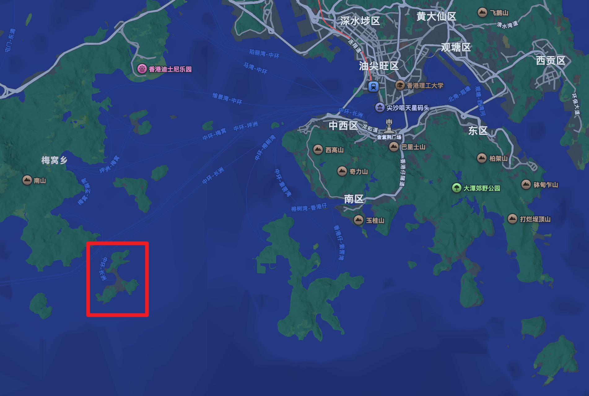

:::tip
**长洲游览 Highlight（不完全）**

- 长洲特产：鱼蛋和糯米糍（但我这次没吃到🤔）
- 香港离岛渔村风情
- 沙滩
- 张保仔洞

张保仔洞是传说中张保仔（华南海盗）藏匿其宝物的一系列岛屿山洞，其中长洲的张保仔洞最为出名。

如果在淡季（或者工作日）前往，有些商铺可能不会开门。
:::

### 从深圳湾口岸出发到中环

得知罗湖/落马洲到上水有着极为抽象的票价（一站花费 $25 左右），这次我选择乘坐深圳地铁 13 号线（2024 年 12 月开通）直达深圳湾口岸，然后坐 B2P 去天水围坐屯马线去中环。

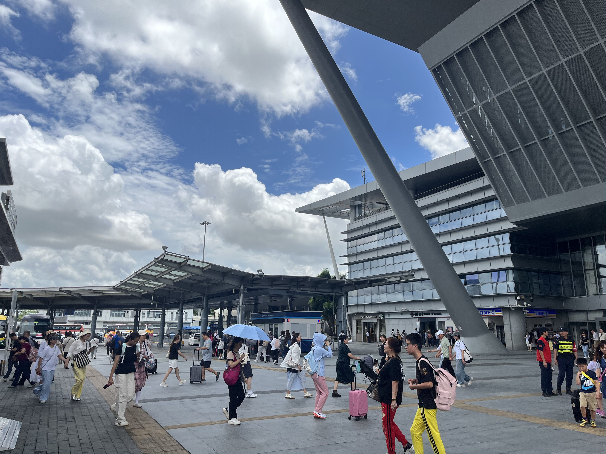 *深圳湾口岸（深圳侧）*
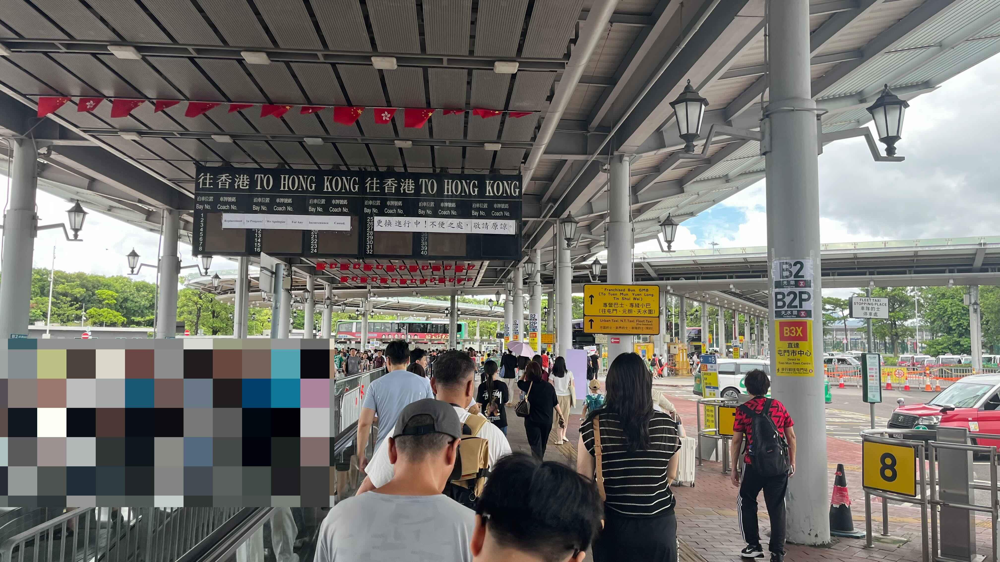 *深圳湾口岸香港侧前往巴士站的人流*

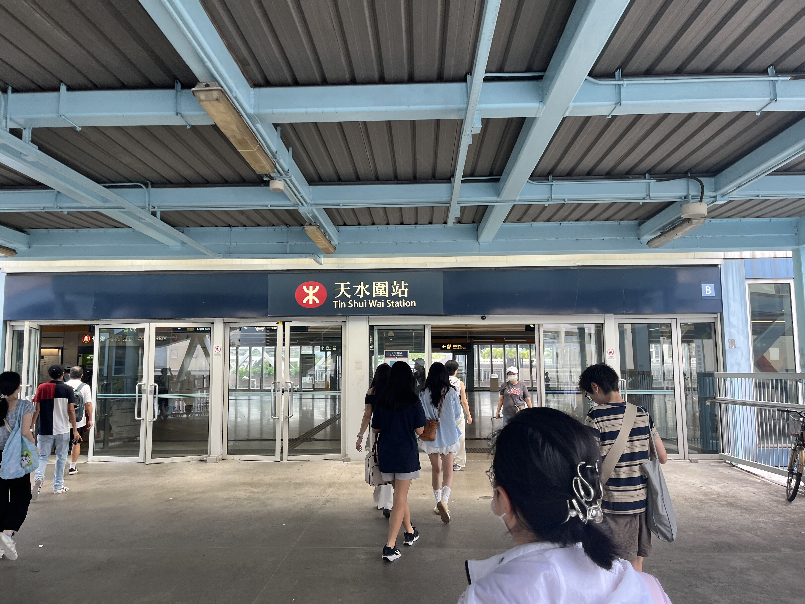 *到达 MTR 天水围站*

> 实测下来，花费如下
> 
> - 屿巴 B2P，深圳湾口岸-MTR 天水围站，花费 $11.3
> - MTR 屯马线+东涌线，天水围-香港*，花费 $29.3
> - 合计 $40.6，大概比坐东铁线的方案便宜 $15。
> 
> *此处“香港”是地铁站的名字。

### 坐船前往长洲

中环的码头有多个，去往长洲这条航线对应的是 5 号码头。

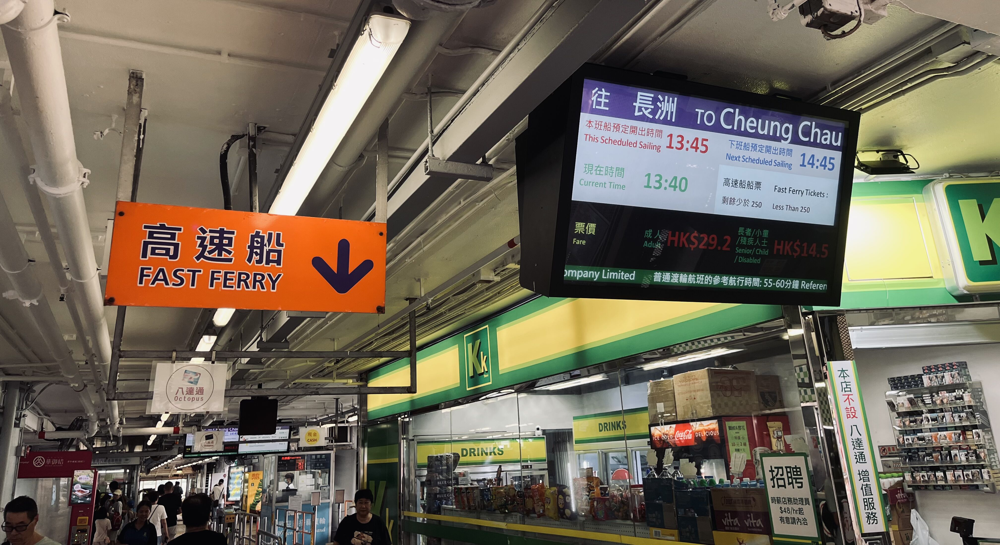 *中环5号码头入口*
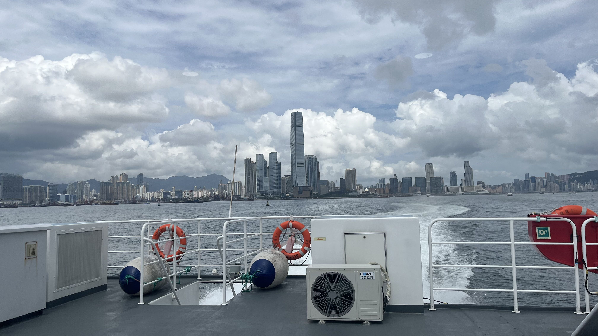 *在高速船上看港岛（透过窗户拍摄）*

这里的轮渡分为普通和高速两种，我去的时候坐的是高速船，大概 30min 就到了，但是船晃得很厉害，想体验一下那种失重感引起的快感（???）的人推荐尝试一下。

不推荐晕船的人乘坐快速轮。我不怎么晕车的人被摇的也有点晕（也可能是因为在看手机）。

### 抵达长洲

到长洲后，船一般会停在位于长洲中部（“哑铃”的细部）的码头。

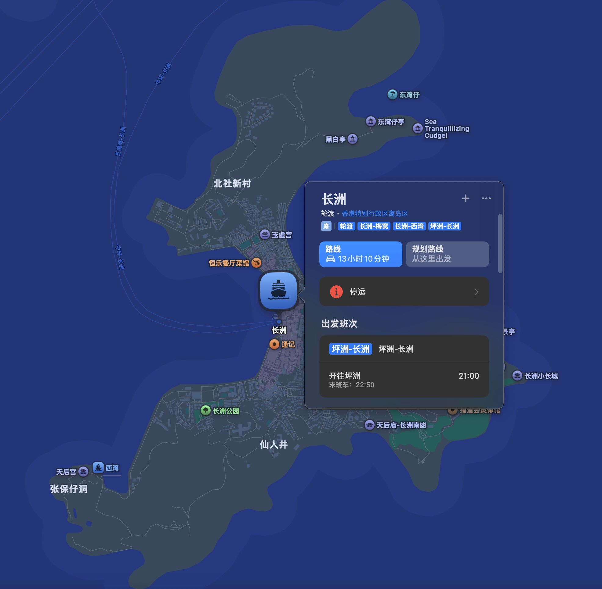 *长洲码头在长洲岛的位置*
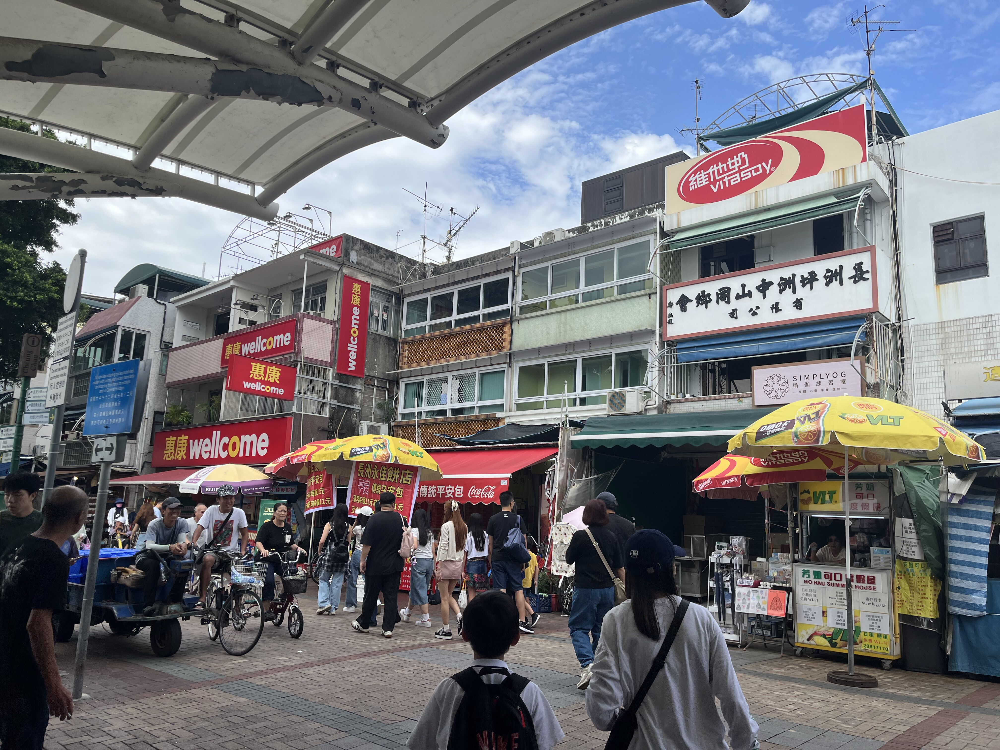 *在码头出口向左看*

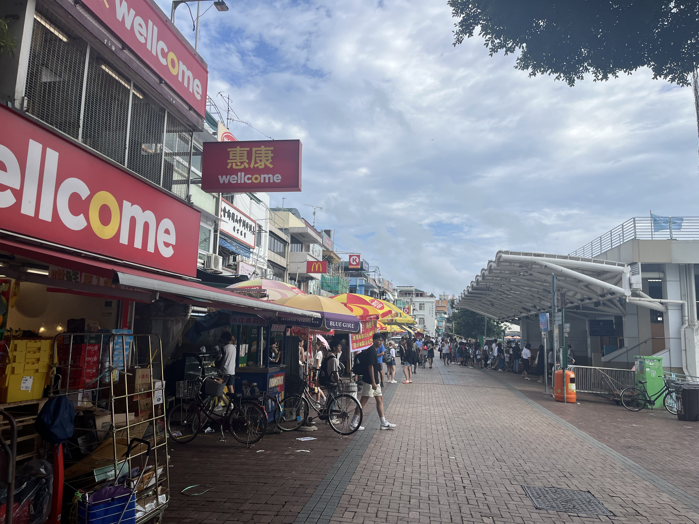 *在新兴海傍街上向南望*

出了码头以后就进入到长洲的一条主街——新兴海傍街。这条街上的商铺主要面向游客，正对着码头的是一家麦当劳；出码头方向的右边有一家 711 和一家 Circle K，除此之外就是当地人开的小吃店、便利店、超市和餐馆。

这条主街的另一侧是海，准确来说是一个海港，停泊着当地人的渔船。船都不算大，有的船上插有香港区旗，有的插有国旗。仔细看还会发现有些船上坐有人。

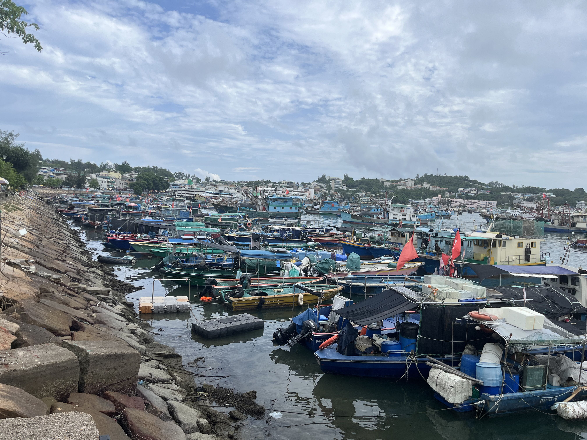 *岸边停靠的船只*

由于码头恰好位于长洲的中间地带，长洲的游览被自然地分为了上下（南北）两个部分，北边的面积相比南边要小一些，游览的内容也相对比较少。我先前往的是北边的北眺亭。

### 前往北眺亭

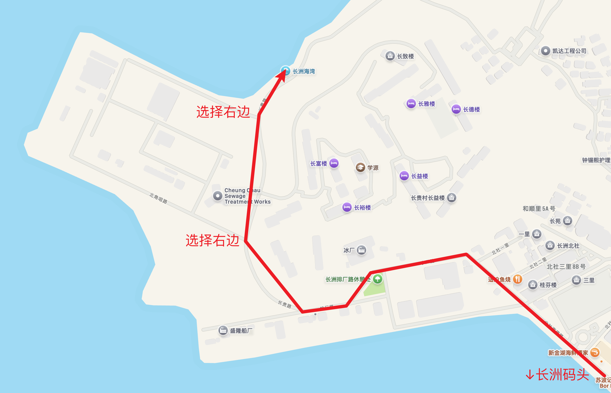

出码头左转一直走，穿过北社海傍路、冰厂路到尽头就可以找到去往北眺亭的登山口。越是往北走，游客就越稀少。路上会经过长洲消防局（仔细看会发现建筑上标有冰厂路一号）和一些...叫不上名来的地段，有些是正在施工的房屋，还有的像是垃圾处理的地方。

过了冰厂路再向前走，可以看到一片沙滩，地图上叫做长洲海湾。

我到的时候，沙滩上只有零星四五个游客和四五条小狗（应该是当地人养的），其中两只在沙滩上给自己挖了坑来躺卧。相信这片沙滩的观感在晴天应该还不错。

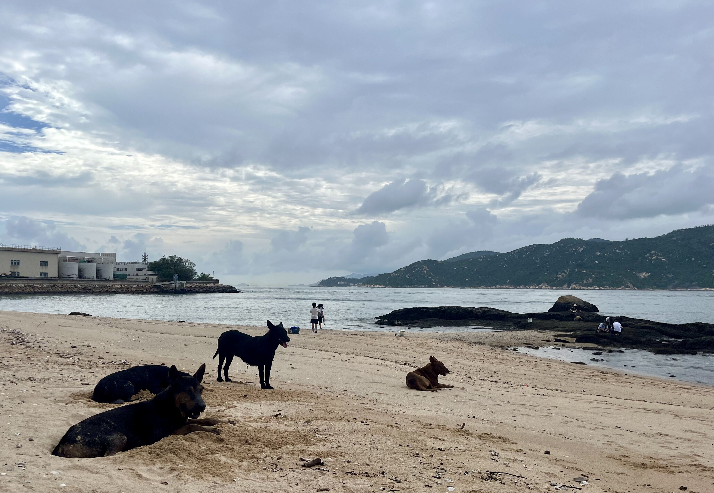 *海滩上的狗*

这些狗的面相不是一般的中华田园犬，至于具体是什么品种...等我找到什么软件能通过狗的面相给出品种再说吧。

这条路走到尽头以后，会有一个指示牌指向北眺亭的位置，从这里就可以开始上山了，直接到达北眺亭。

:::note
**上山遇到蛇**

上山的路稍微有些陡，总体上并不长，一路都有树荫。当时似乎只有我一个人在上山。然后...我就碰到了蛇。

一条小型的、黑色的蛇，在路旁的水泥斜坡上突然开始蠕动，然后掉落到斜坡下的地面。这是我人生第一次碰到蛇。我原本对蛇这类动物并没有很害怕，但是我余光瞥见它的样子，心里还是不由得发怵。我头也不回，一口气直接跑到了北眺亭。

不知为何，这条蛇并没有在我心中留下很大的阴影，取而代之的是我固有的对山林里各种虫子的恐惧。一路上的树荫本是完美的遮蔽，但在我遇到蛇以后就变成了无数古怪、混杂的昆虫栖息的巢穴，我开始担心会不会有虫子从树上掉下来，挂在我身上，然后等我很久以后才发现............这蛇似乎变得微不足道了。
:::

北眺亭上可以看到长洲周围的海域，以及下面的城镇。在北眺亭这里可以继续下山前往山脚的东湾仔亭，不过需要原路返回，由于我的体力在极度紧张之下已经消耗殆尽，就没有再继续向前了。

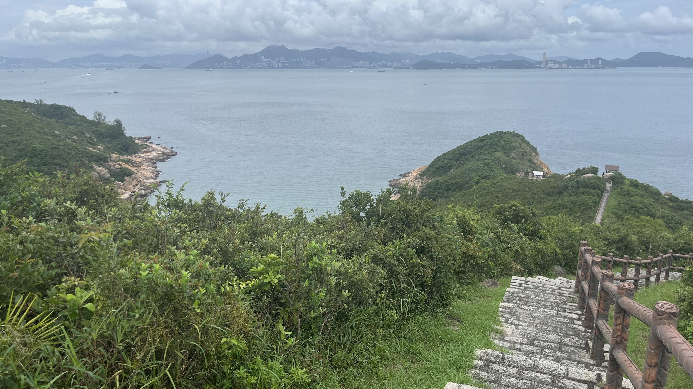 *在北眺亭上看东湾仔和东湾仔亭*

### 长洲居民区

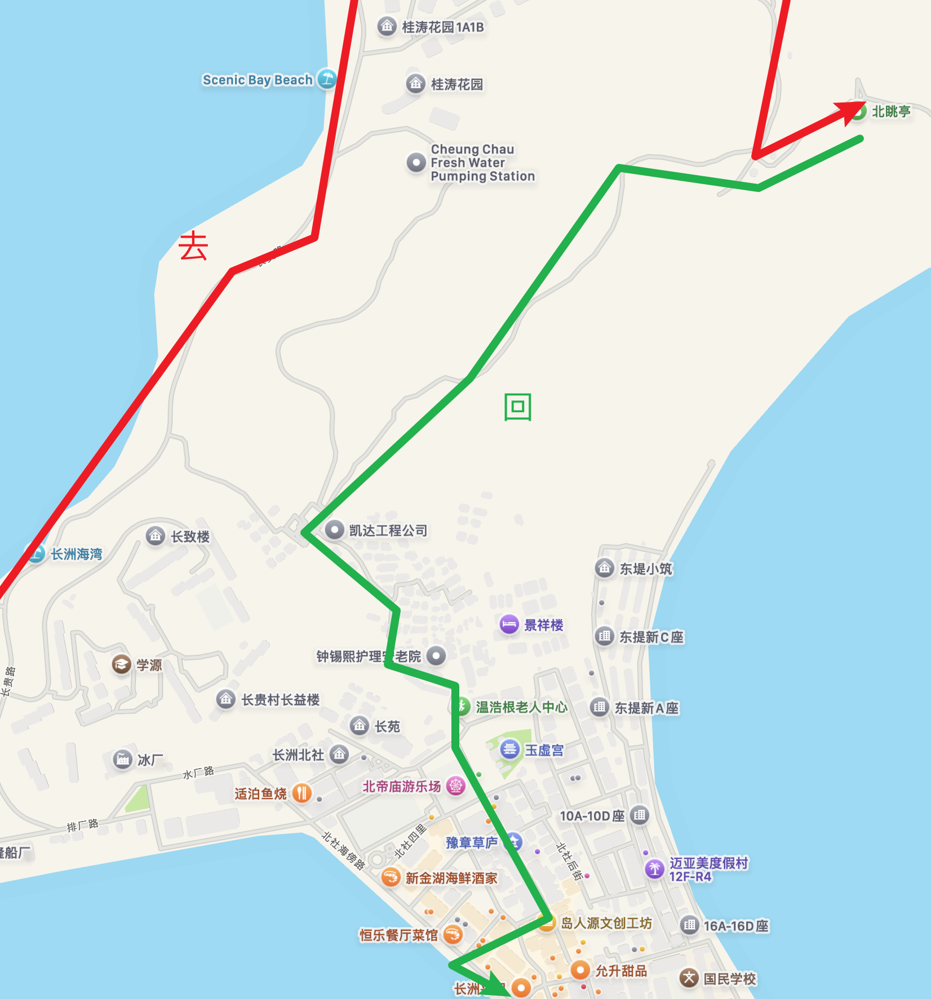

下山时没有走回头路。直接沿着前往北眺亭的路继续向前走，经过一大片树荫，就可以下山来到长洲的居民区。路上会经过一个比较狭窄的下山阶梯，两侧是高低交错坐落着的民房，可以听到当地人的交谈。

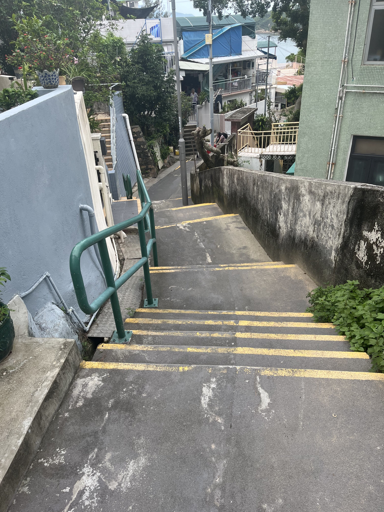 *下山的路以及两侧的民居*

下到最底下便到了街巷中，也就是北社海傍路旁的一大片房屋，稍微走一走就会回到刚来时的大路上。

由于体力原因，我放弃探索南端的一些景点，而是决定直接在居民区里逛一逛。

:::note
**买水经历**

我在一家当地人开的超市里买水时，老板娘不会说普通话。这家店不支持使用八达通，但可以使用微信支付（扫码可以看到实名信息，如同在内地小摊结账一样，顿时感到一丝莫名的亲切...）。幸亏先前有些粤语的听力经验，听懂老板娘说的是十二蚊而不是十一蚊（粤语中的二的发音跟普通话中的一很像）。

这里的价格确实比便利店要便宜很多。在这里 300ml 的可口可乐和 700ml 的 Bonaqua 加起来 $12，便利店里可能一瓶 700ml Bonaqua 就要 $12 左右了。
:::

太阳出来了。下午三四点中的阳光洒在街巷里，被房屋遮挡住一部分形成阴翳。这番配合，让本就富有历史感的街巷变得更具怀旧气息。

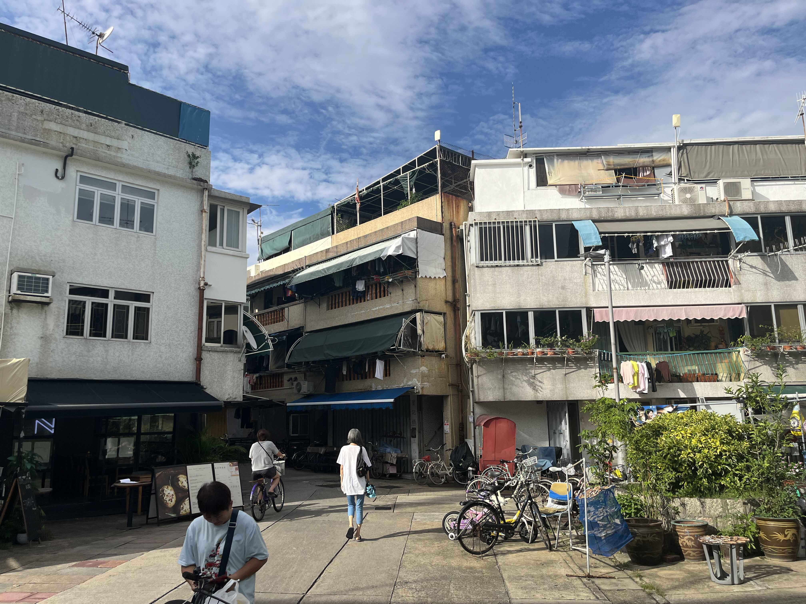 *街巷一角*
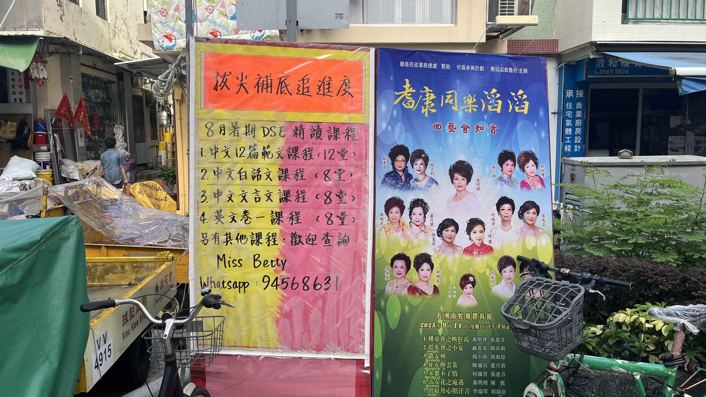 *宣传立牌*
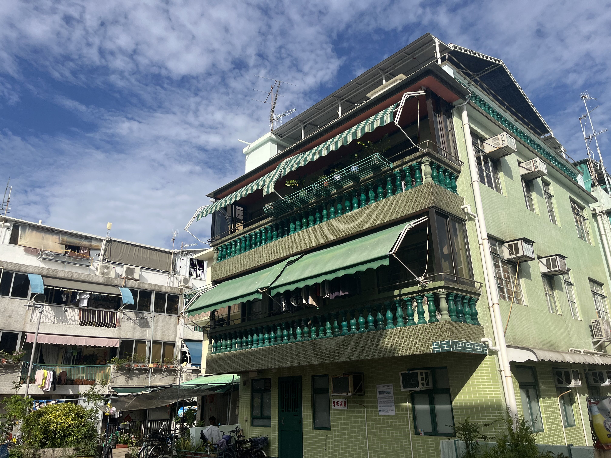 *一栋绿色系的住房，在众多房屋中脱颖而出*

沿着主街往南走，可以发现有些建筑之间会有一大片空地，这或许是建设时专门留下来的类似于广场的地点，两侧有各种店铺。

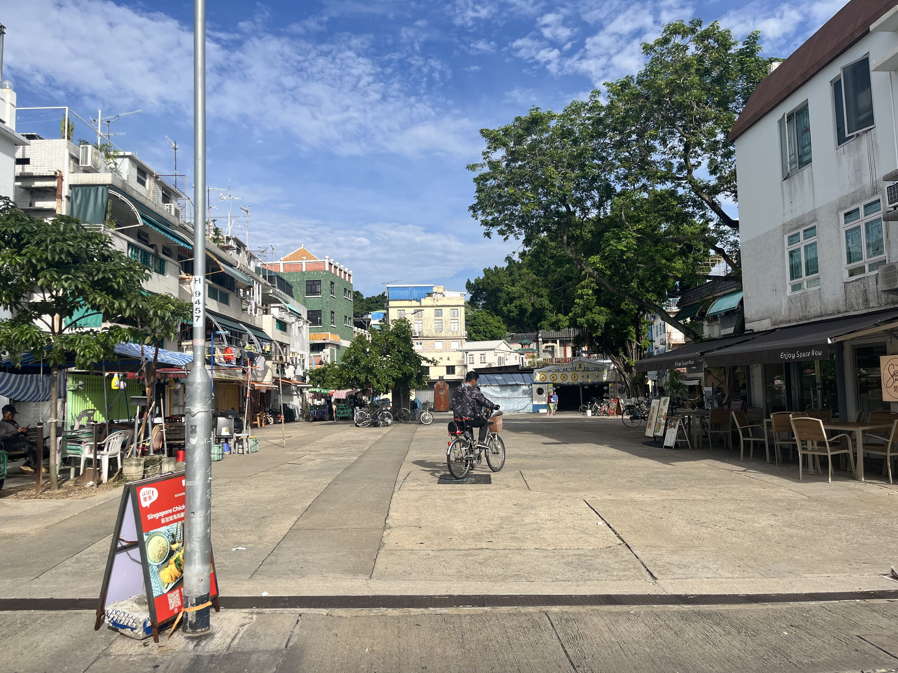 *一片空地*

在主街上行走，会一直闻到“海的味道”——海风吹来的腥味；在游客聚集的街道的旁边可以看到当地人晾晒的鱼干和虾干。

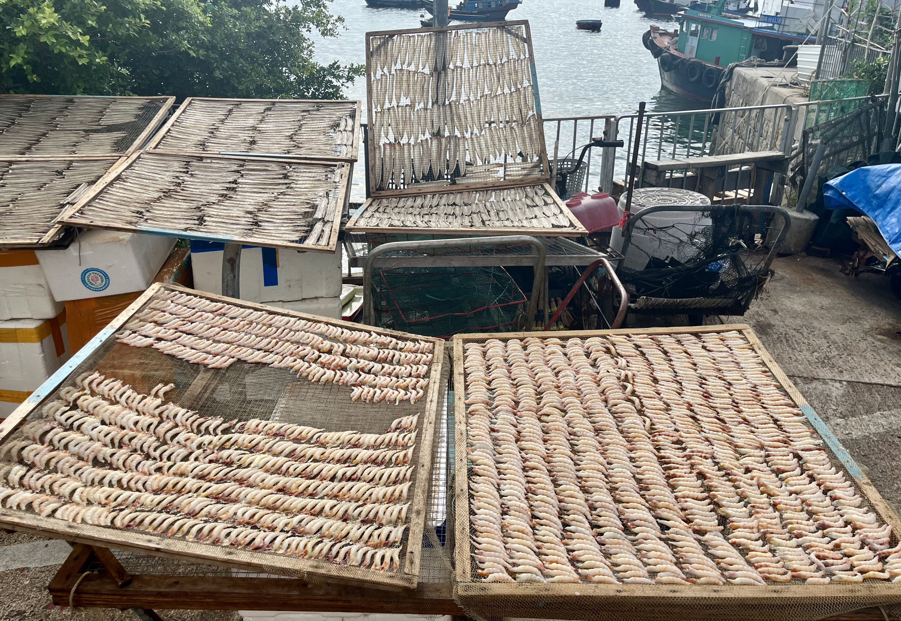 *街边晾晒的鱼干和虾干*

这个虾干看上去是已经剥好壳的，看上去应该会很弹牙。

与香港的许多地方类似，长洲也有一座天后庙。天后庙前有一片更大的空地。空地一侧的店铺门前，有一群老者坐着聊天。

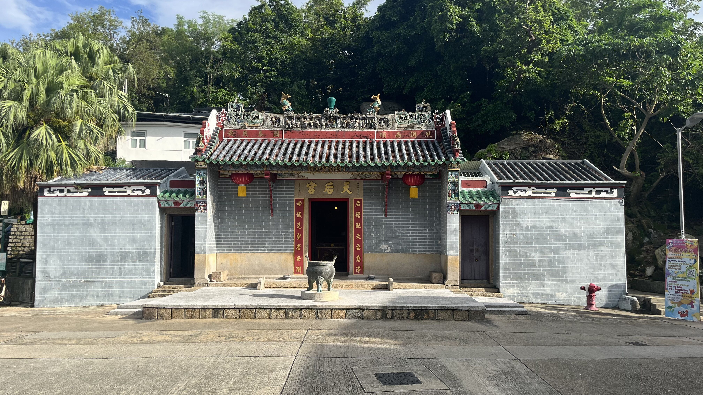 *天后庙*
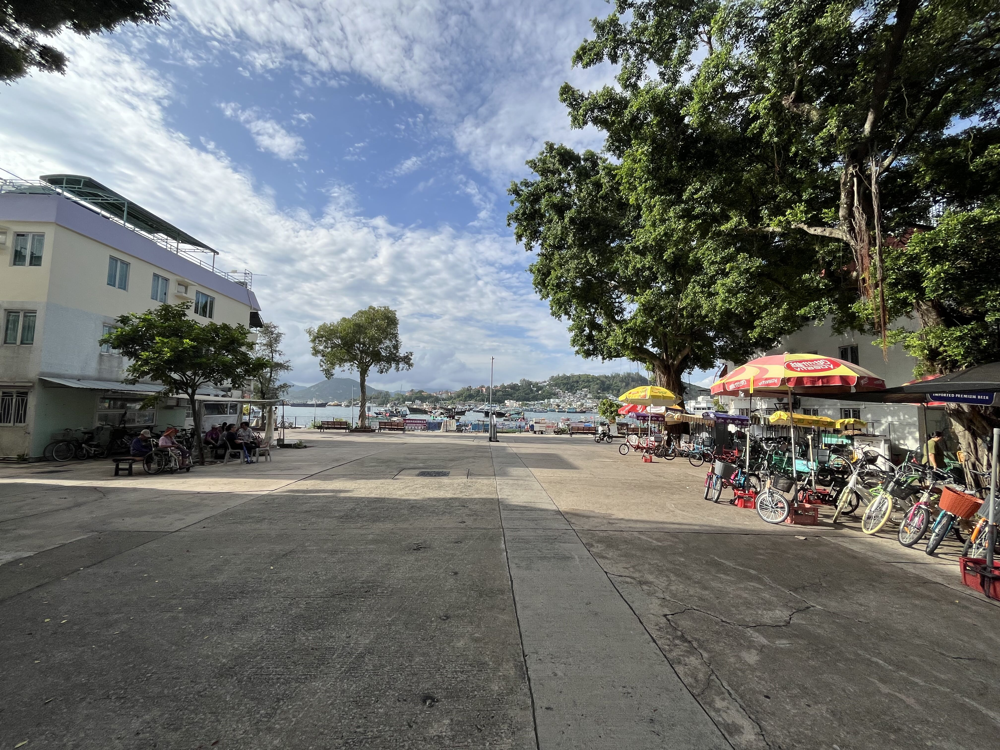 *天后庙前的空地*

继续向南走，可以看到一座中学，再向前走就几乎没什么人了（后来发现这里其实还不到南半段的一半）。天色已经开始转晚，我准备离开这里了。

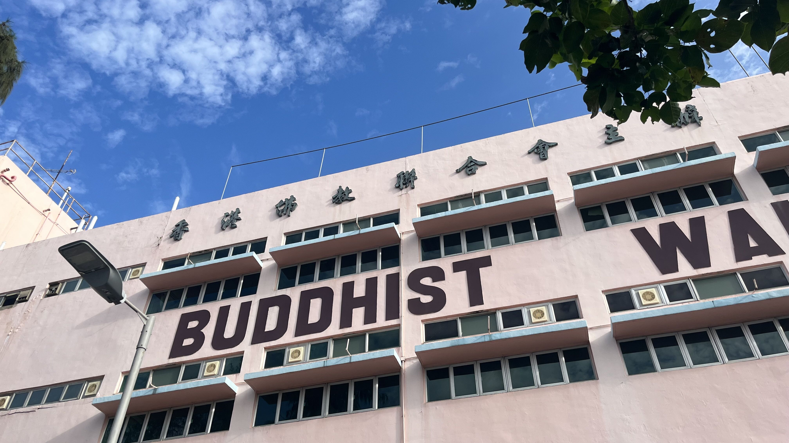 *佛教慧因法师纪念中学外墙，墙上写有“香港佛教联合会主办”和“BUDDIST WAI YAN ...”字样*

### 离开长洲

在长洲的游历时间相对较短，14 点左右抵达，18 点左右离开。如果要把长洲主要景点都看一遍，可能也只需要一天。这样的小岛游览体验整体来说还是很不错的，尤其是对于我这样第一次来到香港离岛的人来说，可以看到很多新的景象。

在离开的时候，我选择坐普通轮渡，但又不知不觉买了豪华票（去往普通轮渡的路上有两种闸机）。这比来程的快速船只便宜了 $1 不到。普通轮渡的豪华票坐在二层，座位更宽敞，船舱中部有桌子；普通票坐在一层。

普通轮渡豪华座票 $23.2

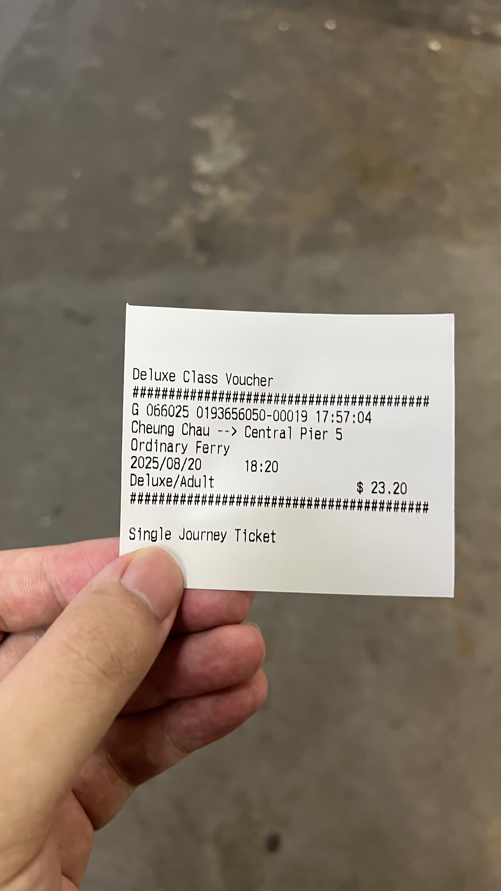 *普通轮渡豪华座票*

这豪华票并没有买到我想要的东西——一层的窗户是可以打开的，二层的窗户是全封闭的，导致在船上拍摄的效果并不好（窗户虽然不脏，但是玻璃磨损得很严重）！因此如果是像我一样以拍照为主的游客，有时真的需要仔细了解和考虑一下最佳方案。

到了中环码头以后，天已经黑了。我准备步行到中环地铁站，然后去金钟坐东铁线回深圳。回到中环，我看到不少游客在对着对面（尖沙咀）的大厦拍照，因为上面有“香港欢迎你”的字样。我顿时感觉到了离岛的另外一层魅力，那就是一种不那么刻板的香港。

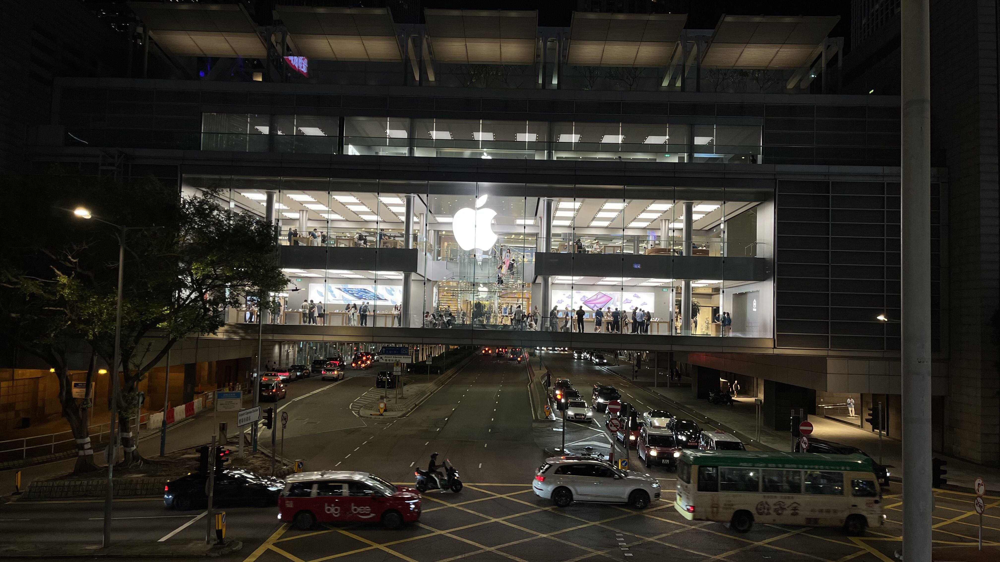 *国际金融中心（ifc）的 Apple Store*

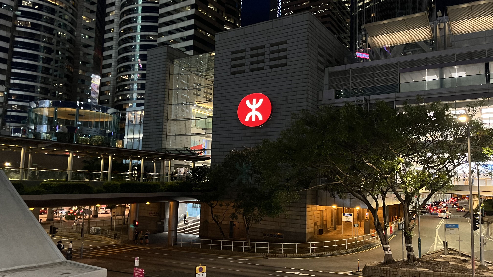 *香港站入口的大型 MTR 红龟标识*

去了地铁，发现 Chiikawa 真是在 MTR 里真的无处不在！

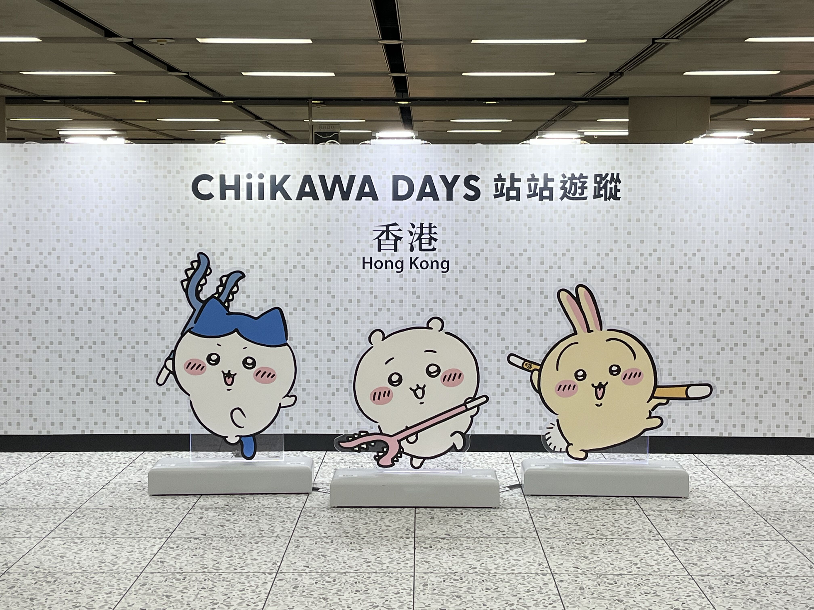