# 港澳漫游（二）

## 目录

## 2025.08.21 香港赤柱

在搜索了几番小红书以后，我将下一个目的地定为赤柱。位于这里的赤柱监狱是如《宝贝计划》等港片的取景地之一，不过真正吸引我来的其实是它的遥远——它在香港岛的最南端。

### 前往赤柱

赤柱位于香港岛的南端，如果坐地铁的话，可以想象需要先坐到金钟或者中环这两个地方附近，然后再换乘。这一次为了方便，直接从福田口岸进香港，东铁线坐到底到达金钟（直接 -HK$50），再换乘一条我没有坐过的线路——南港岛线，到海洋公园站以后转乘公交。嗯，这样看来的确很远。

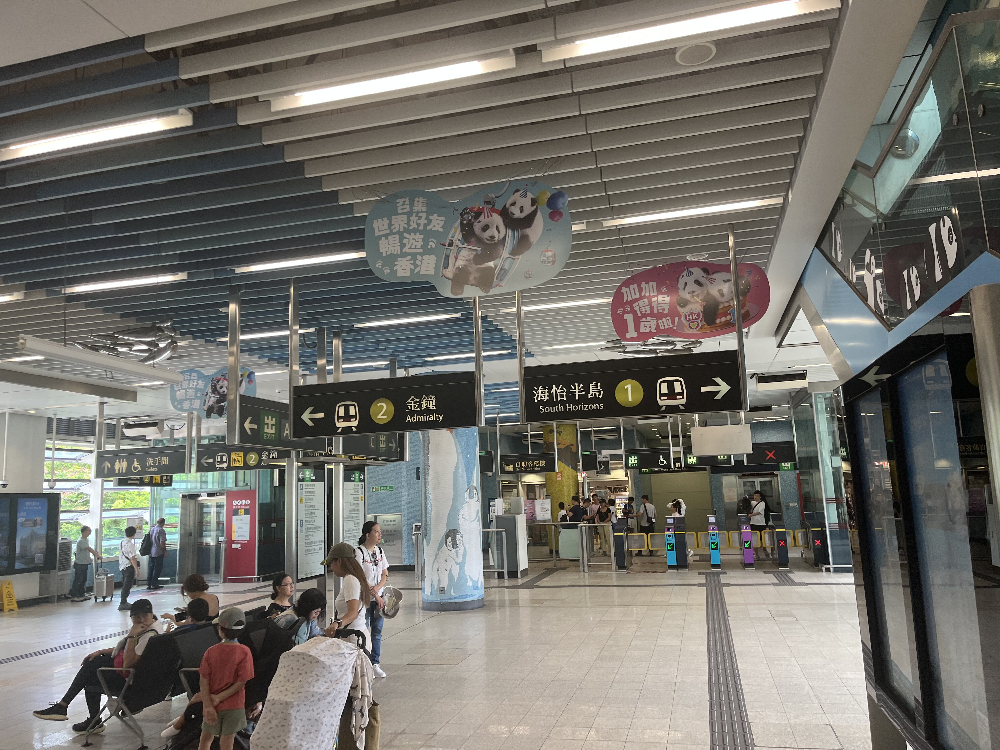 *MTR 海洋公园*

在海洋公园出站以后，步行去黄竹坑道等公交。坐上公交，一路都是沿着海岸线行驶，路过不少建在山海间的宅邸和深水湾、浅水湾海滩。这两个地方在我坐上公交之前从未听说，有种意外收获的感觉。出太阳的时候，这两个海滩上的景色都还不错，碧海蓝天，配着两边绿意盎然的山，我想着返程一定要下车看一看。

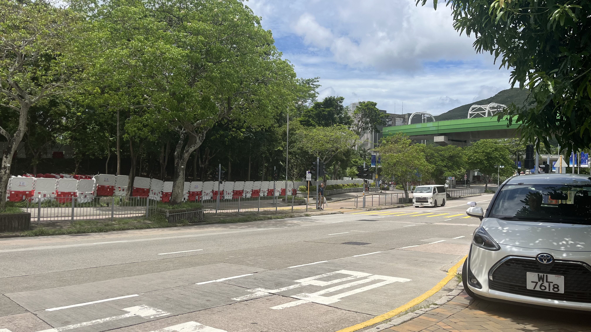 *黄竹坑道等公交*

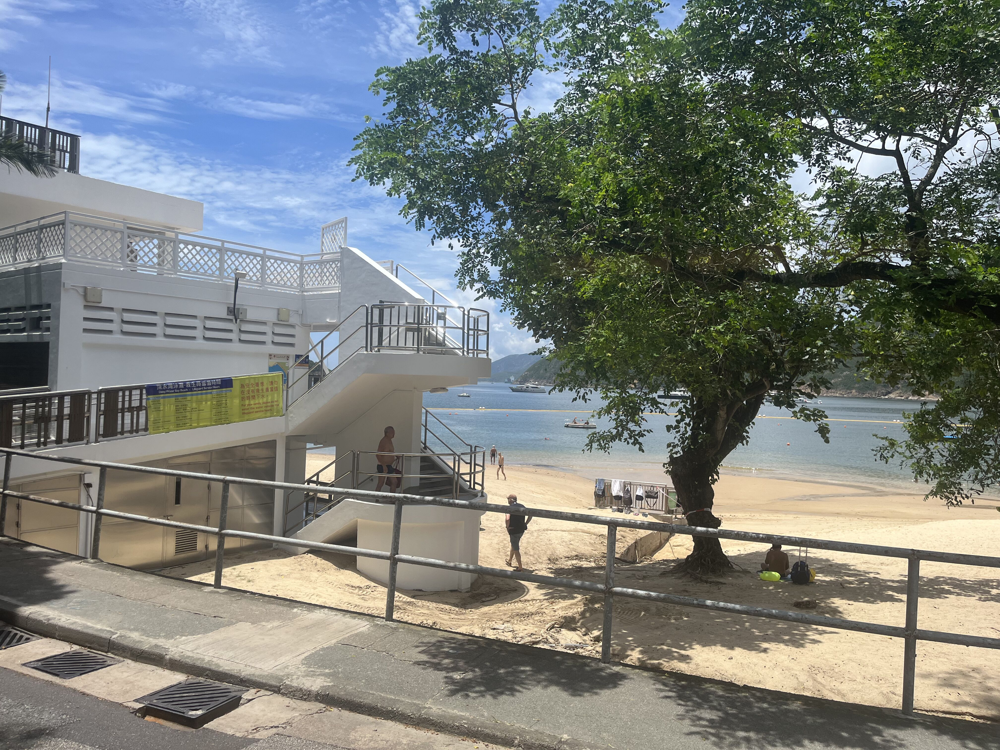 *途径深水湾（公交上拍摄）*

### 赤柱

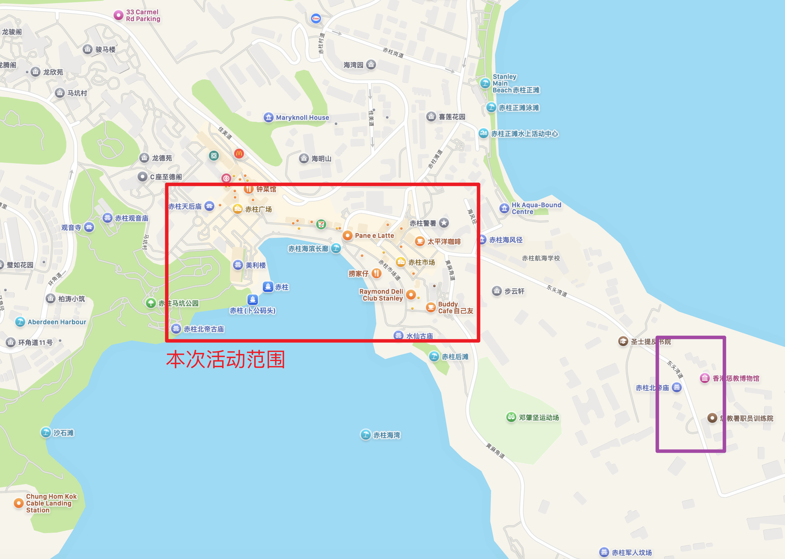 *赤柱活动范围*
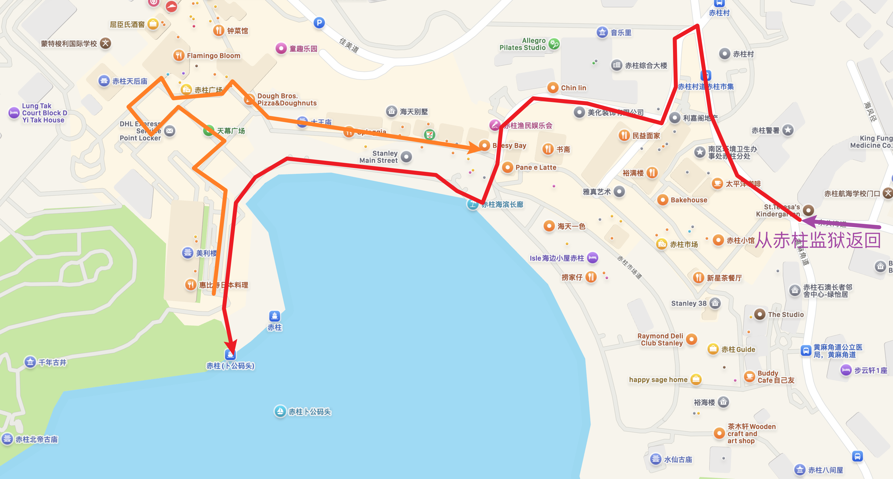 *本次赤柱游览路线*

前往赤柱监狱（图中紫框）打卡是一个错误的决定

赤柱算是一个比较偏的地方，我坐的这一趟公交的终点站便是赤柱，但不是赤柱的居民区，而是居民区附近的赤柱监狱。关于赤柱监狱，我在小红书上刷到过它的照片，似乎还和港片相关，于是怀着打卡的目的，当公交已经到达赤柱大街附近的时候，我没有下车，而是一下子坐到了最终点——赤柱监狱。

当时车上已经没有什么人了，或者说所有人（事后发现对于所有游客也是）已经在赤柱大街下车了。留下的只有我，以及另外一位应该是本地的大哥，还有司机。就这样，坐到了赤柱监狱前面。

在赤柱监狱下车以后，我准备开启打卡模式，先是拍摄了公交站台对面的香港惩教学院的门。只见另一位大哥下车以后向周围的建筑物走去，有一群人从惩教学院的正门走出来，往赤柱监狱前方的关卡走去。

这个时候我举起我的手机，准备拍摄赤柱监狱——也就是小红书上面随处可见的那一张照片——来完成一次一般意义上的打卡。

然后我就被叫住了。是一个年轻的小哥，先是用粤语说了几句话，我没有听懂；然后他换用普通话，告诉我前面不能走，并指了指旁边的路牌，上面写着游客止步。天真的我还以为这是什么预约机制或者游客限制；事实告诉我这并不是在开玩笑。前面是实打实的监狱，里面关的是实打实的犯人，而刚才专程而来的那位大哥，以及从惩教学院门出来往监狱走去的人群，也的确有预约，他们进去应该是探监的，而不是打卡。

可这个时候我已经拍下了照片，照片上守门小哥的惊诧目光依然清晰，我不打算发在任何地方，就这样默默收藏。

我穿过公交站台上等公交的大批人群，准备步行回到赤柱大街那里（不是很远，大概 500m 的样子），不禁在后悔，并在心中持续念叨“我究竟带自己来到了一个什么地方”。从另一个角度来看，小红书上的人真的胆大，换我在这种自己一个人、人生地不熟、又在港岛最南端的地带，遇到了这种算是被劝诫，还是在监狱附近的处境，简直吓得不轻。*要是刚才公交上的大哥一眼看出我是个大陆仔，又是跟着他一起坐到了赤柱监狱这里，那得有多尴尬...*

这里可以看到专门售卖探监用品的店铺（旁边不远就是赤柱监狱），在大陆比较罕见。

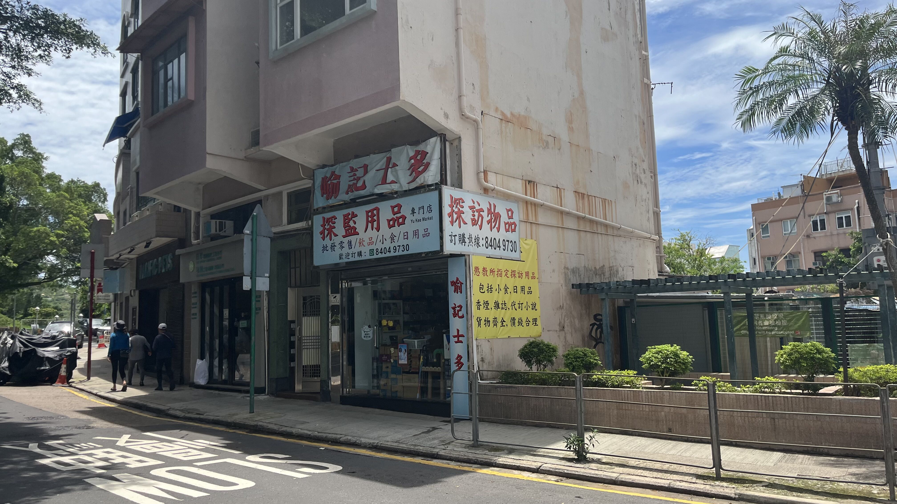 *探监用品专卖店？*

赤柱这个地方虽然不太大，但也有很气派、现代化的市政大厦。

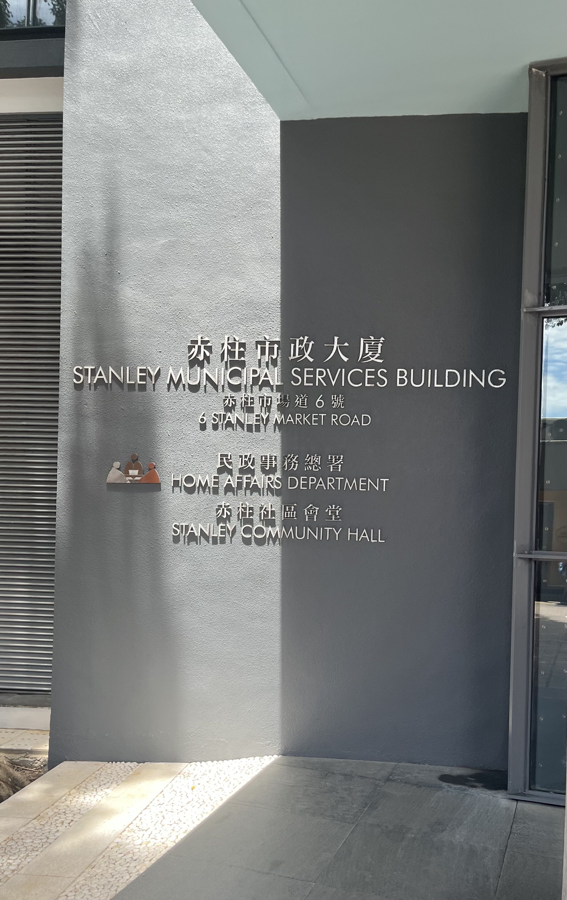 *赤柱市政大厦字样*

从赤柱村道公交站下车以后，沿着赤柱村道、赤柱市场道，经过赤柱市政大厦就可以来到赤柱的海边（赤柱海滨长廊）。这里同时也是赤柱主街（Stanley Main Street）。

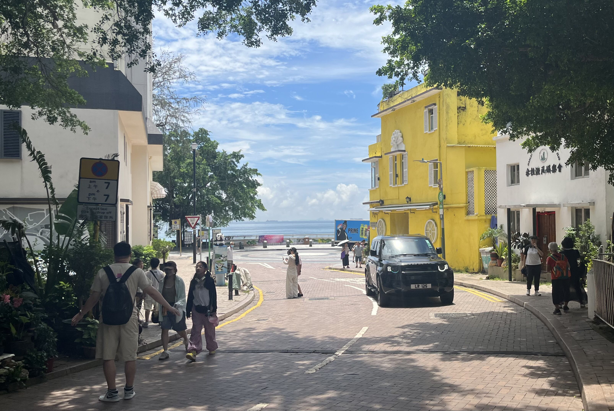 *小红书上的打卡点之一，海边的黄色房子（是一家餐厅，大众点评显示人均消费 ¥162）*

口渴了去赤柱主街上的一家 711 买水，买的是一瓶很大的 Bonaqua（是 700ml 还是更多已经忘记了），花了 $17，我认为还是比较贵的。就这样沿着海滨长廊一直走，边走边拍照，就到了美利楼和卜公码头。

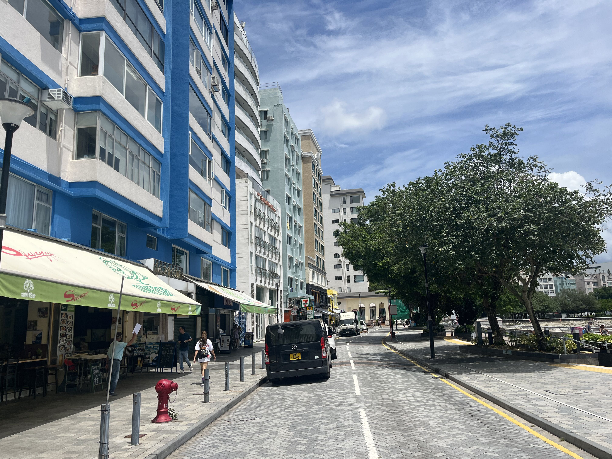 *赤柱大街（望向来时的方向）*
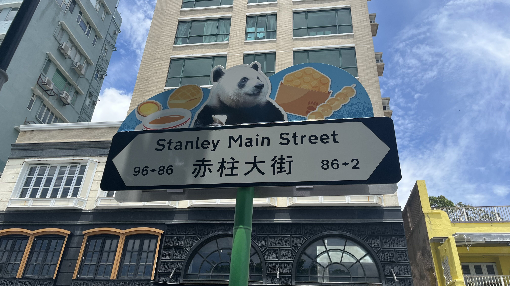 *赤柱大街的路牌*

“卜公码头”这个名字，在有了探访一些香港的地点的经验后，可以很容易猜出是取自人名（第十二任港督**卜力（Blake）**）。这个码头当前仍在运行中。有了卜公码头的上盖的遮挡，虽然当天的太阳实在是很大，但站在码头上吹着海风喝着刚刚买来的冰水，也是很凉爽惬意。

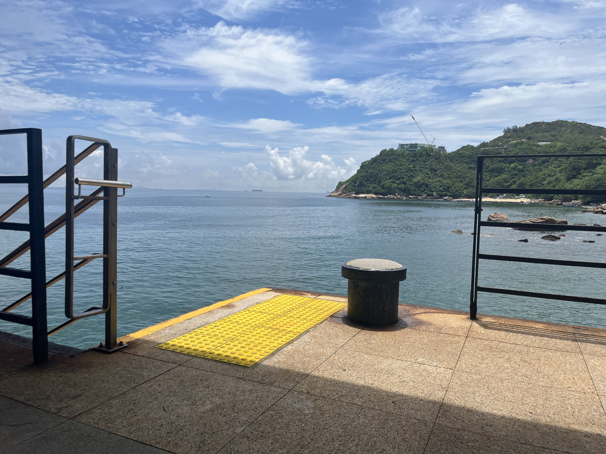 *在卜公码头看向南边的海域*

卜公码头前就是赤柱的美利楼（美利 **Murray**），也是一个历史建筑。这栋楼原本位于中环，拆卸时所有的花岗岩都被专门编号，并原样重建于赤柱。

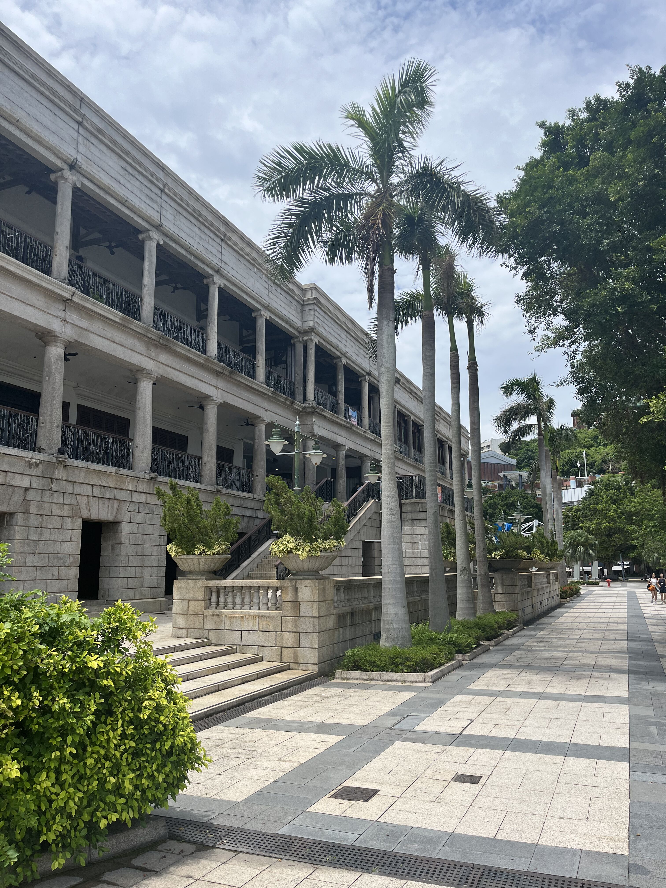 *美利楼*

逛完美利楼和卜公码头这一带后，再简单逛了一下周边，就往回走了。

### 离开赤柱：一些特别的经历

这一次来赤柱并没有真正意义上把赤柱逛完，但也逛了个大概，毕竟这个地方作为旅游目的地时，主打的就是一种海边小镇 vibe，如果不消费吃饭的话，走一走就够了。我并不为这次长途跋涉来到赤柱感到后悔，但也不得不说：跟着小红书上的推荐走，有的时候只适合像我这样时间非常宽裕的旅游方式，并且还需要做好不计代价和路程，只为旅游感受的心理准备。简而言之，专程从深圳来一趟从经济上来说并不值得，但抛开这一点，既然来了就是一种收获。

不知为何，很巧的是这次探访中脱离与旅行之外的经历变得多了起来。先是被小红书误导前往赤柱监狱意外扮演了一次“天真的大陆客”，然后是——

在离开赤柱的时候上公交车，由于我没有注意到自然形成的上公交的队伍（我知道香港的公交要排队，但我到现在还是回想不起来当时的队伍在哪里），就自然往没什么人的公交车门上靠了。结果被一个戴着眼镜的大陆女人（带着她的孩子，口音是大陆的）严肃地提醒了一番“我们都在排队”，我赶紧说 sorry。

公交是开往金钟的。来的路上看到了浅水湾和深水湾的景象，于是我在深水湾先了下车，准备去看一看。不过当时的天气已经变脸，几乎已经没有太阳而只有天光了，这个时候的海就不怎么蓝，所以我在海边停留了大约五分钟就又坐上公交走了。

这一次上公交的时候，有一个香港本地的奶奶拎着它的行李（并不是行李箱，是一种小推车，上面放一个小箱子，在香港经常能看到老者拉着这样的车），用粤语表达让我帮她提一下，也就是将行李从地上提到公交车上。我照办了以后，清晰听见这位奶奶说了一句“我唔该你”。就这样被老者感谢一番，不加掩饰地说，我感到心里暖暖的，虽然她的这句感谢可能没有那么强烈，只是出于礼貌。我本想回一句类似于不用谢的语句，但困于不会说粤语，觉得突然冒一句普通话也有些尴尬，所以我显得比较木讷，啥也没说拍了卡就往后排走去。

就这样一直坐到了湾仔，然后是金钟，莫名来到了我两年前第一次来香港下地铁的地方。我在金钟坐上港铁回到了深圳。

路上经过湾仔（因为看到了港铁湾仔站的标）的时候，我不禁观察窗外，这是一个街道长得非常像尖沙咀的地方（这句话只有外地人能说出来😄）。

### 从深圳往返赤柱的消费统计

> 八达通记录整理而来，MTR 真是抢钱（主要体现在上水）

|项目|消费|
|:-:|:-:|
|MTR 福田口岸-海洋公园|$54.4|
|公交 海洋公园停车场，黄竹坑道-赤柱监狱，东头湾道|$15.1|
|赤柱主街 711 买水 700ml|$17|
|公交 赤柱市集，赤柱村道-深水湾，香岛道|$11.7|
|公交 深水湾，香岛道-太古广场外，金钟道|$6.4|
|MTR 金钟-福田口岸|$52.2|
|**合计**|**$156.8（交通 $139.8）**|

## 2025.08.22-23 珠海、澳门路环

### 前往珠海

从深圳到珠海比较划算的方式是直接坐巴士。巴士这种交通工具一直不是我的首选，因为它的速度不算很快，环境也不算很好，可是看着深圳北到珠海 ¥100+ 的票价，我还是决定去坐只需不到 ¥50 的巴士。

不了解不知道，在看了小红书上的推荐之后，我发现可以直接在小程序购买跨市的巴士票。看上去，这种跨市巴士在深圳和周边各市相当普遍成熟——它们有专门的小程序可以付钱买票、选择目的地和填写个人信息，可以选择不同的时间段（时间段几乎覆盖全天），可以查看这班车在深圳市区里会经过哪些站，在珠海会经过哪些站。有了这些信息，在固定的票价下，你就可以自由选择上车点和下车点。

我选择的是下午 14:40 左右在深大地铁站上车，在拱北口岸附近下车。

早上起来就出发，由于不是很想在早上就直接去珠海（可能会比较赶），所以定的下午。先在商场里看了一部电影《伊甸》，当天影院并没有什么人（只有我和另一个人，包场）。看完电影就往深大地铁站走。

到了深大地铁口的公交站，可以看到附近有专门的牌子表示这里是一个巴士上下客点。不同小程序、不同集团的巴士都会到这里接客和下客。对于出发的巴士，还会有专门的引导员站在公交站附近。其中一个女引导员，腰上挎一个扩音器，戴着扁圆形的眼镜，不断验证着周围排队乘客的车牌号和手机号，打电话联系还没有到达的乘客。

巴士起步，开始往宝安机场开去。这条线路上巴士相比于坐高铁的又一个优势是深中通道的开通，不必绕道到广州去。宝安机场附近就是深中通道深圳端的入口。

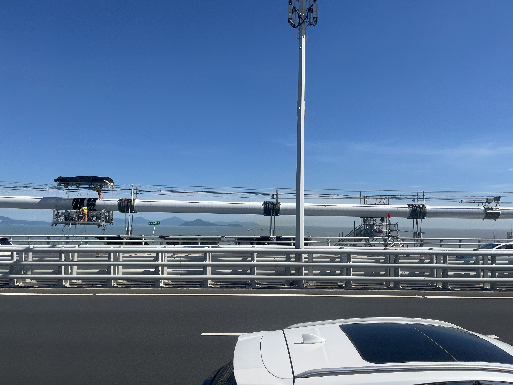 *深中通道*

过深中通道后就到了中山，从这里开始就是截然不同的景象了：四周并没有多少钢筋混凝土，而是一大片的绿色伴以矮矮的山丘，这附近似乎正在修建高速，许多路上是空荡荡的，还有不少施工的痕迹。就这样一直走，经过这些巴士每天都会经过的几个固定的站点，唐家湾火车站、北理工、北师大，穿过凤凰山隧道，来到珠海的香洲区，继续往南，最后抵达拱北口岸附近。

### 情侣南路

来之前我对珠海的了解，仅来自于我爸从前跟我讲过的他到珠海格力开会的故事。来到珠海以后，我发觉这里的科技气息没有想象中的那样（如同深圳、广州）浓厚，反倒有几分海边宁静小城氛围，尤其是我之后走在情侣南路沿海的时候。

在拱北口岸附近的公交站下车，步行大约十分钟去到我在珠海站对面定的一家如家。这里的路有些错综复杂。在酒店里休整了大约一个小时以后，我带上手机轻装上阵，准备沿着东边的情侣路海边一路走上去（但当天实在太热，走了大约三公里就歇了坐公交去了）。

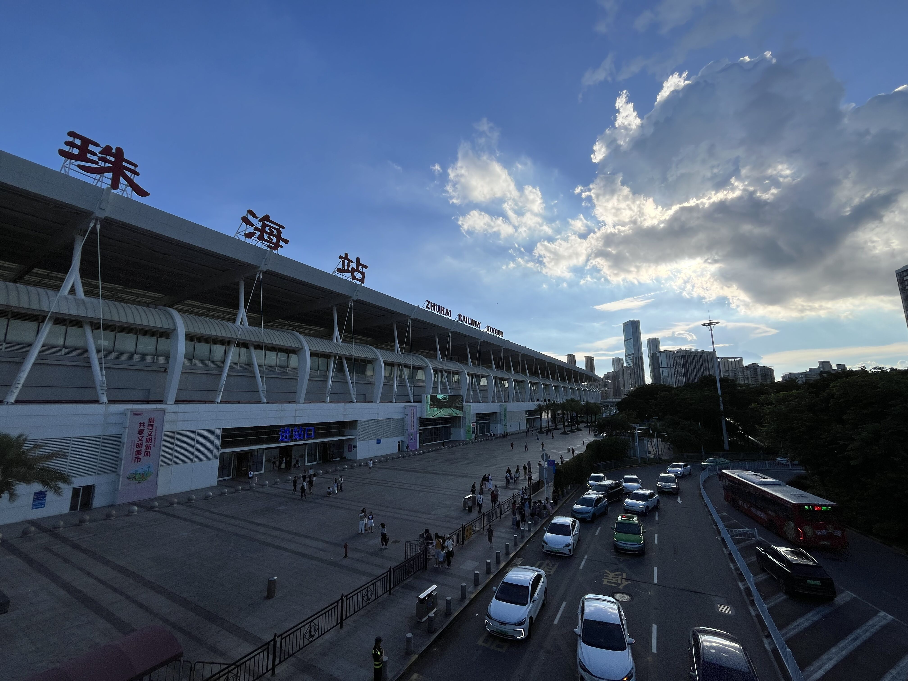 *珠海站（天桥上拍摄）*

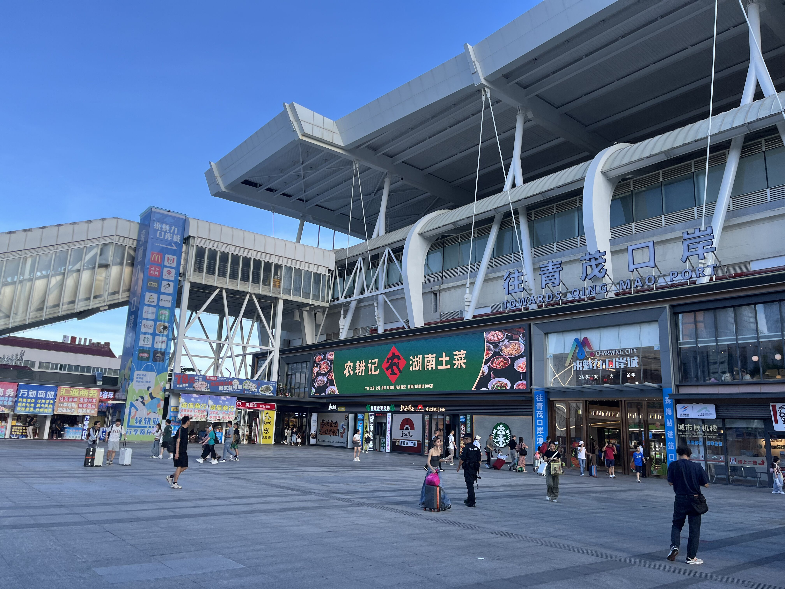 *这里的青茂口岸引起了我的注意。看别人提起从珠海到澳门，往往只提到拱北口岸，而从未听说过青茂口岸。两个口岸相距不到五百米，人更少（我觉得应该是有些游客不太愿意尝试青茂口岸导致的），青茂口岸的入口就在拱北口岸一旁的珠海站旁。既然人少，我打算明天就走青茂口岸。*

情侣南路一侧是宽敞的靠海的步道和自行车道，沿着情侣南路不断延伸。这里距离澳门很近，可以直接看到澳门那边的港珠澳大桥人工岛，背后的各种赌场建筑似乎都被遮住了。

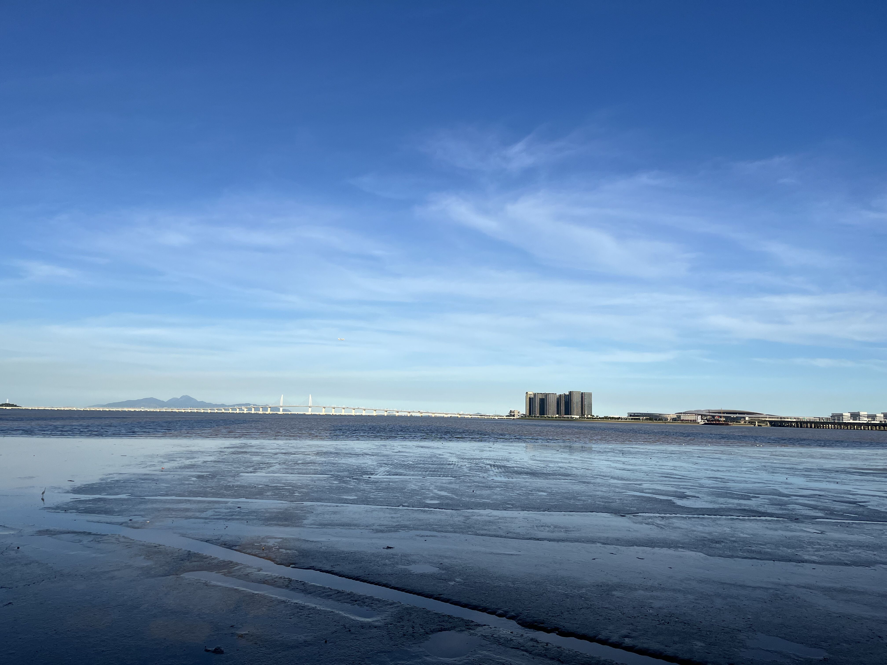 *从情侣南路看港珠澳大桥及人工岛*

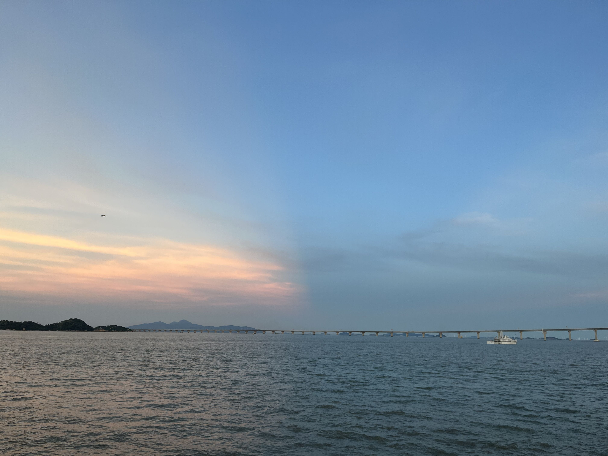 *港珠澳大桥*

一路上，有中年人依靠或坐在一旁的栏杆上，也有小孩骑着自行车不顾一切地疾驰。夏天的海风吹着，带不来一丝凉意，傍晚的太阳光被一旁的酒店等建筑物遮住，赋予这一路蓝色调。在建筑的空隙间，可以望到云上泛着的金光，在我驻足拍摄完一张张普普通通的照片后，一旁行走的一些散步的人也停下脚步望向那片金云。这种一个人自由地走在陌生却又感到亲切的一种环境的感觉，有种说不上的奇妙。

太阳完全落山的时候，我走到了大概九洲港附近的岸边，这里是港珠澳大桥施工便桥的起点。后来看地图才发现，这里似乎是一条专门用来上人工便桥的道路，已经不是情侣南路。到这里的所有的车都要先转到便桥上，再掉头绕回来。或许这也是为什么几乎在这里打不到车。

在这里等了 3 路公交，准备去到市里面逛一逛——没想到“市区”还挺远。珠海的公交无论里程都只需要一块钱，这和我先前去过的其他地方形成了巨大的反差。由于来珠海的时候没有带换洗衣服，我就直接去优衣库买了一套，外加一个画有 Keith Haring 图案的藏青色帽子。

晚上回到酒店以后，发现港澳通行证的香港签注还没有续签，这会导致没办法正常通过港珠澳大桥。幸好今年没有被莫名其妙拉黑，准备明天直接去附近的签注点续签。

### 前往澳门

第二天一早起床，退完房，带着我的一点点行李，我就打个车去续签了。续签的过程很丝滑。续完签就打车到珠海站，准备从青茂口岸进入澳门。

我不知道拱北口岸里面是什么样子的，所以无法进行对比。不过青茂口岸人确实不多，一条路走下去没有觉得很堵。过这个海关还有一个发现是，澳门这边过关与香港不太一样：这边的两个海关直接拼在了一起，内地关过了以后，开一道门，直接过澳门关进入澳门，中间（对旅客来说）没有禁区空间。

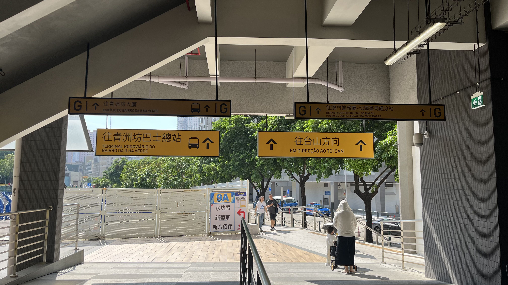 *离开青茂口岸*
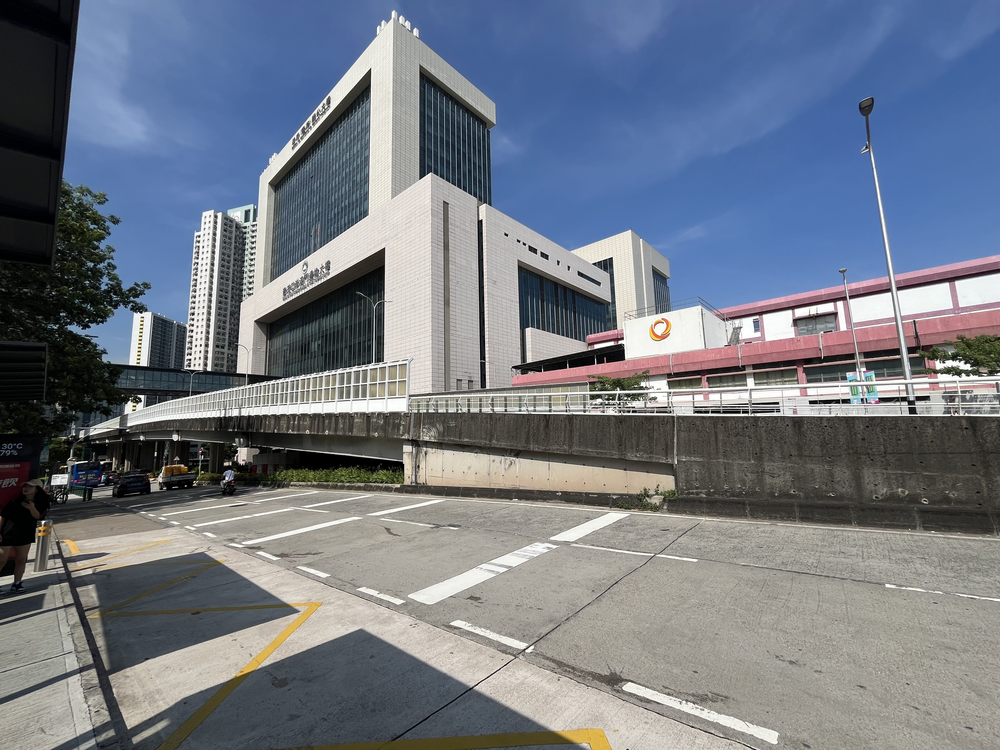 *在附近等公交*

:::note
**使用深圳通可乘坐澳门公交**

澳门这边的公交是支持使用交通联合的，因此我可以直接用 Wallet 里的深圳通在这里坐公交，统一收费 MOP 6，转换成人民币是五块多钱。

澳门本地的交通卡并不好开，它不像八达通那样可以直接在 Wallet 里开卡，似乎也不支持线上直接充值。支持交通联合这一点基本弥补上了不好办澳门本地交通卡的问题。

至于为啥不用支付宝或者微信，是因为我个人觉得 NFC 比扫码要更方便，效率也更高，所以能用 NFC 的地方都不太愿意用扫码了（除非扫码的优惠力度特别大）。
:::

在青茂口岸附近等公交的时候，发现旁边有一个穿着制服的中年男人用着不甚标准的普通话，在耐心地引导游客上公交刷卡，并提供一些目的地的信息。

### 前往大三巴牌坊

大三巴距离口岸并不远，位于澳门半岛。坐公交到大三巴附近的路口，开始跟着导航往巷子里面走。在到大三巴之前，我甚至不知道大三巴是什么，只是本着一种打卡的心态去一下；最终的目的地是路环。

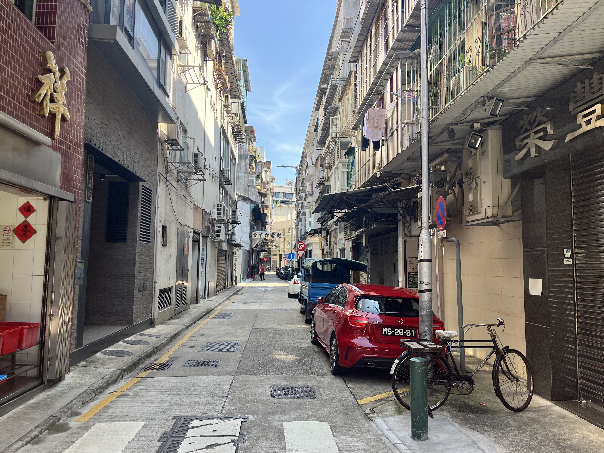 *前往大三巴路线上的街巷*

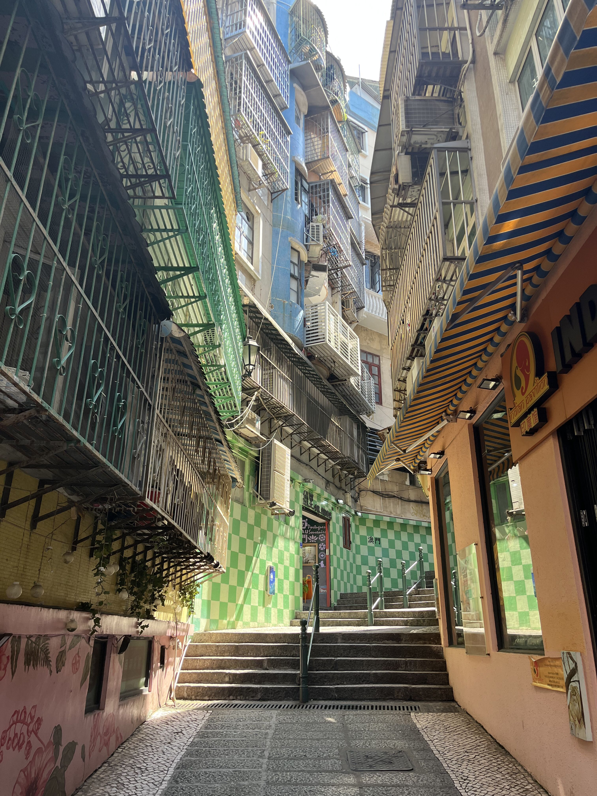 *这是我觉得比较好看的一处街巷场景，在大三巴所处的街道不远处，是在路线上意外逛到的地方*

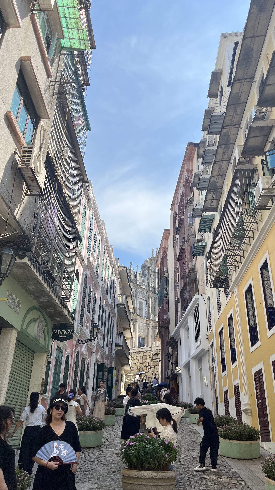 *一个街道口不知为何这么多人，仔细一看发现，原来后面有建筑。当时的我走到这里，还不知道眼前的就是大三巴。*

### 大三巴牌坊

到了大三巴牌坊，才发现原来这里的客流这么多（这还不是最高点，最高点应该是国庆之类的假期），与来时的街巷形成了巨大的反差，好像一下子从有着葡据历史的老旧却鲜艳的巷道风回到了内地的网红景点风。

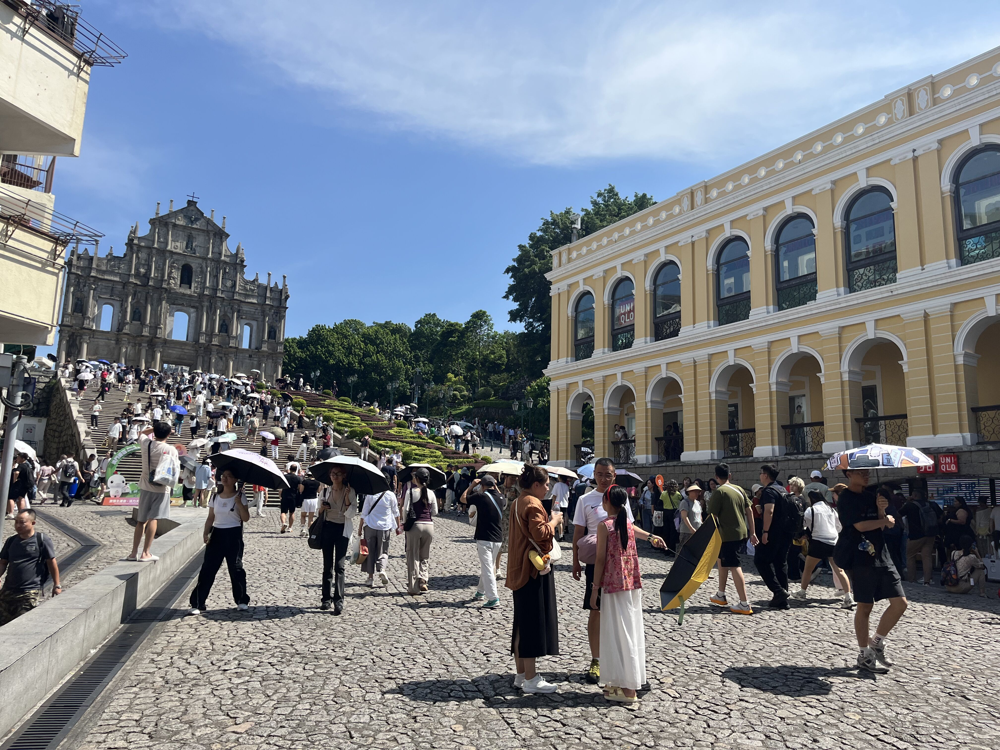 *刚刚抵达大三巴下面*
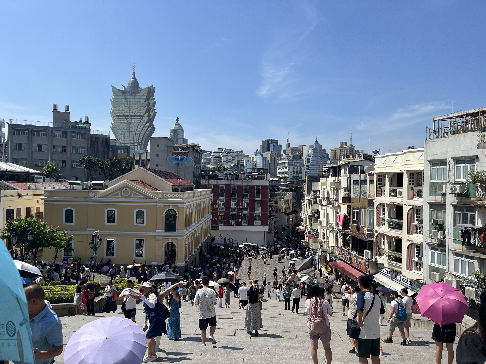 *从大三巴上面看下面。人太多了我没有进去*

在大三巴上顶着烈日拍了几张照片和几张自拍以后，就从旁边的斜坡直接下来了。这个斜坡的最底下是一所中学。在这里绕这么一圈，发现是如此的炎热且拥挤，我就准备马上前往路环，不在这里久留了。

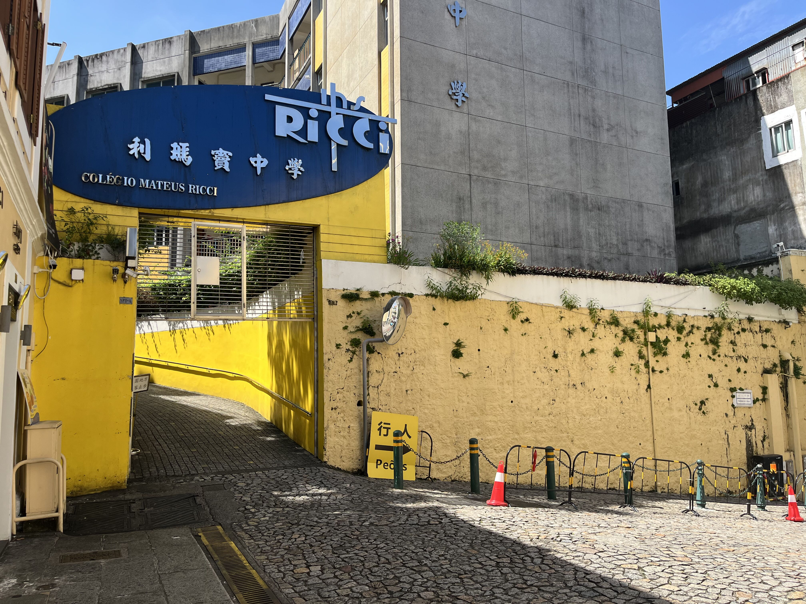 *斜坡最下面的中学*
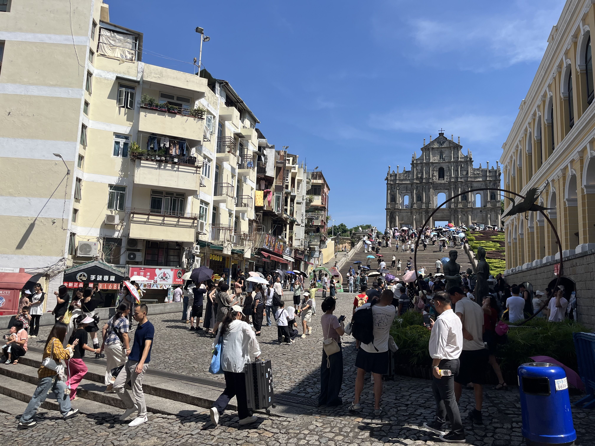 *从中学那一边绕一圈，回到大三巴底下*

### 前往路环

从一个个错综复杂的巷道出来以后，到了水坑尾街上，在水坑尾/公共行政大楼等公交去往路环。

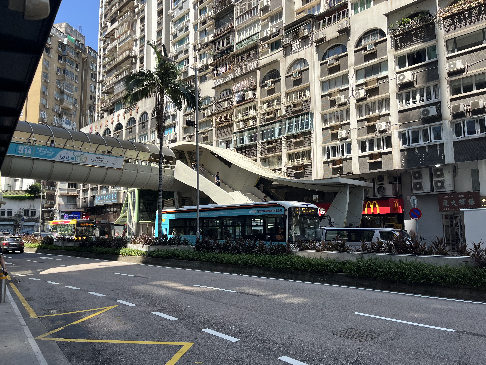 *等车 ing*
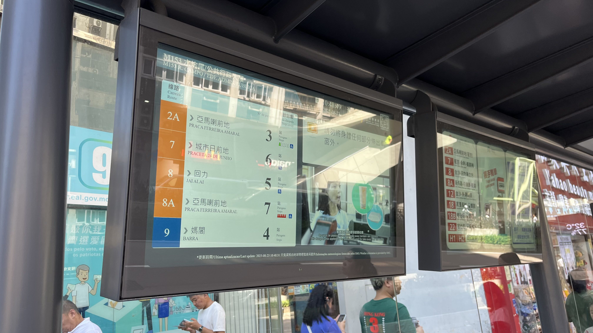 *站台上的文字*

上车的人很多。从大堂区出发，车厢几乎都是爆满。车开得很快，不会儿就上了桥，往路环开去。不少人在到达路环市区公交站之前就已经下了车，最终抵达路环市区的人在少数。

过了桥，最先来到的是氹仔岛。记得在学初中地理时，把澳门分为澳门半岛、氹仔岛和路环岛三个部分，但后两者其实已经被填海部分连在了一起，氹仔岛也不大能称为是氹仔岛了。氹仔与路环之间的填海区域称为路氹填海区。路氹填海区似乎是专门为赌场而生的一片填海区，在地图上可以清楚看见氹仔与路环之间连接部分开设的全是赌场。

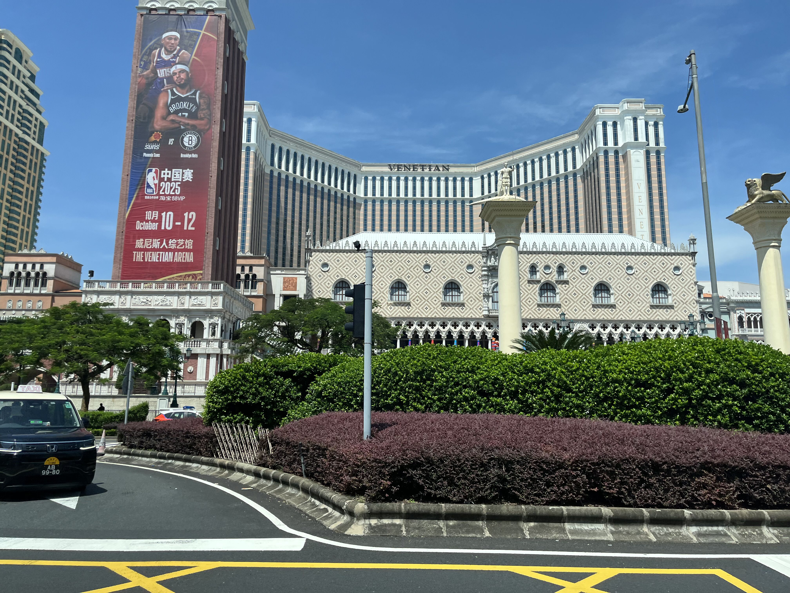 *路过威尼斯人*
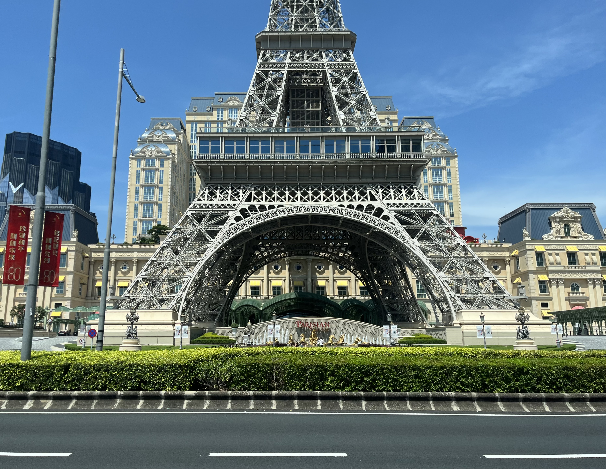 *路过巴黎人*

一路上经过了澳门威尼斯人、澳门巴黎人、新濠影汇等等，看到了澳门的几个轻轨站。仔细看这些酒店的名字我才发现，原来 XX 人的称呼是来源于这些赌场本来的名字，即 Venetian、Parisian 等，直译过来就是“威尼斯人”、“巴黎人”。但这些词也可以翻译为“威尼斯的”，“巴黎的”（但运作这些酒店的集团不是威尼斯的也不是巴黎的）。估计为了图好记直接写成 XX 人。这个叫法我总感觉简单粗暴、不明不白的，有些许符合一种没什么文化的土豪气质。

经过了大约几十分钟的车程，公交在路环市区公交站停了下来。

一下车就感受到了截然不同的氛围，这是一种不同于先前在澳门半岛或是路氹填海区看到景象所给人的氛围。澳门半岛有着新旧交错的特质，有着许多文化遗迹的同时也有着现代化的奢华赌场，可认为是澳门的综合门面。而路氹填海区给我的人工气息十分浓厚：当天太阳普照，印象中几乎没有什么地方有自然阴凉（除了被混凝土遮盖的地方），只有一路的赌场酒店。而到了路环，绿树成荫，没有什么大马路，街道窄，建筑紧凑，像是来到了一个海边小镇。难怪路环岛被称为澳门的“后花园”。

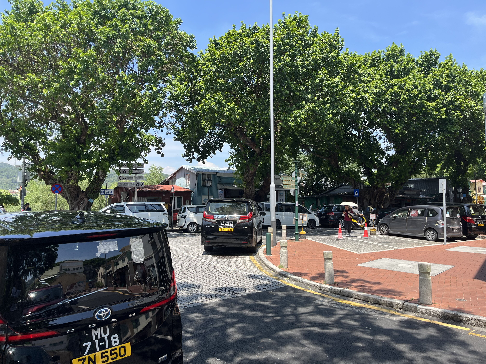 *路环。这里和珠海的横琴隔海（河）相望*

之所以目的如此明确要来路环，[参考文献还是有的（赖导的视频）](https://www.bilibili.com/video/BV1UYTezVEz6)，感兴趣可以去看看。

### 路环

下了车，没走多远就闻到了一股香甜气息。还记得先前刷小红书的时候，有人提到这里的几家小吃店，其中有一家是卖蛋挞的。我潜意识是不大敢一个人进香港或澳门的食品店消费的，但不知是否因为看到了路环如此景象，让我也自然松弛了下来，打算进店买几个尝尝。

刚进店，是想象中的尴尬，不过好在店员很懂，直接说蛋挞的价格。蛋挞一个一个用黄色的纸袋包着，排列在铁盘里，专门等待顾客来购买。我要了两个，是 22 MOP。这家店在收费记录上显示的是 Lord Stow's Bakery，后来查了一下这家店在刚刚路过的威尼斯人附近，应该是连锁来的。

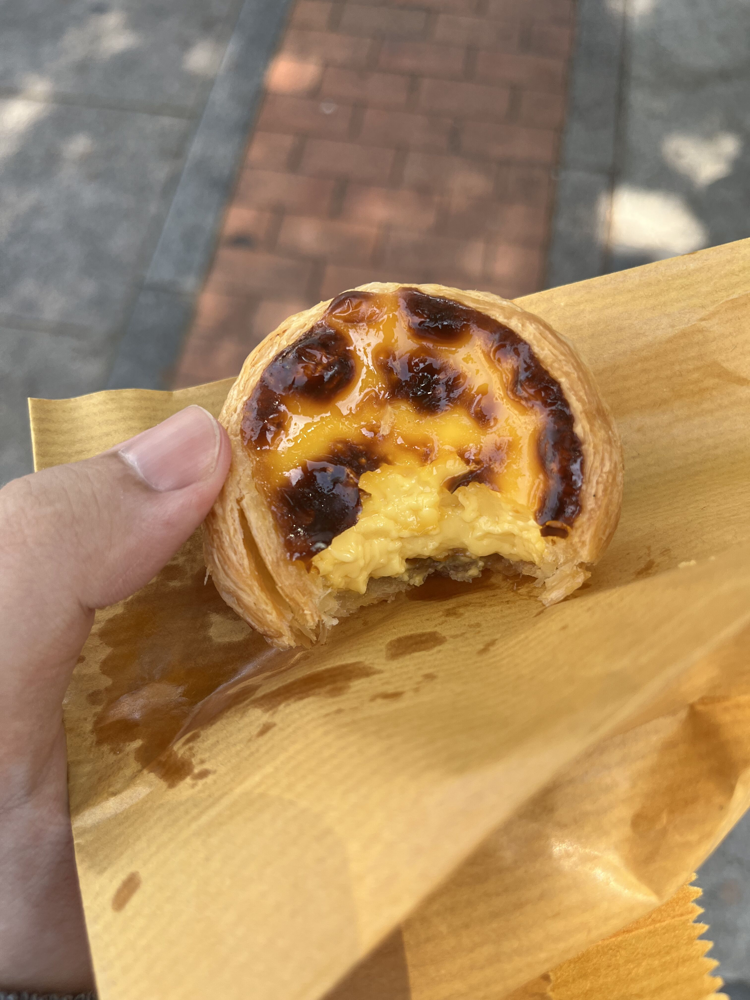 *咬了一口的蛋挞*

确实很好吃，香甜酥脆，样子也不错。但真要说味道惊艳，也不至于—因为跟肯德基的太像了！这又一次证明了肯德基的蛋挞是多么出色。这也不意外，毕竟都是葡式蛋挞。也算打了个卡。

### 十月初五马路

过这家甜品店不远就到了海边，这里的一条马路叫作十月初五马路。接下来就是沿着这条马路（海岸线）走。这边很容易能看见河（或者说海）对面的横琴，或许也能看见澳门大学？总之那边并不是很发达的样子。

路上会经过路环的圣方济各堂和路环图书馆，这是这条路上的两个著名打卡点。

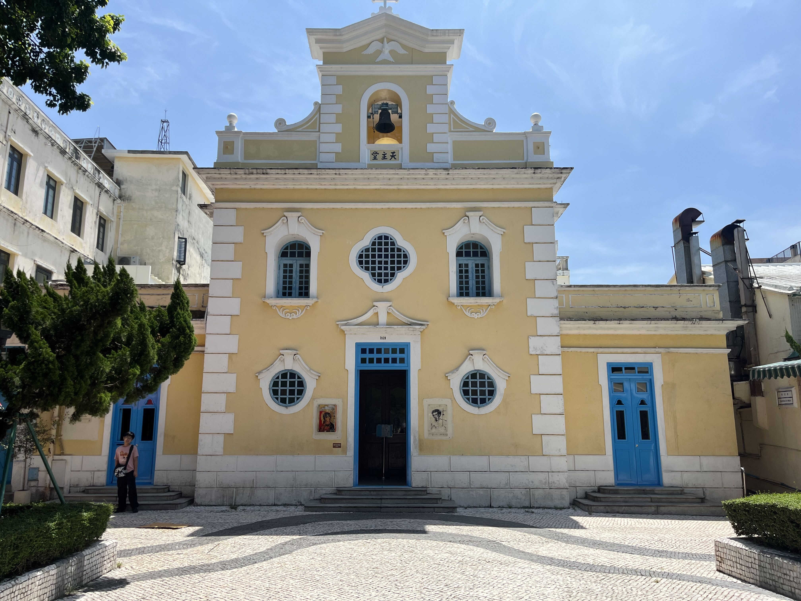 *路环圣方济各堂*
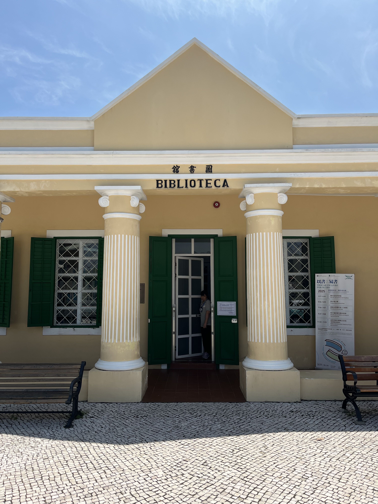 *路环图书馆*

圣方济各堂里的“圣方济各”让我不禁想起旧金山的“San Francisco”，但查询发现二者纪念的不是同一人但，这里的圣方济各是圣方济各·沙勿略，旧金山名称中的弗朗西斯科（三藩里的藩）是亚西西的圣方济各，后者应该是方济各这一称呼的来源。另外，路环市区以及周围的石排湾在行政区划上属于“圣方济各堂区”。

我走到圣方济各堂前，感到场景有一些眼熟。这是因为在捕风追影这部电影的结尾，抓捕影子就是在这里进行的。就这样莫名其妙进行了一次圣地巡礼（虽然我觉得这电影不好看）。

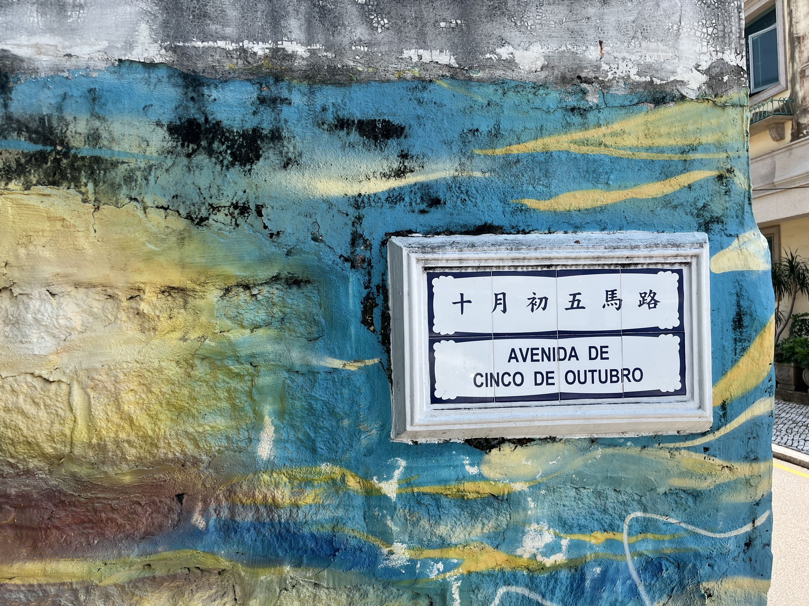 *十月初五马路路牌*

路过图书馆以后再往前走，就会到一处庙宇。在行走的过程中，我留意到我身边的一对似乎是父女的对话，颇感有趣。女孩大概是十八岁左右的样子，在和他的父亲抱怨着现在来的时机不对（当时是 11 点多），大中午的拍不了什么，并且在阳光的照射下看不清手机屏幕，不知道拍的啥。这位父亲无奈地笑着反驳，说他是来玩的，不是拍照的。女孩不同意这个观点，而父亲则坚持他的观点。二者的对话并不严肃。最后女孩有些郁闷的样子。听着这段对话的同时，我按下了快门拍下十月初五马路的路牌。

这段对话让我想起我先前在香港中文大学的天人合一时产生的一些反思想法，我想还是不要太纠结于怎样才能拍出最好的照片为好，更何况这中午也并非出不了片。

马路尽头的庙宇，名曰谭仙圣庙（又称为谭公庙）。谭仙或者谭公是传说中广东惠州一带的海神，香港的筲箕湾也有谭公庙。一旁其实还有一座小道，名为乡村马路（很直接！），接下来我就沿着这条乡村马路，一直走到澳门的最南端。

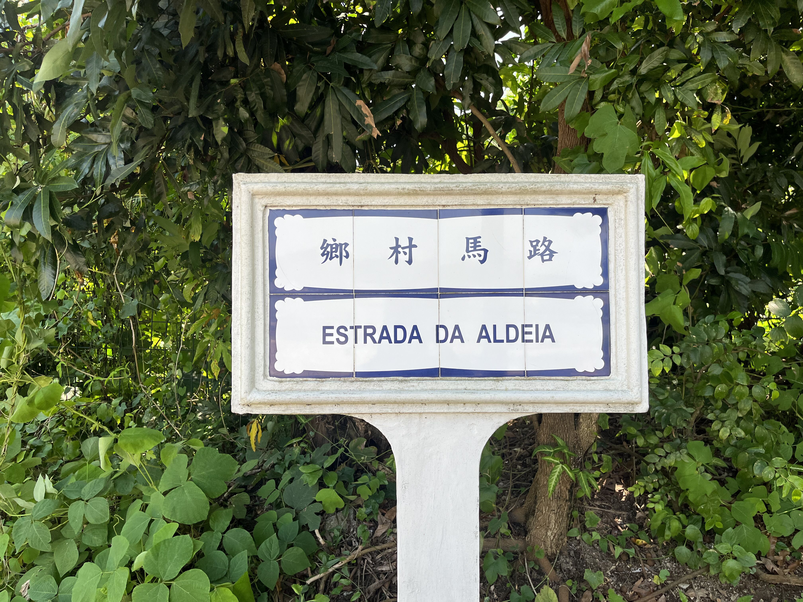 *乡村马路路牌*

### 乡村马路

乡村马路如其名，是非常乡村的马路。一路上没有遇到什么人，倒是遇到了几辆放飞自我的摩托车疾驰而来。因此无论是多么偏的道路，除非偏的不行，否则最好还是不要在马路中间走，依然比较危险（摩托车声音比较大就还好）。

路上会经过澳门保安部队射击场和一处公墓（直白点说，在地图上标的是坟场，且不止一个），公墓的围墙上画着许多神话相关的意象，我想我大抵是真的来到了一个很偏的地方。小红书上有许多人好像都被公墓吓跑了。据说这里还会有狗。我的确都碰上了，但感觉就还好，可能跟我是在一个大太阳天，还是正中午到这里有关系。

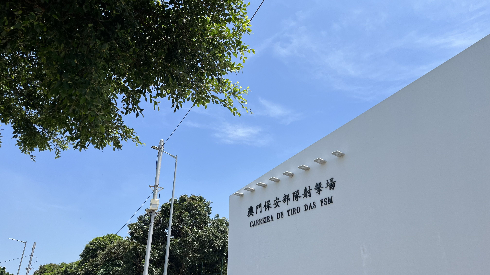 *澳门保安部队射击场外墙*

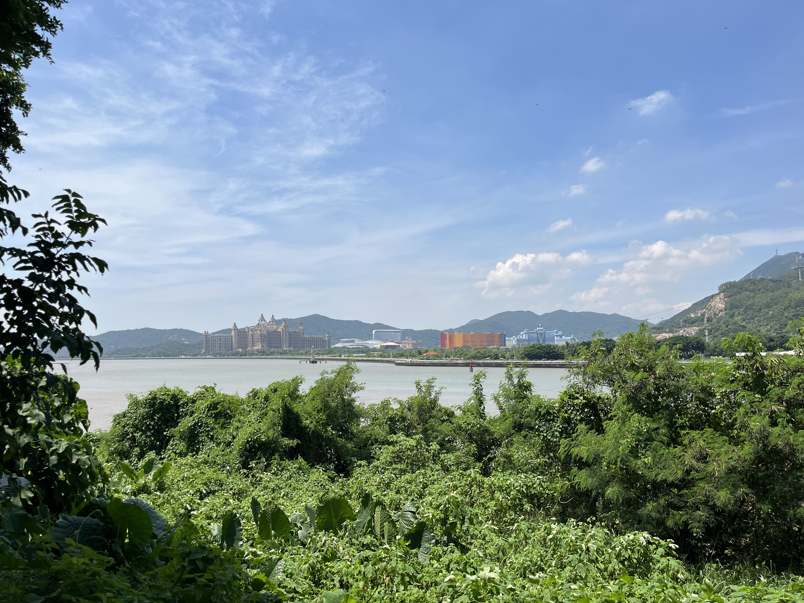 *对岸像城堡一样的建筑，不知道是干啥的，但总之跟金山银山有关系*

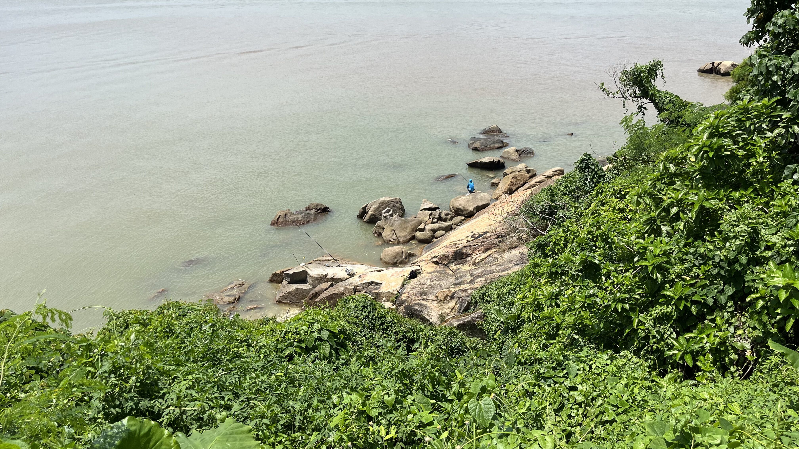 *随处刷新的钓鱼佬*

过了公墓继续向前走，是一条水泥马路，路两边都有树，中间留下一部分太阳直射着。这样的路一直走大概十几分钟，就到了一个转弯处，转过弯去就变成了柏油马路。这里其实就是澳门最南端的入口，但这个入口实在太不显眼了——入口藏在一个小停车场后的树林里。所以我第一遍走到这里时，直接越过了目的地，直到我发现居民建筑越来多，似乎不太可能是澳门最南点时，看了一下地图返回去。

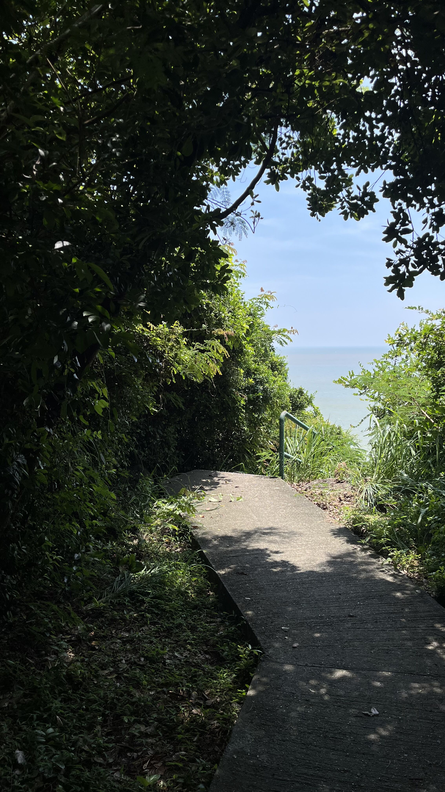 *下去吧，会有什么呢？*

### 澳门最南点

所谓“澳门最南点”如其名，的确是澳门的最南点，但严格意义上来说不能算是一个景点，因为这里没什么看的，但有一定的纪念意义。按照赖导的线路走上乡村马路的时候，我其实不太能想象这个最南点该怎样到达，不过就是在这种探索中，我找到了这个最南点。

下了阶梯，迎接我的不是多么美的海景，附近的海域甚至有些浑浊。到了对我来说如此遥远的地方，打个卡，自拍一张也值得。

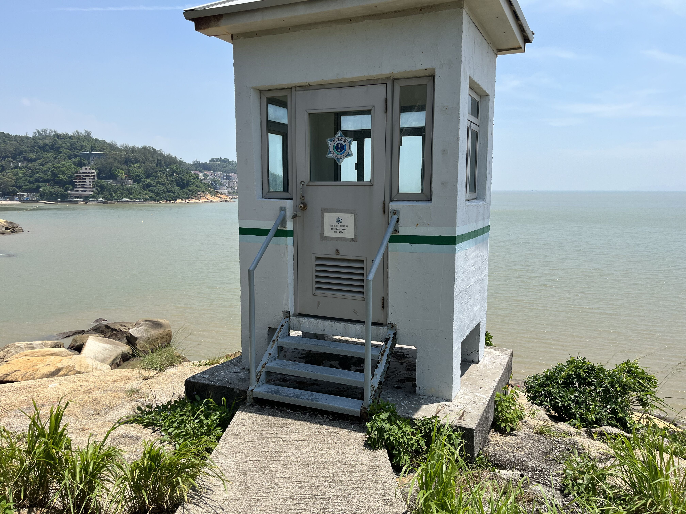 *澳门最南点——一个海关岗亭*

我在无意间越过入口，折返回来的时候，一辆黑色的车停在了停车场里。车里下来一位年轻的警员，往这个岗亭走。我跟在他的后面下了阶梯，心里有些忐忑。当我准备旁若无人开始拍照的时候，警员用粤语发话，看我听不懂，不到两秒马上换用普通话告诉我要注意安全，这附近没有什么防护的。我道完谢，他便走了。如果为了表达人情味，还应该多聊一些内容，我不知如何继续。

### 黑沙海滩

打卡了澳门最南点以后，我就继续沿着柏油马路走。前面是一片居民区，在这里居住的应该就是纯正的 local people 了。这里也没有任何和旅游相关的东西。我依稀能听见当地人的对话，是另一种听不懂的粤语，也有可能是葡语，或者是土生葡语？

经过其中一处人家时，我听到了狗叫。原来小红书上说到的狗是在这里出现的。这一条路走下来，花费不下半个小时，小红书上的概括性还是相当强的。

下面是路上拍到的一些居民楼外侧的摆设。我发现这里的一部分建筑的颜色很鲜艳。

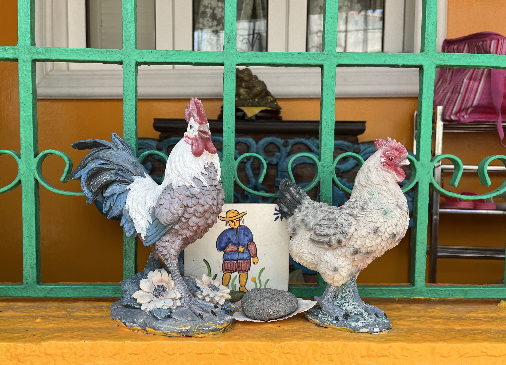

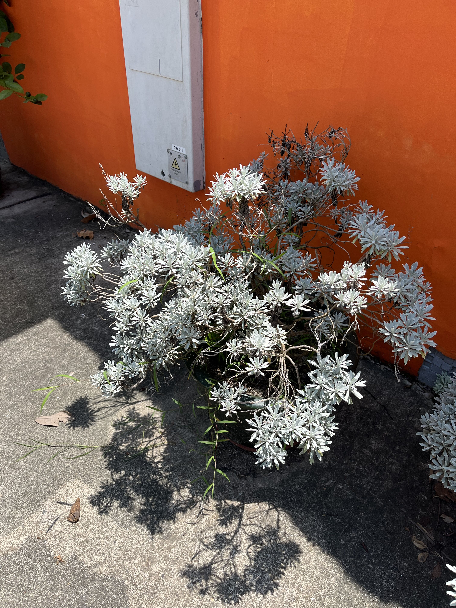

穿过居民区再往前走一段路，到了一个环岛，这里是竹湾泳池公交站。坐上公交前往黑沙海滩（如果继续步行的话，要走比来时两倍的路）。

到黑沙海滩以后，感受和在深水湾差不多，如果不下海里面去玩的话，就是平平淡淡的。这里的一个特点就是海滩上的沙子是黑色的，远看有一些脏兮兮的感觉，但确实是沙子的本色。来时的公交站附近，其实也有一个竹湾海滩，走路的时候透过旁边的树林就能看到。

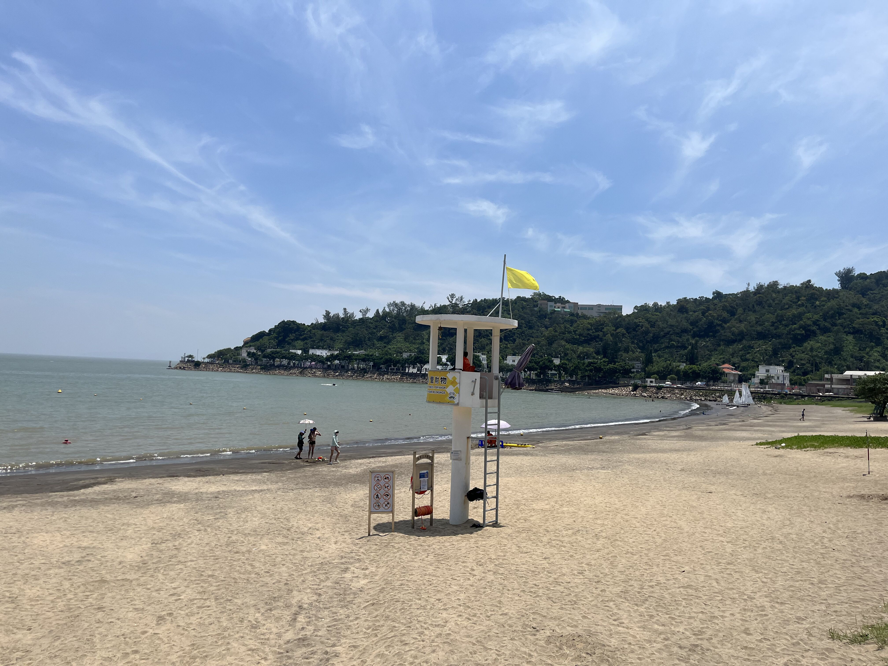 *黑沙海滩*

在黑沙海滩稍作休息以后，就准备坐公交回到路环市区了。有趣的是在这里等公交排队，又遇到了一些事情：我在这里停留的并不长，离开的公交和来时的公交是同一辆，司机换完班以后就准备发车了。我原先排队站的位置，是正对车门口第一个。车门打开之前，我发现车有一点向前走的趋势，于是也向前走了一点。但车最终没有向前走，门直接就开了。这个时候我准备直接上车，然后就被一个中年男人拦住了。他后面跟着一个身体不太好的老女人，他们准备先后上车。但这个男人上车以后，一直没能刷成功卡，待了大约几十秒以后，终于刷好卡。之后我也上车了。

像这样排队时候遇到的事情，我只觉得有趣。

### 返回路环市区

在黑沙海滩坐上公交，一口气坐回到路环市区。沿着十月初五马路往北走，可以到达路环马码头。

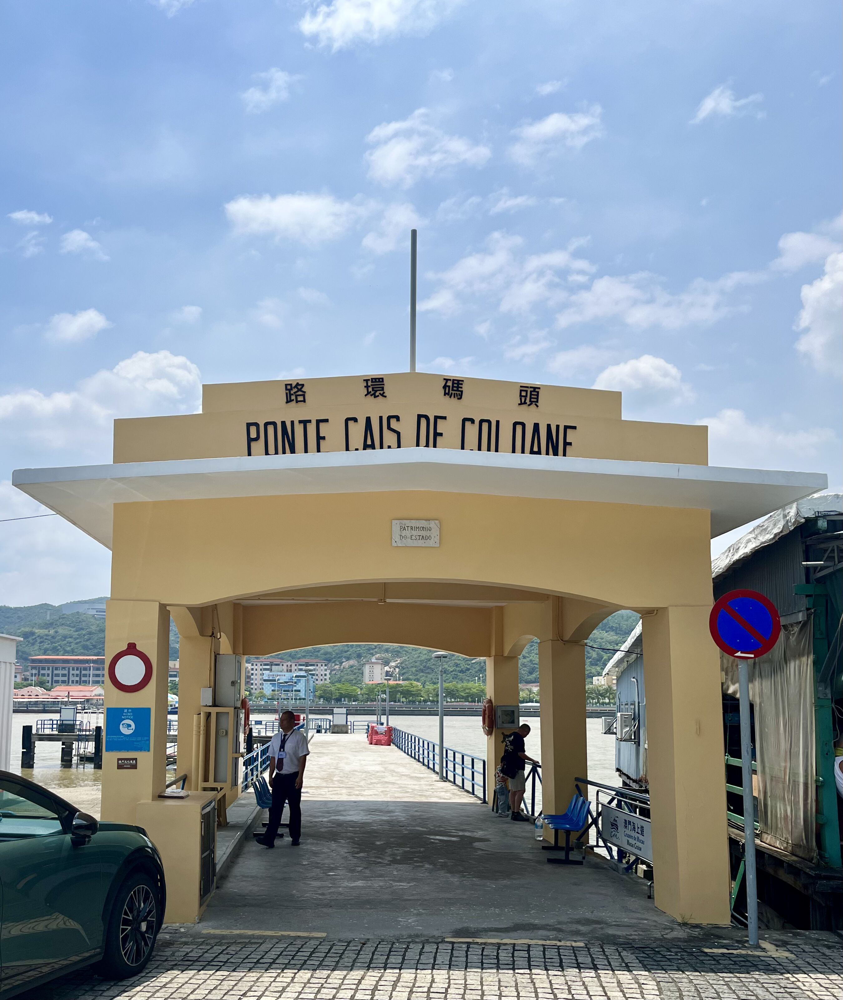 *路环码头*

 *Walking like a gentleman*

### 和家人在澳门吃了顿饭

返回路环简单走走，这个时候大概是下午的一点多，这里的人明显变得多了起来。正当我还在为接下来该去哪里发愁时，我的另一位表姐（是的...我有很多表姐）发来微信，问我是不是也在澳门——就这样，我和他们就约上了晚餐，这是我未曾想到的。晚餐的地点在澳门半岛那边，可想而知应该是一顿“大餐”。

我准备好了以后，就去路环市区公交站坐车往澳门半岛走了。

### 回到大堂区

回到澳门半岛后，由于时候还早没到饭店，我准备去随便打卡一些赌场，这原本并不在我的计划里，但...来都来了！

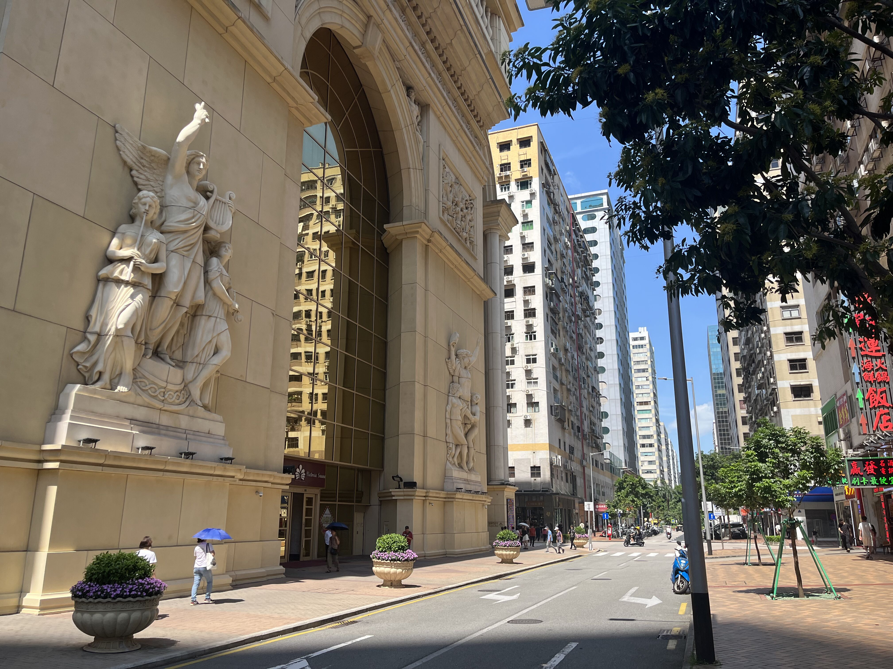 *大堂区街景之一*
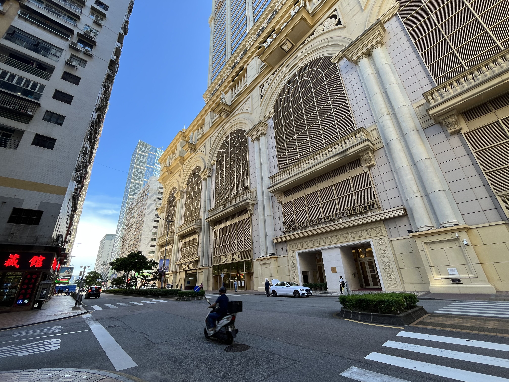 *大堂区街景之二*

在城市日大马路下车以后，随便晃晃，到了一个在马路中间的绿地，走上去看，这里是宋玉生公园。整个公园环绕在现代化建筑之间，公园之中绿树成荫，两侧又是车水马龙。公园的末端有一个不小的水池造景，池中养有锦鲤等观赏鱼，有幼鱼、乌龟，仔细看还能看见不少小鱼苗。我已经很久没有看到这么活生生的而且还在游泳的乌龟了。

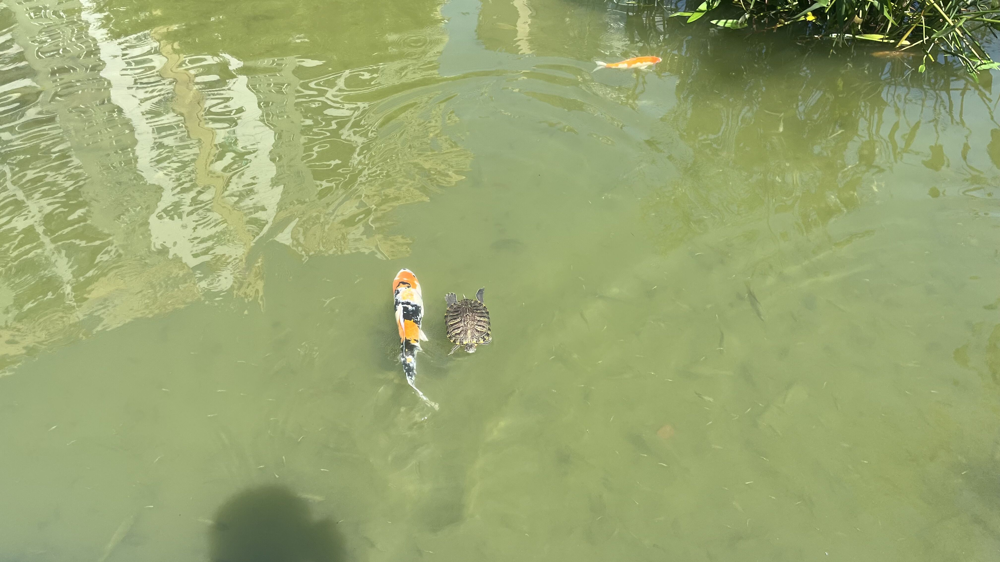 *宋玉生公园一端的水池。照片可能显得有些浑浊，实际水质还可以，并且肉眼可见其中的小动物都很有活力*

### 赌场打卡：永利、新葡京

接下来就是一些暴走，打卡赌场，感受一下赌场群聚之地的气氛。进去体验就没必要了（其实后来准备去吃饭的时候有尝试进入过永利，不过是错误的入口，然后被里面的保安人物请出来了，虽然他的话我一句也没听懂，好像既不是普通话也不是粤语）。

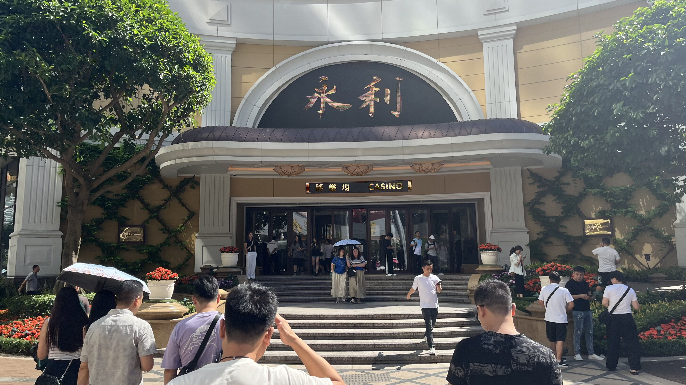 *永利娱乐场门口*

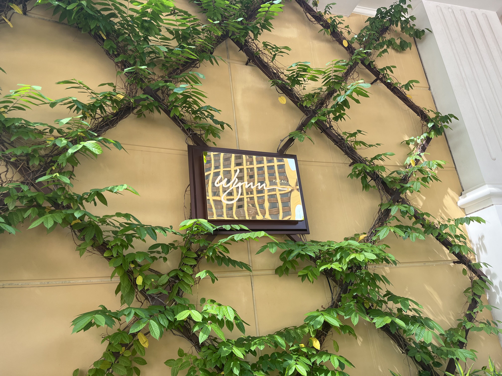 *永利娱乐场的 Logo 牌，说实话我还挺喜欢这个背景板设计的*

我还记得到永利娱乐场的路上会经过一个星际娱乐场，那里我没有拍照片。

旁边的一条街上几乎全是当铺之类的设施。街道尽头，娱乐场外面的环形地，花坛上坐着许多人（看上去不是富人），不知道在干什么。这个娱乐场的正门在建筑物的上盖遮蔽之下，门口站着很多人，各种人。我以为不能走，但还是硬着头皮走过去了。经过正门时看到了很多保镖之类的人物，还有叫不上名字的车。另外，这里的空调开得好大，经过门口的时候很凉快。

接下来，终于还是到了传说中的澳门新葡京，之前经常能在盗版美剧看见字幕组加的它的私货。门口的人特别多，几乎全在拍摄新葡京的建筑。

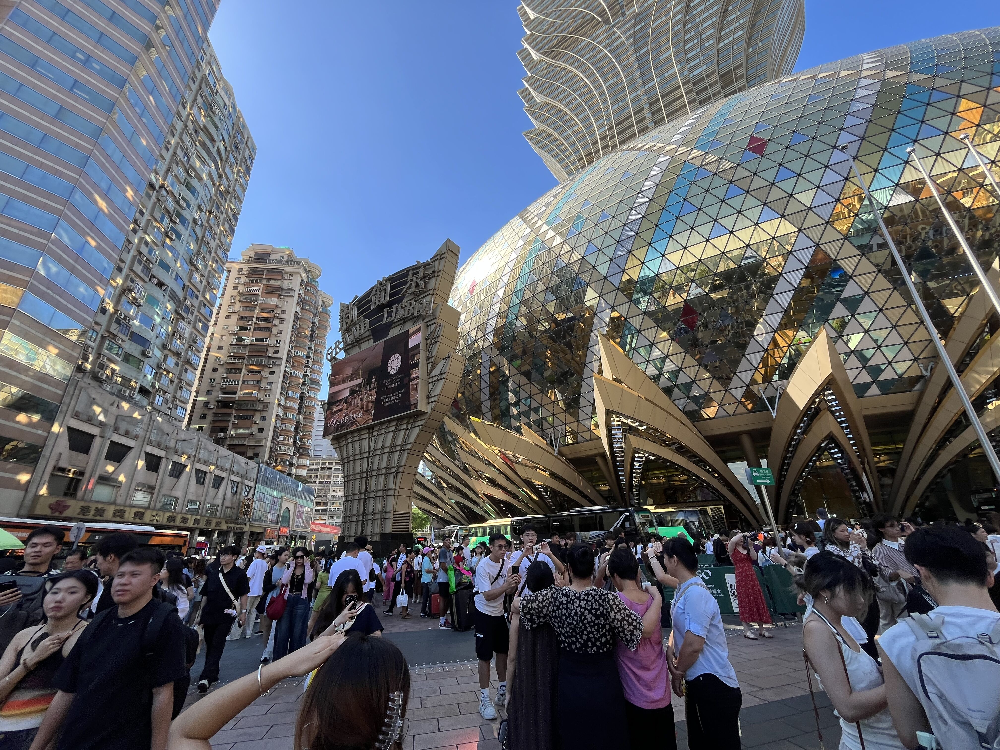

新葡京酒店这里的人相比于之前两个，不是一般的多，于是我打算进到酒店大堂里去看一看。这里大概就是一个开着空调的、黄金配色的大堂，靠外墙一侧安排了几个像鼎一样的极具中国风水学特征的器件。大堂人很多，有坐在地上休息的，有站着打电话的，有推着婴儿车的。在大堂里你甚至能看见黄金店。

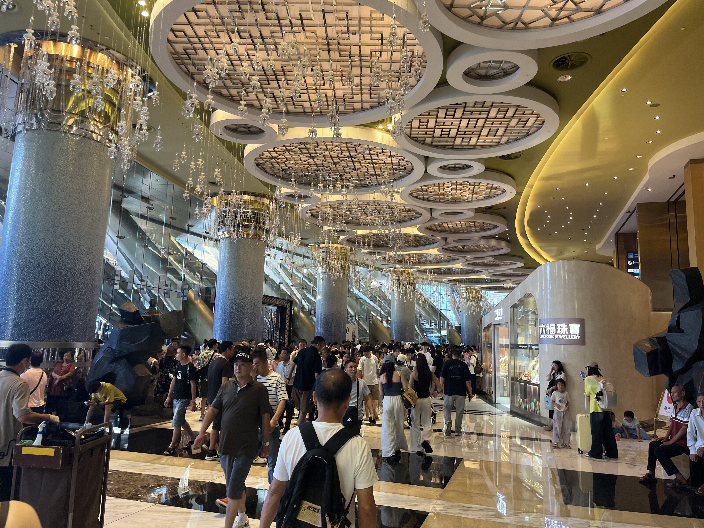

这个建筑的底座是球形的，下面有很多支撑，大堂门外的空间就显得比较逼仄，能站人的地方不多且已经被挤满，这里之外就是车道。站在这里的人似乎都是等发财车的人，但这里不远处就是亚麻喇前地的公交站群。

### 永利轩晚餐

大概五六点左右，我和表姐一家在永利汇合。晚上在永利轩吃了一顿饭，价格是四位数，感觉就是吃个氛围和服务，具体菜品不太对得上这个价格。但毕竟已经是在赌场了，溢价是很正常的一件事情。

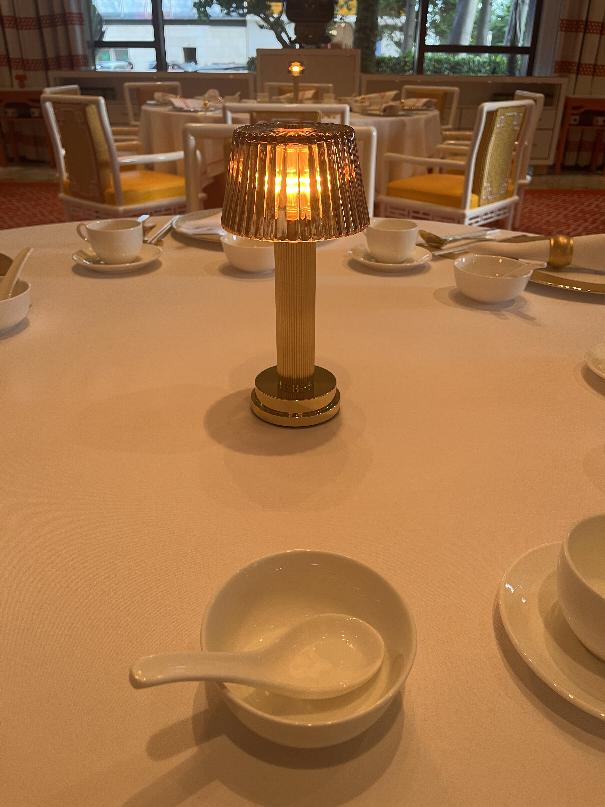 *等待上菜中...*
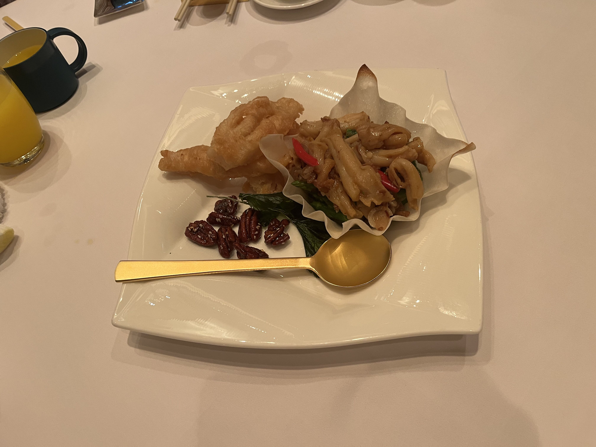 *晚餐内容之一。应该是蚌、碧根果之类的*

吃完饭，我们一起合了影，是服务员拍摄的。不得不说这里的服务确实不错，可能价格的相当一部分在这里。餐厅给每个人送了纪念品，是一小罐茶叶，我到现在还没有尝。

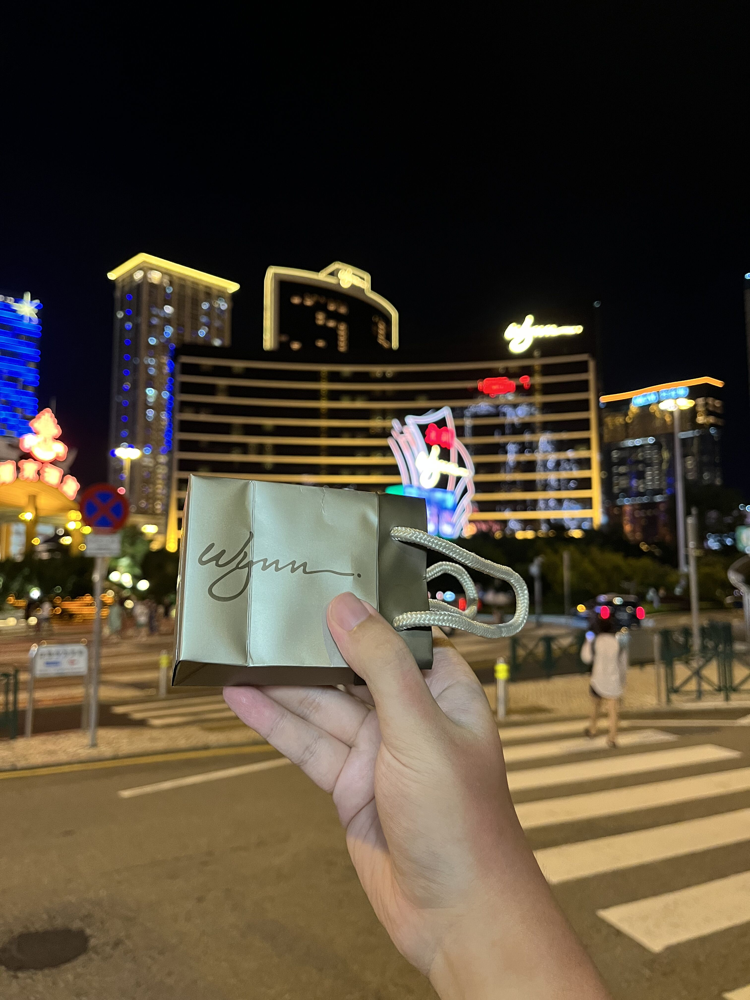 *永利轩纪念品*

### 港珠澳大桥，前往深圳

从永利轩出来大概晚上七点多，我按照计划应该前往港珠澳大桥，往香港去。其实我到这个时候才开始研究路线。本以为高德地图能保持可靠，结果规划出来的前往港珠澳大桥的路线却是先过到珠海的...谜之操作让我一度以为不能去了。之后不知道怎么调整的，终于找到了正确的路线，直接在附近新葡京前的亚麻喇前地等 101X 就可以。

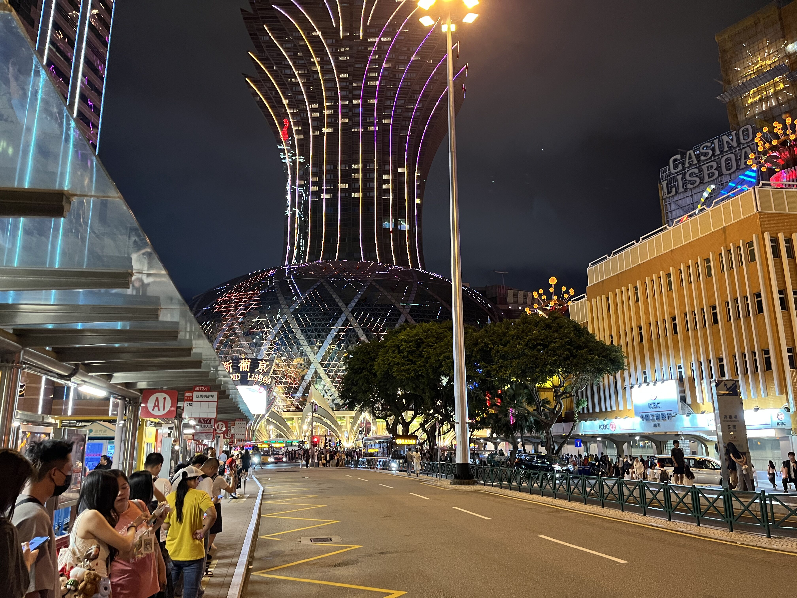 *亚麻喇前地等 101X*

到这里，其实已经踏上了从澳门到深圳的路线。

上车的人有很多，我以为都是和我一起去港珠澳大桥坐车的，心想居然这么火爆吗？这趟车的停靠站没有多少，港珠澳大桥是终点。大部分人在到青茂口岸附近就下车了。

港珠澳大桥口岸在一个人工岛上，公交驶上这座岛以后，夜晚能看到的几乎只有错综交叉的马路、路上的路灯和路牌，还有夸张的整栋建筑停车场，整体颇有工业朋克的感觉。车停在了口岸入口附近。

我提前在网上买好了穿梭巴士的票（大概 ¥50 左右，和从深圳到珠海的巴士票价相当，但路程肯定少一些），只需在口岸取票，准备出关坐车就可以。

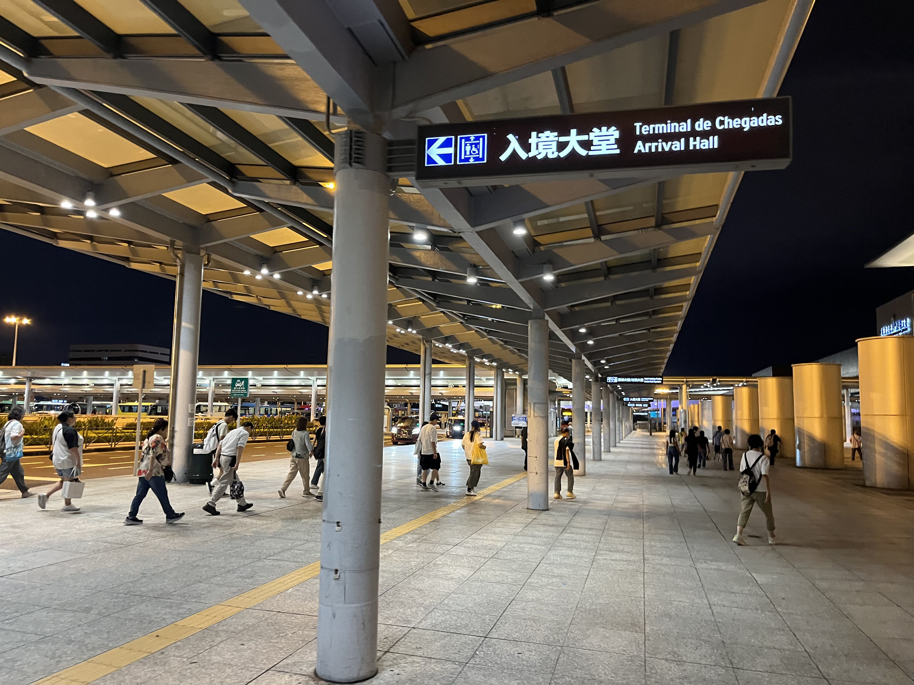 *口岸门口*

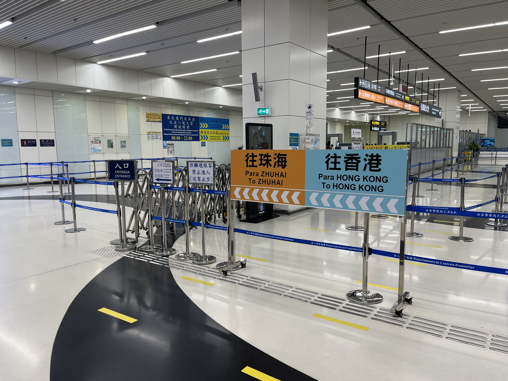 *通往过关通道*

过完澳门关以后，外面是和入口外面类似的一个个车道，人走的地方有遮盖。排队上穿梭巴士就可以。到这里就已经能从车牌、标识等感受到一些香港的气息了，车上应该也有不少香港人。巴士起步开上港珠澳大桥，我坐在车的左侧，能看到对岸珠海（昨天我所站的位置）的灯光，以及很远处的一座平行的桥梁（或许就是深中通道？），这种感觉有种说不上奇妙。

之后珠海的灯光逐渐消失，应该是到了大约正对着珠江口的海域。几十分钟后，就可以看见香港侧的灯光和机场了，这里是香港的赤𫚭角。

下了穿梭巴士以后，天气变了。这时雷声轰鸣，虽然顶上有盖，但还是拦不住外面的雨被风吹进来。赶紧进到口岸内部，过完香港关，继续等香港的巴士。在外面等巴士的时候，附近机场飞出的飞机伴随着雷声一起轰鸣，有的飞的很低。这一连串的景象，加上之前在桥上看到的景象，以及周围的环境，让我感到一丝莫名的震撼。

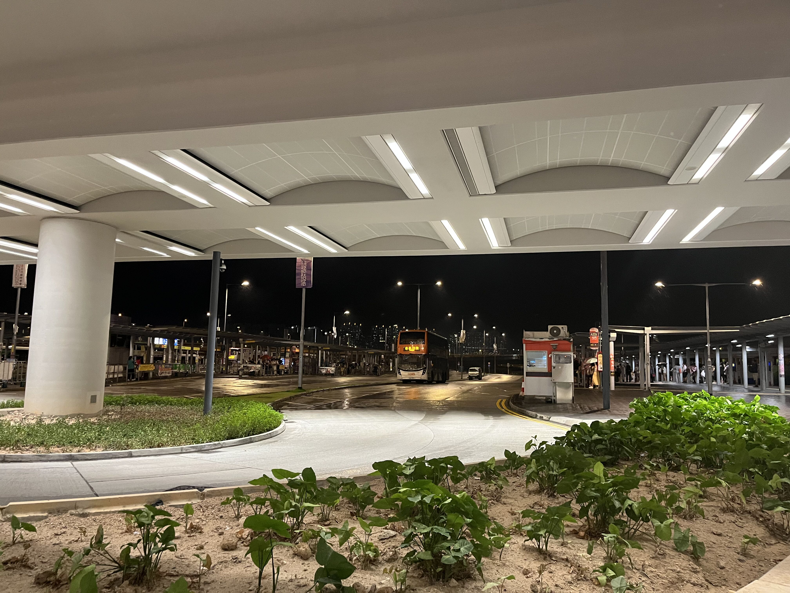 *一排排的公交站台*

我等的那一趟，是前往屯门的公交，迟迟不来，大概等了有二十分钟。等公交的时候又发生了一些有趣的事情：我到这里的时候，没有发现已经形成了一条横着的队伍，只是习惯上跟着其他人排在后面，因为其他站台就是这样竖着排的，而且我前面的一对男女前面还有人。这一对男女中的男人似乎很喜欢唱歌，一直轻松地哼着小曲，这没什么，但我总感觉两人在时不时往后面瞟打伞的我。当时的天上下着小雨并不大，有的人打了伞，有的人没打伞。我没有怎么在意，继续刷着手机，直到...我听见男人用粤语说了一句“这一看就是珠海来的”——是因为我穿得不够土吗？

终于等到了公交。先坐到屯门（$15.7），再从屯门坐 B3X 到深圳湾口岸（$16.5）。这一路程大概花了一个小时多，到深圳湾已经将近十一点。下了 B3X 以后，我赶紧跑步过关，终于在 13 号末班车开出之前坐上了。

所以其实从澳门回深圳，还是走大陆比较舒适。但有幸体验了一次跨越深圳、珠海、澳门、香港四个地方（其实还有中山）的某种“环线”也不亏！

## 总交通花费

交通花费是本次旅行的一个主要消费项目。
- 本次旅行从武汉出发，乘坐高铁往返
- 在四地主要都乘坐公共交通出行
- 在香港不打车

|项目|价格|花费时间单位|
|:-:|:-:|:-:|
|高铁 （武汉-深圳北 往返）|￥1277|-|
|深圳地铁|~￥195|14d|
|珠海公交|￥1|1d|
|澳门公交|MOP 6×7|1d|
|港铁、公交|HK$554.1|4+1d|
|香港中文大学小巴|HK$5.5×2|-|
|**合计**|~**￥2022.39**|14d|

注：此合计按照 HK$1=￥0.92（粗略汇率）、MOP 6=￥5.66（Wallet 中实际收费）计算。