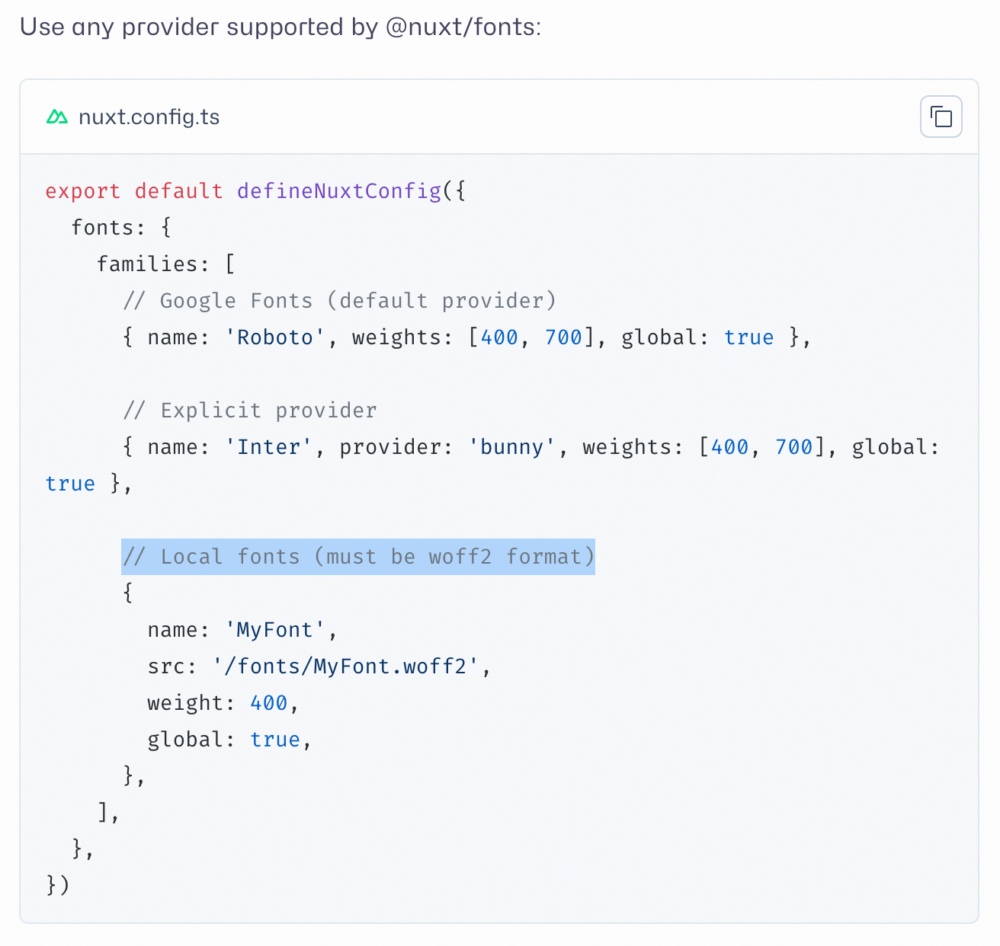

# 记录第四次更新博客系统

一转眼已经 2026 年了。元旦之后的这段时间里，我又将自己的博客系统翻新了一遍。值得庆幸的是，看着半年乃至一年之前积累起的没有写注释的代码，我没有直接粗暴地选择重写，而是在先前的基础上来做得更好——当然，依然没有写注释。

这一次翻新主要做出了下面的改动。

## 目录

## 1. 将博客字体从 serif 重新换回了 sans-serif

看了几个月的 Literata+Noto Serif SC 后，我感到非常审美疲劳。我想我也理解了为什么很多（中文）网站都不倾向于使用衬线字体（当然也有[例外（阮一峰的网络日志）](https://www.ruanyifeng.com/blog/)）。所以，我还是决定换回简洁清晰的无衬线字体。说到简洁的字体，Google Fonts 上有许多透露出性冷淡的字体，可以任意选择一个。在这里，英文字体选择的是有着 Sans Francisco 开源平替（其实一点也不「平」）之称的 [Inter](https://rsms.me/inter)。

值得一提的是，Google Fonts 上面提供的是 *Inter*，可以理解为标准版，但除了 Inter 外，还有 Inter Display，它适合展示一些大字号文本（看上去会更紧凑和大气），比如标题。为了用上 Inter Display，可以从字体的官网下载压缩包并自行编写 @font-face，或者也可以直接使用 rsms.me 上提供的 CSS 文件，里面已经把支持写好了。本站使用的是后者。

## 2. 全面转向 Tailwind CSS，进一步简化了页面设计和页面上的文字表述等

先前的页面设计（第三次更新）虽然相比于再先前的页面设计（第二次更新）要简洁许多，比如丢掉了色彩和如卡片这样的页面组件，但感觉还不够简洁，因此这一次进一步做了简化，将文章的一小段描述也删除了，在[这篇文章中](./Adding-TOC-to-This-Blog.md)提到的用黑魔法写出的侧边 TOC 也被文章开头的静态 TOC 取代了。

在更新之前，我浅浅地体验了一下 Hugo，发现很多人喜欢用 Sidenote 这种方式来替代 Footnote。我原本想将这个也作为一个更新，但话又说回来，其实只要不是特别学术或者严谨的文章，Footnote 也好、Sidenote 也好，甚至一个句子里的括号，都显得有些多余。有点类似于 Golang 的 `sync.Mutex` 的 `TryLock` 方法文档中暗示的那样，这是某种 *bad smell*。

对括号、注解的频繁使用可能暗示着语言表达的不简洁或信息密度太高等问题。脚注的用户体验只能说一般，随着页面的长度而进一步衰减，侧注可以认为一定程度上解决了用户体验的问题，但没有解决其余的问题。我能想到的博客文章中合适的脚注使用场景，除去一些正经的讨论之外，也就只剩下
- 脚注里的内容其实并不重要，可以放在最后或者一旁，瞟到了就看一下
- 你想要强行增加文章的信息密度或学术性，来达到一些节目效果
- ...一些我没考虑到的

所以我就没有在这方面花时间了，目前仍然使用的是 Footnote，因为它是 GFM 自带的语法。并且在有了上面的考虑以后，之后应该会避免吧（并不）。

页面先前是用 SCSS 写的。但是自从高强度使用 React+Shadcn+Tailwind CSS 的开发组合之后，我就觉得有些回不去了。在不谈及 CSS 模块化需求的情况下，我能想象到的使用体验最好的样式写法已经变为了组件（React 或 Vue 都可以实现）+Tailwind CSS。因此我一口气将页面的所有 SCSS，无论是写在文件里的也好，还是写在 `<style scoped></style>` 里的也好，都删干净了，然后凭借直觉从零开始写 Tailwind，不到半个小时，先前的页面就基本复刻完成了。

后来我想了一下，之所以这里将 SCSS 换成 Tailwind 感到那么的释然，大概是因为我根本没怎么用到 SCSS 的功能，可能大部分时候只用到了 Less 的功能级别。上一版系统中的主题切换器确实用到了 mixin 之类的东西，但这功能本身就没那么有必要，且也可以用组件来实现，而不需要在样式表文件里面搞来搞去。

文字表述的修改集中在关于页面和友链页面，简化了部分表述，让页面的信息密度缓和下来。

## 3. 使用 `unified` 生态系统重构了文章解析器

我记不太清楚是什么时候了解到 [unified](https://unifiedjs.com/) 这样的一个生态系统了，或许在捣鼓某种内容编辑器的时候？当时我就觉得这非常适合拿来做博客的文章解析器。这个库用起来非常像是在吃自助餐，可以自己选择插件并配置来让文档的解析达到满意的效果。并且，这个系统有足够的宏观性，Markdown 在这里被看作一种解析对象，对它的变换是任意的，而不仅限于将其转换为 HTML。不过在我这里就的确只需要转换为 HTML。

更棒的是，通过这种链式调用和即插即用的风格，拆卸和组织环节变得很容易，也促使我重新梳理了自己对文档的语法需求。我自己的这份需求（或者说习惯）最初来自于 VuePress，用着用着就成了习惯，之后的每一篇 Markdown 里几乎都有相关的用法。具体来说：
- 基础的 Markdown 功能，CommonMark + GFM
- Frontmatter 作为文档的元数据
- TOC，用来代替侧边动态 TOC
- 语法高亮
- $$ \mathrm{KaTeX} $$ 支持
- 外部链接的区分
- Callout（或 Alert、Admonitions），可以翻译成标注或警示块。这东西在博客或文档程序里存在时间不短，GitHub 上甚至设计了一份[语法](https://github.com/orgs/community/discussions/16925)，在目前的 README 等地方都可以使用。我最初见过的 Callout 来自 VuePress 和 Docsify。VuePress 的语法风格大致是下面这样
```
:::tip 标题
内容
:::
```

其中 tip 可以换成 warning、danger 等。

我用到了下面这些插件

### `remark-math`

解析文档中的数学公式，这些数学公式一般分为 inline 和 block 两种，用美元符号包围。这个插件不会要求美元符号与公式内容紧挨着，因此文档中如果有多个 `$123` 这样表示金额的数字，就会被解析为公式。为了解决这一点，将 `singleDollarTextMath` 设置为 `false` 来避免单一的美元符号被解析，这样无论是行内还是块级公式都要用两个美元符号包围。有关讨论可以查看 https://github.com/remarkjs/remark-math/issues/63

### `remark-frontmatter`

解析文档的 Frontmatter，但不做提取。为了实现提取，需要自行根据文档编写插件，或者使用 `remark-extract-frontmatter`，将其放在链中前者的后面。

### `remark-directive`

为文档提供一种[新的语法](https://talk.commonmark.org/t/generic-directives-plugins-syntax/444)，这种语法简单来说就是用一种简洁的方式来表示 HTML 元素或自定义的元素，以及该元素上的属性。这种语法主要基于冒号 `:` 开展。用这个插件主要是为了实现类似 VuePress 的 Callout，因为这种语法中恰好有用 `:::` 来开始一个块的（称为 container directive）。因此，我的需求就是只利用该语法中的这种块，生成一个 div 来做样式自定义即可。

但在这里有一个问题：这种语法中有意义的单元形如 `:xyz`、`::abc` 等，而像时间的表示 `12:30` 中的 `:30` 也会被抓走，这对于我的需求是没有意义的。为此我搜索了一番，发现的确有人提出了相关问题 [Parsing of inline directive collides with usage of colon in natural language. (E.g. n:th)](https://github.com/remarkjs/remark-directive/issues/5)，但是他在这里举的例子实在一般（`n:th` 是什么写法...），时间的冒号表示应该很常见吧。这里 Member 的回复是可以用转义，但我觉得为了这样一个我用不到的语法转义，有些过于妥协了，所以我想要从根本上消除这个问题。

最终我在 [Serialize back a textDirective to its original form?](https://github.com/remarkjs/remark-directive/issues/12) 这里找到了一个不那么完整的解决方案，改了改终于将这个问题解决了。
```typescript
if (parent && index && node.type === 'textDirective') {
    // node.name 就是被抓走的数字，如 12:30 中的 30
    parent.children[index] = { type: 'text', value: `:${node.name}` };
    return;
}
```

这里最主要的思路不是 bypass 而是 serialize back，因为采用了这个语法之后，它所完成的职责就是确定的，修改其行为本身并不符合其设计出来的逻辑。这或许就是突发奇想借用 directive 语法来实现 VuePress 的 callout 语法的代价所在吧。

### `remark-gfm`, `remark-toc`

用于实现 GFM 和 TOC。GFM 提供了脚注的支持。最初使用的时候发现脚注的部分被加上了一个额外的 Heading，内容是 Footnotes 英文，很突兀。后来发现这个 Heading 是在 remark -> rehype 的过程（i.e. `remark-rehype`）中加入的，而不是 `remark-gfm` 插件做的（[ref](https://github.com/remarkjs/remark-gfm/issues/38) & README），需要在 `remark-rehype` 处配置 `footnoteLabel`。

### `remark-cjk-friendly`, `remark-cjk-friendly-gfm-strike-through`

当很多人遇到了同样的问题之后，兴许就会有人站出来解决了！这两个插件如其名，对 CJK 很友好。具体友好在哪里呢？这两个插件修复了 Markdown 语法对中日韩文字支持不好的问题。如果你时不时能见到自己标的粗体或者斜体莫名其妙掉了或者错位，而加了个空格就又好了的话，应该会有相同的感受。谁让世界通用语言英语是一个到处都是空格的语言呢？

### 自己写的一个插件，用于转换相对地址

这个插件做的事情很简单，将对本地 markdown 文件的相对地址转换为可访问的网站地址。这种需求产生于需要在一个页面中添加对另一个同站页面的链接时。例如，`[abc](./ABC.md)` 生成的地址 `./ABC.md` 不能在最终的网页中正常访问，需要将其转换为特定的格式，如 `/posts/abc`（添加了前缀，并进行了 lowercase 处理）。

### `rehype-infer-title-meta`

用于提取文档的标题。文档的标题单独提取出来的好处有很多，比如在文章列表中显示，以及可以将标题单拎出来作为一个元素，在这个元素之后加额外的元素，而不是让 h1 与其余内容混合在一起作为一个 HTML 整体，这样不好自定义。

### `rehype-highlight`

先前使用的是 Shiki 来高亮，搜索了相关插件以后，发现已经几年没有更新了（后来发现这其实在 remark/rehype 插件里是常态，很多插件能用就不需要维护）...于是选择了 `rehype-highlight`，底层使用的是 lowlight，再底层使用的是 highlight.js，兜兜转转又回到了最经典的方案。

主题方面，我选了比较简洁且美观的 Stackoverflow 风格。

### `rehype-katex`

这个插件主要是将 `remark-math` 识别到的数学内容用 Katex 渲染，实现数学公式的最终呈现。

### `rehype-raw`

这个插件的名字不是很直接，它的 README 里面写的也很神秘

> This package is a unified (rehype) plugin to parse a document again. To understand how it works, requires knowledge of ASTs (specifically, hast). This plugin passes each node and embedded raw HTML through an HTML parser (parse5), to recreate a tree exactly as how a browser would parse it, while keeping the original data and positional info intact.

简单来说，这个插件的一个重要的作用就是让 Markdown 中内嵌的 HTML 正常工作，否则 HTML 只是纯文本（类似于将标签中的 `<` 和 `>` 用 `&lt;` 和 `&gt;` 呈现的效果）。为了实现这一点，单靠这个插件也是不够的。在 remark -> rehype 的过程中，为了安全的考虑，HTML 会被清洗一遍，这样一些 HTML 就会消失掉，就无从被 `rehype-raw` 处理。因此，实现完整的 Markdown 中内嵌 HTML 的保留，需要
- 在 `remark-rehype` 的配置中，配置 `allowDangerousHtml: true`，当然，只适合在你自己写文档的时候启用。
- 添加 `rehype-raw`，让其处理 HTML 标签

### `rehype-wrap-all`

`rehype-wrap-all` 是一个对 `rehype-wrap` 的封装。如其名称，这个插件主要用来实现一层包装，具体来说，是给定一个选择器 selector，为其套上元素 wrapper，wrapper 也用类似选择器的语法表示，例如 `div.wrapper` 表示 `<div class="wrapper">...</div>`。`rehype-wrap` 很尴尬的一点是，它只会处理第一个选中的元素...并且没有额外的选项（为啥要这样设计？），于是就有了 wrap all 插件。这两个插件的关系好比 `document.querySelector` 和 `document.querySelectorAll` 的关系。

用这个插件主要是实现对 `pre` 元素的一层包装。通常为了阅读方便，代码块的角落会标有这一段代码的语言，这一个小标记一般用伪元素来实现。但是，当 `pre` 有了横向滚动，如果标记位于 `pre` 元素的内部，很难实现固定在角落不动，而伪元素只能在元素的内部，所以这并不是正确的实现方式。使用 wrap all，就可以在 `pre` 外层再加一个包装，进而实现将标记固定在角落且不跟随横向滚动的效果。

### `rehype-slug`

`rehype-slug` 用来为每一个标题生成一个锚点，以实现页内的跳转，与 `remark-toc` 搭配使用实现目录。

### `rehype-external-links`

`rehype-external-links` 识别指向外部网页（不是当前网站的网页）链接，设置 `a` 元素的属性。使用该插件来实现将指向外部网页的 `a` 的 `target` 都设置为 `_blank`，并添加 class，借助伪元素，在链接末尾添加↗符号。


---

这样一来，文章解析器的实现既有了条理也有了保障，同时还没有对功能的妥协（directive 那里实现的确实不优雅，但是能用就行！）。相比于旧构建脚本里不可靠的字符串替换魔法和 JSDOM，可以说是非常<ruby>优雅<rt>エレガント</rt></ruby>了。

## 4. 使用 Satori 静态地生成 Open Graph Image

Nuxt 生态中其实有专门生成 OG Image 的库 [Nuxt OG Image](https://nuxtseo.com/docs/og-image/)，但出于种种原因，这个库并不能满足我的需求

第一点，这个库要求对 OG Image 的声明必须在服务端执行，这就要求相关页面不能是纯 client 页面，Nuxt 项目也不能 disable SSR。

第二点，字体的支持很令人疑惑。我可以理解这个字体不能与现有网页字体相通，但根据文档上所说的

> If @nuxt/fonts is not installed, no fonts will be available for OG image rendering. Install the module to use custom fonts.

我不懂为何必须要安装 `@nuxt/fonts`，哪怕我只是想要简单地用一用 Web 服务或者本地字体文件...这种强依赖性，让我感觉目前的版本很像半成品，因为我记得在半年前，第三次更新博客系统的时候，就没有这种限制。我记得我读到一篇 Issue 提出加入对 `@nuxt/fonts` 的支持，是为了与现有使用该库的用户连通，这样就不需要额外的配置直接使用字体；但如果在这里变成了一个强依赖，岂不是有些本末倒置了。

假设抛开这层顾虑，安装了 `@nuxt/fonts` 之后，依然没办法让其正确运行。确切地说，是没办法让推荐的 Satori 渲染模式正确运行，因为缺少字体，而这个缺少字体的报错发生在其尝试获取远程字体上面——这里的逻辑就非常混乱：Nuxt OG Image 本身在 nuxt.config.ts 里面就有一个 fonts 的配置项，但[文档](https://nuxtseo.com/docs/og-image/integrations/fonts)里又提到需要配置 `@nuxt/fonts`。现实是哪怕我两个都配置了，Satori 依然会报错字体找不到，而且我知道这不是 Satori 的问题。

```typescript
ogImage: {
    zeroRuntime: true,
    defaults: {
        // satori is not working at all at my needs.
        // chromium is the only choice here.
        renderer: 'chromium'
    },
    fonts: [
        { path: '/fonts/InterDisplay-Regular.ttf', name: 'Inter', weight: 400 },
        { path: '/fonts/InterDisplay-Bold.ttf', name: 'Inter', weight: 700 },
        { path: '/fonts/NotoSansSC-Regular.otf', name: 'NotoSansSC', weight: 400 },
        { path: '/fonts/NotoSansSC-Bold.otf', name: 'NotoSans', weight: 700 }
    ]
},

fonts: {
    provider: 'local',
    processCSSVariables: false,
    families: [
        {
            name: 'Inter',
            weight: 400,
            src: '/fonts/InterDisplay-Regular.ttf',
            global: true
        },
        {
            name: 'Inter',
            weight: 700,
            src: '/fonts/InterDisplay-Bold.ttf',
            global: true
        },
        {
            name: 'NotoSansSC',
            weight: 400,
            src: '/fonts/NotoSansSC-Regular.otf',
            global: true
        },
        {
            name: 'NotoSansSC',
            weight: 700,
            src: '/fonts/NotoSansSC-Bold.otf',
            global: true
        }
    ]
}
```

难道是因为这里写的本地字体只支持 woff2（I mean, *WTF?*）格式导致的吗？这也许有些荒谬了。


*How come?*

总之，以上配置无法让 Satori 正常渲染，但更换为 Chromium 以后就一切正常，且不会提示找不到字体。最后让我彻底放弃使用 Nuxt OG Image，是因为虽然 Chromium 渲染一切正常，但是用了 `nuxt generate` 后，生成的所有图片均是空白。我搜索了相关问题，发现有一个和我非常类似的 [help: Nuxt Generate gives blank og-images on Nuxt Content pages #270](https://github.com/nuxt-modules/og-image/issues/270)，然而这个 Issue 在 2024 年 10 月提出之后就没有回复，上个星期变成 closed as not planned，也没有任何回复。我想或许这个库设计本身就不是为了让你静态地、离线地使用吧...

所以，我打算自己实现一个类似的功能，不就是生成一张图嘛，可以放在文章解析的正后面。在这里还是得感谢 Nuxt OG Image，让我了解到了 [Satori](https://github.com/vercel/Satori) 这个库。虽然这个库本身的兼容性一般，功能也比较少，但是相比于 Chromium 要轻量不少，且更适合生成简单 OG Image 这样的需求。

跟着 Satori 的文档，可以很容易写出字体的配置并调用函数。Satori 输出的是一串 SVG，其中的文本以图形的形式显示（可以配置，默认是这样），这样就不必担心缺少字体的问题（类似于平面设计软件里的转曲）。得到 SVG 字符串后，通过 [Sharp](https://sharp.pixelplumbing.com/) 将其转换为 PNG 后输出到 public 中，就可以在模板中直接调用了。

在这里踩了一些坑：

- Satori 有一个很严重的 bug，见 [next/server ImageResponse throws Error: Expected `<div>` to have explicit "display: flex"... when mixing variables and text](https://github.com/vercel/next.js/issues/48238)。简单来说，就是会报一个很难理解的错误，这个错误需要你把所有的 div 都加上 `display: flex` 或 `contents` 或 `none`。这可能是内部的要求，但是你很快会发现哪怕真的照做了以后，也没法正常生成图片。这个问题有很多解决方法，比如不用 div。~~没有 div 还怎么写网页~~

- Satori 的主函数 `satori` 的第一个参数是要渲染的元素。Satori 是 Vercel 出品的，可想而知这个库一定是 opinionated 且和 React 衔接紧密。这里输入的元素要么是 jsx，要么是一个类 JSX element object。为了方面和可维护性的考虑，我觉得 jsx 是唯一的选择——其实是因为我不知道怎样在 object 里面表示 fragment，也找不到文档，这直接把我困住了。

- 虽然 JSX 与 React 不是强绑定，但是也离那里不远了，至少在 Satori 中是这样。在编写 jsx 的那个文件里面，如果没有明确 `import React from 'react'` 的话，就会报错 React is undefined。什么时候 JavaScript 也有副作用导入了？虽然这很难以置信，但...添加了这行 import 之后，确实不报错了。我不得不在这样一个 Nuxt 项目下面运行 `yarn add react` 和 `yarn add @types/react`。

虽然有坑，但结果是好的，最终在不借助 Nuxt OG Image 的情况下，实现了自行生成 OG Image。

